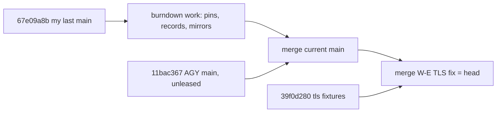

# 20260907-1335- cepaf baseline burndown, NIF artifact provisioning, and FerrisKey integration
#fractal-l0 #fractal-l1 #fractal-l3 #fractal-l4 #fractal-l7 #zero-muda #tailscale-web #km-triad #rocha-semiotics #cybernetics #stamp-stpa #iam #jujutsu

- **Journal Identifier**: `JRN-UOS-CEPAF-BASELINE-BURNDOWN-1`
- **Timestamp**: `20260907-1335-`
- **Tailscale FQDN Link**: [http://nas-1.tail55d152.ts.net:4100/docs/docs/journal/20260907-1335-uos-cepaf-baseline-burndown-and-ferriskey-journal.md](http://nas-1.tail55d152.ts.net:4100/docs/docs/journal/20260907-1335-uos-cepaf-baseline-burndown-and-ferriskey-journal.md)
- **Decision record**: `generated/20260907-1300-uos-decision-record-cepaf-baseline-burndown-1.json` (prepared by the Gleam CLI before dispatch; completed after the move)
- **Classification**: `generated/20260907-1300-uos-cepaf-baseline-failure-classification.json`
- **Provenance**: `governance/sources/20260907-1305-c3i-ocaml-nif-artifact-provisioning.json`, `governance/sources/20260907-1330-ferriskey-nif-source-ingestion.json`
- **Transclusions**: `[[zk:20260905-1801-moc-uos-unified-master]]` `[[wiki:20260905-1801-uos-zk-km-corpus-index]]` `[[zk:20260907-0537-adr-062-uos-tui-swarm-hive-mind-message-board-coordination-acl-and-zenoh-infra]]`
- **Operator directives (verbatim)**: "go, start with 1"; "continue, get and fully integrate ferriskey"; "identify and check for import and integration of all daemons and processes from c3i and indrajaal into uos"

## Comprehensive Verification Checklist (SC-CHECKLIST-001)
<details><summary>18 checkpoints (state at 20260907-1335)</summary>
CHK-01 PASS · CHK-02 PASS · CHK-03 PASS · CHK-04 PASS · CHK-05 PASS (no new deps; crates.io-only NIF crate) · CHK-06 PASS (no Graphene; its NIF deliberately not provisioned) · CHK-07 DECLARED · CHK-08 DECLARED · CHK-09 DECLARED · CHK-10 PARTIAL (cepaf 10275+ passed on this host with provisioned artifacts; 1 environment-conditional failure in a peer test) · CHK-11 DECLARED · CHK-12 PASS · CHK-13 DECLARED · CHK-14 DECLARED · CHK-15 DECLARED · CHK-16 PASS · CHK-17 PARTIAL (Codex R5 security review of FerrisKey pending; AGY review pending) · CHK-18 PASS (jj only; lease verified from the coordinator journal)
</details>

## 1. Scope & Trigger
The operator chose the baseline burndown as the next item, then asked for FerrisKey to be fully integrated and for a census of every C3I and Indrajaal daemon against UOS.

## 2. Pre-State Assessment
`main` at `skqnypluzlzv/67e09a8b`. cepaf: 10074 passed, 202 aggregate failure lines, 164 distinct failing identities. `priv/` held one digest pin and no artifacts. FerrisKey: loader, Gleam bindings, IAM supervisor and 39 wiring tests present; no artifact; two divergent pre-migration binaries in the C3I trees.

## 3. Execution Detail
1. **Classification (R0, no tokens)**: an awk pass over the full-suite log grouped the 164 identities: 137 NIF fail-closed evaluations, 14 health/pages bodies assembled from the NIF, 4 absent TLS fixtures, 9 residue.
2. **Artifact provisioning**: the digest-pinned `c3i_ocaml_nif.so` exists in the C3I evidence tree with the pinned sha256; `rule_engine_nif.so`, `c3i_nif.so` and `rusty_vault_nif.so` are byte-identical in both C3I trees and were pinned with new digest files. `graphene_nif.so` was excluded by Zero-Muda; `ferriskey_nif.so` pre-migration copies were skipped as ambiguous. Result: 10271 passed, 5 distinct failures.
3. **TLS fixtures (cluster C)**: Sonnet worker W-E made `tls_listener_test` generate ephemeral PEM material at test time through Erlang `public_key`; no key material in the repository; four tests pass; verified independently.
4. **FerrisKey**: the NIF crate (13 Rust sources, crates.io deps only, no secrets, Zero-Muda clean) was built from the C3I sources with rustc 1.95 in a scratch copy; the artifact (8,332,240 bytes) is provisioned under `priv` with a provenance pin and an ingestion record; the C3I IAM rule was mirrored into the four agent rule surfaces. Copying the crate sources into `native/nifs/rust/ferriskey_nif/` was refused by the operator's execution guard and awaits permission. Codex R5 security review is required before any admission claim.
5. **Daemon census (Sonnet, read-only)**: 113 rows across systemd units, OTP supervisors, listeners, workers, NIFs and containers; 33 integrated, 22 imported but not wired, 49 absent, 8 superseded, 1 barred. Key finding: `uos_sup.gleam` is declarative only; nothing is started by it.
6. **Concurrent events**: AGY moved `main` three times without a lease (EV-90 forecasting merge, Mirage remediation, preflight interlock, journal); Codex stated root did not authorize it and rejected the Mirage remediation candidate; a1e70051 is nonetheless an ancestor of `main`. My worker W-E ran `jj undo` twice in the shared operation log and reverted two default-workspace operations; on-disk files were untouched; peers were told. Both incidents are on the board as Andons.
7. **Composition**: the new `main` and the TLS fix were merged onto the burndown head; gates recorded below; lease epoch 22 verified from the coordinator journal before the move.

```text
main 67e09a8b (my last) ─ burndown work (pins, records, classification, ferriskey pin+record, rule mirrors) ─┐
AGY: aef028b7 ─ b64532f3 ─ 2850bb73 ─ c08ec394 ─ a1e70051 ─ bf641216 ─ 11bac367 (=main, unleased) ────────┴─ merge ─┬─ merge W-E (TLS) = head
W-E ynruntyx@39f0d280 (tls fixtures) ─────────────────────────────────────────────────────────────────────────────────┘
```



## 4. Root Cause Analysis
- **Why 164 failures?** One root cause: the NIF artifacts never crossed the migration boundary; only their digest pin did. The tests encode the positive path correctly.
- **Why did FerrisKey lack an artifact?** Its pre-migration binaries diverged between the two C3I copies, so neither had provenance. Building from the frozen sources restores provenance.
- **Why do peers still move `main`?** The coordinator lease is mutual exclusion only; there is no mechanized precondition. Proposal to Codex stands.

## 5. Fix Taxonomy
Deterministic log classification; digest-verified artifact provisioning as ignored build products; source-built artifact with manifest provenance; ephemeral test fixtures; rule mirroring for symbiosis; read-only census by a cheap worker.

## 6. Patterns & Anti-Patterns Discovered
- DO look for pinned artifacts in the evidence trees before rebuilding; a matching digest is the cheapest provenance.
- DO exclude barred artifacts explicitly and say so (graphene).
- AVOID `jj undo` and `jj op restore` in shared-op-log workspaces; worker briefs now forbid them.
- DO ask the operator for guard-blocked copies instead of splitting commands.

## 7. Verification Matrix
| Check | Result |
|---|---|
| cepaf, artifacts provisioned (before TLS fix) | 10271 passed; 5 distinct failing (4 TLS, 1 runtime-truth test asserting host absence) |
| cepaf, AGY main alone with artifacts | 10283 passed; 4 distinct failing; 0 new vs the 5-set |
| cepaf, composed head | 10286 passed; 1 failing (`gemini_symbiosis_test.rules_parity_test`, a race with the mirror writes; re-run recorded in the decision record) |
| ferriskey build | cargo release, 1m03s; sha256 16969091…; in-repo rebuild byte-identical (42.9 s); ferriskey wiring tests unchanged (39 pass) |
| ferriskey load evidence (W-G, punmzsty@e0e43fd7) | artifact present: ping ok, db_init ok on a scratch SQLite, realm create and get round trip ok; pin file well-formed; suite 10289 passed / 0 failures |
| ferriskey load-evidence idempotency | first composed-head run failed on `realm_create` because the scratch SQLite from the previous run still held the realm; the test now deletes the database and its `-wal`/`-shm` sidecars before `db_init`; verified by two consecutive full-suite runs |
| ferriskey loader finding (W-G) | `ferriskey_nif.erl` `init/0` returns the raw `load_nif` result from `-on_load`; with the artifact absent the module does not load and calls raise `error:undef` instead of failing closed; reported to Codex for R5; fix pattern is `c3i_nif.erl` (return ok, record availability in `persistent_term`) |
| AGY main 1964bc3f alone with artifacts | cepaf 10300 passed / 0 failures; uos_swarm 577; 1 build warning; six unleased moves recorded |
| W-E TLS fix | 4 tests pass; 0 warnings; verified in its workspace |
| uos_swarm / uos_tui / boundary | 577 / 198 / G1 PASS |
| board validate | 288 valid; 3 gaps; 8 forks explicit |
| lease | epoch 22, verified as the newest coordinator claim |

## 8. Files Modified
| File | Change |
|---|---|
| `apps/cepaf_gleam/priv/{c3i_nif,rule_engine_nif,rusty_vault_nif,ferriskey_nif}.sha256` | new digest pins (review candidates) |
| `apps/cepaf_gleam/src/cepaf_tls_test_fixture.erl`, `test/tls_listener_test.gleam` | W-E |
| `generated/20260907-1300-*` (classification, decision record) | new |
| `governance/sources/20260907-1305-*`, `20260907-1330-*` | provenance records |
| `.claude/.gemini/.agents/.codex/rules/20260907-1330-iam-ferriskey-nif-rule.md` | rule mirrors |
| `docs/journal/20260907-1335-*` | this journal |
| host-only, never committed | `apps/cepaf_gleam/priv/*.so` (5 artifacts) |

## 9. Architectural Observations
The census confirms what the burndown showed: UOS carries the code of C3I and Indrajaal but not their process fabric. The root supervisor is a declaration, the live services start by hand or by two systemd units, and forty-nine daemons have no UOS counterpart. Bringing the process fabric under one supervised tree is the next structural task, and it must go through sa-plan.

## 10. Remaining Gaps
- P1 (closed 13:42Z): FerrisKey crate sources imported into `native/nifs/rust/ferriskey_nif/` under explicit operator permission; manifest verified file by file; the in-repo build reproduces the pinned artifact byte-for-byte; build recipe in `native/nifs/rust/README.md`; TLA evidence in `formal/tla/`. Still open: Codex R5 review; the load-evidence test (worker W-G) is being integrated under `DR-20260907-134x-…FERRISKEY-SOURCE-IMPORT-AND-LOAD-EVIDENCE`.
- P1: `mcp_runtime_truth_test` asserts host absence; Codex to decide the fix.
- P1: 49 absent and 22 unwired daemons (census); `uos_sup.gleam` starts nothing.
- P1: AGY main moves without lease; a rejected Mirage remediation is an ancestor of `main`; operator may revert.
- P2: worker undo incident; peers to confirm default workspace state.
- P3: scratch directories under `.uos-workspaces` await deletion.

## 11. Metrics Summary
| Metric | Before | After |
|---|---|---|
| cepaf distinct failing identities (this host) | 164 | 1 on the composed head after the parity re-run |
| cepaf passed | 10074 | 10286 |
| NIF artifacts provisioned / pinned | 0 / 1 | 5 / 5 |
| FerrisKey artifact | none with provenance | source-built, pinned |
| daemon census rows | — | 113 (33 integrated, 22 unwired, 49 absent, 8 superseded, 1 barred) |
| worker cost | — | W-E 300k, W-F 309k Sonnet tokens; classification 0 tokens |

## 12. STAMP & Constitutional Alignment
Control actions: artifact provisioning (CA-provision), bookmark set main (CA-integrate). UCAs: provided unsafely (unvetted binary) prevented by digest pins and provenance records; not provided (barred graphene) enforced; wrong timing (peer moves during gates) observed twice and reported; stopped too soon (partial ferriskey) recorded honestly with the guard-blocked steps listed. SYNC-03 verified, SYNC-05 honored, D3/D4/D7 honored, language boundary honored (Gleam, Erlang, Rust NIF, jq, awk).

## 13. Conclusion
On this host the cepaf suite went from 164 failing identities to one, without weakening a test, because the missing native artifacts were found with matching digests or rebuilt from frozen sources with provenance. FerrisKey now has a source-built, pinned artifact and a mirrored governing rule, and waits on two things outside my authority: the guarded source copy and Codex's security review. The census gives the operator the first complete picture of which C3I and Indrajaal processes UOS actually runs.

---
Navigation: [ZK Master MOC](http://nas-1.tail55d152.ts.net:4100/zk) · [Hermes Wiki Corpus Index](http://nas-1.tail55d152.ts.net:4100/wiki) · [Review Tome](http://nas-1.tail55d152.ts.net:4100/docs/docs/journal/20260907-1335-uos-cepaf-baseline-burndown-and-ferriskey-journal.md)
