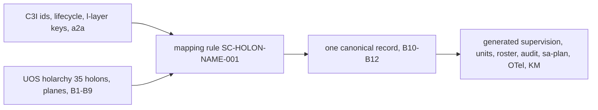

# 20260907-1505- Holonic naming system of C3I and Indrajaal, and its mapping onto UOS
#fractal-l0 #fractal-l1 #fractal-l2 #fractal-l3 #fractal-l4 #fractal-l5 #fractal-l6 #fractal-l7 #zero-muda #tailscale-web #km-triad #rocha-semiotics #cybernetics #stamp-stpa #holon #holarchy

- **Journal Identifier**: `JRN-UOS-HOLONIC-NAMING-AND-MAPPING`
- **Timestamp**: `20260907-1505-`
- **Tailscale FQDN Link**: [http://nas-1.tail55d152.ts.net:4100/docs/docs/journal/20260907-1505-uos-holonic-naming-system-and-fractal-mapping-journal.md](http://nas-1.tail55d152.ts.net:4100/docs/docs/journal/20260907-1505-uos-holonic-naming-system-and-fractal-mapping-journal.md)
- **Design produced**: `docs/design/20260907-1505-uos-holonic-architecture-and-fractal-services-mapping-approach.md` (`DES-UOS-HOLONIC-MAPPING-001`)
- **Transclusions**: `[[zk:20260905-1801-moc-uos-unified-master]]` `[[wiki:20260905-1801-uos-zk-km-corpus-index]]` `[[zk:20260907-0537-adr-062-uos-tui-swarm-hive-mind-message-board-coordination-acl-and-zenoh-infra]]`
- **Operator directives (verbatim)**: "what is the holonic naming system used by c3i and indrajaal. can the holonic architecture and all its fractal services and implications . can it be mapped to uos"; "save this in journal. create comprehensive approach that covers all tehse aspects"

## Comprehensive Verification Checklist (SC-CHECKLIST-001)
<details><summary>18 checkpoints (state at 20260907-1505)</summary>
CHK-01 PASS · CHK-02 PASS · CHK-03 PASS · CHK-04 PASS · CHK-05 PASS · CHK-06 PASS · CHK-07 DECLARED · CHK-08 DECLARED · CHK-09 DECLARED · CHK-10 DECLARED (no code changed by this journal) · CHK-11 DECLARED · CHK-12 PASS · CHK-13 PASS · CHK-14 DECLARED · CHK-15 DECLARED · CHK-16 PASS · CHK-17 PENDING (design review) · CHK-18 PASS
</details>

## 1. Scope & Trigger
The operator asked what holonic naming system C3I and Indrajaal use, whether the holonic architecture with all its fractal services and implications can be mapped onto UOS, and then asked for this to be saved and turned into a comprehensive approach.

## 2. Pre-State Assessment
UOS carried three partial views of the same idea: the swarm holarchy in `uos_swarm/holon.gleam` (35 holons, levels 0–3, seven planes, base rules B1–B9), the cepaf fractal layer modules `l0_constitutional … l7_federation` with the IAM 96-cell matrix, and the C3I Zenoh key scheme `indrajaal/l<n>/<domain>/…` kept verbatim. The daemon census of the same morning (113 rows: 33 integrated, 22 imported-not-wired, 49 absent, 8 superseded, 1 barred) showed the root supervisor starts nothing.

## 3. Execution Detail
1. Read-only inspection of C3I `core/ids.gleam` (opaque 13-hex `HolonId`, sibling id families), the C3I holon lifecycle (Dormant → Apoptotic), the Zenoh key census by layer and domain plane, the a2a address form, and the UOS `Holon` record with its `uos/holon/L<level>/<id>` address and svara pairing.
2. Assessment answered in the session: the skeletons already match; the mapping is a completion, not a translation.
3. Design written: canonical naming rule SC-HOLON-NAME-001 (`uos/holon/L<layer>/<plane>/<id>` with `uid` for cross-system correlation and domain-plane subject prefixes), canonical record with process class, lifecycle and status, three new base rules B10–B12, seven generated surfaces, a mapping table for the 113 census classes, a sa-plan execution plan with tiers and gates, STPA for the generator, and implications.
4. sa-plan plan `uos/holonic-mapping/20260907-1505` registered with the tasks of the design; HOLON-SPEC completed by this pair of documents.
5. Operator extended the scope twice in the same hour: first to the full fractal matrix (items × components × subsystems × interactions × cross-cutting services such as logging, security and observability), then to the whole universe of the system (code, artifacts, docs, runtime components, resources). The design gained section 3.5 (holon kinds) and base rule B13; two Sonnet workers were dispatched read-only: W-H generates the fractal matrix from the census, module trees, Zenoh key census and service greps; W-I censuses every non-process holon kind. Both outputs carry an evidence pointer per cell and are folded into the design as appendices when they land.

```text
C3I / Indrajaal                              UOS today                          UOS target
HolonId 13-hex + lifecycle       ─┐          human id, no lifecycle   ─┐        id + uid + lifecycle + vitals
indrajaal/l<n>/<domain>/…        ─┼─ map ─►  uos/holon/L<level>/<id>  ─┼─ gen ─► uos/holon/L<n>/<plane>/<id>; uos/l<n>/<domain>/…
c3i/a2a/{src}/{dst}              ─┤          board a2a keys           ─┤        roster, ACL, audit, sa-plan, OTel, KM generated
L0..L7 layer modules             ─┘          fractal/l0..l7 modules   ─┘        supervision generated from the holarchy (B10–B12)
```



## 4. Root Cause Analysis
- **Why three partial views?** Each stream imported the part of C3I it needed: the swarm needed a holarchy to place agents, cepaf needed layer modules, the message plane needed keys. Nobody owned the join.
- **Why does the supervisor start nothing?** The declarative tree was written before the census existed; without a source of truth for processes it could only declare.

## 5. Fix Taxonomy
Single canonical record; generation of derived surfaces; census as oracle (B10); staged generation with no runtime restart.

## 6. Patterns & Anti-Patterns Discovered
- DO keep human ids as addresses and carry opaque ids as correlation fields; both systems stay readable.
- DO treat the two taxonomies (domain plane, architectural plane) as orthogonal coordinates rather than merging them.
- AVOID hand-written supervision lists once a holarchy exists; generate and validate.
- DO name what UOS deliberately does not run (`absent` with a decision) so the architecture is truthful.

## 7. Verification Matrix
| Check | Result |
|---|---|
| holarchy today | 35 holons; levels 0 ×2, 1 ×8, 2 ×17, 3 ×7 (measured) |
| layer modules in cepaf | l0–l7 present in `fractal/` and `iam/fractal/` (measured) |
| Zenoh key layers in C3I code | l0, l1, l4, l5, l6, l7 with 14 domain planes (measured) |
| census | 113 rows; 33 / 22 / 49 / 8 / 1 by status (measured by W-F) |
| sa-plan | plan `uos/holonic-mapping/20260907-1505` registered; HOLON-SPEC completed; UNIVERSE-CENSUS and FRACTAL-MATRIX delivered (their sa-plan states could not all be recorded: the CLI claims tasks in creation order only, see the design's Appendix B note) |
| fractal matrix (W-H, roqrpqvv@1a43438b) | 94 subsystems; 671 + 30 component rows; 483 interactions; 11 service families; 5 gaps in Appendix A (measured) |
| universe census (W-I, lukuvlkl@de0e8f2c) | 19 subsystems; 4,640 components; 5 pins; 36 records; 607 documents; 20 rules; 545 tests; 8 + 73 specs; 3/113/113/15 sa-plan units; 55 workspaces, 81 bookmarks, 28 ports; 5 sessions; 5 B13 gaps in Appendix B (measured) |

## 8. Files Modified
| File | Change |
|---|---|
| `docs/design/20260907-1505-uos-holonic-architecture-and-fractal-services-mapping-approach.md` | new design |
| `docs/journal/20260907-1505-uos-holonic-naming-system-and-fractal-mapping-journal.md` | this journal |
| `var/sa-plan/uos.sqlite3` | plan and nine tasks registered through `tools/sa-plan` |

## 9. Architectural Observations
The holon record is the natural join between the control plane (supervision), the message plane (keys, roster), the evidence plane (audit, formal), the planning plane (sa-plan) and the knowledge plane (wiki, ZK). Generating all five from one validated record is what makes the fractal claim mechanical.

### 7a. HOLARCHY-CENSUS addendum (2026-09-07 16:1x UTC)
| Check | Result |
|---|---|
| holarchy after W-J (usnrkwzn@11d8fa5c) | 157 holons: 34 original + 10 subsystem + 113 process; levels L0 18 / L1 19 / L2 22 / L3 7 / L4 58 / L5 26 / L6 6 / L7 1 (measured) |
| base rules | B1–B9 PASS over 157; B10 census parity is a test against the census fixture; B13 placeholder (measured) |
| tests | uos_swarm 581 passed, 0 warnings, format clean; split gate PASS with uos_tui 198 (measured) |
| integration | two-parent merge rnqvrplsnlwq/73808b50c4f4 on main under lease epoch 27 (coordinator events 369/373); receipt tyzwypwovvqs/61f2ddc6; DR-20260907-1539 completed; sa-plan HOLARCHY-CENSUS completed (measured) |
| modelling consequence | B5 level-monotonic rule cascaded `cepaf-gleam`, `uos-swarm`, `tools`, `native-nifs` and three planes to L0 because L0 process rows sit under their subsystem; refinement recorded in the design's Appendix C for HOLON-LIFECYCLE (an L0 constitution holon as the whole) |
| ontology vocabulary | the signed board's concept registry (`system_ontology`) has no holon, holarchy or census concept; Integrate posts for this slice had to cite `Compositor` and `17 Aspect audit`; registering holonic concepts is a KM task |
| HOLON-LIFECYCLE (W-K, okyntnlylzzn@01138cca) | L0 `constitution` holon as the whole of 9 L0 process holons; planes and `planes` back at L1; cepaf-gleam/uos-swarm L2, native-nifs L1; 158 holons, L0 12 / L1 24 / L2 24 / L3 7 / L4 58 / L5 26 / L6 6 / L7 1; lifecycle state machine with 6 legal edges and derived initial state; optional Vitals; 591 tests; B1–B10 PASS (measured) |
| KM (W-L, muvsyxqqmmly@d35e623d + review fixes klxyzpssmrsp@06d738d6) | 10 holonic concepts in `system_ontology` (registry measured at 389, `ontology check` aligned); `holon_km` generator + `holon-km <stamp> <root>` CLI arm with stamp and root validation; 158 wiki pages + ZK holarchy MOC at stamp 20260907-1645, byte-identical on regeneration (golden sha256 `7bb9e38b…`); inbound links from the master MOC and corpus index; 599 tests; adversarial review workflow: 0 blockers, 6 minors all fixed, notes recorded; per-file contract check 0 violations; note: `tools/uos` doc gates are static contract checks that never scan generated pages (gap, KM triad) (measured) |
| sa-plan store split (found 16:3x) | `tools/sa-plan` on main defaults to `state/sa_plan.sqlite3`; the canonical working copy's wrapper exports `var/sa-plan/uos.sqlite3` (the mandate's path); my plans lived in state/, peers' in var/; append-only replay into var under DR-20260907-1635 after a peer objection window; nothing deleted |

## 10. Remaining Gaps
- P1: SUP-GENERATOR, KEY-ALIGN, PROJECTIONS not started (sa-plan tasks available); HOLARCHY-CENSUS completed 16:1x UTC (see 7a); HOLON-LIFECYCLE must first fix the level cascade.
- P2: board ontology lacks holonic concepts (holon, holarchy, census, lifecycle); posts about this work cite unrelated concepts until KM registers them.
- P1: tri-sovereign review of the design (CHK-17).
- P2: lifecycle and vitals semantics to be reconciled with the C3I metabolic domain before implementation.
- P3: names for layers 8 and 9 proposed here (Evolution, Cosmos) and need ratification.

## 11. Metrics Summary
| Metric | Value |
|---|---|
| holons today / target | 35 / 113 + planes and wholes |
| layers with holons today / target | 0–3 / 0–9 |
| generated surfaces proposed | 7 |
| new base rules | 3 (B10–B12) |
| tokens for the analysis | Fable only; read-only inspection; 0 worker tokens |

## 12. STAMP & Constitutional Alignment
Design only; no control action executed. The generator's UCAs and constraints are stated in the design (section 6) with enforcement listed, including one prose-only constraint flagged as a gap. Zero-Muda preserved (graphene remains barred and is modelled as such). Language boundary preserved (generation in Gleam and OCaml).

## 13. Conclusion
C3I and Indrajaal name holons by an opaque id plus a layered, domain-planed key space and an a2a address form; UOS names them by human id, layer and architectural plane with validated part-whole rules. The two compose into one record from which supervision, units, roster, audit, planning, telemetry and knowledge can be generated. The design and its sa-plan plan are recorded; the first executable step is extending the holarchy to the 113 census rows.

---
Navigation: [ZK Master MOC](http://nas-1.tail55d152.ts.net:4100/zk) · [Hermes Wiki Corpus Index](http://nas-1.tail55d152.ts.net:4100/wiki) · [Review Tome](http://nas-1.tail55d152.ts.net:4100/docs/docs/journal/20260907-1505-uos-holonic-naming-system-and-fractal-mapping-journal.md)
