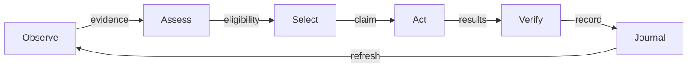

# 20260907-1559 — Systematic risk prioritization policy and integration journal

#fractal-l0 #fractal-l1 #fractal-l2 #fractal-l3 #fractal-l4 #fractal-l5 #fractal-l6 #fractal-l7 #fractal-l8 #fractal-l9 #zk-adr #zero-muda

[Source](http://nas-1.tail55d152.ts.net:4100/files/docs/journal/20260907-1559-risk-prioritization-journal.md) · [SOP](http://nas-1.tail55d152.ts.net:4100/files/contracts/rules/20260907-1559-risk-prioritization-sop.md) · [Wiki](http://nas-1.tail55d152.ts.net:4100/docs/wiki/20260907-1559-risk-prioritization-guide.md) · [ADR](http://nas-1.tail55d152.ts.net:4100/docs/zk/20260907-1559-adr-risk-prioritization.md) · [Journal](http://nas-1.tail55d152.ts.net:4100/docs/journal/20260907-1559-risk-prioritization-journal.md)

Created from host observation 2026-09-07T15:58:59Z. Scope: SC-RISK-PRIORITY-001.
Plan: uos/risk-sop/20260907-1559. Task: SOP-POLICY. Actor: codex-side-risk-sop.

## 1. Scope & Trigger

The operator asked to standardize criticality × STPA × FMEA × dependency × impact across
SDLC, SRE, SOPs, agentic work, skills, Superpowers, agents and plugins, with a journal.
The follow-up explicitly required a self-contained repository.
This side-conversation change implements that local process package. Parent-thread implementation,
runtime services, other agents and their work orders were outside its mutation scope.

## 2. Pre-State Assessment

At 2026-09-07T15:58:59Z, chrony reported a 0.001245209-second system offset fast of NTP,
Stratum 3 and Normal leap status. Prefix 20260907-1559 uses hour and seconds.
Risk guidance was distributed among existing STPA/FDC skills and SDLC documents.
Relevant skill directories resolved into /home/an/.gemini/config/skills; these were external dependencies.

The inspected Sa-plan selection implementation accepts nonnegative legacy factors, has no impact
field and appends selection evidence without updating queue priority. This is a source observation,
not an assertion that all wrappers lack additional controls. Existing release/task labels were not
treated as new production evidence.

## 3. Execution Detail

### Observation and bounded registration

Read the current policies, canonical Sa-plan CLI/Store implementation and relevant skills.
Created a separate Sa-plan plan and claimed only SOP-POLICY as codex-side-risk-sop.
The first plan-create attempt was rejected because the name lacked two hierarchical segments.
Corrected that local input to uos/risk-sop-20260907-1559 before retrying; no direct database write or authority bypass was used.

### Policy and workflow integration

Authored the canonical SOP, explicit scoring rubric, mandatory decision record, freshness rules,
STPA/FMEA obligations, dependency inheritance and lifecycle transition table.
Added bindings to five agent instruction files, the SDLC/SRE contract and its three existing mirrors,
two SDLC documents and the swarm runbook. Added a local skill/plugin and repository discovery aliases.
No externally linked skill was edited or imported into UOS.

### Self-contained validation

Added OCaml sources and their Dune project inside the plugin plus a bounded shell wrapper.
The wrapper uses normal tools on PATH, builds in an owned temporary directory, runs report-only checks
and removes that temporary build directory. It embeds no private checkout or home-directory path.
The package's authored policy, examples, schema, workflow bindings and validator are all inside UOS.

A newly discovered Codex rule mirror contained the earlier SOP paragraph. Its difference was confined
to this packet's inherited-score wording; that delta was reconciled, preserving the local mirror.
No existing conflicting file was force-overwritten to create an alias.

## 4. Root Cause Analysis

The process lacked one shared, executable definition of work-selection arithmetic and precedence.
Imported source-specific instructions and local lifecycle documents could therefore diverge,
and a stored “priority” could be mistaken for implemented scheduler behavior.
The fix separates procedural obligation, deterministic checking, live enforcement and admission.

During draft review, uniform RPN division with a severity floor was found to collapse the FMEA
factor to severity alone. The final band thresholds let occurrence/detection raise the score while
preserving severe consequences. Boundary and monotonicity tests exercise this behavior.
A generated patch initially prefixed existing headings with a literal plus; the exact added characters
were removed before validation. No source/runtime failure was hidden by rerunning an unchanged test.

## 5. Fix Taxonomy

- Consolidation: one policy and versioned machine-readable profile.
- Explicit safety precedence: class/constraints/readiness before ordinal score.
- Poka-yoke: input bounds, arithmetic, UCA coverage, FMEA floors and DAG checks.
- Provenance: source references, factor rationale, UTC freshness and inherited urgency origins.
- Local composition: one local skill with per-runtime discovery and Superpowers bindings.
- Truthful status: report-only checks are distinct from automatic scheduler or runtime admission.

## 6. Patterns & Anti-Patterns Discovered

Use task-scoped primary evidence; show unknown inputs, blocked effects and residual hazards.
Record alternatives and counterevidence rather than just a product.
Use exact-task Sa-plan claims while automatic ordering remains unimplemented.
Keep global/imported skill sources intact and bind local policy at the repository boundary.

Avoid treating multiplied ordinal scores as probabilities, equating equal RPNs,
averaging away severe failure modes, inflating dependency counts, using cost to waive constraints,
or converting board ACKs, syntax-valid digests and passing tests into blanket approval.

## 7. Verification Matrix

| Check | Result / evidence scope |
|---|---|
| OCaml local selftests | PASS: 375 assertions; bounded tests, not a formal proof |
| Arithmetic/FMEA | Product bounds, band boundaries, severity floor, occurrence/detection monotonicity |
| Dependency/ranking | Class before score, inherited urgency, blocked/unknown/expired exclusion, exact expiry, future ready time, stable ties, cycle/missing/duplicate rejection |
| Record negatives | Forged product, zero factor, missing UCA, placeholder digest, duplicate JSON field, false-ready blocker, unknown-ready and understated FMEA interval rejected |
| Shell parsing | PASS: bash -n tools/risk-priority-check |
| Local package and manifest checks | PASS: 30 repository-local paths; plugin and skill format checks passed |
| Full JSON Schema oracle | PASS: Draft 2020-12 schema/example and 3 TOML files; the local OCaml checker deliberately implements this schema's bounded subset |
| Preservation audit | PASS: removing only the new binding blocks reproduces all 14 original file hashes |
| Active-agent pressure tests | UNRUN; sub-agents are prohibited in this side conversation |
| Lean/Quint/runtime two-key checks | UNRUN; no formal theorem or production admission claimed |
| Live page delivery / plugin reload | UNRUN; references/discovery files are not evidence of current serving or agent adoption |

Two semantic mutant comparisons cover score-only sorting and dropping the FMEA severity floor.
They are local finite tests, not an independent fleet-wide mutation campaign.
Schema/digest syntax checks do not authenticate source bytes or authorize effects.
The historical example is not refreshed into a live admission receipt.

## 8. Files Modified

| Path | Change |
|---|---|
| AGENTS.md | Targeted policy binding; pre-existing content preserved |
| .codex/AGENTS.md | Targeted policy binding; pre-existing content preserved |
| .claude/AGENTS.md | Targeted policy binding; pre-existing content preserved |
| .gemini/AGENTS.md | Targeted policy binding; pre-existing content preserved |
| .agents/AGENTS.md | Targeted policy binding; pre-existing content preserved |
| contracts/rules/sdlc-sre-verification-process-contract.md | Targeted policy binding; pre-existing content preserved |
| .agents/rules/sdlc-sre-verification-process-contract.md | Targeted policy binding; pre-existing content preserved |
| .claude/rules/sdlc-sre-verification-process-contract.md | Targeted policy binding; pre-existing content preserved |
| .gemini/rules/sdlc-sre-verification-process-contract.md | Targeted policy binding; pre-existing content preserved |
| docs/design/20260906-1300-uos-sdlc-sre-verification-process-specification.md | Targeted policy binding; pre-existing content preserved |
| docs/wiki/20260906-1300-uos-sdlc-sre-verification-process-guide.md | Targeted policy binding; pre-existing content preserved |
| docs/wiki/20260907-0653-uos-tri-agent-swarm-operations.md | Targeted policy binding; pre-existing content preserved |
| governance/capability-inventory/skills.toml | Targeted policy binding; pre-existing content preserved |
| governance/capability-inventory/plugins.toml | Targeted policy binding; pre-existing content preserved |
| contracts/rules/20260907-1559-risk-prioritization-sop.md | Repository-owned policy, code, metadata or local discovery alias |
| governance/planning/20260907-1559-risk-priority-policy.json | Repository-owned policy, code, metadata or local discovery alias |
| governance/planning/20260907-1559-risk-priority-record.schema.json | Repository-owned policy, code, metadata or local discovery alias |
| governance/planning/20260907-1559-risk-priority-example.json | Repository-owned policy, code, metadata or local discovery alias |
| plugins/uos-risk-prioritization/skills/uos-risk-prioritization/SKILL.md | Repository-owned policy, code, metadata or local discovery alias |
| plugins/uos-risk-prioritization/skills/uos-risk-prioritization/references/20260907-1559-superpowers-bindings.md | Repository-owned policy, code, metadata or local discovery alias |
| docs/wiki/20260907-1559-risk-prioritization-guide.md | Repository-owned policy, code, metadata or local discovery alias |
| docs/zk/20260907-1559-adr-risk-prioritization.md | Repository-owned policy, code, metadata or local discovery alias |
| governance/agents/policy/20260907-1559-risk-priority-bindings.toml | Repository-owned policy, code, metadata or local discovery alias |
| plugins/uos-risk-prioritization/validation/priority.ml | Repository-owned policy, code, metadata or local discovery alias |
| plugins/uos-risk-prioritization/validation/dune-project | Repository-owned policy, code, metadata or local discovery alias |
| plugins/uos-risk-prioritization/validation/dune | Repository-owned policy, code, metadata or local discovery alias |
| plugins/uos-risk-prioritization/validation/validate.ml | Repository-owned policy, code, metadata or local discovery alias |
| tools/risk-priority-check | Repository-owned policy, code, metadata or local discovery alias |
| plugins/uos-risk-prioritization/validation/uos-risk-priority-validation.opam | Declared normal toolchain dependencies; no private source path |
| plugins/uos-risk-prioritization/.codex-plugin/plugin.json | Repository-owned policy, code, metadata or local discovery alias |
| .codex/skills/uos-risk-prioritization | Repository-owned policy, code, metadata or local discovery alias |
| .codex/rules/20260907-1559-risk-prioritization-sop.md | Repository-owned policy, code, metadata or local discovery alias |
| .claude/skills/uos-risk-prioritization | Repository-owned policy, code, metadata or local discovery alias |
| .claude/rules/20260907-1559-risk-prioritization-sop.md | Repository-owned policy, code, metadata or local discovery alias |
| .gemini/skills/uos-risk-prioritization | Repository-owned policy, code, metadata or local discovery alias |
| .gemini/rules/20260907-1559-risk-prioritization-sop.md | Repository-owned policy, code, metadata or local discovery alias |
| .agents/skills/uos-risk-prioritization | Repository-owned policy, code, metadata or local discovery alias |
| .agents/rules/20260907-1559-risk-prioritization-sop.md | Repository-owned policy, code, metadata or local discovery alias |
| docs/journal/20260907-1559-risk-prioritization-journal.md | Repository-owned policy, code, metadata or local discovery alias |

Generated document names have the required timestamp prefix.
SKILL.md, plugin.json, AGENTS.md, Dune and code filenames retain their protocol-required names;
the new skill title and companion documents carry the timestamp.
The final check receipt binds hashes of the actual scoped artifacts. No JJ integration or native Git command was performed.
The receipt itself is docs/reviews/20260907-1559-risk-prioritization-checks.json and is excluded from its own hash list.

## 9. Architectural Observations

The same process runs at each lifecycle/fractal layer; evidence moves upward without inheriting execution authority.
The local analysis tool remains in OCaml, with a shell build wrapper. It does not add a runtime daemon,
new language service, background hook, network call or task store.

Editable ASCII:

```text
[Observe] --evidence--> [Assess] --eligibility--> [Select]
    ^                                               |
    | refresh                                     claim
    |                                               v
[Journal] <--record--- [Verify] <----results------ [Act]
```

Editable Mermaid (same nodes, edges and labels):



## 10. Remaining Gaps

| Priority | Remaining obligation | Acceptance |
|---|---|---|
| P1 for autonomous selection rollout | Native Sa-plan impact/class/freshness data, validated arithmetic and atomic dependency-aware selection with fencing | Independent candidate-bound negative/concurrency tests at the real execution boundary |
| P1 for affected release/effect | Revalidate evidence integrity, expired-owner controls, authorization, recovery and isolation against current work | Fresh scoped runtime/control evidence; separate release authority |
| P2 | Independently test live agent compliance with pressure scenarios and reload/discovery | Observed sessions obey constraints without duplicate tasks or unauthorized effects |
| P2 | Integrate measured cost/outcome and forecast calibration into selection | Real denominators, uncertainty and budget enforcement |
| P3 | Broader cleanup of unrelated legacy global skill links | Separate scoped inventory and reviewed local replacements |

These are obligations, not completed implementation or a new competing queue.
The author completed no parent work-order item and sent no board or peer-agent message.
Existing legacy skills elsewhere in the repository may still point outside UOS;
this package has no dependency on them.

## 11. Metrics Summary

One shared policy and formula; five bounded factors; four mandatory UCA categories;
five FMEA bands with a severity floor; four safety classes; three default freshness ceilings.
Five agent entry points and four runtime skill/rule discovery paths use the same policy.
Actual final validator results and artifact hashes are recorded in the companion receipt.
Additional model-provider requests dispatched through tools: 0. Primary assistant session cost: UNKNOWN.
Production restarts/cutovers: 0.
These are operation counts, not claimed improvements in production reliability or intelligence.

## 12. STAMP & Constitutional Alignment

Control action: select the next authorized work item.
Unsafe provision: score grants apparent authorization. Omission: required repair is starved.
Timing: stale evidence or missing dependency drives dispatch. Duration: owner acts beyond lease/budget.
Constraints: SC-RISK-PRIORITY-001 requires authority/eligibility before scoring, evidence refresh,
explicit hazards, bounds, and Sa-plan ownership. Enforcement is a process rule plus report-only validation;
mandatory runtime enforcement remains a gap.

The operator authorized this local update. No prior approvals were inherited from the parent thread.
Sa-plan is the canonical state authority for this task; the static JSON example and journal are evidence,
not alternate task state. Decision summaries expose reasons, alternatives and uncertainties without
requesting private model reasoning or asserting consciousness.

## 13. Conclusion

The repository now contains the common prioritization method and local lifecycle/agent discovery bindings,
plus the source and tests needed to validate its records and ordering.
Validation and final task completion are recorded separately after the scoped artifact checks.

Automatic scheduling, live agent adoption and production release safety remain separate evidence obligations.
Future work should address those enforcement gaps before treating this policy as an autonomous control gate.

## Comprehensive verification checklist

This is a process/document package. The entries below do not assert production conformance.
UNRUN and NOT_ADMITTED remain nonpassing; N/A must be justified for each actual change.

<details><summary>Domain 1 — Metadata and navigation</summary>

- [x] CHK-01-TIME — Host timestamp recorded.
- [x] CHK-02-TAIL — Full Tailscale FQDN references provided; live delivery unverified.
- [x] CHK-03-FRACT — L0–L9 applicability tagged.
- [x] CHK-04-KM — SOP, wiki, ADR and journal linked in this package.

</details>
<details><summary>Domain 2 — Zero-Muda and storage safety</summary>

- [ ] CHK-05-MUDA — Fleet dependency exclusion scan UNRUN.
- [ ] CHK-06-GRAPH — Runtime language/NIF conformance UNRUN.
- [ ] CHK-07-DRIVE — OS storage interlock execution UNRUN.

</details>
<details><summary>Domain 3 — Testing and mathematical gates</summary>

- [ ] CHK-08-C1C8 — Full UI categories UNRUN.
- [ ] CHK-09-MATH — Mathematical quality gates UNRUN.
- [ ] CHK-10-9MOD — Nine runtime test modalities UNRUN.
- [ ] CHK-11-REGR — Live UI regression monitoring UNRUN.

</details>
<details><summary>Domain 4 — Cross-language control and observability</summary>

- [ ] CHK-12-GLEAM — Production supervision/fencing checks UNRUN.
- [ ] CHK-13-HERMES — Mandatory scheduler enforcement NOT_IMPLEMENTED by this package.
- [ ] CHK-14-ZIGVM — Runtime kernel checks UNRUN.
- [ ] CHK-15-MAX — Actual inference checks UNRUN.
- [ ] CHK-16-OTEL — Runtime telemetry correlation UNRUN.

</details>
<details><summary>Domain 5 — Governance and Jujutsu</summary>

- [ ] CHK-17-SOV — Independent review/admission NOT_ADMITTED.
- [x] CHK-18-JJ — No native Git command or integration/VCS mutation used for this package.

</details>

[SOP](http://nas-1.tail55d152.ts.net:4100/files/contracts/rules/20260907-1559-risk-prioritization-sop.md) · [Wiki](http://nas-1.tail55d152.ts.net:4100/docs/wiki/20260907-1559-risk-prioritization-guide.md) · [ADR](http://nas-1.tail55d152.ts.net:4100/docs/zk/20260907-1559-adr-risk-prioritization.md) · [Journal](http://nas-1.tail55d152.ts.net:4100/docs/journal/20260907-1559-risk-prioritization-journal.md)

**UOS footer:** local policy and evidence package; production admission remains NOT_ADMITTED.
