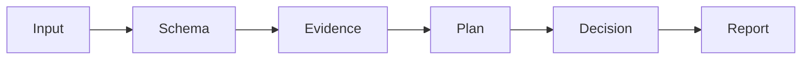

# 20260907-1606 — Risk checker implementation journal

#fractal-l0 #fractal-l1 #fractal-l2 #fractal-l3 #fractal-l4 #fractal-l5 #fractal-l6 #fractal-l7 #fractal-l8 #fractal-l9 #zk-adr #zero-muda

[SOP](http://nas-1.tail55d152.ts.net:4100/files/contracts/rules/20260907-1606-risk-checker-contract.md) · [Guide](http://nas-1.tail55d152.ts.net:4100/docs/wiki/20260907-1606-risk-checkers-guide.md) · [Journal](http://nas-1.tail55d152.ts.net:4100/docs/journal/20260907-1606-risk-checkers-journal.md) · [Planning](http://nas-1.tail55d152.ts.net:4100/planning)

Created: 2026-09-07T16:58:06Z. Actor: codex-side-risk-checkers.
Canonical plan: uos/risk-checkers/20260907-1631; task: CHECKERS; attempt: 1.
Status: local checker implementation and scoped verification completed; Sa-plan completion references the final receipt. Independent runtime admission is not asserted.

## 1. Scope & Trigger

The active side-conversation request was “continue. setup inteliigent strong checkers.”
Extend the completed local prioritization SOP with bounded executable evidence and
decision checks. This does not resume inherited Mirage/Solo5 work or grant runtime authority.

## 2. Pre-State Assessment

The v1 package passed 375 arithmetic/structural checks but did not compare source hashes
or live Sa-plan state. Some schema assertions could be ignored in unvisited branches.
Host clock at 16:58:06Z: chrony stratum 3, Normal leap state, 0.000477823s slow of NTP.
The existing receipt remains historical and must not be overwritten.

## 3. Execution Detail

### Bounded task registration

Created and claimed the task above through the supported Sa-plan CLI; selection evidence
records C3 × T4 × F4 × Dep5 × I4 = 960, P2, with source-only scope.
No sub-agent, board, mainline or production service mutation was used.

### Checker implementation

Added bounded JSON/file reads, complete schema traversal, Cryptokit SHA-256 source
verification, record-reference checks, read-only SQLite planning observation, host-clock
checks using Mtime elapsed time, uncertainty analysis and artifact receipt comparison.
Added preclaim and active-attempt commands with explicit report-only authority.

### Independent testing

The first targeted test reproduced an accepted unsupported assertion in an absent
optional schema field (exit 1). The schema preflight then rejected that input.
An independent matrix-closure oracle checks 32,768 three-node DAG scenarios against
the priority engine. Negative fixtures cover source tampering, hidden schema assertions,
path/FIFO bounds, clock failures, omitted tasks, forged states/dependencies and expired leases.
Final review moved expiry checking after the final clock observation, rechecked lease expiry
at that point, and added assessment/source expiry regression cases. The v1 packet was kept;
a new v2 packet binds the changed checker bytes.

## 4. Root Cause Analysis

Schema rules were validated only while traversing supplied values; absent branches
escaped validation. Structural SHA-256 syntax was mistaken for the strongest available
evidence check, although live byte comparison was not implemented. Ranking lacked explicit
uncertainty feedback, and plan assertions were supplied by the assessment itself.

## 5. Fix Taxonomy

Preventive: bounded input readers and strict schema preflight.
Detective: source hashes, clock evidence, state/dependency/owner comparison and receipt checks.
Decision support: provenance-aware urgency, sensitivity and unresolved-tie holds.
Process: local skill/agent/Superpowers bindings and reproducible one-command verification.

## 6. Patterns & Anti-Patterns Discovered

Independent recomputation is stronger than a second rendering of the same claim.
Source equality, runtime truth, authority and formal proof are separate evidence types.
Relative skill aliases need explicit link-target checks when verifying older receipts.
No false-green retry or rewriting of historical verification is acceptable.

## 7. Verification Matrix

| Observed check | Result |
|---|---|
| First hidden-schema negative case | Reproduced the v1 loophole; corrected validator rejects it |
| --all | PASS: 375 baseline + 32,843 adversarial/oracle checks; 39 local paths |
| Independent graph oracle | 32,768 DAG/class/state/score scenarios agree |
| v2 --active-check, worker codex-side-risk-checkers, attempt 1 | ACTIVE_OBSERVATION_PASS at 2026-09-07T17:26:52Z; 10 source files |
| Same v2 packet, attempt 2 | HOLD / RP-ACTIVE-OWNER, expected exit 1 |
| Claim preflight for the already executing task | HOLD / RP-SELECTION, expected exit 1 |
| Preserved v1 packet after timing correction | HOLD / RP-EVIDENCE for three changed source files |
| Previous 39-artifact receipt against current files | STALE_OR_CHANGED_ARTIFACTS; original receipt SHA-256 unchanged |
| Narrow binding edits | Original text preserved outside the 10 intended binding changes |
| Final source snapshot | See the [receipt](http://nas-1.tail55d152.ts.net:4100/docs/reviews/20260907-1606-risk-checker-verification.json) |

The first generated live packet omitted the terminal Z on its expiry. The checker rejected
it as invalid canonical UTC; the typo was corrected before any positive live result.
This was an input-format error, not evidence of source freshness.

The positive active observation used chrony stratum 3, absolute NTP offset about 0.00117s,
uncertainty about 0.01713s and 0.2204s monotonic checker duration. Full fleet tests, Lean/Quint
proofs and independent live-agent behavior are UNRUN. Artifact equality does not authenticate
test provenance or create runtime admission.

## 8. Files Modified

The receipt lists 51 artifact/dependency paths. Actual scoped edits:

- Eight existing implementation/metadata files: priority.ml, validate.ml, dune, the opam
  dependency manifest, tools/risk-priority-check, the local plugin manifest and the two
  capability inventories.
- Ten existing binding files: five AGENTS.md files, the canonical risk SOP and its local
  Codex mirror, the local skill, its Superpowers reference and the earlier risk guide.
- Six new OCaml modules: record.ml, bounded.ml, checker.ml, live_plan.ml, host_clock.ml,
  adversarial.ml.
- Six new artifacts: this contract/guide/journal packet, the v1 and v2 assessment portfolios,
  and the dated verification receipt.

Existing relative skill/rule aliases continue to resolve to the repository-owned package.
No global skill/plugin files, parent work-order sources, VCS state or production services
were modified. The earlier receipt's unchanged SHA-256 is
2554df1b82316caa82825e5bd4a8b40aa3171759658fa4ea445f497f46e09a7b.

## 9. Architectural Observations

The editable flow below describes check-only stages; no edge claims or executes a task.

```text
Input -> Schema -> Evidence -> Plan -> Decision -> Report
```



A fresh complete-plan observation is necessary but not atomic with a later effect.
The runtime Store must eventually enforce ownership/fencing and policy at that boundary.

## 10. Remaining Gaps

Atomic scheduler/effect integration, authenticated runtime/revision evidence, typed cost
comparison and semantic review remain separate work. Finite tests are not a Lean/Quint
proof. Global plugin installation, running-agent adoption and production deployment are unverified.

## 11. Metrics Summary

No additional model-provider calls, sub-agent interactions or runtime deployments.
One owned task; 33,218 assertion/scenario checks including 32,768 small-graph oracle
scenarios; 39 package-path checks; primary assistant session cost UNKNOWN.
The count is not a capability score or a proof of production readiness. The dated receipt
binds actual commands, expected negative exits and source hashes.

## 12. STAMP & Constitutional Alignment

SC-RISK-CHECK-001 implements veto/report behavior under SC-RISK-PRIORITY-001.
Four UCA types and the false-clearance FMEA mode are specified in its contract.
Sa-plan owns task execution. Existing operator scope, side-thread isolation and
two-key admission requirements are preserved.

## 13. Conclusion

The local checker package is implemented and the scoped positive/negative checks passed.
Historical receipts and the superseded packet remain preserved. Sa-plan task completion
records this journal and final receipt. Native atomic enforcement, independent review and
live-agent adoption remain open; no fleet admission is claimed.

## Comprehensive verification checklist


This is a process/document package. The entries below do not assert production conformance.
UNRUN and NOT_ADMITTED remain nonpassing; N/A must be justified for each actual change.

<details><summary>Domain 1 — Metadata and navigation</summary>

- [x] CHK-01-TIME — Host timestamp recorded.
- [x] CHK-02-TAIL — Full Tailscale FQDN references provided; live delivery unverified.
- [x] CHK-03-FRACT — L0–L9 applicability tagged.
- [x] CHK-04-KM — SOP, wiki, ADR and journal linked in this package.

</details>
<details><summary>Domain 2 — Zero-Muda and storage safety</summary>

- [ ] CHK-05-MUDA — Fleet dependency exclusion scan UNRUN.
- [ ] CHK-06-GRAPH — Runtime language/NIF conformance UNRUN.
- [ ] CHK-07-DRIVE — OS storage interlock execution UNRUN.

</details>
<details><summary>Domain 3 — Testing and mathematical gates</summary>

- [ ] CHK-08-C1C8 — Full UI categories UNRUN.
- [ ] CHK-09-MATH — Mathematical quality gates UNRUN.
- [ ] CHK-10-9MOD — Nine runtime test modalities UNRUN.
- [ ] CHK-11-REGR — Live UI regression monitoring UNRUN.

</details>
<details><summary>Domain 4 — Cross-language control and observability</summary>

- [ ] CHK-12-GLEAM — Production supervision/fencing checks UNRUN.
- [ ] CHK-13-HERMES — Mandatory scheduler enforcement NOT_IMPLEMENTED by this package.
- [ ] CHK-14-ZIGVM — Runtime kernel checks UNRUN.
- [ ] CHK-15-MAX — Actual inference checks UNRUN.
- [ ] CHK-16-OTEL — Runtime telemetry correlation UNRUN.

</details>
<details><summary>Domain 5 — Governance and Jujutsu</summary>

- [ ] CHK-17-SOV — Independent review/admission NOT_ADMITTED.
- [x] CHK-18-JJ — No native Git command or integration/VCS mutation used for this package.

</details>


**UOS footer:** local checker journal; historical evidence is preserved.
