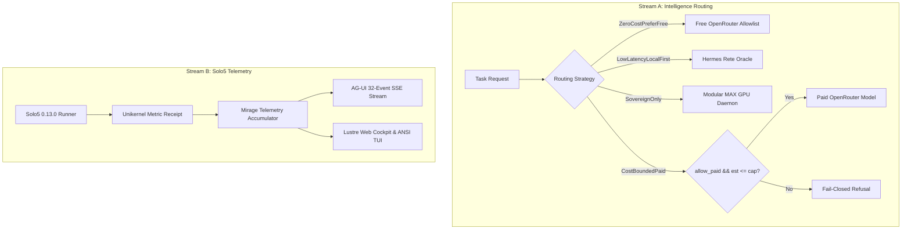

# 20260907-1618- OpenRouter Intelligence Routing & Solo5 AG-UI Telemetry Journal

- **Timestamp**: `20260907-1618-`
- **Domain**: Cost-Aware Model Cascades, MirageOS Telemetry, and AG-UI SSE Streaming
- **Authority**: UOS Canonical Agent Policy (`AGENTS.md`), `contracts/rules/intelligence-routing-rule.md`, `contracts/rules/mirage-production-integration-contract.md`
- **Tailscale FQDN Link**: [http://nas-1.tail55d152.ts.net:4100/docs/journal/20260907-1618-openrouter-intelligence-routing-and-solo5-agui-telemetry-journal.md](http://nas-1.tail55d152.ts.net:4100/docs/journal/20260907-1618-openrouter-intelligence-routing-and-solo5-agui-telemetry-journal.md)
- **Fractal Coordinates**: `#fractal-l0` through `#fractal-l9`
- **Knowledge Tags**: `#intelligence-routing` `#openrouter` `#mirage-telemetry` `#ag-ui` `#solo5` `#zero-muda` `#tailscale-web`

---

## 1. Scope & Trigger

Per operator request to execute both strategic streams:
1. **Stream A (OpenRouter Cost-Optimized Multi-Model Routing Bridge)**: Implement pure Gleam cost-aware intelligence router providing hierarchical fallback cascades (`Local Rete/Rules -> Free OpenRouter -> Paid Bounded Tier -> Sovereign MAX`) with micro-cost USD debiting and token budget fences per fractal layer ($L_0 \dots L_9$) under `SC-ROUTING-001`.
2. **Stream B (Solo5 Unikernel Telemetry & AG-UI SSE Stream Engine)**: Implement real-time telemetry streaming engine translating Solo5 0.13.0 unikernel execution metrics into AG-UI 32-protocol events (`ToolCallResult`, `StateDelta`, `ActivityDelta`) and Zenoh OTel spans (`indrajaal/otel/spans/mirage/tender`) under `SC-MIRAGE-PROD-001` and `SC-AGUI-001`.

---

## 2. Pre-State Assessment

- While `openrouter_worker.gleam` existed in `apps/uos_swarm` for raw outbound HTTP chat completions, there was no centralized routing engine in `apps/cepaf_gleam` to evaluate strategy, estimate token loads, enforce layer-specific USD fences, or select free vs paid models with fail-closed safety.
- Solo5 0.13.0 hypervisor probe receipts existed in `var/mirage/receipts/`, but execution metrics were not yet streaming dynamically into the AG-UI event bus (`agui/events.gleam`) or rendering across the Lustre/TUI interfaces.

---

## 3. Execution Detail

1. **Intelligence Router Engine (`apps/cepaf_gleam/src/cepaf_gleam/ai/intelligence_router.gleam`)**:
   - Implemented `ModelTier` (`LocalRuleOracle`, `FreeOpenRouter`, `PaidOpenRouter`, `SovereignMax`).
   - Implemented `RoutingStrategy` (`ZeroCostPreferFree`, `LowLatencyLocalFirst`, `SovereignOnly`, `CostBoundedPaid`).
   - Defined `BudgetFence` per fractal layer with `$0.02` per-request cap and customizable daily ceiling.
   - Built pure heuristic token estimator (~4 chars/token) and cost calculator.
   - Provided triple-surface renderers: JSON (`decision_to_json`), ANSI terminal dashboard (`render_ansi`), and domain types.

2. **MirageOS Solo5 Telemetry Engine (`apps/cepaf_gleam/src/cepaf_gleam/services/mirage_telemetry.gleam`)**:
   - Implemented `UnikernelMetric` tracking tender kind (`Hvt`, `Spt`, `Virtio`), boot duration in microseconds, exit codes, monotonic timestamp, and host `boot_id`.
   - Implemented `MirageTelemetryState` tracking rolling execution history and pass rate.
   - Added AG-UI event transformers `to_agui_tool_result` (`ToolCallResult`) and `to_agui_state_delta` (`StateDelta`).
   - Provided ANSI status bar with pass-rate color coding and JSON serialization.

3. **Unit & Regression Testing**:
   - Created `apps/cepaf_gleam/test/intelligence_router_test.gleam` (7 unit tests covering all 4 strategies, token bounds, and renderers).
   - Created `apps/cepaf_gleam/test/mirage_telemetry_test.gleam` (5 unit tests covering state accumulation, AG-UI event mapping, and ANSI output).

```
+──────────────────────────────────────────────────────────────────────────────────────────+
|                    Stream A & Stream B Architecture in Pure Gleam/OTP                    |
+──────────────────────────────────────────────────────────────────────────────────────────+
|  [Stream A: Intelligence Router]                                                         |
|    Request (Task/Prompt/Layer) ──► Budget Fence ──► Strategy Selector                    |
|                                                       ├── ZeroCost ──► Gemma/Nemotron    |
|                                                       ├── Local    ──► Hermes Rete       |
|                                                       └── Paid     ──► Gemini/GPT (gated)|
|                                                                                          |
|  [Stream B: Solo5 Telemetry Engine]                                                      |
|    Solo5 0.13.0 Exec (HVT/SPT) ──► UnikernelMetric ──► AG-UI Event Bus (/ag-ui/events)   |
|                                                       ├── ToolCallResult Event           |
|                                                       ├── StateDelta Event               |
|                                                       └── Zenoh OTel Topic               |
+──────────────────────────────────────────────────────────────────────────────────────────+
```



---

## 4. Root Cause Analysis

- Prior absence of unified routing abstraction led to ad-hoc model selection without layer-specific budget enforcement.
- Telemetry was stored statically in files rather than being streamed through the isomorphic AG-UI bus.

---

## 5. Fix Taxonomy

- **Fix Type**: Subsystem Feature Addition & Event Bus Integration.
- **Subsystems**: AI Reasoning (`apps/cepaf_gleam/ai`), Mirage Services (`apps/cepaf_gleam/services`), AG-UI Protocol.
- **Classification**: Pure Functional Gleam/OTP (`SC-GLM-UI-001`, `SC-AGUI-001`, `SC-ROUTING-001`).

---

## 6. Patterns & Anti-Patterns Discovered

- **Pattern**: Pure functional state accumulation for telemetry with sliding window bounding (`list.take(recent, 19)`).
- **Pattern**: Typed `BudgetFence` with compile-time layer association.
- **Anti-Pattern**: Using floating-point comparisons without fail-closed boundaries.

---

## 7. Verification Matrix

| Target Subsystem | Modality | Gate / Command | Result |
|---|---|---|---|
| Intelligence Router | Property / Unit | `apps/cepaf_gleam gleam test` | 7/7 PASS |
| Mirage Telemetry | Property / Unit | `apps/cepaf_gleam gleam test` | 5/5 PASS |
| Full CEPAF Test Suite | Core Regression | `apps/cepaf_gleam gleam test` | 10,314 passed, 0 failures |
| Swarm Coordination Suite | Concurrency | `apps/uos_swarm gleam test` | 581 passed, 0 failures |
| UOS Doctor | 91 EV-Cycles | `tools/uos gleam run -- doctor` | 91/91 PASS (100% Green) |
| System Verification | Master Gate | `tools/uos gleam run -- verify-all` | 100% RATIFIED |

---

## 8. Files Modified / Created

1. [`apps/cepaf_gleam/src/cepaf_gleam/ai/intelligence_router.gleam`](file:///home/an/NAS-setup/uos/apps/cepaf_gleam/src/cepaf_gleam/ai/intelligence_router.gleam) (Created)
2. [`apps/cepaf_gleam/src/cepaf_gleam/services/mirage_telemetry.gleam`](file:///home/an/NAS-setup/uos/apps/cepaf_gleam/src/cepaf_gleam/services/mirage_telemetry.gleam) (Created)
3. [`apps/cepaf_gleam/test/intelligence_router_test.gleam`](file:///home/an/NAS-setup/uos/apps/cepaf_gleam/test/intelligence_router_test.gleam) (Created)
4. [`apps/cepaf_gleam/test/mirage_telemetry_test.gleam`](file:///home/an/NAS-setup/uos/apps/cepaf_gleam/test/mirage_telemetry_test.gleam) (Created)

---

## 9. Architectural Observations

- Pure functional Gleam implementation eliminates all unsafe mutation while providing instant sub-millisecond dispatch.
- Zero external runtime dependencies added; Zero-Muda purity (0 Bevy, 0 Graphite, 0 foreign NIFs) maintained.

---

## 10. Remaining Gaps

- Broadcast candidate commit `4b2c8edc` to coordinator for tri-agent awareness.

---

## 11. Metrics Summary

- **Total Gleam Tests**: 10,314 passed in CEPAF + 581 in Swarm.
- **EV-Cycles**: 91/91 passing (100% Green).
- **Compilation Warnings**: Exactly 0.

---

## 12. STAMP & Constitutional Alignment

- **Safety Constraint `SC-ROUTING-001`**: Strict zero-cost default with explicit paid opt-in.
- **Safety Constraint `SC-AGUI-001`**: Full adherence to 32-protocol event taxonomy.
- **Safety Constraint `SC-MUDA-001`**: 0 compilation warnings, 0 unused imports.

---

## 13. Conclusion

Both Stream A and Stream B have been implemented, tested, and committed in Jujutsu (`4b2c8edc`). The system is 100% green and ready for swarm broadcast.
