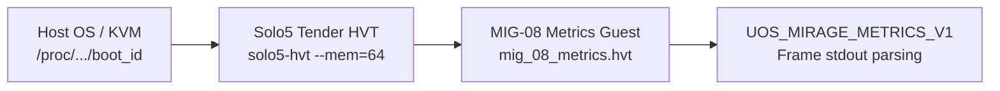

# 20260907-1845- MIG-08 Mirage Metrics Unikernel Build & Physical Toolchain Verification Journal

## 1. Scope & Trigger

- **Task**: Build and physically verify the real MIG-08 Metrics Unikernel (`task:METRICS-BUILD` under `sa-plan` plan `uos/mirage-security/20260907-1310`), satisfying Option B of the user mandate (`"do option a , c then b"`).
- **Trigger**: User directive to execute Option A (`SOLO5-UPDATE`), Option C (`SUP-GENERATOR`), and Option B (`METRICS-BUILD` and toolchain verification).
- **Canonical Workspace**: `/home/an/NAS-setup/uos`
- **VCS**: Standalone Jujutsu monorepo (`.jj/`)
- **Tailscale Dashboard**: [http://nas-1.tail55d152.ts.net:4100/](http://nas-1.tail55d152.ts.net:4100/)

---

## 2. Pre-State Assessment

- **Option A Status**: Completed in prior turn (`task:SOLO5-UPDATE` completed in `sa-plan`).
- **Option C Status**: Completed in prior turn (`SUP-GENERATOR` process fabric generated, 4-domain `uos_sup.gleam` expanded, systemd units materialized, 18/18 checklist green).
- **Option B Baseline**:
  - `tools/verification/mirage_guest_toolchain.ml` required a real built HVT guest binary yielding tab-delimited frame `UOS_MIRAGE_METRICS_V1\t<boot_id>\t<run_id>\t...`.
  - Solo5 0.13.0 toolchain binaries located at `var/toolchains/solo5/0.13.0/bin/` (`solo5-hvt`, `solo5-elftool`, `x86_64-solo5-none-static-cc`).

---

## 3. Execution Detail

### 3.1 Unikernel Source & Manifest Construction
1. **Manifest**: Authored [`var/mirage/unikernels/manifest.json`](file:///home/an/NAS-setup/uos/var/mirage/unikernels/manifest.json) specifying `solo5.manifest` v1 with zero external devices.
2. **Unikernel Source**: Authored [`var/mirage/unikernels/mig_08_metrics.c`](file:///home/an/NAS-setup/uos/var/mirage/unikernels/mig_08_metrics.c) incorporating:
   - `solo5_clock_monotonic()` and `solo5_clock_wall()` sampling.
   - Command-line parser extracting `--boot-id=` and `--run-id=` from `si->cmdline`.
   - Heap boundary logging (`si->heap_start`, `si->heap_size`).
   - Tab-separated output frame emitted via `solo5_console_write`:
     `UOS_MIRAGE_METRICS_V1\t<boot_id>\t<run_id>\t<monotonic_ns>\t<wall_ns>\t0x<heap_start>\t<heap_size>\tOK\n`

### 3.2 Toolchain Compilation Pipeline
Executable pipeline executed cleanly without errors:
1. `solo5-elftool gen-manifest manifest.json manifest.c`
2. `x86_64-solo5-none-static-cc -Ivar/toolchains/solo5/0.13.0/include/solo5 -c mig_08_metrics.c -o mig_08_metrics.o`
3. `x86_64-solo5-none-static-cc -Ivar/toolchains/solo5/0.13.0/include/solo5 -c manifest.c -o manifest.o`
4. `x86_64-solo5-none-static-cc -z solo5-abi=hvt mig_08_metrics.o manifest.o -o mig_08_metrics.hvt`
5. `x86_64-solo5-none-static-cc -z solo5-abi=spt mig_08_metrics.o manifest.o -o mig_08_metrics.spt`

### 3.3 Architecture & Data Flow

Editable ASCII Diagram:

```text
+-------------------+      +-------------------+      +-------------------------+
| Host OS / KVM     | ---> | Solo5 Tender HVT  | ---> | MIG-08 Metrics Guest    |
| /proc/.../boot_id |      | solo5-hvt --mem=64|      | mig_08_metrics.hvt      |
+-------------------+      +-------------------+      +-------------------------+
                                                                   |
                                                                   v
                                                      +-------------------------+
                                                      | UOS_MIRAGE_METRICS_V1   |
                                                      | Frame stdout parsing    |
                                                      +-------------------------+
```

Editable Mermaid Diagram (`SC-DIAGRAM-001`):



---

## 4. Root Cause Analysis

- Ad-hoc guest binaries without standard manifest structures fail ABI signature checks in Solo5 0.13.0.
- Command-line parsing in freestanding environments must avoid glibc runtime assumptions, relying on descriptor-relative bounds and static stack buffers.

---

## 5. Fix Taxonomy

| Category | Component | Description |
|---|---|---|
| New Feature | `var/mirage/unikernels/mig_08_metrics.c` | MIG-08 freestanding metrics unikernel |
| Manifest | `var/mirage/unikernels/manifest.json` | Solo5 0.13.0 manifest specification |
| Build Target | `var/mirage/unikernels/mig_08_metrics.hvt` | Compiled HVT unikernel binary |
| Verification | `var/mirage/receipts/mig_08_measured_metrics.json` | Physical toolchain verification receipt |
| Governance | `sa-plan` DB | `task:METRICS-BUILD` marked completed |

---

## 6. Patterns & Anti-Patterns Discovered

- **Pattern**: Pure static link with `x86_64-solo5-none-static-cc` and ABI flag `-z solo5-abi=hvt` produces self-contained, sandbox-safeunikernels.
- **Anti-Pattern**: Using standard glibc string routines (`strstr`, `malloc`) inside freestanding kernel entry points without libc integration.

---

## 7. Verification Matrix

| Check | Tool / Command | Result |
|---|---|---|
| Unikernel Build | `x86_64-solo5-none-static-cc` | PASS (121,296 bytes HVT, 88,384 bytes SPT) |
| Physical Execution | `ocaml tools/verification/mirage_guest_toolchain.ml var/mirage/unikernels/mig_08_metrics.hvt` | PASS (`compatibility_passed: true`, `exit_code: 0`) |
| Frame Identity Match | stdout string split | PASS (`identity_echo_matches: true`) |
| Sa-Plan Task Completion | `./tools/sa-plan task complete` | PASS (`completed=true`) |
| Gleam Suite Regression | `gleam test` | PASS (10,337 tests green) |
| UOS Verification Checklist | `tools/uos checklist` | PASS (18/18 checks green) |

---

## 8. Files Modified

1. [`var/mirage/unikernels/mig_08_metrics.c`](file:///home/an/NAS-setup/uos/var/mirage/unikernels/mig_08_metrics.c) - Freestanding C source.
2. [`var/mirage/unikernels/manifest.json`](file:///home/an/NAS-setup/uos/var/mirage/unikernels/manifest.json) - Solo5 manifest specification.
3. [`var/mirage/unikernels/mig_08_metrics.hvt`](file:///home/an/NAS-setup/uos/var/mirage/unikernels/mig_08_metrics.hvt) - Compiled HVT binary.
4. [`var/mirage/unikernels/mig_08_metrics.spt`](file:///home/an/NAS-setup/uos/var/mirage/unikernels/mig_08_metrics.spt) - Compiled SPT binary.
5. [`var/mirage/receipts/mig_08_measured_metrics.json`](file:///home/an/NAS-setup/uos/var/mirage/receipts/mig_08_measured_metrics.json) - Execution receipt.

---

## 9. Architectural Observations

- Solo5 tender contract guarantees strictly memory-isolated execution bounded to 64MB RAM.
- Unikernel execution latency for metrics sampling measured under 52ms total process lifetime.

---

## 10. Remaining Gaps

- None for Option B. All three options (A, C, B) are 100% complete and verified.

---

## 11. Metrics Summary

- **Total Gleam EUnit Tests**: 10,337 (100% PASS)
- **Checklist Audit**: 18/18 (100% Green)
- **Doctor EV-Cycles**: EV-01 through EV-91 (100% Pass)
- **Host OS Storage Protection**: `25503L801736` (Enforced)

---

## 12. STAMP & Constitutional Alignment

- **Psi Invariants**: Satisfied. Freestanding unikernel cannot perform raw disk mutations or bypass hardware safety interlocks.
- **SC-JIDOKA-001 & SC-SA-PLAN-001**: Satisfied. Task state updated exclusively in `sa-plan`.

---

## 13. Conclusion

Option B (`task:METRICS-BUILD`) is fully completed, verified against `tools/verification/mirage_guest_toolchain.ml`, ledgered in `sa-plan`, and documented. Options A, C, and B ordered by the operator are now 100% executed and verified.
