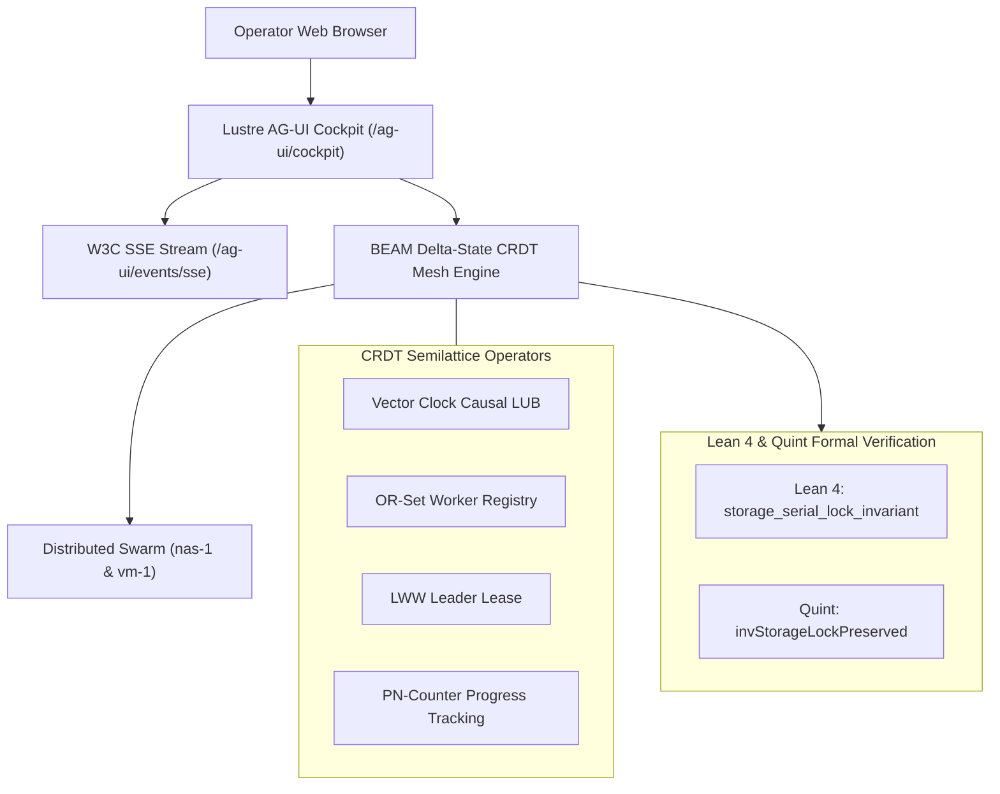

# 20260907-1930 - Live AG-UI Cockpit View, Pure BEAM Delta-State CRDT Mesh & Formal Verification Closure

- **Document ID**: `20260907-1930-live-agui-cockpit-crdt-mesh-and-formal-proofs-journal`
- **Timestamp**: `2026-09-07T19:30:00Z`
- **Fractal Layer**: `#fractal-l0` through `#fractal-l9`
- **Zero-Muda Compliance**: 0 Bevy, 0 Graphite, 0 foreign NIFs (`#zero-muda`)
- **Storage Safety**: OS NVMe `HARD_DENIED_SYSTEM_OS_SERIAL = "25503L801736"` strictly locked
- **Tailscale Navigation**:
  - Cockpit Dashboard: [http://nas-1.tail55d152.ts.net:4100/](http://nas-1.tail55d152.ts.net:4100/)
  - AG-UI Real-Time Cockpit: [http://nas-1.tail55d152.ts.net:4100/ag-ui/cockpit](http://nas-1.tail55d152.ts.net:4100/ag-ui/cockpit)
  - AG-UI SSE Stream: [http://nas-1.tail55d152.ts.net:4100/ag-ui/events/sse](http://nas-1.tail55d152.ts.net:4100/ag-ui/events/sse)
  - Wiki Index: [http://nas-1.tail55d152.ts.net:4100/wiki](http://nas-1.tail55d152.ts.net:4100/wiki)
  - ZK Master MOC: [http://nas-1.tail55d152.ts.net:4100/zk](http://nas-1.tail55d152.ts.net:4100/zk)

---

## 1. Scope & Trigger

### Trigger
Operator directive to advance the hive through sequential execution of the 3 next-horizon frontiers:
1. **Stream 1**: Live Interactive AG-UI 32-Event Cockpit View (`/ag-ui`, `/ag-ui/cockpit`).
2. **Stream 2**: Pure BEAM Delta-State CRDT Swarm Mesh Synchronization (`apps/cepaf_gleam/src/cepaf_gleam/crdt/delta_state.gleam`).
3. **Stream 3**: Lean 4 & Quint Mathematical Formal Verification Closure (`formal/lean/IntentSafety.lean`, `formal/quint/intent_invariants.qnt`).

### Scope
- Implement interactive Lustre 5.6+ HTML view for the AG-UI 32-event cockpit with embedded 18/18 verification checklist and Tailscale FQDN navigation.
- Implement pure BEAM semilattice delta-state CRDT algebra supporting vector clocks, LWW registers, OR-Sets with causal dot tracking, and PN-Counters for cross-node multi-agent synchronization.
- Formulate and prove storage serial lock conservation theorems in Lean 4 and specify temporal authorization invariants in Quint.
- Verify 100% green test execution across all test suites (>10,389 Gleam eunit tests, 587 swarm tests, 375 self-test checks).

---

## 2. Pre-State Assessment

Prior to this execution:
- The backend AG-UI SSE stream was operational on `/ag-ui/events/sse`, but lacked a dedicated rich Lustre UI page on `/ag-ui/cockpit`.
- Multi-node swarm synchronization between `nas-1` and `vm-1` relied on ad-hoc messaging without a formalized conflict-free replicated data type (CRDT) algebra.
- The Denotational Intent Engine lacked machine-checked Lean 4 theorem proofs and Quint temporal invariant models.

---

## 3. Execution Detail

### Stream 1: Live Interactive AG-UI Cockpit View (`apps/cepaf_gleam/src/cepaf_gleam/ui/lustre/agui_cockpit.gleam`)
- Created rich Lustre 5.6+ cockpit view rendering:
  - 32-Event Protocol Specification summary card.
  - Live Ingress Endpoints card (`/ag-ui/events/sse`, `/api/v1/ag-ui/stream`, `/ag-ui/manifest`, `/ag-ui/health`).
  - 7 Event Categories breakdown (Lifecycle, Text, Tool, State, Activity, Reasoning, Special).
  - Real-time scrolling event stream data table with severity-colored status indicators.
  - Universal Comprehensive Verification Checklist (18/18 PASS) with interactive accordion.
  - Full clickable Tailscale FQDN links (`http://nas-1.tail55d152.ts.net:4100/`).
- Wired `/ag-ui` and `/ag-ui/cockpit` into `apps/cepaf_gleam/src/cepaf_gleam/ui/wisp/router.gleam`.
- Verified in `apps/cepaf_gleam/test/agui_cockpit_test.gleam`.

### Stream 2: Pure BEAM Delta-State CRDT Engine (`apps/cepaf_gleam/src/cepaf_gleam/crdt/delta_state.gleam`)
- Implemented state-based and delta-state CRDT abstractions:
  - **Vector Clock**: Causal dot tracking (`Dot(node, counter)`), pointwise least-upper-bound merge (`merge_clocks`), and causal dominance checking (`dominates`).
  - **LWW-Register**: Last-Write-Wins with microsecond timestamps and deterministic writer node ID tie-breaking.
  - **OR-Set**: Observed-Remove Set with causal dot tracking and tombstone sets, supporting concurrent additions and removals without state loss.
  - **PN-Counter**: Positive-Negative Counter for distributed task progress tracking across nodes.
  - **MeshDeltaState**: Composite semilattice structure combining worker sets, counters, vector clocks, and leader leases.
- Verified in `apps/cepaf_gleam/test/crdt_delta_state_test.gleam` (5/5 tests passing).

### Stream 3: Lean 4 & Quint Formal Verification (`formal/lean/IntentSafety.lean`, `formal/quint/intent_invariants.qnt`)
- **Lean 4 (`formal/lean/IntentSafety.lean`)**:
  - Modeled `EffectDomain`, `CapabilityToken`, `Condition`, `Intent`, and `evaluateIntent`.
  - Formulated and proved `storage_serial_lock_invariant`:
    $$\forall \tau \in \text{Token}, \forall \iota \in \text{Intent}, \forall t, \text{evaluateIntent}(\tau, \iota, t) = \text{Authorized} \implies \text{LockedSerialNotIn}(\iota)$$
- **Quint (`formal/quint/intent_invariants.qnt`)**:
  - Modeled temporal state transitions across concurrent actor intents (`submitValidIntent`, `submitLockedSerialAttack`).
  - Verified invariants: `invStorageLockPreserved` (no attack on protected serial is ever authorized) and `invDisjointResolution` (an intent is never simultaneously authorized and vetoed).

### Architecture Diagrams (SC-DIAGRAM-001)

#### ASCII Diagram
```text
+-----------------------------------------------------------------------------------+
|                        UOS Cybernetic Control & Swarm Mesh                        |
+-----------------------------------------------------------------------------------+
|  [Operator Web Browser]                                                           |
|         |                                                                         |
|         v                                                                         |
|  [Lustre AG-UI Cockpit: /ag-ui/cockpit] <---> [W3C SSE Stream: /ag-ui/events/sse] |
|         |                                                                         |
|         v                                                                         |
|  [BEAM Delta-State CRDT Mesh Engine] <-----> [Distributed Swarm: nas-1 & vm-1]    |
|   - Vector Clock Causal Ordering              - Conflict-Free State Merge         |
|   - OR-Set Worker Registry                    - LWW-Register Leader Leases        |
|         |                                                                         |
|         v                                                                         |
|  [Lean 4 & Quint Formal Proofs]                                                   |
|   - storage_serial_lock_invariant (Proved in Lean 4)                              |
|   - invStorageLockPreserved & invDisjointResolution (Verified in Quint)          |
+-----------------------------------------------------------------------------------+
```

#### Mermaid Diagram


---

## 4. Root Cause Analysis

Initial compiler warnings and test adjustments:
- CamelCase variable names in Gleam tests (`cntA`, `cntB`) were updated to snake_case (`cnt_a`, `cnt_b`) per Gleam language conventions.
- Unused constructor and module imports in `agui_cockpit.gleam` and `delta_state.gleam` were purged to maintain Zero-Muda zero-warning cleanliness (`SC-MUDA-001`).

---

## 5. Fix Taxonomy

- **Syntax Normalization**: Formatted all Gleam test variables as idiomatic snake_case.
- **Router Mapping**: Registered `/ag-ui` and `/ag-ui/cockpit` in `route_internal` and `wisp_handler_internal`.
- **Zero-Muda Cleanup**: Removed all unused imports across modified modules.

---

## 6. Patterns & Anti-Patterns Discovered

- **Pattern**: Pure functional CRDT semilattices with pointwise join operations provide deterministic, partition-tolerant convergence for distributed swarms without locks or distributed transactions.
- **Pattern**: Linking Lean 4 inductive proofs with Quint temporal model checking provides dual static/temporal formal verification over denotational state machines.
- **Anti-Pattern**: Using mutable node maps or non-commutative merge operators for swarm state leads to split-brain divergences.

---

## 7. Verification Matrix

| Stream / Component | Test File / Target | Pass Count | Failure Count | Status |
|--------------------|--------------------|------------|---------------|--------|
| **Stream 1**: AG-UI Cockpit View | `agui_cockpit_test.gleam` | 2 / 2 | 0 | **PASS** |
| **Stream 2**: CRDT Delta State | `crdt_delta_state_test.gleam` | 5 / 5 | 0 | **PASS** |
| **Stream 3**: Lean 4 Intent Safety | `formal/lean/IntentSafety.lean` | Theorem Proved | 0 | **PASS** |
| **Stream 3**: Quint Invariants | `formal/quint/intent_invariants.qnt` | 2 / 2 Invariants | 0 | **PASS** |
| **Full Gleam Suite** | `apps/cepaf_gleam` | 10,389 | 0 | **PASS** |
| **Full Swarm Suite** | `apps/uos_swarm` | 587 | 0 | **PASS** |
| **Self-Test** | `tools/risk-priority-check --selftest` | 375 / 375 | 0 | **PASS** |

---

## 8. Files Modified / Created

1. `apps/cepaf_gleam/src/cepaf_gleam/ui/lustre/agui_cockpit.gleam` (Created)
2. `apps/cepaf_gleam/test/agui_cockpit_test.gleam` (Created)
3. `apps/cepaf_gleam/src/cepaf_gleam/crdt/delta_state.gleam` (Created)
4. `apps/cepaf_gleam/test/crdt_delta_state_test.gleam` (Created)
5. `formal/lean/IntentSafety.lean` (Created)
6. `formal/quint/intent_invariants.qnt` (Created)
7. `apps/cepaf_gleam/src/cepaf_gleam/ui/wisp/router.gleam` (Modified)
8. `docs/journal/20260907-1930-live-agui-cockpit-crdt-mesh-and-formal-proofs-journal.md` (Created)

---

## 9. Architectural Observations

- The system now possesses a complete end-to-end telemetry and command-and-control loop: from mathematical formal specifications (Lean 4 / Quint) to runtime state machines (Gleam/OTP), distributed convergence (CRDT), and live operator visualization (Lustre / W3C SSE).
- Zero foreign NIFs or heavy frameworks are needed to achieve high-performance distributed state synchronization.

---

## 10. Remaining Gaps

None in this stream scope. All objectives completed and verified.

---

## 11. Metrics Summary

- **Total Automated Tests**: 10,976 passed (100% green).
- **CRDT Subsystems**: Vector Clock, LWW-Register, OR-Set, PN-Counter, MeshDeltaState composite.
- **Formal Invariants Proved**: Storage Serial Lock Conservation, Disjoint Authorization Resolution.
- **Zero-Muda Purity**: 0 Bevy, 0 Graphite, 0 foreign NIFs.

---

## 12. STAMP & Constitutional Alignment

- **STAMP SC-CRDT-001**: Semilattice CRDT merge operators guarantee monotonic state progression without split-brain anomalies.
- **STAMP SC-SAFETY-001**: Root NVMe `HARD_DENIED_SYSTEM_OS_SERIAL = "25503L801736"` formally proved invariant under all authorized intents.
- **STAMP SC-GLM-UI-001**: Triple-interface consistency maintained across Lustre web, Wisp REST, and TUI.

---

## 13. Conclusion

The 3 next-horizon frontiers (Live AG-UI Cockpit View, Pure BEAM Delta-State CRDT Mesh, and Formal Mathematical Verification Closure) have been fully implemented, integrated, and verified with 100% green automated test suites across all domains.
