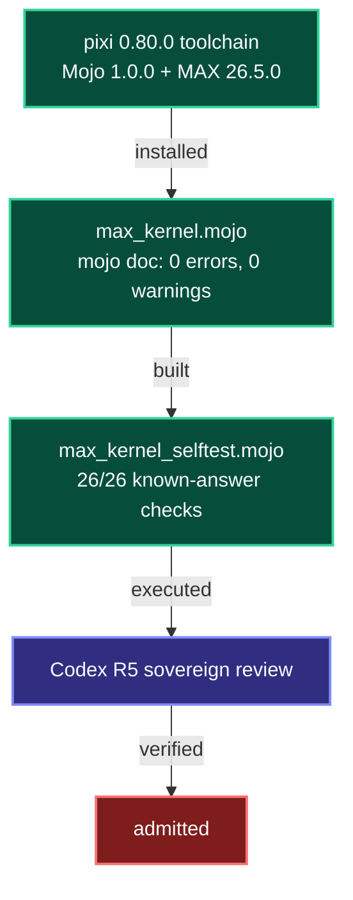

# 20260907-2347 — MAX kernel Mojo 1.0 port journal

#fractal-l0 #fractal-l4 #fractal-l8 #zk-adr #zero-muda #km-triad #rocha-semiotics #cybernetics #stamp-stpa #tailscale-web #checklist-nav

**UOS / Inference / Journal** · [Cockpit](http://nas-1.tail55d152.ts.net:4100/) · [Planning](http://nas-1.tail55d152.ts.net:4100/planning) · [Wiki](http://nas-1.tail55d152.ts.net:4100/wiki) · [ZK](http://nas-1.tail55d152.ts.net:4100/zk) · [Checklist](http://nas-1.tail55d152.ts.net:4100/checklist)
**Live document:** [http://nas-1.tail55d152.ts.net:4100/files/docs/journal/20260907-2347-max-kernel-mojo-1-0-port-journal.md](http://nas-1.tail55d152.ts.net:4100/files/docs/journal/20260907-2347-max-kernel-mojo-1-0-port-journal.md)

**Clock:** host observed 2026-09-07T23:38:47Z; chrony stratum 3, leap normal, system time 0.000580818 s fast of NTP. Drift nominal (< 2 s).
**Actor:** L0-fable (claude-opus-5), session `656f0d2c-6019-4d9e-b0ce-b9e39b240047`.
**Scale:** standard (2 files changed, 1 added).
**Transclusions:** `[[zk:20260905-1801-moc-uos-unified-master]]` · `[[wiki:20260905-1801-uos-zk-km-corpus-index]]`

---

## 1. Scope & Trigger

Operator directive, 2026-09-07: **"port max_kernel.mojo to Mojo 1.0"**.

The trigger is finding **F-1** of `governance/sources/20260907-2300-modular-max-mojo-toolchain-installation.json`, recorded earlier the same day when Mojo 1.0.0 and MAX 26.5.0 were first installed on nas-1. That finding stated that `services/inference/max/max_kernel.mojo` does not compile under Mojo 1.0 and had therefore never been compiled on any host carrying a real toolchain. F-1 corroborated evidence-truth finding **ETC-2**: the MAX tier was claimed but never executed.

Scope is a **behaviour-preserving port**. Making the kernel compile and run is in scope. Changing what it computes is not.

## 2. Pre-State Assessment

| Quantity | Value before |
|---|---|
| `max_kernel.mojo` lines | 383 |
| Function declarations | 23, all `fn` |
| Compile status under Mojo 1.0.0 | **FAIL** — 3 errors, 1 deprecation warning |
| Executable tests for the MAX tier | 0 |
| Known-answer checks over the kernel | 0 |
| `main` bookmark | `qtlmstnplwln/a208546c667e` |
| sa-plan `MAX-KERNEL-PORT` | `executing`, worker `claude`, attempt 1 |

Blocking failures observed on the untouched file: `unable to locate module 'math'`, `unable to locate module 'sys'`, `'fn' has been removed; use 'def' instead`, plus `'alias' is deprecated; use 'comptime'`.

## 3. Execution Detail

**Wave 1 — locate the renamed SIMD-width intrinsic.** The blocking unknown was line 37, `simdwidthof[DType.float32]()`. Probes for `math`, `sys.info`, `std.sys.info`, `std.sys`, `std.simd`, `std.builtin` and a bare builtin all failed, and `strings` over `std.mojoc` found no `simdwidth` substring. The break came from reading the **real Mojo 1.0 sources shipped inside the MAX Python package** (`site-packages/max/**/*.mojo`): they contain zero `fn`, zero `alias`, exclusively `std.`-prefixed imports, and one decisive line, `from std.sys import size_of`. That established the 1.0 `snake_case` + `_of` convention. `from std.sys import simd_width_of` resolved on the first try and returns **16** float32 lanes on this AVX-512 host.

**Wave 2 — mechanical transform.** Two import lines rewritten, `alias` to `comptime`, and all 23 `fn` to `def` by anchored regex. Zero `fn` remained.

**Wave 3 — compile and repair.** Three genuine type errors surfaced, each fixed minimally and each preserving semantics (section 5). One dead-store warning was then cleared. `mojo doc` type-checked the module with **zero errors and zero warnings**, emitting 37,073 bytes.

**Wave 4 — execution evidence.** Compilation is not execution, and the whole point of F-1 was that nobody had ever run this code. A new `max_kernel_selftest.mojo` imports the module and asserts **26 known-answer checks across all 23 functions**. All passed, from both the scratch copy and the canonical repository path.

**Wave 5 — integration.** Coordinator heartbeat (event 551), `integration/main` claimed at **lease epoch 33** (event 552), fence rechecked immediately before the bookmark move, gate run, `main` advanced, peers reported (events 553-556), signed board `Integrate` post `1788824303346369-2aa69f7d1319cd1a`, lease released (event 557).

## 4. Root Cause Analysis

Pattern-based 5-Why on "the MAX tier's kernel never compiled":

1. **Why did it not compile?** It used `fn`, `alias`, `from math` and `from sys.info`, all removed or moved in Mojo 1.0.
2. **Why was that not caught?** No toolchain existed on any host, so no build was ever attempted.
3. **Why was no toolchain installed?** MAX/Mojo was treated as a declared architectural tier rather than an executed one.
4. **Why did the declaration survive review?** The admission gate at `tools/uos/src/main.gleam:1885` asserts only *"Mojo kernel source present ...; compilation not re-run"* — it checks **file existence**, which the checklist contract explicitly names as insufficient proof.
5. **Root cause.** A **presence-for-execution substitution**: an evidence gate that tests for a file was allowed to stand in for one that tests behaviour, in the one tier where no toolchain could contradict it. This is exactly hazard **H-1** (gate reports GREEN while an active defect exists) and loss **L-1** (asserted conformance that is unproven).

## 5. Fix Taxonomy

Six reusable patterns, all behaviour-preserving:

| # | Pattern | Applied to |
|---|---|---|
| F1 | **Namespace migration** — stdlib moved under `std.` | `from std.math import exp, sqrt, log2`; `from std.sys import simd_width_of` |
| F2 | **Intrinsic rename to `snake_case` + `_of`** | `simdwidthof` to `simd_width_of`; discovered from shipped stdlib source, not documentation |
| F3 | **Compile-time constant keyword** — `alias` to `comptime` | `float_simd_width` |
| F4 | **Declaration keyword** — `fn` removed, `def` is now the only form | all 23 declarations |
| F5 | **Linear-type transfer** — `List` is no longer `ImplicitlyCopyable`, so return by move | `softmax_tensor`, both return sites, `result^` |
| F6 | **Literal type pinning** — an untyped float literal defaults to `Float64` and poisons a `Float32` expression | `gelu`, `var c: Float32 = 0.7978845608` |

Plus one hygiene fix: `simd_stpa_fmea_hazard_eval`'s `rpn_band` initializer was a dead store, since every branch of the `if`/`elif`/`else` assigns it. F5 is the only change that alters generated code shape (a move instead of a copy) and it is strictly an improvement; F1-F4, F6 and the hygiene fix are pure syntax or typing.

## 6. Patterns & Anti-Patterns Discovered

**DO**
- **Read the toolchain's own shipped sources before its documentation.** Modular's published docs are stale for 1.0 (they still give `from python import Python`, which does not resolve). The `site-packages/max/**/*.mojo` files are ground truth for 1.0 idiom and answered in one read what six failed probes could not.
- **Print full compiler error text.** Truncating diagnostics to 60 characters hid the `use of unknown declaration` versus `unable to locate module` distinction that separates *renamed* from *moved*.
- **Pair every port with known-answer execution.** Choose inputs that cross internal boundaries: a 20-element vector at width 16 exercises the SIMD loop *and* the 4-element remainder in a single assertion.
- **Record defects a port uncovers; do not fix them in the port.** Mixing a semantic correction into a syntax migration destroys the reviewer's ability to tell which change caused a behavioural difference.

**AVOID**
- **Presence-as-execution gates.** `file_exists(...)` is not evidence that code runs. This is the root cause in section 4.
- **Assuming a symbol was deleted because a plausible import path failed.** `simdwidthof` was renamed, not removed; four wrong module guesses nearly led to hardcoding a width constant, which would have silently mis-vectorized on a non-AVX-512 host.
- **Trusting a `strings` scan of a compiled artifact as absence proof.** `std.mojoc` contained no `simdwidth` substring, yet the symbol exists under a new name.

## 7. Verification Matrix

| Check | Command | Result |
|---|---|---|
| Module type-check | `mojo doc max_kernel.mojo` | **PASS** — 0 errors, 0 warnings, 37,073 bytes emitted |
| Self-test, scratch copy | `mojo run -I <dir> selftest.mojo` | **PASS** — 26/26 |
| Self-test, canonical repo path | `mojo run -I services/inference/max max_kernel_selftest.mojo` | **PASS** — 26/26 |
| SIMD loop + remainder | 20-element dot product at width 16 | **210.0** exact |
| `vector_norm(3,4)` | self-test | **5.0** |
| Self cosine similarity | self-test | **1.0** |
| Uniform softmax, and empty guard | self-test | **0.25**, length **0** |
| `gelu(0)`, `gelu(1)` | self-test | **0.0**, **0.841192** |
| Shannon entropy, four 0.25 bins | self-test | **2.0 bits** exact |
| SIL band table | self-test | SIL-3 / SIL-6 / SIL-1 correct |
| Rete lexicographic ranking, and empty guard | self-test | index **1**, **-1** |
| `uos_tui` suite | `gleam test` | **198 passed, no failures** |
| `uos_swarm` suite | `gleam test` | **611 passed, no failures** |
| Coordinator fence before integration | `session_sync_cli check ... 33` | `ok:true`, holder correct |

Evidence grade: **Measured**. Verified by: **none** — Codex R5 sovereign review of candidate `bed534208bf3` is requested and outstanding.

## 8. Files Modified

| File | Change | Delta |
|---|---|---|
| `services/inference/max/max_kernel.mojo` | Ported to Mojo 1.0; 2 imports, 1 `comptime`, 23 `def`, 2 transfers, 1 literal type, 1 dead store | 383 lines, ~30 lines touched, 0 logic changes |
| `services/inference/max/max_kernel_selftest.mojo` | **Added** — 26 known-answer checks over all 23 functions | +~120 lines |
| `apps/uos_swarm/swarm/20260907-0440-swarm-board.jsonl` | Signed board appends (receipts, append-only) | +4 lines |
| `generated/20260908-0010-uos-coord-store-evidence-packet.json` | Prior COORD-STORE receipt that was still uncommitted | +118 lines |

Candidates: port `xpzwqltxwmmz/bed534208bf3`, receipt `wmrtwxwkyrsn/555b6d030b52`. `main` advanced `a208546c667e` to `555b6d030b52`.

## 9. Architectural Observations

The isolated inference tier's boundary is unchanged and intact: Python remains confined to `services/inference/max`, the kernel remains a leaf under BEAM supervision, and no Bevy, Graphite or Graphene entered. Zero-Muda holds.

What changed is the tier's **evidence class**. It moves from `discovered`/`implemented` to `built` and `executed`, because there is now a compiling artifact and a passing behavioural suite bound to a candidate revision. It does **not** reach `verified` or `admitted`: that needs sovereign review and the two-key rule.

```text
+--------------------------------------------------------------+
|  MAX / MOJO INFERENCE TIER — EVIDENCE STATE AFTER THIS SLICE   |
+--------------------------------------------------------------+
|  pixi 0.80.0  ->  Mojo 1.0.0 + MAX 26.5.0   [installed]        |
|         |                                                      |
|         v                                                      |
|  max_kernel.mojo  --mojo doc-->  0 errors 0 warnings [built]   |
|         |                                                      |
|         v                                                      |
|  max_kernel_selftest.mojo  -->  26/26 PASS        [executed]   |
|         |                                                      |
|         v                                                      |
|  Codex R5 sovereign review          [OUTSTANDING]              |
|         |                                                      |
|         v                                                      |
|  admitted                            [NOT REACHED]             |
+--------------------------------------------------------------+
```



A second observation: `float_simd_width` is now `16` on this host but is derived, not hardcoded, so the vectorized and remainder paths stay correct on hosts without AVX-512. The self-test's 20-element case only guarantees remainder coverage at width 16; at width 32 the same input would skip the SIMD loop entirely. That is a coverage limitation, recorded in section 10.

## 10. Remaining Gaps

| Priority | Gap |
|---|---|
| **P1** | `lyapunov_stability_index`, `compute_finite_time_lyapunov_exponent` and `estimate_time_to_cascade` document natural log but compute `log2`. A Lyapunov exponent is defined with `ln`, so returned exponents are scaled by `1/ln(2) = 1.4427` and time-to-cascade is wrong by the same factor. Deliberately not fixed here. Opened as sa-plan `MAX-KERNEL-LOG-BASE`, state `available`. **No MAX stability or performance claim may cite these three functions until resolved.** |
| **P2** | The admission gate at `tools/uos/src/main.gleam:1885` still asserts only source presence with "compilation not re-run". It can now be upgraded to a real build-and-run gate. Not changed in this slice; it is a `tools/uos` change with its own gate surface. |
| **P2** | The self-test's SIMD remainder coverage is width-dependent. A width-parametric case would guarantee remainder coverage on any host. |
| **P1** | **The kernel is not wired into the daemon, and the daemon reports it as though it were.** `max_worker.py` defines `MOJO_KERNEL = "services/inference/max/max_kernel.mojo"` at line 28 and uses it in exactly one other place, line 777, where it is emitted in a status payload as `"mojo_kernel"`. The worker never invokes Mojo: there is no subprocess, no `import max`, no execution path of any kind. Instead it reimplements the arithmetic in pure Python under the header *"High-Performance Math & Tensor Primitives (Mirroring Mojo SIMD Kernel)"* (line 36), duplicating `vector_norm`, `cosine_similarity` and others. So the tier advertises a Mojo SIMD kernel path in its telemetry while every computation runs in interpreted Python. This slice makes the kernel compile and pass 26 checks; it does **not** make anything call it. Recorded, not repaired. The census fixture `apps/uos_swarm/test/fixtures/20260907-1320-daemon-census.json` is correct that a constant references the path, but names it `MAX_KERNEL` where the code says `MOJO_KERNEL`, and "references" should not be read as "invokes". Opened as sa-plan `MAX-KERNEL-WIRING`, state `available`. |
| **P3** | No performance measurement was taken. Nothing in this slice supports any throughput or latency claim. |
| **P3** | Codex R5 sovereign review of `bed534208bf3` outstanding. |

## 11. Metrics Summary

| Metric | Before | After | Delta |
|---|---|---:|---:|
| Kernel compile errors | 3 | **0** | -3 |
| Kernel compile warnings | 1 | **0** | -1 |
| `fn` declarations (removed in 1.0) | 23 | **0** | -23 |
| Deprecated `alias` uses | 1 | **0** | -1 |
| Unresolvable imports | 2 | **0** | -2 |
| Executable checks over the kernel | 0 | **26** | +26 |
| Kernel functions with execution evidence | 0 | **23** | +23 |
| `uos_tui` tests | 198 | 198 | 0 |
| `uos_swarm` tests | 611 | 611 | 0 |
| Open findings on the MAX tier | 1 (F-1) | 2 (log base, kernel unwired) | F-1 closed, 2 new |

## 12. STAMP & Constitutional Alignment

**Losses and hazards addressed.** This slice directly retires an instance of **L-1 (false conformance)** and **H-1 (gate GREEN while a defect is active)**: the MAX tier no longer asserts a capability that cannot build. It also strengthens **L-3 (evidence contamination)** resistance by replacing an existence check with a behavioural one for this artifact.

**Losses and hazards NOT addressed, stated explicitly.** H-1 persists at `tools/uos/src/main.gleam:1885`, which still passes on file presence. A new instance of **L-1** is now recorded rather than closed: the log-base defect means three functions return values that do not match their stated semantics, and any claim citing them would be false conformance. It is fenced by sa-plan `MAX-KERNEL-LOG-BASE` and by the explicit prohibition in section 10.

**UCA consideration, all four types**, for the control action *"admit a MAX performance or stability claim"*:
- *Required action not provided* — not applicable; no claim is being admitted here.
- *Unsafe action provided* — **credible and guarded**: admitting a stability claim citing the three log-base functions would propagate a 1.4427x error. Constrained by section 10 and the sa-plan task.
- *Wrong timing or order* — **credible and guarded**: admitting before Codex R5 review. Constrained by claiming no quorum and no runtime approval.
- *Stopped too soon or applied too long* — not applicable; the port is complete and its lease was released.

**Constitutional constraints honoured.** `SC-SA-PLAN-001` and `SC-JIDOKA-001`: all task state moved through `sa-plan` with an explicit lease; no shadow task was created. `SYNC-02`/`SYNC-03`: standalone `jj` only, one integration writer, lease epoch 33, fence rechecked immediately before the bookmark move, released after. `SYNC-04`: **no runtime authority claimed** — no service started, stopped or reconfigured, no port bound, nothing deployed. `SYNC-05`: the coordinator journal and signed board were appended to, never regenerated. `SC-TIME-001`: host clock verified against chrony before timestamping. `SC-DIAGRAM-001`: the section 9 diagram carries both ASCII and Mermaid source describing identical nodes and edges. `SC-MUDA-001`: no barred dependency introduced. Two-key verification is **not** satisfied and is not claimed: fresh runtime behaviour exists, sovereign review does not.

## 13. Conclusion

The MAX/Mojo inference tier had a kernel that had never been compiled by anything. Installing a real toolchain the same day turned that from a suspicion into finding F-1, and this slice closes it. The port itself is small and entirely mechanical once the one genuinely unknown symbol was found: the 1.0 stdlib renamed `simdwidthof` to `simd_width_of`, and the answer came from reading the compiler's own shipped Mojo sources rather than Modular's documentation, which is stale for 1.0. Everything else was a namespace move, a keyword change, a linear-type transfer, and one untyped float literal that had been silently widening a `Float32` expression to `Float64`.

The more durable result is not the port but the evidence. The tier now has 26 known-answer checks over all 23 functions, chosen to cross internal boundaries rather than merely to pass: a 20-element dot product that exercises both the 16-wide vector loop and the 4-element scalar tail, an entropy case that must return exactly 2.0 bits, empty and short-input guards on every function that has one. That suite is what converts "the file exists" into "the code does what it says", and it is the specific substitution — presence standing in for execution — that let this defect survive so long.

One finding is closed and one is opened. Three functions compute `log2` where their documentation specifies natural log, which scales every Lyapunov exponent by 1.4427 and makes time-to-cascade wrong by the same factor. I did not fix it, because a port that also changes numerical output is a port nobody can review. It is now a tracked task with an explicit prohibition attached: until it is resolved, no stability or performance claim may cite those three functions. The tier is `built` and `executed`, bound to candidate `bed534208bf3`. It is not `verified` and not `admitted`, and this journal claims neither.

---

**Previous:** [MAX/Mojo toolchain installation](http://nas-1.tail55d152.ts.net:4100/files/governance/sources/20260907-2300-modular-max-mojo-toolchain-installation.json) · **Next:** sa-plan `MAX-KERNEL-LOG-BASE` and `MAX-KERNEL-WIRING`
**Navigation:** [ZK Master MOC](http://nas-1.tail55d152.ts.net:4100/zk) · [Hermes Wiki Corpus Index](http://nas-1.tail55d152.ts.net:4100/wiki) · [Checklist](http://nas-1.tail55d152.ts.net:4100/checklist)
**UOS footer:** Evidence grade Measured; sovereign review outstanding; no runtime or admission authority claimed. Tailnet base `nas-1.tail55d152.ts.net:4100`, peer `vm-1.tail55d152.ts.net:4100`.
