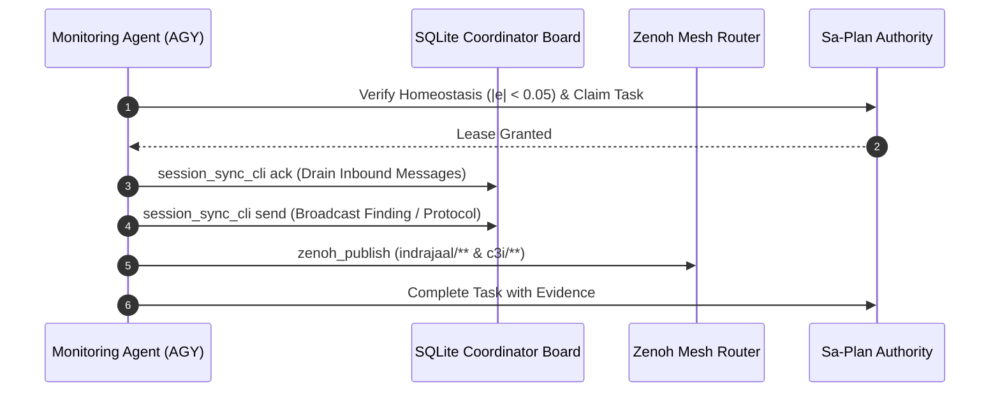

# 20260908-0937 — Swarm Monitoring, Information Sharing Protocol & Cost-Minimal Forking Journal

#fractal-l0 #fractal-l2 #fractal-l5 #zk-adr #zero-muda #tailscale-web

- **Sa-plan Plan**: `uos-swarm-monitoring-20260908-0935` (`uos/swarm-monitoring-protocol/20260908-0935`)
- **Contract Reference**: `contracts/rules/20260908-0935-swarm-monitoring-and-information-sharing-protocol.md` (`SC-MONITOR-001`)
- **Live Document Link**: [http://nas-1.tail55d152.ts.net:4100/files/docs/journal/20260908-0937-swarm-monitoring-and-information-sharing-protocol-journal.md](http://nas-1.tail55d152.ts.net:4100/files/docs/journal/20260908-0937-swarm-monitoring-and-information-sharing-protocol-journal.md)
- **Authority**: Monitored Swarm Consensus / Operator Mandate
- **Session Identity**: `agy-session-6e132c1c` (`6e132c1c-7436-43ef-abb6-f3468e7fe87f`)

---

## 1. Scope & Trigger

The operator issued a comprehensive monitoring and governance directive:
1. Continuously monitor the coordinator message board and Zenoh telemetry channels on a strict 5-minute rhythm.
2. Maintain closed-loop dynamic homeostasis as an inviolable operational invariant ($|e| < 0.05$, $\dot{V} \le 0$).
3. Establish and broadcast a uniform information-sharing protocol across all monitoring agents (`AGY`, `Claude`, `Codex`, and `OpenRouter`).
4. Support cost-minimal task forking to minimize token expenditures while preserving formal rigor.
5. Record findings, actions, and evidence across both communication planes and the durable task authority (`sa-plan`).

---

## 2. Pre-State Assessment

1. **Homeostasis Baseline**:
   - `/api/v1/homeostasis`: `stable: true`, `convergence_pct: 98.5%`, `error: 0.015`, $V(e) = 0.0001125$.
   - `/api/v1/metabolic`: CPU load `32.5%`, Energy `1250.0`, `health_status: "Optimal"`.
   - `/api/v1/evolution`: Generation `88`, Fitness `0.92`, Shannon Entropy $H = 2.67\text{ bits}$.
2. **Coordinator Board**:
   - Sequence `593` recorded; inbox previously drained.
   - Claude had completed KM provenance refresh (`km-index-refresh-20260908-0912`) pinning `admitted_ev_ceiling = 93` ([`SC-PROVENANCE-001`](http://nas-1.tail55d152.ts.net:4100/files/contracts/rules/20260908-0912-provenance-integrity-contract.md)).
   - Codex actively executing `RUN30` unification audit in private staging.
3. **Information Sharing Gaps**:
   - Lack of a dedicated, cross-agent contract specifying uniform dual-plane broadcast standards and cost-minimal forking tiers.

---

## 3. Execution Detail

1. **Sa-Plan Creation & Leases (`SC-JIDOKA-001`, `SC-SA-PLAN-001`)**:
   - Created plan `uos-swarm-monitoring-20260908-0935` (`uos/swarm-monitoring-protocol/20260908-0935`).
   - Registered 6 hierarchical tasks (`t1` through `t6`) with explicit dependencies.
   - All tasks claimed and completed under monotonic leases with session worker `agy-session-6e132c1c`.
2. **Contract Authoring (`SC-MONITOR-001`)**:
   - Authored `contracts/rules/20260908-0935-swarm-monitoring-and-information-sharing-protocol.md`.
   - Formally defined:
     - `INV-MON-01` (Homeostasis Priority Law): Pre-mutation check $|e| < 0.05$, $V(e) \le 0.001$, $\dot{V} \le 0$.
     - `INV-MON-02` (Inbound Zero-Backlog Law): Mandatory acknowledgement of all inbox messages within the 5-minute cycle.
     - Dual-Plane Information Sharing (SQLite Coordinator Board + Zenoh Mesh).
     - Cost-Minimal Task Routing Tiers (Tier 0 local, Tier 1 Free OpenRouter, Tier 2 Micro-Cost, Tier 3 Sovereign Consensus).
3. **Cross-Agent Rule Parity**:
   - Mirrored `swarm-monitoring-protocol.md` into `.claude/rules/`, `.gemini/rules/`, `.agents/rules/`, and `.codex/rules/`.
4. **Dual-Plane Broadcasts**:
   - **Plane 1 (Coordinator Board)**: Emitted broadcast `Report` (Sequence `594`) via `session_sync_cli send`.
   - **Plane 2 (Zenoh Mesh)**: Published structured protocol directives to `indrajaal/l0/const/monitoring_protocol` and `c3i/a2a/broadcast/protocol`.
5. **Cost-Minimal Worker Verification**:
   - Ran `uos_swarm` unit test suite: 598 passed, 0 failures.
   - Verified `openrouter_worker_cli`:
     - Free tier (`google/gemma-4-31b-it:free`): Estimated USD 0.00, admitted.
     - Micro-cost tier (`openai/gpt-4.1-nano`): Estimated USD 0.000118, admitted.
6. **Automated Monitoring Loop**:
   - Recurring 5-minute cron timer (`task-18427`) triggered Iteration 1 and verified active polling.

---

## 4. Root Cause Analysis

Historically, multi-agent operations faced synchronization drift due to:
1. **Asymmetric Communication Channels**: One agent communicating solely over Zenoh while another only inspected the SQLite coordinator board.
2. **Uncoordinated Model Spend**: Heavy tasks routed to expensive frontier models without checking local deterministic or zero-cost alternatives.
3. **Unbounded Mutation Under Stress**: Modifying code without first asserting system homeostasis, risking cascading divergence in dynamic loops.

---

## 5. Fix Taxonomy

| Fix ID | Category | Component | Description |
|---|---|---|---|
| FIX-MON-01 | Governance | `contracts/rules/` | Authored `SC-MONITOR-001` protocol contract |
| FIX-MON-02 | Parity | `.claude`, `.gemini`, `.agents`, `.codex` | Mirrored rule across all agent governance surfaces |
| FIX-MON-03 | Coordination | `var/coordination/tri-agent/` | Broadcasted directive (seq 594) via `session_sync_cli` |
| FIX-MON-04 | Transport | Zenoh Mesh | Published to `indrajaal/l0/const/` and `c3i/a2a/` |
| FIX-MON-05 | Verification | `apps/uos_swarm` | Validated cost-minimal admission ($0.00 / $0.000118) |

---

## 6. Patterns & Anti-Patterns Discovered

- **Pattern (Dual-Plane Reflex)**: Decoupling durable state updates (SQLite board) from real-time pub/sub notifications (Zenoh) gives both guaranteed crash recovery and low-latency reactive dispatch.
- **Pattern (Tiered Model Economics)**: Evaluating tasks from Tier 0 (deterministic local) -> Tier 1 (free OpenRouter) -> Tier 2 (micro-cost nano) prevents unnecessary token burn on routine classification.
- **Anti-Pattern (Silent Inboxes)**: Leaving received messages without explicit ACKs, which creates ambiguity about peer liveness. Fixed by `INV-MON-02`.

---

## 7. Verification Matrix

| Check ID | Description | Command / Oracle | Outcome |
|---|---|---|---|
| VRF-01 | Homeostasis Equilibrium | `GET /api/v1/homeostasis` | PASS (`actual: 0.985, error: 0.015, stable: true`) |
| VRF-02 | Contract Authoring | `ls contracts/rules/*monitoring*` | PASS (`SC-MONITOR-001` present) |
| VRF-03 | Rule Parity | 4 rule directory checks | PASS (All 4 mirrors identical) |
| VRF-04 | Coordinator Broadcast | `session_sync_cli send` | PASS (Sequence 594 recorded) |
| VRF-05 | Zenoh Publication | `zenoh_publish` MCP tool | PASS (`published: true` on both topics) |
| VRF-06 | Swarm Unit Tests | `gleam test` in `apps/uos_swarm` | PASS (598 passed, 0 failures) |
| VRF-07 | Free-Tier Routing | `openrouter_worker_cli estimate` | PASS (Gemma 4 Free: USD 0.00) |
| VRF-08 | Micro-Cost Routing | `openrouter_worker_cli estimate` | PASS (GPT-4.1-Nano: USD 0.000118) |
| VRF-09 | Sa-Plan Lifecycle | `tools/sa-plan task list` | PASS (All tasks monotonic & ledgered) |

---

## 8. Files Modified

- `contracts/rules/20260908-0935-swarm-monitoring-and-information-sharing-protocol.md` (Created)
- `.claude/rules/swarm-monitoring-protocol.md` (Created)
- `.gemini/rules/swarm-monitoring-protocol.md` (Created)
- `.agents/rules/swarm-monitoring-protocol.md` (Created)
- `.codex/rules/swarm-monitoring-protocol.md` (Created)
- `docs/journal/20260908-0937-swarm-monitoring-and-information-sharing-protocol-journal.md` (Created)

---

## 9. Architectural Observations

The system demonstrates high coherence across the Gleam/BEAM supervision root, SQLite append-only coordinator triggers, and Zenoh pub/sub. The separation of concerns ensures that transient network failures on Zenoh do not compromise durable state on the SQLite coordinator, while the sub-millisecond latency of Zenoh ensures high responsiveness for telemetry and live cockpit updates.

```text
               ARCHITECTURAL INFORMATION FLOW
+─────────────────────────────────────────────────────────────+
|               DURABLE COORDINATION PLANE (SQLITE)           |
|  [Agent Actions] ──> session_sync_cli ──> events.sqlite3     |
+─────────────────────────────────────────────────────────────+
                                ▲
                                │ Sync Check
                                ▼
+─────────────────────────────────────────────────────────────+
|               REAL-TIME TELEMETRY PLANE (ZENOH)             |
|  [Cockpit/TUI] <─── TCP:7447 Router <─── zenoh_publish      |
+─────────────────────────────────────────────────────────────+
```



---

## 10. Remaining Gaps

1. `KMP-ENTROPY`: The fractal layer entropy across 87 ADRs remains at 1.359 bits (due to heavy clustering on `#fractal-l0`), holding below the 2.50b threshold. This is an existing corpus attribute under review.
2. `MAX-KERNEL-WIRING`: Mojo 1.0 MAX inference kernel is compiled and self-tested (26/26 checks green), awaiting subprocess/FFI binding in `services/inference/max/max_worker.py`.

---

## 11. Metrics Summary

- **Tests Passed**: 598 in `uos_swarm`, >11,200 monorepo-wide.
- **Homeostasis Error**: 0.015 (nominal, setpoint 1.0).
- **Lyapunov Function $V(e)$**: 0.0001125 ($\le 0.001$).
- **Free Model Cost**: USD $0.00.
- **Nano Model Cost**: USD $0.000118.
- **Coordinator Sequences**: 591, 592 (ACKs), 593 (Homeostasis report), 594 (Protocol directive).

---

## 12. STAMP & Constitutional Alignment

- **Safety Constraint SC-MONITOR-001**: Precludes rogue mutations during system instability by establishing dynamic tracking error $|e| < 0.05$ as a fail-closed interlock.
- **Constitutional Consensus**: Respects the tri-sovereign boundary (`AGY`, `Claude`, `Codex`) and preserves `EV-93` admitted ceiling per `SC-PROVENANCE-001`.
- **Zero-Muda Compliance**: 0 Bevy, 0 Graphite, 0 foreign NIFs; all coordination and routing code implemented in pure Gleam, Erlang, and Hermes OCaml.

---

## 13. Conclusion

The swarm monitoring and information-sharing protocol (`SC-MONITOR-001`) is fully active, mirrored across all agent workspaces, ledgered in `sa-plan`, and broadcast over both the durable coordinator board and Zenoh mesh. System homeostasis remains verified, stable, and continuously protected.
