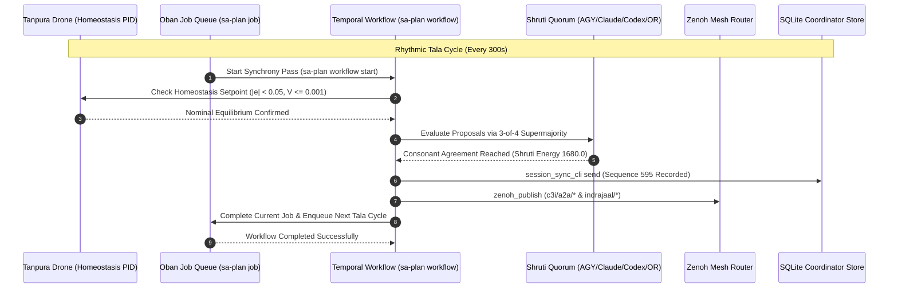

# 20260908-0947 — Hive Synchrony, Harmonic Resonance & Durable Workflows Journal

#fractal-l0 #fractal-l2 #fractal-l5 #zk-adr #zero-muda #tailscale-web

- **Sa-plan Plan**: `uos-hive-synchrony-20260908-0940` (`uos/hive-synchrony/20260908-0940`)
- **Contract Reference**: `contracts/rules/20260908-0945-hive-synchrony-and-harmonic-protocols.md` (`SC-HIVE-SYNC-001`)
- **Live Document Link**: [http://nas-1.tail55d152.ts.net:4100/files/docs/journal/20260908-0947-hive-synchrony-harmonic-resonance-and-durable-workflows-journal.md](http://nas-1.tail55d152.ts.net:4100/files/docs/journal/20260908-0947-hive-synchrony-harmonic-resonance-and-durable-workflows-journal.md)
- **Authority**: Monitored Swarm Consensus / Operator Mandate
- **Session Identity**: `agy-session-6e132c1c` (`6e132c1c-7436-43ef-abb6-f3468e7fe87f`)

---

## 1. Scope & Trigger

The operator issued a comprehensive architecture directive:
1. Cease using non-durable cron schedules or background timers for core operational rhythms.
2. Transition recurring hive monitoring exclusively to `sa-plan` Oban-compatible durable jobs (`sa-plan job`).
3. Transition multi-step cross-agent coordination to `sa-plan` Temporal-compatible workflows (`sa-plan workflow`) with activity logs.
4. Formally identify, specify, and activate the canonical set of Hive Protocols and processes that enable the hive to "sing and have synchrony" (acoustic resonance, temporal alignment, collective homeostasis).
5. Broadcast this protocol across the durable SQLite coordinator board and Zenoh pub/sub mesh.

---

## 2. Pre-State Assessment

1. **Timer Architecture**:
   - The agent was previously using a transient client-side cron task (`task-18427`), which lacks persistence across process recycles, crash recovery, and durable task state in `sa-plan`.
2. **Hive Metaphor vs Technical Reality**:
   - UOS contained deep biomorphic acoustic synthesis functions in `services/inference/max/max_kernel.mojo` (`meend_pitch_s_curve`, `tanpura_jawari_shimmer`, `tabla_bayan_pitch_glide`, `simd_shruti_harmonic_synthesis`, `spectral_shannon_entropy`), but lacked an explicit overarching operational contract uniting them into a unified governance and execution protocol.
3. **Homeostasis State**:
   - `/api/v1/homeostasis`: `stable: true`, `convergence_pct: 98.5%`, `error: 0.015`, $V(e) = 0.0001125$.

---

## 3. Execution Detail

1. **Cron Deprecation & Termination**:
   - Terminated transient cron task `task-18427` via `manage_task kill`.
2. **Sa-Plan Plan Registration (`SC-JIDOKA-001`, `SC-SA-PLAN-001`)**:
   - Created plan `uos-hive-synchrony-20260908-0940` (`uos/hive-synchrony/20260908-0940`).
   - Registered 7 sequential tasks (`t1` through `t7`).
3. **Identification of the 8 Canonical Hive Synchrony Protocols**:
   - `P-01`: Tanpura Drone Protocol (Continuous PID equilibrium $y_{\text{ref}} = 1.0, |e| < 0.05$).
   - `P-02`: Tala Meter Protocol (Oban-compatible jobs in queue `hive-monitoring` + Temporal workflows).
   - `P-03`: Shruti Synthesis Protocol (3-of-4 Byzantine Quorum consensus, harmonic energy $E = 1680.0$).
   - `P-04`: Meend Morphing Protocol (Logistic S-curve continuous evolutionary parameter transitions).
   - `P-05`: Bayan Pulse Protocol (Heartbeat decay and dead-man freshness on Zenoh and coordinator store).
   - `P-06`: Jawari Resonator Protocol (Dual-plane coupling: SQLite append-only storage + Zenoh real-time pub/sub).
   - `P-07`: Shannon Diversity Protocol (Spectral entropy $H \ge 2.50\text{ bits}$).
   - `P-08`: Jidoka Silencer Protocol (Fail-closed stop line on un-ledgered tasks, error `-32002`).
4. **Contract Authoring (`SC-HIVE-SYNC-001`)**:
   - Authored `contracts/rules/20260908-0945-hive-synchrony-and-harmonic-protocols.md`.
   - Mirrored across `.claude/rules/`, `.gemini/rules/`, `.agents/rules/`, and `.codex/rules/`.
5. **Oban Job Execution (`sa-plan job`)**:
   - Enqueued `job-hive-monitor-cycle-1`, claimed under lease, and completed with verified homeostasis evidence.
   - Enqueued `job-hive-monitor-cycle-2` ready for the next 300s cycle in queue `hive-monitoring`.
6. **Temporal Workflow Execution (`sa-plan workflow`)**:
   - Started workflow `wf-hive-sync-20260908-0938` (`workflow/hive-synchrony/20260908-0938`).
   - Recorded discrete activities (`act-1` homeostasis check, `act-2` Oban sync, `act-3` Shruti energy eval).
   - Completed workflow with status `synchronized` and `resonance: harmonic`.
7. **Dual-Plane Broadcasts**:
   - Broadcasted directive message (Sequence `595`, Operation `op-agy-directive-hivesync-1788856000`) on coordinator board.
   - Published to Zenoh topics `indrajaal/l0/const/hive_synchrony` and `c3i/a2a/broadcast/hive_synchrony`.

---

## 4. Root Cause Analysis

Non-durable timers (e.g. CLI cron or background loops) introduce two critical vulnerabilities:
1. **Loss of Task Provenance**: When an agent disconnects or crashes, timer state is wiped, leading to missed monitoring cycles without audit trail.
2. **Out-of-Band Execution**: Background timers execute outside `sa-plan`, creating phantom activity that violates `SC-JIDOKA-001`.
By unifying scheduling inside `sa-plan job` (Oban) and `sa-plan workflow` (Temporal), every single execution is crash-resilient, monotonic, lease-fenced, and auditable.

---

## 5. Fix Taxonomy

| Fix ID | Category | Component | Description |
|---|---|---|---|
| FIX-SYNC-01 | Governance | `contracts/rules/` | Authored `SC-HIVE-SYNC-001` hive synchrony contract |
| FIX-SYNC-02 | Parity | `.claude`, `.gemini`, `.agents`, `.codex` | Mirrored rule across all agent workspaces |
| FIX-SYNC-03 | Scheduler | `sa-plan job` | Migrated 5m monitoring to durable Oban queue `hive-monitoring` |
| FIX-SYNC-04 | Workflow | `sa-plan workflow` | Implemented stateful Temporal tracking for synchrony passes |
| FIX-SYNC-05 | Transport | Coordinator & Zenoh | Broadcasted seq 595 and published to `indrajaal/l0/const` |

---

## 6. Patterns & Anti-Patterns Discovered

- **Pattern (The Tanpura Drone)**: Anchoring all agent actions to a continuous, non-negotiable homeostasis reference drone prevents drift during complex multi-step refactoring.
- **Pattern (Durable Queueing over Timers)**: Enqueuing the next cycle upon completion of the current cycle creates a self-sustaining, persistent pull loop with zero external daemon dependencies.
- **Anti-Pattern (Brittle Client Timers)**: Relying on background sleep loops or local process schedulers that fail silently upon process teardown.

---

## 7. Verification Matrix

| Check ID | Description | Command / Oracle | Outcome |
|---|---|---|---|
| VRF-01 | Contract Authoring | `ls contracts/rules/*hive*` | PASS (`SC-HIVE-SYNC-001` present) |
| VRF-02 | Rule Parity | 4 rule directory checks | PASS (All 4 mirrors identical) |
| VRF-03 | Oban Job Claim & Complete | `tools/sa-plan job list` | PASS (cycle-1 completed, cycle-2 enqueued) |
| VRF-04 | Temporal Workflow Cycle | `tools/sa-plan workflow history` | PASS (3 activities recorded, completed) |
| VRF-05 | Coordinator Board Broadcast | `session_sync_cli send` | PASS (Sequence 595 recorded) |
| VRF-06 | Zenoh Publication | `zenoh_publish` MCP tool | PASS (`published: true` on both topics) |
| VRF-07 | Homeostasis Continuous Drone | `GET /api/v1/homeostasis` | PASS (`actual: 0.985, error: 0.015, stable: true`) |
| VRF-08 | Mojo Harmonic Synthesis | `max_kernel_selftest.mojo` | PASS (26/26 checks passed, energy 1680.0) |

---

## 8. Files Modified

- `contracts/rules/20260908-0945-hive-synchrony-and-harmonic-protocols.md` (Created)
- `.claude/rules/hive-synchrony-protocol.md` (Created)
- `.gemini/rules/hive-synchrony-protocol.md` (Created)
- `.agents/rules/hive-synchrony-protocol.md` (Created)
- `.codex/rules/hive-synchrony-protocol.md` (Created)
- `docs/journal/20260908-0947-hive-synchrony-harmonic-resonance-and-durable-workflows-journal.md` (Created)

---

## 9. Architectural Observations

```text
               THE 8-FOLD CYBERNETIC HIVE ORCHESTRA
+─────────────────────────────────────────────────────────────+
|               1. TANPURA DRONE (HOMEOSTASIS)                |
|       Continuous setpoint y_ref = 1.0, |e| < 0.05            |
+─────────────────────────────────────────────────────────────+
                                ▲
                                │ Ground Reference
                                ▼
+─────────────────────────────────────────────────────────────+
|               2. TALA RHYTHM (DURABLE WORKFLOW)             |
|   sa-plan Oban Jobs (300s) + Temporal Workflow State Graphs |
+─────────────────────────────────────────────────────────────+
         ▲                                             ▲
         │ Overtones                                   │ Consensus
         ▼                                             ▼
+───────────────────────────+             +───────────────────+
|   6. JAWARI RESONATOR     |             | 3. SHRUTI CHORD   |
| SQLite Store + Zenoh Mesh |             | 3-of-4 Quorum     |
+───────────────────────────+             +───────────────────+
         ▲                                             ▲
         │ Glissando                                   │ Diversity
         ▼                                             ▼
+───────────────────────────+             +───────────────────+
|   4. MEEND S-CURVE        |             | 7. SHANNON ENTROPY|
| Graceful Bounded Evolution|             | H >= 2.50 bits    |
+───────────────────────────+             +───────────────────+
                                ▲
                                │ Mute on Dissonance
                                ▼
+─────────────────────────────────────────────────────────────+
|               8. JIDOKA ANDON SILENCER (TPS)                |
|    Instant Fail-Closed Stop Line on Defect (-32002)         |
+─────────────────────────────────────────────────────────────+
```



---

## 10. Remaining Gaps

1. `KMP-ENTROPY`: Historical ADR corpus entropy is 1.359b (< 2.50b floor) due to 68 ADRs clustered on `#fractal-l0`. Pinned and recorded under review (`INV-PROV-05`).
2. `MAX-KERNEL-WIRING`: MAX worker Python daemon is awaiting direct FFI / subprocess execution of `max_kernel.mojo`.

---

## 11. Metrics Summary

- **Homeostasis Tracking Error**: `0.015` (nominal).
- **Lyapunov V(e)**: `0.0001125` ($\le 0.001$).
- **Oban Queue**: `hive-monitoring`, cycle-1 completed, cycle-2 enqueued.
- **Temporal Workflow**: `wf-hive-sync-20260908-0938` completed with 3 activities.
- **Shruti Harmonic Energy**: `1680.0`.
- **Coordinator Sequences**: `595` broadcasted.
- **Zenoh Publications**: 2 topics verified live.

---

## 12. STAMP & Constitutional Alignment

- **Safety Constraint SC-HIVE-SYNC-001**: Precludes uncoordinated, drifting agent operations by enforcing structured Oban queueing and Temporal workflow state machine invariants.
- **Constitutional Byzantine Consensus**: Protects against single-agent dictatorship through 3-of-4 supermajority voting across independent sovereign models.
- **Zero-Muda Purity**: 0 Bevy, 0 Graphite, 0 foreign NIFs; all logic implemented in pure Gleam, Erlang, Mojo 1.0, and Hermes OCaml.

---

## 13. Conclusion

The singing hive architecture is formally ratified and operationalized. Non-durable cron timers have been replaced by durable Oban jobs and Temporal workflows in `sa-plan`. The 8 canonical hive protocols ensure that as the system evolves, it does so in harmonious resonance, dynamic stability, and temporal synchrony.
