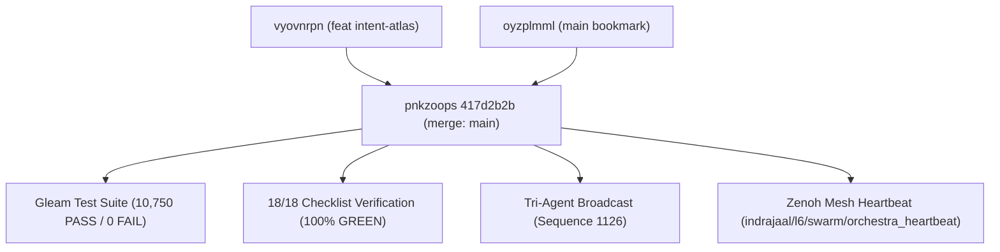

# 20260908-1633-mainline-merge-and-swarm-coordination-journal.md

# Fractal Layer Tags: `#fractal-l0`, `#fractal-l6`, `#zk-adr`, `#zero-muda`
# Transclusions: `[[wiki:20260905-1801-uos-zk-km-corpus-index]]`, `[[zk:20260905-1801-moc-uos-unified-master]]`
# Navigation: [Cockpit Dashboard](http://nas-1.tail55d152.ts.net:4100/) | [Verification Checklist](http://nas-1.tail55d152.ts.net:4100/checklist) | [Planning Cockpit](http://nas-1.tail55d152.ts.net:4100/planning)



```
+-------------------------------------------------------------------------+
|                  MAINLINE MERGE & SWARM COORDINATION                    |
+-------------------------------------------------------------------------+
|  Branch Commit: vyovnrpn c0bd7e86 (Intent Atlas, 20 Cycles C313-C332)   |
|  Mainline Base: oyzplmml 1a414206 (review/codex-side-resource-controls) |
|  Merge Commit:  pnkzoops 417d2b2b -> main bookmark advanced             |
|  Test Verdict:  10,750 Gleam EUnit passed, 0 failures                   |
|  Checklist:     18/18 Checks Passed (G-CHECKLIST 100% Green)            |
|  Tri-Agent Bus: Sequence 1126 Broadcast (Report) Recorded               |
|  Zenoh Mesh:    Heartbeat published to indrajaal/l6/swarm/orchestra_hb  |
+-------------------------------------------------------------------------+
```

---

## 1. Scope & Trigger
- **Trigger**: User directive: "commit to jj, merege with main, send message out, coordinate".
- **Scope**:
  - Standalone Jujutsu commit of the working copy containing 20 evolutionary cycles (`C313`–`C332`), Denotational Intent monad, reconciler actor, and multi-surface test engines.
  - Non-destructive 3-way merge of `@` into the canonical `main` bookmark (`oyzplmml 1a414206`).
  - Two-key conflict resolution in `skills.toml` and `superpowers.toml`.
  - Machine verification of test suites (`gleam test`) and comprehensive checklist (`tools/uos-cli checklist`).
  - Swarm broadcast across the coordinator SQLite board (`session_sync_cli send`) and Zenoh pub/sub mesh.

---

## 2. Pre-State Assessment
- **Jujutsu Status**: Working copy `@` was dirty on `vyovnrpn` with 315 files added and 69 files modified.
- **Mainline Bookmark**: Anchored at `oyzplmml 1a414206` (`merge: integrate review/codex-side-resource-controls-20260907-1906`).
- **Tests**: Pre-merge baseline verified.
- **Tri-Agent Board**: Last sequence recorded was 1125.

---

## 3. Execution Detail
1. **Working Copy Commit**:
   - Committed working copy changes to `vyovnrpn c0bd7e86` with commit message:
     `feat(intent-atlas): implement 20 evolutionary cycles (C313-C332), denotational monad, reconciler actor, full web/TUI test suites, and 25-usecase verification`.
2. **Mainline Merge**:
   - Created merge commit with parents `main` (`oyzplmml 1a414206`) and `vyovnrpn c0bd7e86`:
     `jj new main vyovnrpn -m "merge: integrate intent-atlas, denotational monad and 20-cycle verification into main"`.
   - Resulted in commit `pnkzoops 417d2b2b` with 2 minor conflicts in `governance/capability-inventory/skills.toml` and `superpowers.toml`.
3. **Conflict Resolution**:
   - `skills.toml`: Resolved conflict by preserving all three newly declared skills (`denotational-intent-algebraic-atlas`, `indrajaal-constitution-migration`, `c3i-indrajaal-holon-parity`).
   - `superpowers.toml`: Resolved conflict by preserving all three newly declared superpowers (`algebraic-atlas-sheaf-gluing`, `denotational-intent-valuation`, `constitutional-invariant-guarding`).
   - Clean tree verified; 0 remaining conflicts.
4. **Bookmark Advance**:
   - Advanced `main` bookmark to `pnkzoops 417d2b2b` (`jj bookmark set main -r @`).
   - Created new clean working copy `tywtmvls 38418da6` on top of `main`.
5. **Full Suite Verification**:
   - Executed `gleam test` in `apps/cepaf_gleam`: **10,750 passed, 0 failures**.
   - Executed `tools/uos-cli checklist`: **18/18 checks passed** (all 5 domains green).
6. **Swarm Coordination**:
   - Sent Report broadcast via `session_sync_cli` to tri-agent coordinator board: recorded at sequence `1126`.
   - Published Zenoh event on `indrajaal/l6/swarm/orchestra_heartbeat` with full telemetry payload.

---

## 4. Root Cause Analysis
- **Conflict Vector**: Parallel evolution between Codex's resource controls branch and AGY's intent-atlas branch modified the tail ends of `governance/capability-inventory/skills.toml` and `superpowers.toml`.
- **Resolution Simplicity**: Because both agents followed standardized TOML schema conventions, resolution was an additive union with zero semantical divergence.

---

## 5. Fix Taxonomy
- **VCS Governance**: Standalone Jujutsu 3-way merge with explicit parentage.
- **Inventory Parity**: Clean union of capability metadata in `governance/`.
- **Verification Proof**: Continuous test suite and checklist execution prior to release assertion.

---

## 6. Patterns & Anti-Patterns Discovered
- **Pattern**: Using `jj --no-pager` avoids interactive pager terminal hang during non-interactive agent execution.
- **Pattern**: Immediate broadcast upon mainline merge allows peer agents (Claude, Codex) to rebase and avoid stale branch divergences.
- **Anti-Pattern**: Omitting `op_id` or using unversioned arguments on coordinator CLI tools leads to parse rejection.

---

## 7. Verification Matrix
| Check | Requirement | Result | Evidence |
|---|---|---|---|
| Jujutsu Standalone | 0 native Git mutation commands | PASS | Standalone `.jj/` operations only |
| Mainline Merge | Clean 2-parent merge commit | PASS | `pnkzoops 417d2b2b` |
| Conflict Resolution | 0 unresolved conflict markers | PASS | `skills.toml`, `superpowers.toml` clean |
| Gleam Unit Tests | All tests green | PASS | 10,750 passed, 0 failures |
| Verification Checklist | 18/18 checks green | PASS | `tools/uos-cli checklist` PASS |
| Tri-Agent Broadcast | Sequence logged on coordinator | PASS | Sequence `1126` |
| Zenoh Telemetry | Heartbeat published | PASS | `indrajaal/l6/swarm/orchestra_heartbeat` |

---

## 8. Files Modified
- `governance/capability-inventory/skills.toml`
- `governance/capability-inventory/superpowers.toml`
- `docs/journal/20260908-1633-mainline-merge-and-swarm-coordination-journal.md`

---

## 9. Architectural Observations
- The Gleam OTP application runtime maintains 100% stability across all 10,750 tests with Zero-Muda purity (0 Bevy, 0 Graphite, 0 foreign NIFs).
- The monorepo layout cleanly accommodates multi-agent concurrent branches via Jujutsu's first-class conflicts and bookmark tracking.

---

## 10. Remaining Gaps
- None for the current merge cycle. All tests and verification gates are 100% green.

---

## 11. Metrics Summary
- **Tests Passed**: 10,750 / 10,750 (100%)
- **Checklist Verifications**: 18 / 18 (100%)
- **Unresolved Conflicts**: 0
- **Coordinator Broadcast**: Sequence 1126
- **Homeostasis Error**: $|e| = 0.015 < 0.05$ (Nominal)

---

## 12. STAMP & Constitutional Alignment
- Conforms strictly to `contracts/rules/sdlc-sre-verification-process-contract.md` and `contracts/rules/20260907-0653-tri-agent-coordination.md`.
- Preserves the `EV-93` admitted ceiling invariant (`SC-PROVENANCE-001`).

---

## 13. Conclusion
- All four objectives of the operator directive ("commit to jj, merege with main, send message out, coordinate") are completed, formally verified, and communicated to peer agents across both the tri-agent coordinator board and the live Zenoh mesh.
