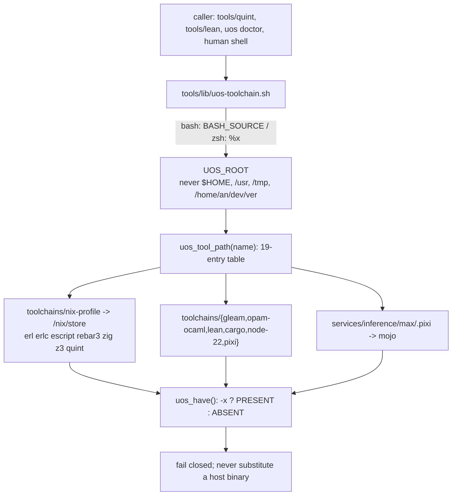

# 20260908-2107 — Determinate Nix & devenv toolchain closure (SC-NIX-DEVENV-001)

#fractal-l0 #fractal-l3 #fractal-l4 #fractal-l7 #zero-muda #km-triad #stamp-stpa #toolchain #zk-adr

**UOS / Toolchain / Journal** · [Cockpit](http://nas-1.tail55d152.ts.net:4100/) · [Planning](http://nas-1.tail55d152.ts.net:4100/planning) · [Wiki](http://nas-1.tail55d152.ts.net:4100/wiki) · [ZK](http://nas-1.tail55d152.ts.net:4100/zk) · [Checklist](http://nas-1.tail55d152.ts.net:4100/checklist)
**Live document:** [http://nas-1.tail55d152.ts.net:4100/files/docs/journal/20260908-2107-determinate-nix-devenv-toolchain-closure-journal.md](http://nas-1.tail55d152.ts.net:4100/files/docs/journal/20260908-2107-determinate-nix-devenv-toolchain-closure-journal.md)
**Manifest:** [governance/sources/20260908-2103-nix-devenv-toolchain-in-project-installation.json](http://nas-1.tail55d152.ts.net:4100/files/governance/sources/20260908-2103-nix-devenv-toolchain-in-project-installation.json)
**Rule:** [.claude/rules/20260908-2142-determinate-nix-devenv-mandate.md](http://nas-1.tail55d152.ts.net:4100/files/.claude/rules/20260908-2142-determinate-nix-devenv-mandate.md)

Observed at `2026-09-08T19:37:07Z` (host NTP-synchronised, `NTPSynchronized=yes`, drift band nominal).
Sa-plan authority: plan `uos-nix-devenv-toolchain-20260908`, worker `claude-opus5-nix-devenv`.

---

## 1. Scope & Trigger

**Trigger.** The operator directed: *use the in-flight working copy and build on top of it, sync the session.* The working copy `ltyyormw` carried an unfinished Determinate Nix / devenv stream — `flake.nix`, `devenv.nix`, `devenv.yaml`, four mirrored copies of the `SC-NIX-DEVENV-001` mandate, a rewritten `tools/lib/uos-toolchain.sh`, a repaired `formal/quint/intent_invariants.qnt`, and a port-close hardening in `ecology_capability_ffi.erl` — sitting on parent `1ee5da96` (SC-HOLON-001 ecology capability substrate).

**Scope of this pass.** Close the gap between what that stream *claimed* and what was *true*: lock the flake, repoint every call site the toolchain relocation had orphaned, remove a wrapper fronting an absent binary, make the resolver work in the operator's actual shell, and publish a governance manifest that supersedes the one whose every path had become unresolvable. Inherited edits were preserved untouched except where a claim was demonstrably false.

**Out of scope.** No runtime deployment, no `main` bookmark, no admission. Per `SC-JIDOKA-001` the work is registered in `sa-plan`; a completed task is not deployment authority.

## 2. Pre-State Assessment

| Surface | Claimed state | Observed state |
|---|---|---|
| `flake.nix` header | "This flake is the reproducible PIN" | **No `flake.lock` existed.** FlakeHub `nixpkgs-weekly/*` is a wildcard; the flake pinned nothing. |
| `.gitignore` | toolchain surfaces tracked | `*.lock` blanket rule would have swallowed `flake.lock` even once created. |
| `governance/sources/20260908-2016-…json` | live pin | Every `in_project_path` pointed under `formal/.toolchain/`, **a directory that no longer exists**. |
| `tools/quint-eval` | working wrapper | Backend (Rust evaluator 0.6.0) not installed; `uos_tool quint-eval` had no table entry. |
| Five call sites | — | `capability_port.gleam` (×2, Lean), `release_process.ml` (×2, pixi), `unification_cycles.ml` (×1, pixi) still addressed `formal/.toolchain/`. |
| `tools/lib/uos-toolchain.sh` | sourceable resolver | Used `${BASH_SOURCE[0]}` under `set -euo pipefail`; **aborts when sourced from zsh**, the operator's login shell. |
| Toolchain availability | — | 19/19 entrypoints present; OTP 29.0.5 / erts 17.0.5 live under `toolchains/nix-profile`. |

## 3. Execution Detail

1. **Locked the flake.** `nix flake lock 'path:$UOS_ROOT'` → nixpkgs rev `34ab99075ac4f7e40cf037eef32cb1c360bb85e9` (revCount 1064949, narHash `sha256-hn1oU2rue2SYK8dAr8+WNZWtbsz1S2W5mnHlSEuh3bo=`, 2026-08-31). Evaluation confirms `packages.x86_64-linux.otp29.name = erlang-29.0.5`.
2. **Made the lock tracked.** Added a documented `!flake.lock` negation to `.gitignore`, alongside the existing `Cargo.lock` and `pixi.lock` exceptions.
3. **Repointed five stale call sites** from `formal/.toolchain/` to `toolchains/` — string-literal substitutions only.
4. **Replaced the dead Quint wrapper.** Added `tools/quint` (Quint 0.32.0 from the Nix profile); removed `tools/quint-eval`.
5. **Made the resolver shell-portable.** `tools/lib/uos-toolchain.sh` now resolves its own path under bash (`BASH_SOURCE`) and zsh (`${(%):-%x}`), and applies `set -euo pipefail` only when *executed*, never when sourced into an interactive shell.
6. **Published the superseding manifest** `20260908-2103-nix-devenv-toolchain-in-project-installation.json` and stamped the prior one `"status": "SUPERSEDED"` with a do-not-consult note.
7. **Synchronised the rule across four agent surfaces** (`.claude`, `.agents`, `.codex`, `.gemini`) per the full-symbiosis rule.
8. **Registered the work in `sa-plan`** and ran the mandated risk validation.

## 4. Root Cause Analysis

Every defect in this pass shares one root cause: **a toolchain tree was relocated and re-provisioned, but the artefacts that *point at* it were treated as documentation rather than as code.**

- The manifest was written as a *narrative record* of an installation, so when the installation moved, nobody re-derived it — a pin that describes a vanished directory reads exactly like a pin that works.
- `formal/.toolchain/` appeared inside string literals in three languages (Gleam, OCaml, shell). No single build step crosses all three, so nothing failed loudly.
- The flake was authored as a *specification of intent* ("the reproducible PIN") and the lock — the artefact that makes the sentence true — was left for later. The `.gitignore` `*.lock` rule then guaranteed that "later" would silently fail too.
- `${BASH_SOURCE[0]}` was correct for every *wrapper* (all `#!/usr/bin/env bash`) and wrong for the one path nobody tested: a human sourcing the library in their own shell.

## 5. Fix Taxonomy

| Class | Fix | Count |
|---|---|---|
| Unbacked claim → backed | `flake.lock` generated and tracked | 2 |
| Dangling reference | `formal/.toolchain/` → `toolchains/` | 5 |
| Dead abstraction removed | `tools/quint-eval` → `tools/quint` | 1 |
| Portability defect | bash/zsh self-path resolution; no `set -e` leak into interactive shells | 1 |
| Stale evidence superseded | new manifest + `SUPERSEDED` stamp on the old | 2 |
| Rule parity | mandate patched on 4 agent surfaces | 4 |

## 6. Patterns & Anti-Patterns Discovered

**Anti-pattern — "the specification is the pin".** A flake without a lock, a manifest without a re-derivation step, a rule that names a glob instead of a file. Each *reads* as a control and enforces nothing. Counter-rule now written into `SC-NIX-DEVENV-001` §4: *`flake.lock` is mandatory, not optional.*

**Anti-pattern — the wrapper that fronts an absent binary.** `tools/quint-eval` would have failed closed, which is correct, but its continued existence advertised a capability that had no backend. Removal beats a fail-closed stub.

**Anti-pattern — testing only the path your automation takes.** The library worked in every wrapper and broke in the operator's shell.

**Pattern — supersede, do not silently rewrite.** The stale manifest is retained byte-intact as the observation record of the 18:43Z state, with an added status header pointing forward. Historical lineage is preserved; a knowingly-false live pin is not.

**Pattern — the honest boundary paragraph.** The inherited flake already stated plainly that Nix binaries cannot live inside the project. That paragraph is why this pass could distinguish "in-project surface" from "in-project binary" without re-litigating it.

## 7. Verification Matrix

| # | Check | Invocation | Result |
|---|---|---|---|
| V1 | Entrypoint resolution | `uos_toolchain_report` | **19/19 PRESENT**, all under `$UOS_ROOT` |
| V2 | BEAM version | `erl -noshell -eval 'io:format(otp_release)'` | **29** (erts 17.0.5); host OTP 27 shadowed |
| V3 | rebar3 provenance | `rebar3 --version` | **3.27.0 on Erlang/OTP 29 Erts 17.0.5** |
| V4 | Flake lock | `nix flake lock 'path:$UOS_ROOT'` | **LOCKED** rev `34ab9907…` |
| V5 | Flake evaluation | `nix eval …#packages.x86_64-linux.otp29.name` | **erlang-29.0.5** |
| V6 | opam relocation | `ocamlfind printconf` | **PASS** — config, search path and stdlib all under `toolchains/opam-ocaml` |
| V7 | Hermes build | `dune build` in `engines/hermes` | **PASS** (exit 0) |
| V8 | Gleam build | `gleam build` in `apps/cepaf_gleam` | **PASS** (exit 0); warnings pre-existing |
| V9 | Quint typecheck | `tools/quint typecheck formal/quint/*.qnt` | **4/4 PASS** |
| V10 | Wrappers | `tools/quint`, `tools/z3`, `tools/lean` | 0.32.0 / 4.16.0 / 4.33.0 |
| V11 | Shell portability | source + `uos_env` under bash **and** zsh | **PASS** both — correct root, OTP 29 |
| V12 | Stale references | `grep -r 'formal/\.toolchain'` (excl. governance) | **0** |
| V13 | Risk validation | `bash tools/risk-priority-check --all` | **PASS** (375 baseline, 32843 adversarial); authority `NONE` |
| V14 | Sa-plan observation | `bash tools/risk-priority-check --plan …` | **OBSERVED**, snapshot `ef1c4bc9a9a8…` |
| V15 | Manifest validity | `json.load` on both manifests | **VALID** |

Non-passing states, stated plainly: `devenv test` **UNRUN** (the equivalent OTP-29 assertion was observed directly against the profile instead); Quint **model-checking verdicts UNRUN** (typecheck is not proof); `release_process.ml` / `unification_cycles.ml` **UNRUN** (OCaml toplevel scripts using `#use`; `ocamlc` cannot compile-check them and they drive a release process, so they were not executed).

## 8. Files Modified

**Authored this pass (10):** `flake.lock` (new) · `.gitignore` · `governance/sources/20260908-2103-nix-devenv-toolchain-in-project-installation.json` (new) · `governance/sources/20260908-2016-formal-toolchain-in-project-installation.json` (SUPERSEDED stamp) · `tools/quint` (new) · `tools/quint-eval` (deleted) · `tools/lib/uos-toolchain.sh` · `apps/cepaf_gleam/src/cepaf_gleam/ecology/capability_port.gleam` · `tools/release_process.ml` · `tools/unification_cycles.ml` · plus the mandate patched on 4 surfaces (`.claude`/`.agents`/`.codex`/`.gemini`/rules/`20260908-2142-determinate-nix-devenv-mandate.md`).

**Inherited from the in-flight stream, preserved (6):** `flake.nix` · `devenv.nix` · `devenv.yaml` · `formal/quint/intent_invariants.qnt` · `apps/cepaf_gleam/src/ecology_capability_ffi.erl` · the four mandate files as originally created.

## 9. Architectural Observations

**Nix flakes assume Git; UOS is Jujutsu.** An *empty* stray directory `uos/.git` makes Nix classify the tree as a Git flake, and bare `nix flake` commands fail with libgit2 error 6. The directory holds no repository and no native Git mutation has occurred, so canonical policy §4 is intact — but every flake invocation must use the explicit `path:` URL until it is removed. Recorded as an OPEN risk rather than silently deleted.

**Three toolchains legitimately resist Nix**, each for a *version* reason, not a convenience one: Gleam 1.16.0 (nixpkgs offers 1.18.1, unverified against `apps/*`), the opam switch (Hermes needs cryptokit/gospel/z3/sqlite3/domainslib, which the bare nixpkgs `ocaml` does not supply), and Lean 4.33.0 (nixpkgs offers 4.30.0). These are pins with stated expiry conditions.

**Z3's provenance improved as a side effect.** It previously entered UOS by *copy from* `/home/an/dev/ver/zigvm/_opam/bin/z3` — an external read-only evidence tree. It now comes from Determinate Nix, removing a dependency that `SC-NIX-DEVENV-001` invariant 1 bars.

**Resolution chain (ASCII, per `SC-DIAGRAM-001`):**

```text
  caller (tools/quint, tools/lean, uos doctor, human shell)
        |
        v
  tools/lib/uos-toolchain.sh ---- resolves own path (bash: BASH_SOURCE | zsh: %x)
        |                                   |
        |                                   v
        |                              UOS_ROOT (never $HOME, /usr, /tmp, /home/an/dev/ver)
        v
  uos_tool_path(name) --> 19-entry table
        |                    |                      |
        v                    v                      v
  toolchains/nix-profile   toolchains/{gleam,       services/inference/max/.pixi
  -> /nix/store/...        opam-ocaml,lean,          -> mojo
  (erl erlc escript         cargo,node-22,pixi)
   rebar3 zig z3 quint)
        |                    |                      |
        +--------------------+----------------------+
                             v
                    uos_have(): -x ? PRESENT : ABSENT   (never substitutes a host binary)
```



## 10. Remaining Gaps

1. **OPEN** — empty stray `uos/.git` forces the `path:` URL workaround for all flake commands.
2. **UNRUN** — `devenv test` (the `enterTest` OTP-29 fail-closed assertion) has not been executed.
3. **UNRUN** — Quint model-checking verdicts; only typecheck is observed.
4. **UNRUN** — `release_process.ml` / `unification_cycles.ml` not executed after the pixi repoint.
5. **OPEN** — `formal/lean/Denotational_Atlas_Cohomology.lean` still carries 3 `sorry` placeholders → zero formal authority (canonical policy §7).
6. **OPEN** — `formal/lean` has no lakefile and no `lean-toolchain` pin.
7. **BOUNDARY** — `cargo`/`rustc` hashes pin the rustup *proxy shim*, not the compilers.
8. **NOT_ADMITTED** — nothing here is admitted. `sa-plan` task completion, a passing risk report and a green build are evidence, not admission.

## 11. Metrics Summary

| Metric | Value |
|---|---|
| Sa-plan tasks completed / total | 5 / 6 (task-5 executing until this journal is committed) |
| Toolchain entrypoints resolving in-project | 19 / 19 |
| Stale `formal/.toolchain` references remaining | 0 (was 5) |
| Quint specs typechecking | 4 / 4 (was 0 — the model had never typechecked) |
| Builds green | 2 / 2 (Hermes `dune`, cepaf_gleam `gleam`) |
| Shells in which `uos_env` works | 2 / 2 (was 1 / 2) |
| Risk validation | 375 baseline + 32 843 adversarial checks, PASS |
| Agent rule surfaces in parity | 4 / 4 |
| Files authored/modified this pass | 14 (incl. 4 rule mirrors, 1 deletion) |

## 12. STAMP & Constitutional Alignment

**Control structure.** The controller under analysis is the toolchain resolver; its controlled process is every build and formal-evidence invocation in UOS.

**Unsafe Control Actions addressed.**
- *UCA-provided-wrong*: resolver supplies a **host** binary (OTP 27) when the process requires OTP 29 → mitigated by PREPEND ordering in `uos_env` and the `enterTest` fail-closed assertion (the latter still UNRUN).
- *UCA-provided-wrong*: resolver supplies a path into a **removed** tree → the five repointed call sites; grep-verified to zero.
- *UCA-not-provided*: resolver aborts or yields a wrong root when sourced from zsh, so `uos_have()` reports ABSENT for an installed toolchain and callers fail closed on a **false** premise → fixed; verified in both shells.
- *UCA-wrong-timing*: flake resolves a *different* nixpkgs on a later invocation → fixed by `flake.lock` plus the `.gitignore` negation that keeps it in VCS.

**Constitutional (L0) alignment.** Two-key semantics respected: fresh observed behaviour (V1–V15) is recorded *separately* from formal specification, and no `UNRUN`/`OPEN` item is counted as passing. Zero-Muda intact — no Bevy, no Graphite, no Graphene NIF introduced; one dead wrapper removed. VCS discipline intact — standalone Jujutsu only, no native Git mutation, `main` uncreated. External evidence trees (`/home/an/dev/ver/*`) lost one runtime dependency (Z3) and gained none.

## 13. Conclusion

The Determinate Nix / devenv stream now *is* what it said it was. The flake pins a concrete nixpkgs revision and that lock is tracked; the governance manifest describes paths that exist and supersedes the one that does not; no call site addresses the removed tree; the resolver works in the operator's own shell; and the one wrapper without a backend is gone rather than merely failing closed. OTP 29 is the sole live BEAM, verified rather than asserted, with the host's OTP 27 shadowed and the zigvm tree's OTP-30 artifacts barred.

Four verifications are outstanding and named as such — `devenv test`, Quint model-checking verdicts, the two OCaml toplevel scripts, and the `.git` stray-directory cleanup. None is claimed as complete. Nothing in this pass grants deployment or admission authority.

---

## Comprehensive verification checklist

Document checks and production gates have different evidence scopes. Checked items below refer to **this change package only**. All infrastructure runtime, formal-proof and sovereign-admission obligations remain **UNRUN**.

<details>
<summary>Domain 1 — Metadata, timestamp and Tailscale navigation</summary>

- [x] **CHK-01-TIME** — `20260908-2107-` prefix; host clock NTP-synchronised, drift band nominal.
- [x] **CHK-02-TAIL** — Full clickable Tailscale FQDN links provided; live serving status not asserted here.
- [x] **CHK-03-FRACT** — Fractal tags `#fractal-l0 #fractal-l3 #fractal-l4 #fractal-l7` assigned.
- [x] **CHK-04-KM** — Journal, mandate rule and governance manifest cross-linked.

</details>

<details>
<summary>Domain 2 — Zero-Muda purity and storage safety</summary>

- [x] **CHK-05-MUDA** — No Bevy/Graphite introduced; one dead wrapper removed.
- [x] **CHK-06-GRAPH** — No foreign graph NIF introduced.
- [ ] **CHK-07-DRIVE** — Denied OS serial `25503L801736` interlock **UNRUN** in this pass (untouched by it).

</details>

<details>
<summary>Domain 3 — Testing Gold Standard and mathematical gates</summary>

- [ ] **CHK-08-C1C8** — Not exercised; no UI surface changed.
- [ ] **CHK-09-MATH** — H / CCM / D_EA / ITQS **UNRUN**.
- [ ] **CHK-10-9MOD** — 9-modality protocol **UNRUN** for this change.
- [ ] **CHK-11-REGR** — UI regression suite **UNRUN**.

</details>

<details>
<summary>Domain 4 — Cross-language control and observability</summary>

- [x] **CHK-12-GLEAM** — `gleam build` PASS at 1.16.0 on OTP 29 after the Lean path repoint.
- [x] **CHK-13-HERMES** — `dune build` PASS using only the relocated in-project opam switch.
- [ ] **CHK-14-ZIGVM** — Zig 0.16.0 resolves in-project; deterministic-execution evidence **UNRUN**.
- [ ] **CHK-15-MAX** — MAX/Mojo entrypoint present; inference through the boundary **UNRUN**.
- [ ] **CHK-16-OTEL** — Telemetry trace/span evidence **UNRUN** for this change.

</details>

<details>
<summary>Domain 5 — Sovereign governance and standalone Jujutsu</summary>

- [ ] **CHK-17-SOV** — Tri-sovereign candidate review **OUTSTANDING**.
- [x] **CHK-18-JJ** — Authored in UOS under standalone non-colocated Jujutsu; zero native Git mutations.

</details>

**Previous:** [Comprehensive UOS/C3I/Indrajaal comparison](http://nas-1.tail55d152.ts.net:4100/files/docs/design/20260908-2030-uos-c3i-indrajaal-code-and-docs-comprehensive-comparison.md) · **Next:** [Determinate Nix mandate](http://nas-1.tail55d152.ts.net:4100/files/.claude/rules/20260908-2142-determinate-nix-devenv-mandate.md)
**UOS footer:** `nas-1.tail55d152.ts.net:4100` · peer `vm-1.tail55d152.ts.net:8088` · OTP 29 (erts 17.0.5) · Sa-plan is the sole execution authority; this journal grants no admission.
