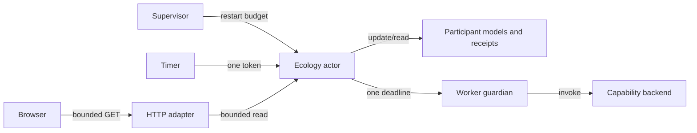

# Ecology supervision completion journal

[#fractal-l2](http://nas-1.tail55d152.ts.net:4100/wiki) #fractal-l4 #fractal-l6 #zk-adr #zero-muda

[Cockpit](http://nas-1.tail55d152.ts.net:4100/) · [Planning](http://nas-1.tail55d152.ts.net:4100/planning) · [Wiki](http://nas-1.tail55d152.ts.net:4100/wiki) · [ZK](http://nas-1.tail55d152.ts.net:4100/zk) · [Machine receipt](http://nas-1.tail55d152.ts.net:4100/files/docs/journal/20260909-0237-ecology-supervision-completion.json) · [Raw source](http://nas-1.tail55d152.ts.net:4100/files/docs/journal/20260909-0237-ecology-supervision-completion.md)

These are canonical navigation targets, not a claim that this document or the candidate has been deployed. Root records staged and live observations separately. No new EV identifier is created; EV-93 remains the admitted ceiling.

## 1. Scope & Trigger

The operator requested ecology-wide participation, common capabilities with selective activation, autonomous operation, and evidence of each development cycle. Root delegated the existing living swarm, its supervisor, persistent HTTP observation, and related tests to this worker. Hooks, capability algorithms, external inference, packaging, deployment, and the grouped wiki/ZK index belong to other delegated or root tasks.

Implementation ran under `SUPERVISION`, worker `codex-ecology-supervision`, attempt 1. Its completion event preceded the explicit request for this separate journal. The event was preserved, and documentation was claimed under dependency-linked `SUPERVISION-JOURNAL`, attempt 1. Both use the same canonical Sa-plan; no alternative task queue was introduced.

## 2. Pre-State Assessment

The registry contained 24 models despite names and UI copy claiming 21. Capability invocation incremented simulated counters; initial agents already claimed proof and inference evidence. The Indrajaal HTTP handler initialized and stepped a new ecology on every request, losing continuity. Heartbeat injection could multiply recurring timers, and inline external work could stall actor replies and pulses.

Root separately observed that the existing port 4100 service belonged to a legacy external C3I tree running OTP 27. That observation is root-supplied context, not this worker's deployment evidence. The source repair therefore covered both the canonical core router and the Indrajaal adapter; external trees were not edited.

## 3. Execution Detail

### State and receipts

The registry now has 26 local participant models, including Ucon and Indrajaal. Every model exposes the same 11-capability catalog, with a selectable mask. Initial service evidence is zero or unrun. `Engaged`, `Masked`, and `Unavailable` results come from the capability port, and only engaged results increase the successful-invocation count. The actor retains at most 128 invocation receipts with sequence, participant, cycle, observation time, input kind, and backend outcome.

### Autonomous loop and recovery

One token-bound timer advances measured heartbeat state and one rotating bounded local computation per tick. Bayesian and ETS inputs derive from observed heartbeat values. F Prime and other fixed samples are explicitly `bounded_diagnostic`. Rete-UL participates in the bounded local rotation. External inference is an explicit invocation, isolated behind one monitored worker slot and a deadline. A stable named Subject resolves the restarted actor. Actor initialization and restart initialize its ETS store.

### Observation and activation

HTTP reads use the live Subject and return 503 when it is absent. The main startup checks supervisor creation before serving. The typed in-VM API sets a model's mode or mask and rejects changes for that same model while an invocation is in flight. There is no new HTTP mutation endpoint. Both HTML adapters share a bounded browser GET loop that refreshes counters and participant rows and reports stale/error state.

## 4. Root Cause Analysis

The defects had a common cause: declarations and demonstrations were being counted as operational evidence. A model name implied an external service, a constructed state implied a running actor, a capability mask implied successful execution, and an unverified numerical field implied a mathematical result.

The correction binds each claim to the event that can support it. Live HTTP state comes from an owned actor; service outcomes come from actual invocation results; heartbeat energy uses measured interval error; fixed diagnostics are labeled as such. Public `lyapunov_exponent` is null, with the computed quantity exposed as `latency_energy_delta`. This is an observed energy change, not a proved Lyapunov exponent.

## 5. Fix Taxonomy

The changes apply outcome provenance, supervised lifecycle ownership, bounded resource use, masked dispatch, and explicit scope labeling. The supervisor owns restart policy; the actor owns timer and ETS lifetime; the worker guardian owns cancellation and failure isolation; the capability port owns backend truth; the view owns presentation without inventing state.

The web manifest was repaired using already-realized local packages. Its crypto and logging versions now align with the core closure. No package installation, dependency update, external source ingestion, native VCS mutation, or deployment was performed by this worker.

## 6. Patterns & Anti-Patterns Discovered

- Keep successful execution separate from presence probes, masks, diagnostics, and solver admission.
- Resolve a named Subject to a current PID before sending a monitored request; preserve the name across supervised restart.
- Give a recurring timer a unique token and cancel its previous handle before scheduling the next one.
- Merge worker outcomes into current actor state so concurrent heartbeats are preserved.
- Retain negative results and stale snapshots visibly; do not reset state or substitute a passing counter.
- Avoid claiming that 26 records hosted in one actor are 26 independent external processes.

## 7. Verification Matrix

| Check | Observation | Receipt |
| --- | --- | --- |
| Final core compilation | PASS, 1.91 s, pinned Gleam 1.16.0 / OTP 29 | `/tmp/uos-supervision-build-refresh-2.log` |
| Core scoped EUnit | PASS, 66 tests: state, actor, recovery, activation, router, and 31 capability tests | `/tmp/uos-supervision-tests-refresh.log` |
| Final web compilation | PASS, 3.64 s, includes root's dedicated service and stable transport | `/tmp/uos-supervision-web-build-final.log` |
| Web EUnit | PASS, 5 tests: 3 ecology adapter and 2 dedicated service tests | `/tmp/uos-supervision-web-tests-final.log` |
| Browser-script harness | PASS, 6 scenarios using compiled script and controlled DOM/fetch/timers | `/tmp/uos-ecology-refresh-test.log` |
| Actual browser interaction | UNRUN by this worker; root observes the staged service separately | No browser receipt claimed |
| Final implementation active-check | PASS, 15 exact source hashes, 2026-09-09T02:31:39Z | `/tmp/uos-ecology-supervision-active-final-receipt-observed.json` |
| Documentation preflight / active-check | PASS, exact dependency-linked journal claim | `/tmp/uos-ecology-supervision-journal-preflight-observed.json`, `/tmp/uos-ecology-supervision-journal-active-observed.json` |
| Whole system admission | NOT_GRANTED | No admission claimed |

The machine receipt embeds the final log text and SHA-256 digests, the final 15-file source manifest, and the observed risk receipts so the evidence does not depend on `/tmp` retention. The final implementation assessment digest is `a2b74b87f0580cc6fad77908775ee4feb8770b997dd052509fb5e3a56042f296`. Host chrony reported an absolute offset of approximately 0.000275 seconds for that check.

Negative observations were retained. An earlier router test incorrectly assumed a sidebar CSS marker; the actual common shell uses `aria-label="Primary"`, and the corrected check passed. A refresh render compile failed because a pipeline supplied table children as attributes; the argument position was corrected and rebuilt. An initial web build encountered a stale local dependency fingerprint. Risk checks inside the sandbox correctly held when chrony was inaccessible; host-authorized observations subsequently passed. The journal preflight also rejected an invalid task-state enum before the declared state and dependency set were corrected to match Sa-plan. None of these failures was force-passed.

## 8. Files Modified

All paths below are relative to the canonical repository. Exact bytes are recorded in the adjacent machine receipt.

| Path | Result |
| --- | --- |
| `apps/cepaf_gleam/src/cepaf_gleam/ecology/living_swarm.gleam` | 26 models, actual measured state, bounded receipts, truthful outcomes and local rotation |
| `apps/cepaf_gleam/src/cepaf_gleam/ecology/living_swarm_actor.gleam` | Timer ownership, worker isolation, typed activation, persistent named recovery |
| `apps/cepaf_gleam/src/cepaf_gleam/ecology/super_agent.gleam` | Common catalog, zero initial execution credit, observed pulse and explicit model scope |
| `apps/cepaf_gleam/src/cepaf_gleam/ui/ecology_refresh.gleam` | Shared bounded browser observation loop |
| `apps/cepaf_gleam/src/cepaf_gleam/ui/wisp/router.gleam` | Live read-only ecology routes and common-shell view |
| `apps/cepaf_gleam/src/cepaf_gleam/uos_sup.gleam` | Canonical supervised ecology child |
| `apps/cepaf_gleam/src/cepaf_gleam.gleam` | Require successful root supervision before serving |
| `apps/cepaf_gleam/test/living_swarm_test.gleam` | Truthful state and invocation regression cases |
| `apps/cepaf_gleam/test/living_swarm_actor_test.gleam` | Timer, worker, restart, ETS and activation regression cases |
| `apps/cepaf_gleam/test/holon_super_agent_test.gleam` | Common catalog, initial evidence and observed pulse cases |
| `apps/cepaf_gleam/test/ecology_runtime_router_test.gleam` | Live-state continuity, 503, truthful rendering and measured inputs |
| `apps/indrajaal_gleam_web/src/indrajaal/ecology_http.gleam` | Persistent snapshots, truthful view and live refresh |
| `apps/indrajaal_gleam_web/src/indrajaal_gleam_web.gleam` | Start the ecology runtime before HTTP; pass its Subject |
| `apps/indrajaal_gleam_web/test/ecology_http_test.gleam` | Rendering, supplied cycle and unavailable-runtime tests |
| `apps/indrajaal_gleam_web/manifest.toml` | Existing local closure plus realized crypto/logging alignment |

Build-cache bookkeeping and reuse of existing package source directories supported compilation. Root-owned `ecology_service.gleam`, its tests, and other agents' capability/transport files were compiled but are not attributed as this worker's edits.

## 9. Architectural Observations

The diagram represents ownership and read paths, not a distributed fleet. Both sources describe the same nodes, edges and labels.

```text
Supervisor --restart budget--> Ecology actor
Timer --one token--> Ecology actor
Ecology actor --update/read--> Participant models and receipts
Ecology actor --one deadline--> Worker guardian
Worker guardian --invoke--> Capability backend
HTTP adapter --bounded read--> Ecology actor
Browser --bounded GET--> HTTP adapter
```



The canonical root supervisor and the standalone web runtime both use OTP restart budgets. Core and web compiler outputs can differ because their embedded source paths differ; root's final release strategy uses the web production closure alone and copies only selected core test modules into a separate test directory. That final exact-package verification belongs to root.

## 10. Remaining Gaps

| Priority | Gap and boundary |
| --- | --- |
| P1 | Ucon and Indrajaal are local participant models. External process/service bindings are absent. |
| P1 | This worker has no actual browser, packaged candidate, live deployment or whole-system admission receipt. Root owns these next observations. |
| P2 | Actor restart intentionally resets local state, receipts and actor-owned ETS; recovery preserves the named handle, not pre-crash history. |
| P2 | Autonomous ticks perform bounded local computations. They do not create or execute coding tasks or external effects; those require exact Sa-plan authority. |
| P2 | Domain proof/token/timing counters receive no fabricated credit. Capability receipts expose actual outcomes, but do not certify all requested services or system aspects. |
| P3 | A response above the browser's 1 MiB observation cap shows an error and retains the last snapshot. The original song graphic is explicitly labeled an initial snapshot. |

## 11. Metrics Summary

| Metric | Before | After |
| --- | --- | --- |
| Registry/model labeling | 24 records with misleading 21 naming | 26 explicit local models, common 11-entry catalog |
| Service execution evidence | Simulated counters and initialized proof credit | Zero initial credit; actual engaged/unavailable/masked outcomes |
| HTTP ecology continuity | New state per read | Persistent actor snapshot or 503 |
| Recurring timer chains | Repeated Tick could create additional chains | One token-bound chain; injected stale ticks ignored |
| External worker budget | Inline blocking invocation | One pending worker; maximum 30 s deadline; monitored actor lifetime |
| Receipt history | No bounded outcome ledger | 128 most recent receipts; monotone invocation sequence |
| Browser reads | Static initial rendering | One request at a time, 1.5 s abort, 2 s delay, 1 MiB cap, stale threshold over 5 s |
| Scoped final checks | No matching final receipt | 66 core tests + 5 web tests + 6 script scenarios passed |

These counts are distinct checks, not a mathematical proof of fleet autonomy. Build observations used at most four BEAM schedulers per check.

## 12. STAMP & Constitutional Alignment

The four unsafe-control contexts are addressed explicitly: absent observation yields unavailable status; false execution credit is removed; stale timer tokens and stale name/PID resolution are fenced; and prolonged external work has a monitored deadline. Selected masks limit invocation, while formal results and diagnostics retain advisory scope. Local mask activation is not authorization for task execution.

Sa-plan remained the sole task authority. Preflight and active observation receipts do not grant effect or release authority. No native Git/JJ mutation, deployment, external source import, prohibited runtime dependency, new EV identifier, hardware/storage action, or paid inference was performed by this worker. Formal proofs and packaged/live runtime evidence are recorded by their actual owners, not inferred from this journal.

<details>
<summary>Comprehensive verification checklist: 18 core checkpoints and provenance</summary>

| Domain | Checkpoints and actual scope |
| --- | --- |
| 1. Metadata and navigation | CHK-01-TIME: observed host/chrony receipt; CHK-02-TAIL: canonical FQDN links; CHK-03-FRACT: layers tagged; CHK-04-KM: this journal/receipt, grouped wiki/ZK publication is root work. |
| 2. Purity and storage | CHK-05-MUDA: no new prohibited dependency; CHK-06-GRAPH: native HTML/SVG view; CHK-07-DRIVE: hardware check UNRUN, no storage action. |
| 3. Tests and mathematics | CHK-08-C1C8: focused tests only; CHK-09-MATH: no proof admission claimed; CHK-10-9MOD: scoped receipts attached; CHK-11-REGR: negative cases retained, continuous fleet monitoring UNRUN. |
| 4. Runtime and observability | CHK-12-GLEAM: OTP 29 compile/actor tests; CHK-13-HERMES: risk checker executed, solvers belong to other scope; CHK-14-ZIGVM: kernel tests UNRUN; CHK-15-MAX: external adapter evidence belongs to root; CHK-16-OTEL: full trace-correlation test UNRUN. |
| 5. Governance and VCS | CHK-17-SOV: NOT_ADMITTED; CHK-18-JJ: no worker VCS mutation; root owns final revision binding. |
| 6. Provenance | CHK-PROV: EV-93 ceiling retained; no new evolutionary identifier minted. |

</details>

## 13. Conclusion

The implementation now distinguishes local participant models, actual backend outcomes, bounded diagnostics, and operational authority. Focused tests observed heartbeat continuity under slow/crashed workers, bounded timer behavior, named recovery, mask enforcement, activation constraints, persistent HTTP state and explicit unavailability. The implementation and documentation are bound to exact Sa-plan attempts and fresh source hashes.

This completes the delegated supervision slice. Root still owns final packaged-byte verification, actual browser use, autonomous service deployment and grouped knowledge publication. Those observations must be attached as new evidence; the passing local checks do not imply external holon integration or system admission.

[Previous: planning](http://nas-1.tail55d152.ts.net:4100/planning) · [Next: machine receipt](http://nas-1.tail55d152.ts.net:4100/files/docs/journal/20260909-0237-ecology-supervision-completion.json) · [Repository source](http://nas-1.tail55d152.ts.net:4100/files/docs/journal/20260909-0237-ecology-supervision-completion.md)

UOS · Canonical workspace `/home/an/NAS-setup/uos` · Sa-plan `uos/ecology-supervision/20260909-0146` · NOT_ADMITTED
