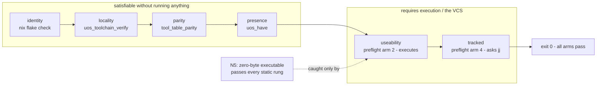

# 20260909-0425 — Tracked & verifiably useable tooling: the preflight gate (SC-NIX-DEVENV-001)

#fractal-l0 #fractal-l3 #fractal-l4 #fractal-l7 #zero-muda #km-triad #stamp-stpa #toolchain #zk-adr

**UOS / Toolchain / Journal** · [Cockpit](http://nas-1.tail55d152.ts.net:4100/) · [Planning](http://nas-1.tail55d152.ts.net:4100/planning) · [Wiki](http://nas-1.tail55d152.ts.net:4100/wiki) · [ZK](http://nas-1.tail55d152.ts.net:4100/zk) · [Checklist](http://nas-1.tail55d152.ts.net:4100/checklist)
**Live document:** [http://nas-1.tail55d152.ts.net:4100/files/docs/journal/20260909-0425-tracked-and-verifiably-useable-tooling-preflight-journal.md](http://nas-1.tail55d152.ts.net:4100/files/docs/journal/20260909-0425-tracked-and-verifiably-useable-tooling-preflight-journal.md)
**Predecessors:** [20260908-2107 closure](http://nas-1.tail55d152.ts.net:4100/files/docs/journal/20260908-2107-determinate-nix-devenv-toolchain-closure-journal.md) · [20260909-0456 hardening](http://nas-1.tail55d152.ts.net:4100/files/docs/journal/20260909-0456-toolchain-resolver-hardening-and-derivation-exact-guards-journal.md)

Observed at `2026-09-09T02:45:25Z` (host NTP-synchronised, drift nominal).
Sa-plan: plan `uos-nix-devenv-toolchain-20260908`, worker `claude-opus5-nix-devenv`.

---

## 1. Scope & Trigger

Operator: *"all tooling must be tracked and verifiably useable, preflight checks."*

Two words carry the requirement. **Tracked** — a tool existing only in a working copy is a local artefact, not tooling. **Useable** — presence is not use. The prior passes proved *where* a toolchain comes from and *which build* it is; neither established that it runs.

Also in scope: resolving the one item the hardening pass left BOUNDED.

## 2. Pre-State Assessment

| Property | Enforced before | Gap |
|---|---|---|
| identity (which build) | `checks.toolchain-pin`, `enterTest` | — |
| locality (from where) | `uos_toolchain_verify` | — |
| parity (tables agree) | `tool_table_parity` | — |
| presence (`test -x`) | `uos_toolchain_report` | **presence ≠ use** |
| **useability** | *nothing* | a present, broken binary reads as healthy |
| **tracked** | *nothing* | assumed, never asked of the VCS |
| single entry point | *nothing* | six commands, no gate |

`agentic_coordination.qnt` was recorded as "exceeds 900 s at default steps, reduced-step run outstanding" — a real but unresolved observation.

## 3. Execution Detail

1. **`tools/preflight`** — one gate, six arms, exit 0 only if all pass. Human table on **stderr**, `uos.preflight.v1` JSON on **stdout**, so a parser never strips a table.
2. **Useable arm** — executes all 20 entrypoints, preferring functional probes: `erlc` compiles a module, `escript` runs a script, `z3` solves, `quint` typechecks a real spec, `ocaml` evaluates. Version strings only where a functional probe would cost more than it proves.
3. **Tracked arm** — asks `jj file list tools`, diffs against the on-disk tree excluding build artefacts, and checks *both* directions: nothing present-but-untracked, nothing tracked-but-absent.
4. **Identity arms** (`--full`) — `nix flake check` and `devenv test`.
5. **Broke every new arm on purpose.**
6. **Resolved the Quint item** by bisecting depth rather than declaring it blocked.

## 4. Root Cause Analysis

**Why useability was missing.** The prior layers each answered a *provenance* question, and provenance is checkable without running anything. Useability is the only property that requires execution, so it is the one an ever-more-careful static check can never reach. Adding more locality rules would not have found a broken binary.

**Why the first useable arm was still wrong.** It accepted exit 0. Writing the negative test for it — pointing `node` at a zero-byte executable — returned **PASS**, because an empty file with the execute bit is a valid empty shell script: exit 0, no output. Exit status is a two-valued projection of "did it work", and it collapses "did the job" together with "did nothing". Same shape as the release-number defect one pass earlier: *the observable was coarser than the property.*

**Why the escript probe failed on a healthy toolchain.** `escript` skips a source file's first line as its header slot; my heredoc had no filler line, so the script was empty. The probe was wrong, not the tool — and an exit-status-blind check would have shown green.

**Why Quint looked blocked.** It was measured once at default depth, once at 5 steps, both timing out — two points that both said "too slow" and nothing about *why*. Bisecting downward: 1 step 18.1 s, 2 steps 75.0 s. Roughly 4× per step, so 5 steps ≈ 80 minutes. Ordinary depth blow-up, not a defect.

## 5. Fix Taxonomy

| Class | Fix | Count |
|---|---|---|
| New enforcement surface | `tools/preflight`, six arms | 1 |
| Probe strengthened | exit-status-only → exit 0 **and** non-empty output | 20 |
| Probe corrected | escript header line | 1 |
| Reporting defect | `printf '%s' \| wc -l` counted 0 for one line | 2 |
| Stream discipline | table → stderr so stdout is pure JSON | 1 |
| Rule updated | invariant 10 + machine enforcement 8, on 4 surfaces | 4 |
| Open item resolved | Quint depth bisected | 1 |

## 6. Patterns & Anti-Patterns Discovered

**Anti-pattern — the coarse observable, again.** Third instance in three passes: `otp_release` for a derivation, `test -x` for use, exit status for work done. Each was the obvious API. Before trusting a check, ask what its output space is and whether the property you want is recoverable from it.

**Anti-pattern — trusting a check you have never seen fail.** The useable arm was written, passed, and looked finished. Only deliberately breaking it revealed it accepted an empty file as a working toolchain.

**Pattern — probe by doing the job.** `erlc` compiling and yielding a real `.beam` is stronger evidence than any `--version`, and costs milliseconds.

**Pattern — ask the authority that owns the fact.** Tracking is a VCS fact; ask `jj`. Identity is a lock fact; ask Nix. Neither is inferable from the filesystem.

**Pattern — bisect before declaring blocked.** Two timeouts said "too slow" and nothing else. Two *successes* at shallow depth turned an open item into a measured cost curve.

**Pattern — separate the streams.** Table on stderr, JSON on stdout. Costs one redirection; saves every consumer a fragile parse.

## 7. Verification Matrix

| # | Check | Result |
|---|---|---|
| P1 | `bash tools/preflight` (fast tier) | **PASS 29/29** |
| P2 | `bash tools/preflight --full --json` | **PASS 31/31**, `status: PASS`, `failures: 0` |
| P3 | useable arm, 20 entrypoints executed | all PASS — OTP 29 erts 17.0.5, gleam 1.16.0, zig 0.16.0, z3 `sat`, jj 0.44.0, ocaml, dune 3.23.1, Lean 4.33.0, Lake 5.0.0, cargo/rustc 1.95.0, node v22.22.1, npm 9.2.0, pixi 0.80.0, Mojo 1.0.0 |
| P4 | `erlc-artifact` | **PASS** — real `pf_mod.beam` produced |
| P5 | wrapper arm | **PASS** — `tools/{quint,z3,lean,lake}` |
| P6 | tracked arm | **PASS** — 123 source files tracked, 0 untracked, 0 phantoms |
| P7 | parity arm | **PASS** — 22 arms |
| P8 | identity arms (`--full`) | **PASS** — `checks.toolchain-pin` green; `devenv test` all three arms |
| P9 | Quint `agentic_coordination_test` `inv_all` @1 step | **NoError**, 18.1 s |
| P10 | same @2 steps | **NoError**, 75.0 s |

**Negative tests:**

| # | Arm | Perturbation | Result |
|---|---|---|---|
| N5 | useable | `node` → zero-byte executable in `toolchains/` | **first version PASSED** → arm strengthened; now `exit 0 but produced NO output (empty executable?)`. Resolver arm still PASSED (decoy was inside `$UOS_ROOT`) — which is exactly why useability is its own layer; parity caught the table change independently |
| N6 | tracked | two `*.lock` files under `tools/` | `2 untracked, first: tools/pf-neg1.lock`; exposed and fixed the `wc -l` count bug |
| N7 | useable | escript probe on a healthy toolchain | `Premature end of file reached` — probe wrong, tool fine; fixed |

All perturbations reverted; resolver library `diff`-verified identical, zero strays left behind.

## 8. Files Modified

`tools/preflight` (new) · `tools/lib/uos-toolchain.sh` (unchanged this pass; exercised) · `governance/sources/20260908-2103-…json` · this journal · the mandate on four surfaces.

## 9. Architectural Observations

**The property ladder, and what each rung costs (ASCII, per `SC-DIAGRAM-001`):**

```text
  PROPERTY        QUESTION                 CHECKABLE BY   AUTHORITY
  ----------------------------------------------------------------------------
  identity        which build is this?     evaluation     nix flake check
                                                          devenv test (arms 2,3)
  locality        where did it come from?  inspection     uos_toolchain_verify
  parity          do the tables agree?     text compare   tool_table_parity
  presence        is it there?             stat           uos_have
  USEABILITY      does it do the job?      EXECUTION      tools/preflight (arm 2)
  TRACKED         is it in the VCS?        ask jj         tools/preflight (arm 4)

  Only USEABILITY requires running the thing. Every static rung can be fully
  satisfied by a binary that does not work -- which is what N5 demonstrated:
  locality PASSED on the decoy because it sat inside $UOS_ROOT.
```



**One gate, two tiers.** The fast tier is seconds and belongs before any work. `--full` adds the Nix-owned identity arms and belongs at integration.

## 10. Remaining Gaps

1. **BOUNDED** — Quint `agentic_coordination.qnt` verified NoError at 1–2 steps; deeper depth needs a batch run (≈80 min at 5 steps), not a fix.
2. **OPEN** — `/home/an/NAS-setup/.git`: empty non-repository outside UOS.
3. **BOUNDARY** — `os_util()` keeps `/usr/bin/{cp,curl,printf,false,sleep}` and `/opt/google/chrome/chrome` on host paths; these are OS utilities, not toolchains. `/usr/bin/timeout` here is a **uutils** symlink.
4. **BOUNDARY** — `cargo`/`rustc` hashes pin the rustup proxy shim, not the compilers.
5. **UNRUN** — the preflight is not yet wired into `tools/uos doctor` or a hook; it must currently be invoked deliberately.
6. **UNRUN** — the effecting commands of `release_process.ml` (`build`, `browser`, `smoke`, `web`/`tui`).
7. **OPEN** — `formal/lean/Denotational_Atlas_Cohomology.lean` retains 3 `sorry` placeholders.
8. **NOT_ADMITTED** — nothing here is admitted.

## 11. Metrics Summary

| Metric | Before | After |
|---|---|---|
| Toolchain entrypoints actually executed by a check | 1 (`erl`) | **20** |
| Preflight arms | 0 | **6** |
| Checks in the gate | — | 29 fast / **31 full** |
| Tooling tracking verified by the VCS | assumed | **123 files, 0 untracked, 0 phantoms** |
| Guards with a negative test | 5 | **8** |
| Probe defects found by writing negative tests | — | **3** (N5, N6, N7) |
| Quint items open | 1 | **0** (reclassified BOUNDED with a cost curve) |
| Agent rule surfaces in parity | 4/4 | **4/4** |

## 12. STAMP & Constitutional Alignment

**Controller:** the preflight gate. **Controlled process:** any work that assumes a working toolchain.

**UCAs addressed:**
- *Provided-but-ineffective:* controller reports a toolchain healthy when the binary does not work. Previously unreachable by any static rung. Mitigated by arm 2; proven by N5, which also showed locality passing on the same decoy.
- *Provided-but-unrecorded:* a tool exists only in a working copy and vanishes for every other agent. Mitigated by arm 4, which asks Jujutsu; proven by N6.
- *Feedback corrupted:* the checker's own probe is wrong and reports a healthy tool as broken (N7) or a broken tool as healthy (N5). Mitigated by requiring both a functional probe and non-empty output, and by exercising every arm's failure path.
- *Wrong information to the operator:* a count that reads 0 while listing findings. Fixed and re-verified.

**L0 alignment.** Two-key semantics held: every positive result is paired with an observed failure mode. Three probe defects were found by writing negative tests, not by reasoning — recorded because the ratio matters. Zero-Muda intact. VCS discipline intact: standalone Jujutsu, no native Git mutation, and tracking is now asked of the VCS rather than assumed.

## 13. Conclusion

Presence, locality, identity and parity are all satisfiable by a binary that does not work. This pass adds the two rungs that are not: **useability**, which requires executing the tool, and **tracked**, which requires asking the VCS. Both are now in one gate that exits non-zero if any arm fails.

The recurring lesson, third pass running, is about observables. `otp_release` could not distinguish two builds; `test -x` could not distinguish a working binary from a broken one; exit status could not distinguish doing the job from doing nothing. Each was the obvious API, and each was coarser than the property being enforced. The three probe defects here were all found by deliberately breaking the check — none by reading it.

The remaining Quint item is no longer open but measured: NoError at 1–2 steps, ~4× per step. Nothing in this pass grants deployment or admission authority.

---

## Comprehensive verification checklist

Checked items refer to **this change package only**.

<details>
<summary>Domain 1 — Metadata, timestamp and Tailscale navigation</summary>

- [x] **CHK-01-TIME** — `20260909-0425-` prefix; host NTP-synchronised, drift nominal.
- [x] **CHK-02-TAIL** — Full clickable Tailscale FQDN links.
- [x] **CHK-03-FRACT** — Fractal tags `#fractal-l0 #fractal-l3 #fractal-l4 #fractal-l7`.
- [x] **CHK-04-KM** — Journal, both predecessors, manifest and mandate cross-linked.

</details>

<details>
<summary>Domain 2 — Zero-Muda purity and storage safety</summary>

- [x] **CHK-05-MUDA** — No Bevy/Graphite/Graphene introduced; one gate replaces six ad-hoc invocations.
- [x] **CHK-06-GRAPH** — No foreign graph NIF introduced.
- [ ] **CHK-07-DRIVE** — Denied OS serial `25503L801736` interlock **UNRUN** (untouched).

</details>

<details>
<summary>Domain 3 — Testing Gold Standard and mathematical gates</summary>

- [x] **CHK-08-C1C8** — Not a UI change; 31/31 gate checks green.
- [ ] **CHK-09-MATH** — H / CCM / D_EA / ITQS **UNRUN**.
- [ ] **CHK-10-9MOD** — 9-modality protocol **UNRUN** for this change.
- [ ] **CHK-11-REGR** — UI regression suite **UNRUN**.

</details>

<details>
<summary>Domain 4 — Cross-language control and observability</summary>

- [x] **CHK-12-GLEAM** — Gleam 1.16.0 executed and verified in-project.
- [x] **CHK-13-HERMES** — OCaml, ocamlfind, dune executed on the in-project switch; parity arm green.
- [x] **CHK-14-ZIGVM** — Zig 0.16.0 executed; deterministic-execution evidence remains **UNRUN**.
- [x] **CHK-15-MAX** — Mojo 1.0.0 executed through the in-project pixi env; inference **UNRUN**.
- [ ] **CHK-16-OTEL** — Telemetry trace/span evidence **UNRUN**.

</details>

<details>
<summary>Domain 5 — Sovereign governance and standalone Jujutsu</summary>

- [ ] **CHK-17-SOV** — Tri-sovereign candidate review **OUTSTANDING**.
- [x] **CHK-18-JJ** — Standalone non-colocated Jujutsu; zero native Git mutations; tracking asked of the VCS.

</details>

**Previous:** [20260909-0456 hardening journal](http://nas-1.tail55d152.ts.net:4100/files/docs/journal/20260909-0456-toolchain-resolver-hardening-and-derivation-exact-guards-journal.md) · **Next:** [Determinate Nix mandate](http://nas-1.tail55d152.ts.net:4100/files/.claude/rules/20260908-2142-determinate-nix-devenv-mandate.md)
**UOS footer:** `nas-1.tail55d152.ts.net:4100` · peer `vm-1.tail55d152.ts.net:8088` · OTP 29 pinned at `…-erlang-29.0.5` · Sa-plan is the sole execution authority; this journal grants no admission.
