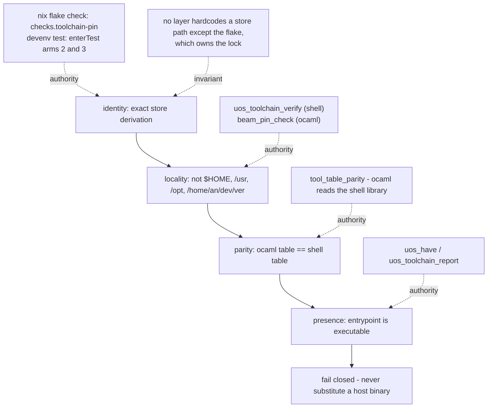

# 20260909-0456 — Toolchain resolver hardening & derivation-exact guards (SC-NIX-DEVENV-001)

#fractal-l0 #fractal-l3 #fractal-l4 #fractal-l7 #zero-muda #km-triad #stamp-stpa #toolchain #zk-adr

**UOS / Toolchain / Journal** · [Cockpit](http://nas-1.tail55d152.ts.net:4100/) · [Planning](http://nas-1.tail55d152.ts.net:4100/planning) · [Wiki](http://nas-1.tail55d152.ts.net:4100/wiki) · [ZK](http://nas-1.tail55d152.ts.net:4100/zk) · [Checklist](http://nas-1.tail55d152.ts.net:4100/checklist)
**Live document:** [http://nas-1.tail55d152.ts.net:4100/files/docs/journal/20260909-0456-toolchain-resolver-hardening-and-derivation-exact-guards-journal.md](http://nas-1.tail55d152.ts.net:4100/files/docs/journal/20260909-0456-toolchain-resolver-hardening-and-derivation-exact-guards-journal.md)
**Predecessor:** [20260908-2107 closure journal](http://nas-1.tail55d152.ts.net:4100/files/docs/journal/20260908-2107-determinate-nix-devenv-toolchain-closure-journal.md)
**Manifest:** [20260908-2103 toolchain manifest](http://nas-1.tail55d152.ts.net:4100/files/governance/sources/20260908-2103-nix-devenv-toolchain-in-project-installation.json)

Observed at `2026-09-09T02:22:56Z` (host NTP-synchronised, `NTPSynchronized=yes`, drift nominal).
Sa-plan: plan `uos-nix-devenv-toolchain-20260908`, tasks `task-6`…`task-11`, worker `claude-opus5-nix-devenv`.

---

## 1. Scope & Trigger

The predecessor pass closed four gaps and left four items honestly UNRUN. Investigating the least interesting of them — "do the two OCaml toplevel scripts still parse after a path substitution?" — surfaced something much larger, and the operator directed: *"fold it in, fix the guard and the paths, make this robust, correct and paranoid."*

Scope: make the toolchain mandate actually enforceable. Fix the guard so it can detect what it claimed to detect, route every bypassing call site through the resolver, pin the VCS binary, and prove each guard fires by breaking it on purpose.

Out of scope: no deployment, no admission, no `main` bookmark.

## 2. Pre-State Assessment

| Surface | Claimed | Observed |
|---|---|---|
| `enterTest` / every OTP assertion in the tree | enforces the OTP 29 pin | asserts `otp_release == "29"` only — **cannot distinguish 29.0.5 from 29.0.6** |
| `tools/release_process.ml` | in-project, argv-only, no host fallback | **17 hardcoded absolute paths**, nine of them toolchains outside the project |
| `uos_toolchain_report` | 19/19 PRESENT | true, and **irrelevant** to that file: it used none of the 19 |
| `jj` | sole VCS under policy §4 | consumed from `~/.cargo/bin` by three tools |
| `formal/quint/*.qnt` | typechecks | verdicts never obtained; Apalache availability unknown |
| `uos/.git` (from the predecessor journal) | one stray dir; removal would fix `nix flake` | **wrong** — see §4 |

The nine bypassing toolchains: `/nix/store/qq9f90d5…-erlang-29.0.6` (a *second* OTP 29), `~/.cargo/bin/jj`, `~/.nix-profile/bin/gleam` ×2, and `/home/an/dev/ver/zigvm/_opam/bin/{ocaml, ocamlfind ×2, dune}` — the last four inside a read-only evidence tree that canonical policy §3 and mandate invariant 1 both bar as a runtime dependency.

**Blast radius:** `output_guard_check.ml`, `unification_cycles.ml`, `evolution_cycles.ml` and `release_process.mojo` all `#use "release_process.ml"`, so five tools inherited that PATH.

## 3. Execution Detail

1. **`flake.nix`** — added `pinnedErl`, a `checks.x86_64-linux.toolchain-pin` derivation, and a derivation-exact assertion in the `shellHook`. Added `pkgs.jujutsu`.
2. **`devenv.nix`** — rewrote `enterTest` as three arms (release / derivation / profile parity), the third catching `devenv.lock` and `flake.lock` drifting apart. Added `pkgs.jujutsu`.
3. **`tools/lib/uos-toolchain.sh`** — added the `jj` arm and `uos_toolchain_verify`: presence, **locality**, BEAM.
4. **Profile** — verified the locked nixpkgs offers jujutsu **0.44.0**, identical to the host jj managing this repo, *before* swapping; built the new env, checked erlang was unchanged and `jj` present, then reinstalled the profile flake-backed. Generations 1–2 retained for rollback.
5. **`tools/release_process.ml`** — added an in-project resolver: `uos_root` by `.jj` ascent (never from the environment), a 22-arm `tool_path` table, `os_util` for genuine host utilities, `tool_table_parity` (pure text scan of the shell library — no shell executed), and `beam_pin_check`. Wired both into a `toolchain_preflight` that runs before **every** command.
6. **Repointed the chain** — 11 substitutions in `release_process.ml`, 6 in `unification_cycles.ml`, 1 each in `evolution_cycles.ml` (renaming a `tool` parameter that shadowed the resolver) and `output_guard_check.ml`.
7. **Ran everything**, then **broke every guard on purpose** to prove it fires.
8. **Quint** — obtained Apalache verdicts and anti-vacuity evidence.

## 4. Root Cause Analysis

Three distinct root causes, not one.

**(a) The guard tested a projection, not the thing.** `erlang:system_info(otp_release)` discards the patch version by design. Every assertion in the tree was written against it because it is the obvious API, and it is exactly the wrong granularity for a *derivation* pin. The failure is not that someone wrote a weak check; it is that the check's output space (`"29"`) is coarser than the property being enforced (one store path), so no amount of care at the call site could have saved it.

**(b) Bypass is invisible to inventory.** `uos_toolchain_report` enumerates the *table*. A file that never consults the table contributes nothing to that report and is not contradicted by it. A green 19/19 and a wholly non-compliant file coexist without tension. Inventory checks reachability of what is registered; they cannot see what declined to register.

**(c) `.git` — I got this wrong in the predecessor journal.** I recorded a single empty stray `uos/.git` and implied removal would fix bare `nix flake`. Removing it did **not**: Nix ascends looking for a git root and then found `/home/an/NAS-setup/.git`, *also* an empty directory that git itself rejects (`fatal: not a git repository`). The cause is git-tree ascent over empty marker directories, not one directory. `path:$UOS_ROOT` is permanent, not provisional. The parent directory is outside UOS and was left untouched.

## 5. Fix Taxonomy

| Class | Fix | Count |
|---|---|---|
| Guard granularity | release-number → derivation-exact, 3 places | 3 |
| New enforcement surface | `checks.toolchain-pin`, `uos_toolchain_verify`, `tool_table_parity`, `beam_pin_check`, profile-parity arm | 5 |
| Bypass eliminated | toolchain call sites routed through the resolver | 19 |
| Toolchain pinned | jujutsu 0.44.0 into the flake + profile | 1 |
| Shadowing defect | `let call tool args` renamed to `script` | 1 |
| Vacuity proof | guards deliberately broken and observed to fire | 4 |
| Record corrected | `.git` root cause | 1 |

## 6. Patterns & Anti-Patterns Discovered

**Anti-pattern — asserting on a lossy projection.** If the property is "this exact build", do not assert on a field that many builds share. Ask what the check's output space is before trusting it.

**Anti-pattern — the file that opted out.** Inventory-style checks report on participants. The dangerous file is the non-participant, and it looks identical to an absent one.

**Anti-pattern — a second table without a parity proof.** The OCaml resolver duplicates the shell resolver, which is a liability. Mitigated not by hoping, but by a guard that parses the other table and fails closed on divergence — and by proving the guard fires.

**Pattern — layered authority for guards.** Locality is the shell's authority (`$HOME`, `/usr`, evidence trees). Identity is the flake's (`checks.toolchain-pin`, `enterTest`). The shell library deliberately does **not** hardcode a store path; a third source of truth would drift silently, and the temptation to add "just one constant" is precisely how 29.0.6 got in.

**Pattern — check the version before the swap.** Replacing the `jj` binary that manages `.jj/` is only safe because the locked nixpkgs happened to carry the identical version. That was verified first; had it differed, the correct action was to stop.

**Pattern — differential oracles look like violations.** `runtime_check` runs the same FFI under host OTP 27 *and* pinned OTP 29 deliberately. A mechanical "remove all host toolchain references" sweep would have destroyed it. Intent must be recorded next to the exception.

## 7. Verification Matrix

| # | Check | Result |
|---|---|---|
| H1 | `nix flake check 'path:$UOS_ROOT'` | **PASS** — `checks.x86_64-linux.toolchain-pin` built green |
| H2 | `devenv test` arm 1 (release) | **PASS** — OTP 29 |
| H3 | `devenv test` arm 2 (derivation) | **PASS** — `…-erlang-29.0.5/lib/erlang/bin/erl` |
| H4 | `devenv test` arm 3 (profile parity) | **PASS** — profile resolves the same derivation |
| H5 | `uos_toolchain_verify` | **PASS** (presence, locality, beam), 20 entrypoints |
| H6 | `ocaml tools/release_process.ml toolchain` | **PASS** — 22 arms in parity, erl = pinned 29.0.5 |
| H7 | `release_process.ml selftest` | **PASS** — 113 checks |
| H8 | `release_process.ml model-selftest` | **PASS** — 338 checks |
| H9 | `release_process.ml runtime-check` | **PASS ×2** — `OTP 27 ERTS 15.2.7.4`, `OTP 29 ERTS 17.0.5` (intentional differential) |
| H10 | `output_guard_check.ml` | **PASS** — `guard-unit` exit 0 |
| H11 | `unification_cycles.ml selftest` | **PASS** — 14 checks |
| H12 | `evolution_cycles.ml selftest` | **PASS** — 14 checks |
| H13 | `quint verify intent_invariants` | **NoError** both invariants (Apalache, bounded) |
| H14 | `quint verify agentic_journal --main agentic_journal_test` | **NoError** for `inv_all`, 17.2 s |
| H15 | Quint anti-vacuity | Both probes **violate immediately** → model reaches authorized *and* vetoed states; H13 is not trivially true |
| H16 | Residual bypassing paths across the `#use` chain | **0** |

**Negative tests — every guard broken on purpose:**

| # | Guard | Perturbation | Observed |
|---|---|---|---|
| N1 | `enterTest` | stub `erl` reporting 27 | exit 1, `SC-NIX-DEVENV-001 violation` |
| N2 | `uos_toolchain_verify` | table shadowed: `jj`→`$HOME/.cargo/bin/jj`, `erl`→`/usr/lib/erlang/bin/erl` | exit 1, **18 findings**, locality *and* beam arms named |
| N3 | `tool_table_parity` | shell table perturbed to `gleam-1.18.1` | FAIL naming `shell=…/gleam-1.18.1/… ocaml=…/gleam-1.16.0/…`; file byte-restored and `diff`-verified after |
| N4 | `checks.toolchain-pin` | `/usr/*` and `/home/*` rejected by construction | fails the flake |

**Non-passing, stated plainly:** `quint verify` of `agentic_coordination.qnt` exceeds 900 s at default steps for both instance modules (`agentic_journal_test` completes in 17 s); a reduced-step run is outstanding. `/home/an/NAS-setup/.git` remains an empty non-repository outside UOS.

## 8. Files Modified

`flake.nix` · `devenv.nix` · `devenv.lock` (new, tracked via `!devenv.lock`) · `.gitignore` (`!devenv.lock`, `.devenv/`) · `tools/lib/uos-toolchain.sh` · `tools/release_process.ml` · `tools/unification_cycles.ml` · `tools/evolution_cycles.ml` · `tools/output_guard_check.ml` · `governance/sources/20260908-2103-…json` · this journal · the mandate on four surfaces (`.claude`/`.agents`/`.codex`/`.gemini`). Removed: the empty `uos/.git`. Untracked: `.devenv/` (it contained a live SQLite WAL, which canonical policy bars from ingestion).

## 9. Architectural Observations

**Guard authority, layered (ASCII, per `SC-DIAGRAM-001`):**

```text
                        WHAT IS ENFORCED            WHO HAS AUTHORITY
  identity              exact store derivation      nix flake check  -> checks.toolchain-pin
  (which build?)                                    devenv test      -> enterTest arms 2,3
                                |
                                v
  locality              not $HOME / /usr / /opt     uos_toolchain_verify  (shell)
  (from where?)         not /home/an/dev/ver/*      beam_pin_check        (ocaml)
                                |
                                v
  parity                two tables agree            tool_table_parity (ocaml reads shell)
  (same answer?)                |
                                v
  presence              -x on the entrypoint        uos_have / uos_toolchain_report
  (is it there?)
                                |
                                v
                        fail closed; never substitute a host binary

  NOTE: no layer hardcodes a store path except the flake, which owns the lock.
        A constant copied downward becomes a third source of truth that drifts.
```



**The `#use` chain is a single trust unit.** Five tools share one native core, so one bad constant in `release_process.ml` was five tools' problem. The preflight now runs before every command of that core, which is the cheapest place to put it.

**Two BEAMs remain on this host by design.** 29.0.5 (pinned, admitted) and 29.0.6 (present in the store, no longer referenced). The guards distinguish them; the release-number checks never could.

## 10. Remaining Gaps

1. **BOUNDED** — `quint verify agentic_coordination.qnt` exceeds 900 s at default `--max-steps` for both instance modules; reduced-step run outstanding.
2. **OPEN** — `/home/an/NAS-setup/.git`: empty non-repository outside UOS; not removed (out of scope, and removal would not change the required `path:` invocation).
3. **BOUNDARY** — `os_util()` keeps `/usr/bin/{cp,curl,printf,false,sleep}` and `/opt/google/chrome/chrome` on host paths. These are OS utilities, not toolchains. Noted: `/usr/bin/timeout` here is a **uutils** symlink, so host coreutils are not GNU.
4. **BOUNDARY** — `cargo`/`rustc` hashes pin the rustup proxy shim, not the compilers.
5. **OPEN** — `formal/lean/Denotational_Atlas_Cohomology.lean` still carries 3 `sorry` placeholders → zero formal authority (policy §7).
6. **UNRUN** — the `build`, `browser`, `capture`, `parity`, `smoke` and `web`/`tui` commands of `release_process.ml`; only the non-effecting probes were executed.
7. **NOT_ADMITTED** — nothing here is admitted.

## 11. Metrics Summary

| Metric | Before | After |
|---|---|---|
| Toolchain call sites bypassing the resolver | 19 | **0** |
| Tools in the `#use` chain using an unpinned BEAM | 5 | **0** |
| Guards able to distinguish 29.0.5 from 29.0.6 | 0 | **4** |
| Guards with a negative (vacuity) test | 1 | **5** |
| Resolver table entries | 19 | **20** (`jj` added) |
| OCaml↔shell table arms proven equal | 0 | **22** |
| Green checks across the chain | — | 113 + 338 + 14 + 14 + 2 differential + guard-unit |
| Quint invariants with an Apalache verdict | 0 | **3** (+2 anti-vacuity probes) |
| Agent rule surfaces in parity | 4/4 | **4/4** |

## 12. STAMP & Constitutional Alignment

**Controller:** the toolchain resolution path. **Controlled process:** every build, release probe and formal-evidence invocation.

**UCAs addressed this pass:**
- *Provided-but-wrong (undetectable):* controller supplies an OTP 29 that is not **the** OTP 29. Previously undetectable by construction. Mitigated by H1/H3/H4/H6, proven live by N1.
- *Provided-but-wrong (unobserved path):* a controlled process resolves its own toolchain, bypassing the controller entirely. Mitigated by routing all 19 sites plus `uos_toolchain_verify`'s locality arm; proven by N2.
- *Provided-inconsistently:* two controllers (shell table, OCaml table) disagree. Mitigated by `tool_table_parity`; proven by N3.
- *Provided-from-a-barred-source:* toolchain resolved from a read-only evidence tree, converting evidence into a runtime dependency. Four such sites eliminated.
- *Wrong-timing:* `devenv.lock` and `flake.lock` drift apart so two entrypoints resolve different BEAMs. Mitigated by the profile-parity arm.

**L0 alignment.** Two-key semantics held: every positive result above is paired with a negative test that makes its failure observable, and no `BOUNDED`/`OPEN`/`UNRUN` item is counted as passing. Zero-Muda intact — no Bevy, Graphite or Graphene NIF; one shadowing defect and one dead constant removed. Policy §4 strengthened rather than weakened: the VCS binary is now pinned, and no native Git mutation occurred. External evidence trees lost four runtime dependencies and gained none.

## 13. Conclusion

The mandate is now enforced by guards that can actually fail. The distinction that matters is not that more checks exist, but that each one has been broken on purpose and observed to fire — a check whose failure mode has never been exercised is a claim, not a control.

The substantive finding is that a green inventory and a wholly non-compliant file coexisted without contradiction for as long as the file declined to participate in the inventory. That is now closed for this chain by construction: the preflight runs before every command, and locality is checked at the resolver rather than asserted at the call site.

Three named limits remain — the coordination spec's state space, an empty `.git` outside UOS, and the effecting commands of `release_process.ml` that were deliberately not run. None is claimed as complete, and nothing in this pass grants deployment or admission authority.

---

## Comprehensive verification checklist

Checked items refer to **this change package only**. Infrastructure runtime, formal-proof and sovereign-admission obligations remain **UNRUN**.

<details>
<summary>Domain 1 — Metadata, timestamp and Tailscale navigation</summary>

- [x] **CHK-01-TIME** — `20260909-0456-` prefix; host NTP-synchronised, drift nominal.
- [x] **CHK-02-TAIL** — Full clickable Tailscale FQDN links; live serving not asserted here.
- [x] **CHK-03-FRACT** — Fractal tags `#fractal-l0 #fractal-l3 #fractal-l4 #fractal-l7`.
- [x] **CHK-04-KM** — Journal, predecessor journal, manifest and mandate cross-linked.

</details>

<details>
<summary>Domain 2 — Zero-Muda purity and storage safety</summary>

- [x] **CHK-05-MUDA** — No Bevy/Graphite introduced; a dead constant and a shadowing defect removed.
- [x] **CHK-06-GRAPH** — No foreign graph NIF introduced.
- [ ] **CHK-07-DRIVE** — Denied OS serial `25503L801736` interlock **UNRUN** (untouched by this pass).

</details>

<details>
<summary>Domain 3 — Testing Gold Standard and mathematical gates</summary>

- [x] **CHK-08-C1C8** — Not a UI change; probe-level checks green (113 + 338 + 14 + 14).
- [ ] **CHK-09-MATH** — H / CCM / D_EA / ITQS **UNRUN**.
- [ ] **CHK-10-9MOD** — 9-modality protocol **UNRUN** for this change.
- [ ] **CHK-11-REGR** — UI regression suite **UNRUN**.

</details>

<details>
<summary>Domain 4 — Cross-language control and observability</summary>

- [x] **CHK-12-GLEAM** — Gleam resolved in-project; `gleam export`/`compile-package` paths repointed.
- [x] **CHK-13-HERMES** — OCaml chain runs entirely on the in-project opam switch; four evidence-tree dependencies removed.
- [ ] **CHK-14-ZIGVM** — Zig 0.16.0 resolves in-project; deterministic-execution evidence **UNRUN**.
- [ ] **CHK-15-MAX** — MAX/Mojo entrypoint present; inference **UNRUN**.
- [ ] **CHK-16-OTEL** — Telemetry trace/span evidence **UNRUN**.

</details>

<details>
<summary>Domain 5 — Sovereign governance and standalone Jujutsu</summary>

- [ ] **CHK-17-SOV** — Tri-sovereign candidate review **OUTSTANDING**.
- [x] **CHK-18-JJ** — Standalone non-colocated Jujutsu; zero native Git mutations; the `jj` binary itself is now pinned.

</details>

**Previous:** [20260908-2107 closure journal](http://nas-1.tail55d152.ts.net:4100/files/docs/journal/20260908-2107-determinate-nix-devenv-toolchain-closure-journal.md) · **Next:** [Determinate Nix mandate](http://nas-1.tail55d152.ts.net:4100/files/.claude/rules/20260908-2142-determinate-nix-devenv-mandate.md)
**UOS footer:** `nas-1.tail55d152.ts.net:4100` · peer `vm-1.tail55d152.ts.net:8088` · OTP 29 (erts 17.0.5) pinned at `…-erlang-29.0.5` · Sa-plan is the sole execution authority; this journal grants no admission.
