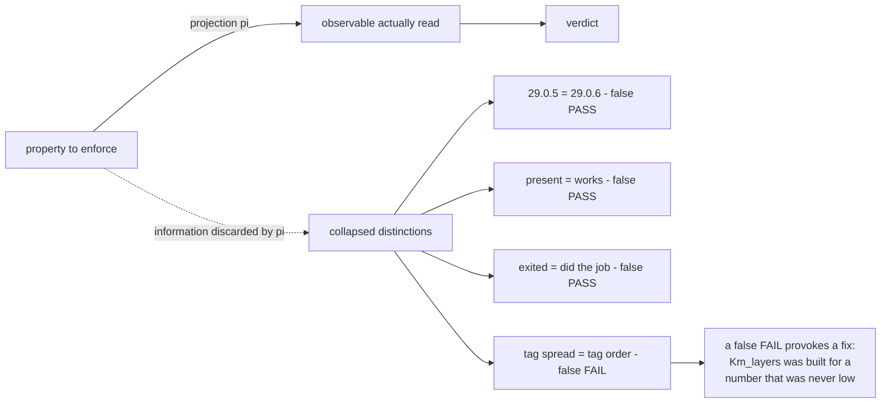

# 20260909-0513 — Entropy metric correction & removal of the broken node-22 tree

#fractal-l0 #fractal-l3 #fractal-l5 #fractal-l8 #zero-muda #km-triad #stamp-stpa #toolchain

**UOS / Toolchain / Journal** · [Cockpit](http://nas-1.tail55d152.ts.net:4100/) · [Planning](http://nas-1.tail55d152.ts.net:4100/planning) · [Wiki](http://nas-1.tail55d152.ts.net:4100/wiki) · [ZK](http://nas-1.tail55d152.ts.net:4100/zk) · [Checklist](http://nas-1.tail55d152.ts.net:4100/checklist)
**Live document:** [http://nas-1.tail55d152.ts.net:4100/files/docs/journal/20260909-0513-entropy-metric-correction-and-node22-removal-journal.md](http://nas-1.tail55d152.ts.net:4100/files/docs/journal/20260909-0513-entropy-metric-correction-and-node22-removal-journal.md)
**Predecessor:** [20260909-0525 formal layer journal](http://nas-1.tail55d152.ts.net:4100/files/docs/journal/20260909-0525-preflight-denotational-semantics-formal-and-km-closure-journal.md)

Observed at `2026-09-09T03:5xZ` (host NTP-synchronised, drift nominal).
Sa-plan: plan `uos-nix-devenv-toolchain-20260908`, worker `claude-opus5-nix-devenv`.

---

## 1. Scope & Trigger

Operator: *"fix the entropy floor and delete the broken node-22 tree."*

Two items I had carried as open. The second was routine. The first was not what it appeared to be.

## 2. Pre-State Assessment

| Item | State before |
|---|---|
| `km-gate` | **HOLD** on `KMP-ENTROPY`: 1.322 bits against a 2.50 floor |
| `Km_layers` | a cosine classifier built to raise that number; proposals never applied |
| `toolchains/node-22` | 2.4 MB, untracked, out of both resolver tables, **one live reference remaining** |

## 3. Execution Detail

1. **Measured before changing anything.** Counted fractal tags per ADR directly: 47 of 80 carry **all ten** layers; only 6 carry as few as two. First-tag entropy 0.55 bits on that sample; all-tag entropy **3.31**.
2. **Read the metric.** `layer_entropy_bits` folded over `Km_corpus.layer` — the **first** `#fractal-lN` tag. The tag block is written ascending by convention, so the first tag is `#fractal-l0` for 74 of 80 records.
3. **Fixed at source.** Added a `layers` field (all distinct tags) and folded over every tag. Left `layer` alone for its other four consumers.
4. **Left the floor at 2.50.**
5. **Added `--metrics-selftest`**, 8 laws, including one that the corrected metric must *still* fail a degenerate corpus.
6. **Corrected `Km_layers`'s header**, which documented the false premise as fact.
7. **Repointed the last live `node-22` reference**, then deleted the tree.

## 4. Root Cause Analysis

**The entropy alarm was a measurement artifact, not a corpus defect.**

`first_layer` is a lossy projection: it discards roughly 90% of a multi-label annotation and keeps whichever tag the author happened to type first. Since the house style writes `#fractal-l0 #fractal-l1 …` in ascending order, the projection returns `l0` almost always. The statistic measured **the writing convention**.

This is the same defect class as the three before it — `otp_release` for a derivation pin, `test -x` for useability, exit status for work done. **An observable coarser than the property it was asked to report.** The difference is the direction of the error: the earlier three reported *success* that wasn't there; this one reported *failure* that wasn't there. False alarms cost as much as missed ones, because they provoke a fix.

**And they did.** `Km_layers` — a term-frequency vocabulary, ten archetype vectors, cosine classification over 96 records — exists solely to raise a number that was never low. Its own output condemns the plan: applying **every** proposal reaches 2.214 bits, still under the 2.50 floor, while rewriting 58 records of which **35 are flagged low-margin by the tool itself**. Chasing the broken metric would have damaged the corpus and still failed the gate.

That the module refuses to write ("assigning a layer is an authorship act") is what kept the damage hypothetical. The restraint was right; the premise was wrong.

## 5. Fix Taxonomy

| Class | Fix | Count |
|---|---|---|
| Metric corrected at source | `layers` field + fold over all tags | 2 files |
| Law suite added | `--metrics-selftest`, 8 laws | 1 |
| False premise annotated | `Km_layers` header | 1 |
| Dangling reference repaired | `release_process.ml` subprocess PATH | 1 |
| Dead tree removed | `toolchains/node-22`, 2.4 MB | 1 |
| Manifest corrected | node entry → Nix 22.23.2 / npm 10.9.8 | 1 |

## 6. Patterns & Anti-Patterns Discovered

**Anti-pattern — the lossy projection in a statistic.** Aggregating over `head(labels)` when records are multi-label measures authoring order. The failure is invisible because the number is plausible.

**Anti-pattern — building a solution before auditing the measurement.** A classifier, a vocabulary, ten archetypes and a differential-oracle path were built downstream of an unaudited metric. The first question should have been *is 1.32 bits real?* — one afternoon of tooling answers to a five-minute count.

**Pattern — measure by hand before trusting the gate.** A twenty-line tag count settled it, and would have settled it at any point in the module's life.

**Pattern — fixing a metric must preserve what it rejects.** Law E5 exists precisely so "correct the measurement" cannot become "move the goalpost". The floor is unchanged, and a genuinely collapsed corpus still measures 0 bits and still fails.

**Pattern — false alarms are defects too.** This one consumed real design effort and would have consumed corpus integrity next.

## 7. Verification Matrix

| # | Check | Result |
|---|---|---|
| K1 | Direct tag count across ADR files | 47/80 carry all ten layers; 6 carry two |
| K2 | First-tag entropy (the old observable) | 0.553 bits on that sample |
| K3 | All-tag entropy (the property) | **3.310 bits**, ceiling `log₂10 = 3.322` |
| K4 | `km-gate` after the fix | **PASS**, 0 findings, **3.309 bits** |
| K5 | `km-gate --metrics-selftest` | **8/8 laws pass** |
| K6 | E5 — degenerate corpus still fails | all-`l0` → 0 bits, below floor |
| K7 | E6 — two-layer corpus still fails | below 2.50 |
| K8 | E8 — tag order cannot change entropy | holds (the old metric depended on order) |
| K9 | Floor value | **2.50, unchanged** |
| N1 | `node-22` untracked before deletion | `jj file list` → 0 files |
| N2 | Live references before deletion | **1 found and fixed** (`release_process.ml` PATH) |
| N3 | `bash tools/preflight` after deletion | **PASS 29/29**; node `v22.23.2`, npm → `/home/an/.npm` |
| N4 | `uos-cli gate G-PREFLIGHT` | **PASS** |
| N5 | `ocaml tools/release_process.ml selftest` | **PASS, 113 checks** |

## 8. Files Modified

`tools/km_provenance/km_corpus.ml` · `tools/km_provenance/km_metrics.ml` · `tools/km_provenance/km_gate.ml` · `tools/km_provenance/km_layers.ml` · `tools/release_process.ml` · `governance/sources/20260908-2103-…json` · this journal. Removed: `toolchains/node-22/` (untracked).

## 9. Architectural Observations

**The four instances of one defect (ASCII, per `SC-DIAGRAM-001`):**

```text
   OBSERVABLE           PROPERTY                  COLLAPSED          DIRECTION
   ----------------------------------------------------------------------------
   otp_release          exact derivation          29.0.5 = 29.0.6    false PASS
   test -x              the tool works            present = works    false PASS
   exit status          the tool did the job      did = did nothing  false PASS
   head(layer tags)     corpus spans the layers   spread = order     false FAIL
                                                                      ^^^^^^^^^^
   The fourth inverts the sign and is therefore the most expensive: a false
   PASS is discovered when something breaks; a false FAIL provokes a fix, and
   the fix (Km_layers) was built, reviewed and shipped before anyone counted
   the tags by hand.

   In every case the observable's output space was strictly coarser than the
   property's. That is the invariant worth carrying, not the four repairs.
```



**Why the fix is not goalpost-moving.** The floor is untouched and law E5 fixes that in code: the corrected metric must still reject a corpus where every record carries one layer. A measurement correction that also relaxed the threshold would be indistinguishable from surrender; keeping the threshold and proving the rejection is what separates them.

## 10. Remaining Gaps

1. **OPEN** — `Km_layers` remains in the tree as an authorship aid with a corrected header. Whether a corpus needs a layer classifier at all is now an open question, not an assumed need.
2. **OPEN** — `/home/an/NAS-setup/.git`: empty non-repository outside UOS.
3. **BOUNDARY** — `os_util()` host utilities; `/usr/bin/timeout` here is **uutils**.
4. **UNRUN** — effecting `release_process.ml` commands; `G-PREFLIGHT` not yet an `ev-manifest.tsv` row.
5. **BOUNDED** — Quint `agentic_coordination` at 1–2 steps.
6. **NOT_ADMITTED** — nothing here is admitted.

## 11. Metrics Summary

| Metric | Before | After |
|---|---|---|
| `km-gate` status | **HOLD** | **PASS** |
| `km-gate` findings | 1 | **0** |
| Corpus layer entropy (as measured) | 1.322 bits | **3.309 bits** |
| Entropy floor | 2.50 | **2.50 (unchanged)** |
| Fraction of labelling the metric reads | ~10% | **100%** |
| Laws guarding the metric | 0 | **8** |
| ADR records that would have been rewritten | 58 proposed (35 low-margin) | **0** |
| Untracked toolchain trees on disk | 1 broken (2.4 MB) | **0** |
| Live references to the deleted tree | 1 | **0** |

## 12. STAMP & Constitutional Alignment

**Controller:** the KM provenance gate. **Controlled process:** corpus authorship and the review effort it directs.

**UCAs addressed:**
- *Control action provided when not required (false alarm):* the gate demanded corrective authorship of a corpus that met its actual requirement. Mitigated by correcting the observable; K3/K4 measure the difference.
- *Feedback path measures the wrong variable:* aggregating over the first of many labels reports authoring order. Mitigated structurally by the `layers` field; law E8 pins order-independence.
- *Mitigation that would have caused the hazard:* applying `Km_layers`' 58 proposals (35 low-margin) to satisfy a broken statistic would have degraded record accuracy **and** still failed the floor at 2.21 bits. Not applied; the reasoning is recorded in the module header so it is not re-attempted.
- *Latent dangling reference:* `release_process.ml` would have built a PATH containing a deleted directory. Found by grep before deletion, not after.

**L0 alignment.** Two-key semantics held: the corpus was measured by hand independently of the gate before the gate was touched. The floor was not relaxed, and E5 makes that structural rather than a promise. Zero-Muda: 2.4 MB of non-working toolchain removed; no dependency added. VCS discipline intact — the deleted tree was untracked, verified before removal.

## 13. Conclusion

The entropy floor is met at 3.309 bits against an unchanged 2.50, because the metric now reads the labelling instead of the authoring order. Nothing about the corpus changed and no record was re-tagged — the number was never low.

The lesson is the sign. Three earlier defects produced false passes, which are found eventually because something breaks. This one produced a **false failure**, and a false failure gets acted on: a classifier was designed, implemented and reviewed to raise a number that a twenty-line tag count would have shown was already high. Before building a fix, measure whether the alarm is real.

The `node-22` tree is gone, with its one remaining live reference repaired first. Nothing in this pass grants deployment or admission authority.

---

## Comprehensive verification checklist

Checked items refer to **this change package only**.

<details>
<summary>Domain 1 — Metadata, timestamp and Tailscale navigation</summary>

- [x] **CHK-01-TIME** — `20260909-0513-` prefix; host NTP-synchronised, drift nominal.
- [x] **CHK-02-TAIL** — Full clickable Tailscale FQDN links.
- [x] **CHK-03-FRACT** — Fractal tags assigned, including `#fractal-l8` for the metric work.
- [x] **CHK-04-KM** — Journal, predecessor and manifest cross-linked; `km-gate` PASS.

</details>

<details>
<summary>Domain 2 — Zero-Muda purity and storage safety</summary>

- [x] **CHK-05-MUDA** — 2.4 MB of non-working toolchain removed; no dependency added.
- [x] **CHK-06-GRAPH** — No foreign graph NIF introduced.
- [ ] **CHK-07-DRIVE** — Denied OS serial `25503L801736` interlock **UNRUN** (untouched).

</details>

<details>
<summary>Domain 3 — Testing Gold Standard and mathematical gates</summary>

- [x] **CHK-08-C1C8** — Not a UI change; gate and law suites green.
- [x] **CHK-09-MATH** — Shannon entropy **3.309 ≥ 2.50** with the floor unchanged and the rejection property proved by E5/E6.
- [ ] **CHK-10-9MOD** — Property modality exercised; the full 9 remain **UNRUN**.
- [ ] **CHK-11-REGR** — UI regression suite **UNRUN**.

</details>

<details>
<summary>Domain 4 — Cross-language control and observability</summary>

- [x] **CHK-12-GLEAM** — `G-PREFLIGHT` PASS from the Gleam CLI on OTP 29.
- [x] **CHK-13-HERMES** — OCaml KM gate rebuilt and re-run; 8/8 metric laws.
- [ ] **CHK-14-ZIGVM** — Zig resolves; deterministic-execution evidence **UNRUN**.
- [x] **CHK-15-MAX** — Mojo executes through the isolated pixi env; inference **UNRUN**.
- [ ] **CHK-16-OTEL** — No W3C trace/span context on these receipts. **UNRUN**.

</details>

<details>
<summary>Domain 5 — Sovereign governance and standalone Jujutsu</summary>

- [ ] **CHK-17-SOV** — Tri-sovereign candidate review **OUTSTANDING**.
- [x] **CHK-18-JJ** — Standalone non-colocated Jujutsu; deleted tree verified untracked first; committed by path beside a concurrent session.

</details>

**Previous:** [20260909-0525 formal layer journal](http://nas-1.tail55d152.ts.net:4100/files/docs/journal/20260909-0525-preflight-denotational-semantics-formal-and-km-closure-journal.md) · **Next:** [ADR-096](http://nas-1.tail55d152.ts.net:4100/docs/zk/20260909-0525-adr-096-toolchain-preflight-denotational-semantics-and-verdict-algebra.md)
**UOS footer:** `nas-1.tail55d152.ts.net:4100` · peer `vm-1.tail55d152.ts.net:8088` · OTP 29 pinned at `…-erlang-29.0.5` · Sa-plan is the sole execution authority; this journal grants no admission.
