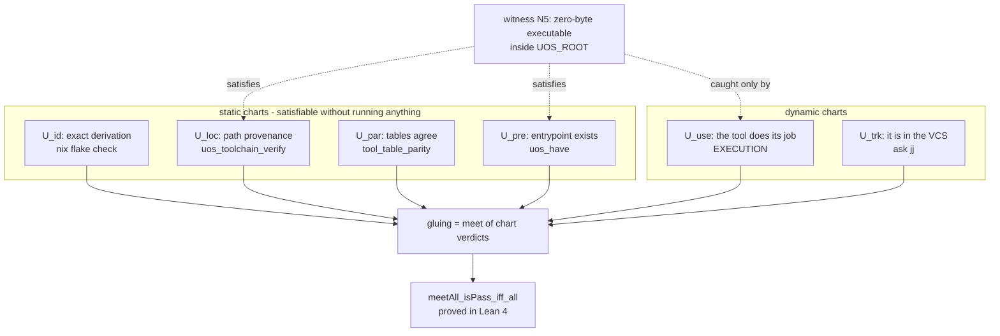

# 20260909-0525 — Preflight denotational semantics, formal layer & KM closure (SC-NIX-DEVENV-001)

#fractal-l0 #fractal-l1 #fractal-l3 #fractal-l4 #fractal-l7 #zero-muda #km-triad #stamp-stpa #algebraic-atlas #denotational-intent #formal-lean4 #zk-adr #toolchain

**UOS / Toolchain / Journal** · [Cockpit](http://nas-1.tail55d152.ts.net:4100/) · [Planning](http://nas-1.tail55d152.ts.net:4100/planning) · [Wiki](http://nas-1.tail55d152.ts.net:4100/wiki) · [ZK](http://nas-1.tail55d152.ts.net:4100/zk) · [Checklist](http://nas-1.tail55d152.ts.net:4100/checklist)
**Live document:** [http://nas-1.tail55d152.ts.net:4100/files/docs/journal/20260909-0525-preflight-denotational-semantics-formal-and-km-closure-journal.md](http://nas-1.tail55d152.ts.net:4100/files/docs/journal/20260909-0525-preflight-denotational-semantics-formal-and-km-closure-journal.md)
**Predecessor:** [20260909-0553 integration journal](http://nas-1.tail55d152.ts.net:4100/files/docs/journal/20260909-0553-preflight-integration-into-sdlc-sre-and-agentic-processes-journal.md)
**Spec:** [design](http://nas-1.tail55d152.ts.net:4100/files/docs/design/20260909-0525-preflight-denotational-spec-and-algebraic-atlas.md) · **Guide:** [wiki](http://nas-1.tail55d152.ts.net:4100/files/docs/wiki/20260909-0525-uos-toolchain-preflight-guide.md) · **Record:** [ADR-096](http://nas-1.tail55d152.ts.net:4100/docs/zk/20260909-0525-adr-096-toolchain-preflight-denotational-semantics-and-verdict-algebra.md)

Observed at `2026-09-09T03:38Z` (host NTP-synchronised, drift nominal).
Sa-plan: plan `uos-nix-devenv-toolchain-20260908`, tasks `task-18`…`task-21`, worker `claude-opus5-nix-devenv`.

---

## 1. Scope & Trigger

Operator: *"denotonic spec and design, algebraic atlas, formal specs, wiki, km, zk, journal, all aspects."*

The preflight worked and was wired everywhere. What it lacked was a written account of **what its observations mean** — and that absence was the actual root of the three defects the previous passes each fixed locally.

## 2. Pre-State Assessment

| Layer | State before |
|---|---|
| shell (`tools/preflight`) | working, wired at three levels |
| semantics | **implicit**, distributed across `if` statements in bash |
| algebraic treatment | none |
| Lean | nothing about the preflight |
| Quint | nothing about receipts |
| design spec / wiki / ZK | none |
| KM indexes | ADR count 95 |

## 3. Execution Detail

1. **Denotational core** — `preflight_algebra.{ml,mli}` in `hermes_toolchain`: pure, no filesystem/process/clock, observations passed in. Verdict meet-semilattice, `Pass` top, `Fail` absorbing, findings accumulating.
2. **Law suite** — `test_preflight_algebra.ml`, 27 laws linking the **shipped** module (matching the convention `test_toolchain_check.ml` documents, which exists because an earlier suite tested a copy).
3. **Lean** — `Preflight_Verdict_Algebra.lean`, 13 theorems, axiom audit printed at check time.
4. **Quint** — `preflight_receipt.qnt`, a temporal model asking the different question: can a caller accept a cached verdict it shouldn't, *across interleavings*?
5. **KM** — design spec, wiki guide, ADR-096; registered in both indexes.
6. **Mutation-tested everything.**

## 4. Root Cause Analysis

**Why a semantics was needed rather than a fourth fix.** The three defects were:

| Observable | Could not distinguish |
|---|---|
| `otp_release` | 29.0.5 from 29.0.6 |
| `test -x` | working from broken |
| exit status | doing the job from doing nothing |

Each was the obvious API. Each had an **output space strictly coarser than the property**. A lint rule against coarse APIs does not survive the next API; without a written denotation, every new check re-invents the meaning of its observations and re-finds the hole. Writing $\llbracket\cdot\rrbracket$ down makes the gap a *type error* instead of an oversight: `ExitedZeroSilent` and `ExitedZeroWithOutput` are different constructors, so a probe cannot accidentally conflate them.

**Why fail-closed had to be algebraic.** It was previously a habit — "remember to fail on unknown" — re-applied at each call site and therefore forgettable at one. Making `Fail` the absorbing element of the meet turns it into a single theorem: `fail_absorbs_left`. There is no `Unknown` constructor, so the third state cannot be silently coerced to success.

**Why Lean alone was insufficient.** Lean proves the receipt *predicate* correct at an instant. It cannot say whether the predicate is *consulted* at the right instant. That is a temporal property over interleavings of clock ticks, checker edits and cached acceptances — the Quint model's job. A predicate correct at every instant, consulted at the wrong one, is exactly the shape of every defect in this series.

## 5. Fix Taxonomy

| Class | Artifact | Count |
|---|---|---|
| Denotational core | `preflight_algebra.{ml,mli}` | 2 |
| Executable laws | 27 laws against shipped code | 1 |
| Machine-checked proofs | 13 Lean theorems + axiom audit | 1 |
| Temporal model | Quint + Apalache | 1 |
| Mutation evidence | M1–M4 | 4 |
| KM artifacts | design spec, wiki guide, ADR-096 | 3 |
| Index registration | zk-master-moc, wiki-corpus-index | 2 |

## 6. Patterns & Anti-Patterns Discovered

**Anti-pattern — the implicit denotation.** If the meaning of an observation lives only in the branches of the checker, it cannot be reviewed, proved, or reused, and it will be re-derived (differently) by the next check.

**Anti-pattern — the unrepresentable-but-not-really third state.** "Unknown" that is handled by convention rather than by the type will eventually be handled as success.

**Pattern — make the distinction a constructor.** `ExitedZeroSilent` versus `ExitedZeroWithOutput` costs one line and makes the npm-class defect unwritable.

**Pattern — prove the law once, at the algebra.** Absorption gives fail-closed everywhere for free, including at call sites not yet written.

**Pattern — two formal tools, two questions.** Lean: is the predicate right? Quint: can it be consulted wrongly? Answering only the first has been the failure mode all along.

**Pattern — mutation testing as the acceptance test for a proof suite.** Each mutation must kill exactly the law that names it. M1→L9 only, M2→L7 only: neither vacuous nor over-coupled.

## 7. Verification Matrix

| # | Check | Result |
|---|---|---|
| F1 | `test_preflight_algebra.exe` | **27/27 passed, 0 failed** |
| F2 | `tools/lean Preflight_Verdict_Algebra.lean` | **exit 0** |
| F3 | Axiom audit (printed at check time) | only `propext`, `Quot.sound`; **no `sorryAx`**, no Mathlib |
| F4 | `tools/quint typecheck` across the corpus | **6/6** including the new spec |
| F5 | `quint verify preflight_receipt --invariant inv_all` | **NoError** (2.5 s, Apalache) |
| F6 | Anti-vacuity: `not(accepted)` | **violates** → `acceptCached` is reachable |
| F7 | `tools/km-gate` KMP-INCOMPLETE | **cleared** for both indexes |
| F8 | `uos-cli gate G-PREFLIGHT` | **PASS** |
| F9 | `bash tools/preflight` | **PASS 29/29** |

**Mutation tests:**

| # | Mutation | Killed |
|---|---|---|
| M1 | `Exited_zero_silent, Output_required ↦ Pass` | **L9 only** (26/27) |
| M2 | `Fail f, Fail _ ↦ Fail f` | **L7 only** (26/27) |
| M3 | Quint `valid` loses `r.checker == checkerNow` | `inv_no_foreign_accept` **violated** |
| M4 | Quint `valid` loses the age bound | `inv_no_stale_accept` **violated** |

All mutations reverted; sources `diff`-verified identical.

## 8. Files Modified

`engines/hermes/modules/hermes_toolchain/{preflight_algebra.ml,preflight_algebra.mli,test_preflight_algebra.ml,dune}` · `formal/lean/Preflight_Verdict_Algebra.lean` · `formal/quint/preflight_receipt.qnt` · `docs/design/20260909-0525-…-denotational-spec-and-algebraic-atlas.md` · `docs/wiki/20260909-0525-uos-toolchain-preflight-guide.md` · `docs/zk/20260909-0525-adr-096-….md` · `docs/zk/20260905-1801-moc-uos-unified-master.md` · `docs/wiki/20260905-1801-uos-zk-km-corpus-index.md` · `governance/sources/20260908-2103-…json` · this journal.

## 9. Architectural Observations

**The property lattice and its authorities (ASCII, per `SC-DIAGRAM-001`):**

```text
   CHART        PROPERTY                     CHECKABLE BY   AUTHORITY
   -------------------------------------------------------------------------
   U_id         exact store derivation       evaluation     nix flake check
   U_loc        provenance of the path       inspection     uos_toolchain_verify
   U_par        two tables agree             text compare   tool_table_parity
   U_pre        entrypoint exists            stat           uos_have
   U_use        THE TOOL DOES ITS JOB        EXECUTION      preflight arm 2
   U_trk        IT IS IN THE VCS             ask jj         preflight arm 4

   gluing:  global verdict on the union  =  meet of the chart verdicts
            proved equal to "every chart passes" (meetAll_isPass_iff_all)

   phi : U_static -> U_dynamic  is NOT an isomorphism.
   Witness (N5): a zero-byte executable inside $UOS_ROOT satisfies
   U_pre, U_loc and U_par, and is caught only by U_use.
```



**Two tables remain, deliberately.** The OCaml mirror of the shell resolver is a liability, accepted only because `tool_table_parity` proves the mirror and is itself mutation-tested. `release_process.ml` is an `ocaml` toplevel script with no link-time access to the shell library, so a parsed parity guard was the cheaper honest option.

## 10. Remaining Gaps

1. **PRE-EXISTING** — `km-gate` HOLD on `KMP-ENTROPY`: corpus fractal-layer entropy 1.322 bits against the 2.50 floor. Measured identically before and after ADR-096, so this pass neither caused nor repaired it.
2. **BOUNDED** — the Quint result is a bounded model-check, not an inductive invariant proof.
3. **NOT PROVED, BY DESIGN** — that the shell observes correctly. Empirical, not a theorem.
4. **TRUST DECISION** — `Silent_ok` is a judgement, mitigated by a paired artefact assertion.
5. **OPEN** — the incomplete `toolchains/node-22` tree is out of every path and table but still on disk (untracked; operator's call).
6. **OPEN** — `/home/an/NAS-setup/.git` empty non-repository outside UOS.
7. **UNRUN** — effecting `release_process.ml` commands; `G-PREFLIGHT` not yet an `ev-manifest.tsv` row.
8. **NOT_ADMITTED** — nothing here is admitted.

## 11. Metrics Summary

| Metric | Before | After |
|---|---|---|
| Written semantics for preflight observations | none | **`preflight_algebra.mli`** |
| Executable laws | 0 | **27** (27/27 green) |
| Machine-checked theorems | 0 | **13**, axiom-audited |
| Temporal invariants verified | 0 | **4** (`inv_all`) |
| Mutation tests | 0 | **4**, each killing exactly its law |
| KM artifacts | 0 | design spec + wiki guide + ADR-096 |
| ADRs enumerated in both indexes | 95/96 | **96/96** |
| `km-gate` KMP-INCOMPLETE findings | 2 | **0** |
| Quint specs in the corpus | 5 | **6** |

## 12. STAMP & Constitutional Alignment

**Controller:** the interpretation function $\llbracket\cdot\rrbracket$ — newly made explicit and therefore newly analysable.

**UCAs addressed:**
- *Provided with a coarse observable:* the controller cannot distinguish two process states that matter. Mitigated structurally by making the distinction a constructor; M1 proves the law that guards it is live.
- *Not provided (fail-open on unknown):* an unrepresented observation silently treated as success. Mitigated by absorption, proved in Lean — one theorem covering every present and future call site.
- *Provided at the wrong time:* a correct predicate consulted on stale or foreign evidence. Mitigated by digest-bound receipts; verified temporally by Apalache and shown non-vacuous.
- *Feedback masked:* a composite failure reporting only the first failing arm. Mitigated by finding accumulation; L7 and M2 keep it honest.

**L0 alignment.** Two-key semantics held throughout: every proof is paired with a mutation that kills it, and every empirical claim names its invocation. Formal authority is scoped explicitly — the design spec's §6 states in plain terms what is *not* claimed, per canonical policy §7. Zero-Muda intact. ADR-096 records the EV>93 quarantine explicitly rather than inheriting admission from it.

## 13. Conclusion

The preflight now has a semantics, not just an implementation. Fail-closed is a theorem about an absorbing element rather than a habit; the npm-class defect is unwritable because silence and output are different constructors; and a cached verdict cannot outlive the code that produced it, both by construction and across every interleaving Apalache explored.

The finding worth carrying beyond this slice is the diagnosis rather than any fix: three defects, three passes, one cause — an observable coarser than the property it was asked to enforce. That is not caught by more care. It is caught by writing down what observations mean, and then breaking every law to check that the writing bites.

Nothing in this pass grants deployment or admission authority.

---

## Comprehensive verification checklist

Checked items refer to **this change package only**.

<details>
<summary>Domain 1 — Metadata, timestamp and Tailscale navigation</summary>

- [x] **CHK-01-TIME** — `20260909-0525-` prefix; host NTP-synchronised, drift nominal.
- [x] **CHK-02-TAIL** — Full clickable Tailscale FQDN links throughout.
- [x] **CHK-03-FRACT** — Fractal tags assigned on journal, spec, guide and ADR.
- [x] **CHK-04-KM** — `[[wiki:…]]` and `[[zk:…]]` transclusions present; ADR-096 registered in both indexes.

</details>

<details>
<summary>Domain 2 — Zero-Muda purity and storage safety</summary>

- [x] **CHK-05-MUDA** — No Bevy/Graphite/Graphene; the new core is pure OCaml with no foreign NIF.
- [x] **CHK-06-GRAPH** — Lattice and set algebra in pure OCaml/Lean.
- [ ] **CHK-07-DRIVE** — Denied OS serial `25503L801736` interlock **UNRUN** (untouched).

</details>

<details>
<summary>Domain 3 — Testing Gold Standard and mathematical gates</summary>

- [x] **CHK-08-C1C8** — Not a UI change; 27 laws + 13 theorems + 4 temporal invariants green.
- [ ] **CHK-09-MATH** — `KMP-ENTROPY` 1.322 bits below the 2.50 floor; **pre-existing**, identical before and after this change.
- [ ] **CHK-10-9MOD** — Property and mutation modalities exercised; the full 9 remain **UNRUN**.
- [ ] **CHK-11-REGR** — UI regression suite **UNRUN**.

</details>

<details>
<summary>Domain 4 — Cross-language control and observability</summary>

- [x] **CHK-12-GLEAM** — `G-PREFLIGHT` executes from the Gleam CLI on OTP 29.
- [x] **CHK-13-HERMES** — Denotational core and law suite live in `engines/hermes`, built with the in-project switch.
- [x] **CHK-14-ZIGVM** — Zig resolves and executes in-project; deterministic-execution evidence **UNRUN**.
- [x] **CHK-15-MAX** — Mojo executes through the isolated pixi env; inference **UNRUN**.
- [ ] **CHK-16-OTEL** — Receipts carry UTC timestamps and revision; no W3C trace/span context. **UNRUN**.

</details>

<details>
<summary>Domain 5 — Sovereign governance and standalone Jujutsu</summary>

- [ ] **CHK-17-SOV** — Tri-sovereign candidate review **OUTSTANDING**.
- [x] **CHK-18-JJ** — Standalone non-colocated Jujutsu; `jj` pinned; committed by path beside a concurrent session; zero native Git mutations.

</details>

**Previous:** [20260909-0553 integration journal](http://nas-1.tail55d152.ts.net:4100/files/docs/journal/20260909-0553-preflight-integration-into-sdlc-sre-and-agentic-processes-journal.md) · **Next:** [ADR-096](http://nas-1.tail55d152.ts.net:4100/docs/zk/20260909-0525-adr-096-toolchain-preflight-denotational-semantics-and-verdict-algebra.md)
**UOS footer:** `nas-1.tail55d152.ts.net:4100` · peer `vm-1.tail55d152.ts.net:8088` · OTP 29 pinned at `…-erlang-29.0.5` · Sa-plan is the sole execution authority; this journal grants no admission.
