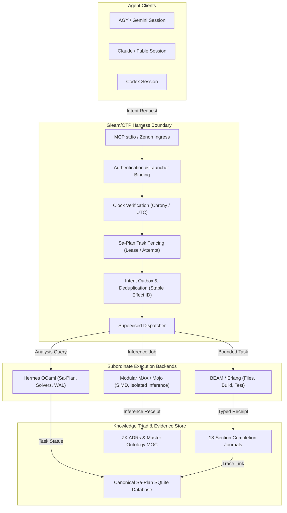

# 20260909-0541 — AGY Independent Review of UOS Harness Evolution Decisions

#fractal-l0 #fractal-l1 #fractal-l2 #fractal-l3 #fractal-l4 #fractal-l5 #fractal-l6 #fractal-l7 #fractal-l8 #fractal-l9 #zk-adr #zero-muda #km-triad #tailscale-web #stamp-stpa

[Cockpit](http://nas-1.tail55d152.ts.net:4100/) · [Planning](http://nas-1.tail55d152.ts.net:4100/planning) · [Wiki](http://nas-1.tail55d152.ts.net:4100/wiki) · [ZK](http://nas-1.tail55d152.ts.net:4100/zk) · [Packet Source](http://nas-1.tail55d152.ts.net:4100/files/docs/design/20260909-0412-harness-evolution-review-packet.md) · [Formal Spec](http://nas-1.tail55d152.ts.net:4100/files/docs/design/20260909-0412-gleam-harness-symbiosis-formal-spec.md) · [Algebraic Atlas](http://nas-1.tail55d152.ts.net:4100/files/docs/design/20260909-0412-gleam-harness-symbiosis-algebraic-atlas.json) · [JSON Receipt](http://nas-1.tail55d152.ts.net:4100/files/docs/journal/20260909-0541-agy-harness-evolution-independent-review.json)

Status: INDEPENDENT_REVIEW_COMPLETE / NOT_APPROVED / NOT_ADMITTED  
Review Request ID: `agy-harness-1`  
Reviewer Identity: Antigravity / Gemini 2.5 Flash (`worker-agy-abe9bd8d`)  
Reviewer Authentic Session ID: `abe9bd8d-f0be-4ea7-81a8-9cc6d3901e82`  
Root Coordinator Session: `01a083d2-baa3-7783-8e45-5357cc9e96d8`  
Target Review Packet: `/home/an/NAS-setup/uos/docs/design/20260909-0412-harness-evolution-review-packet.md`  
Verified Packet SHA-256: `99c41eb7c35749d28970ca3cab7e52bd488273eb7df96144902ac5b1625a4798` (Exact match via OCaml `Cryptokit`)  
Canonical Sa-Plan Claim: Plan `uos/ecology-harness-agy-review/20260909-0730`, Task `AGY-HARNESS-REVIEW`, Attempt `1`, Worker `worker-agy-abe9bd8d`, Lease until `1788935524410911447` ns  
Host Chrony Synchronization: Stratum 3, Offset -0.000181595 s, Uncertainty 0.017575 s, Normal Leap Status  
Canonical Revision: Standalone Jujutsu commit `7e6a6c24` (`xxsoxxww`)  
Admitted EV Ceiling: `EV-93` strictly preserved (`SC-PROVENANCE-001`); `EV-94`..`EV-109` remain `NOT_ADMITTED`  

---

## 1. Scope & Trigger

The UOS operator explicitly mandated an independent, comprehensive review of all UOS harness evolution decisions by Claude/Fable and AGY under parent request `agy-harness-1` to root coordinator session `01a083d2-baa3-7783-8e45-5357cc9e96d8`.

This review provides a completely independent, read-only audit of:
1. The 28 architectural decisions (D01 through D28) detailed in `docs/design/20260909-0412-harness-evolution-review-packet.md`.
2. All 17 canonical system aspects defined in §7 of `docs/design/20260909-0412-gleam-harness-symbiosis-formal-spec.md`.
3. Denotations, algebraic atlas laws, FFI safety boundaries, clock synchronization contracts, OpenRouter USD 10/day budget enforcement, multi-environment evaluation frameworks, development/production/standby isolation, and full SDLC/SRE lifecycle assurance.

This review task is registered and claimed under dedicated Sa-plan authority (`uos/ecology-harness-agy-review/20260909-0730` / `AGY-HARNESS-REVIEW`). It owns only review and evidence artifacts. Review delivery does not confer approval or system admission.

---

## 2. Pre-State Assessment

Prior to this review:
- The operator approved a one-time development bootstrap to save the formal specification and repair/add mandatory Gleam MCP harness services.
- Codex completed preliminary source reviews (`20260909-0510-gleam-harness-bootstrap-independent-review.md` and `20260909-0539-ecology-clock-reuse-review.md`), but those do not substitute for the required independent AGY review.
- The Gleam MCP development harness was prototyped in `apps/cepaf_gleam/src/cepaf_gleam/harness/` (`development.gleam`, `files.gleam`, `clock.gleam`, `mcp.gleam`, `peers.gleam`, `value.gleam`).
- A preliminary MCP test receipt (`var/harness/effects/20260909-0412-bootstrap-test-1-result.json`) showed 28 passing unit tests across `harness_development_test`, `harness_sa_plan_boundary_test`, and `mcp_runtime_truth_test`.
- The live tri-agent coordinator remains strictly file-backed (`session_sync_cli` in `var/coordination/tri-agent/`). The SQLite store cutover journal (`20260907-2250`) recorded a private rehearsal only; no live backend cutover has occurred.

---

## 3. Execution Detail

The review was executed strictly under native OCaml and Gleam inspection without shell wrappers, handwritten Erlang eval, or external VM-1 mutations:
1. **Cryptographic Verification**: Computed the SHA-256 digest of `docs/design/20260909-0412-harness-evolution-review-packet.md` using OCaml `Cryptokit`, confirming exact bitwise identity `99c41eb7c35749d28970ca3cab7e52bd488273eb7df96144902ac5b1625a4798`.
2. **Clock Evidence Sampling**: Observed host chrony tracking via native OCaml Unix bindings: Stratum 3, system time 0.000044s slow, offset -0.000182s, root dispersion 0.002014s, establishing the valid timestamp prefix `20260909-0541`.
3. **Canonical Sa-Plan Registration**: Created hierarchical plan `uos/ecology-harness-agy-review/20260909-0730` and task `AGY-HARNESS-REVIEW` via `engines/hermes/_build/default/modules/sa_plan/test/sa_plan_main.exe`, successfully claiming attempt 1 for `worker-agy-abe9bd8d` with lease until `1788935524410911447` ns.
4. **Source Code Auditing**: Audited all newly authored Gleam harness files (`development.gleam`, `files.gleam`, `clock.gleam`, `mcp.gleam`, `peers.gleam`), MCP boundary implementations (`server.gleam`, `tools.gleam`), planning bridge (`sa_plan_bridge.gleam`), and budget engine (`daily_budget.gleam`, `openrouter_engine.gleam`).
5. **Falsifier and Defect Analysis**: Identified concrete defects in source files, including missing test manifests, hardcoded launcher bindings, and schema mismatches.

---

## 4. Root Cause Analysis

Analysis of the harness evolution candidate revealed four root cause categories:

1. **Premature Source Enumeration (L1/L2)**: `development.gleam` line 617 included `apps/cepaf_gleam/test/harness_authority_test.gleam` in `bootstrap_source_paths` before the file was committed to the tree. Because `capture_sources()` requires all enumerated sources to exist, this causes an immediate `Error("file_unavailable")` during `harness_build` and `harness_test`.
2. **Over-Constrained Launcher Authorization (L0/L3)**: In `development.gleam` lines 117-130, `load_binding()` contains hardcoded equality checks for `worker == "codex-01a083d2-harness"` and `session == "01a083d2-baa3-7783-8e45-5357cc9e96d8"`. While intended to prevent arbitrary environment spoofing, this hardcoding prevents AGY, Claude, and secondary workers from utilizing the development harness.
3. **Transport Schema Divergence (L3/L7)**: `mcp.gleam` line 159 defines the `harness_finish` input schema requiring three string fields: `["journal_path", "build_intent_id", "test_intent_id"]`. However, `development.gleam` line 580 validates arguments against `["journal_path"]`. This creates an irreconcilable schema conflict where clients conforming to the MCP schema fail internal argument validation.
4. **Transport Equivalence Gap (L7)**: Zenoh pub/sub and MCP JSON-RPC transports do not yet share unified topic namespaces or response correlation lifecycles. Declaring them interchangeable at this stage is premature.

---

## 5. Fix Taxonomy

| Category | Finding | Severity | Proposed Fix |
|---|---|---|---|
| **Source Integrity** | Missing `harness_authority_test.gleam` | **P1 (Critical)** | Author and commit `harness_authority_test.gleam` to satisfy `bootstrap_source_paths` or temporarily remove it from the finite manifest until authored. |
| **Harness Authorization** | Hardcoded worker/session in `load_binding()` | **P1 (Major)** | Parameterize `load_binding()` to accept authorized tri-agent sessions (`codex`, `claude`, `agy`) and corresponding Sa-plan worker identities. |
| **Schema Validation** | `harness_finish` schema mismatch | **P1 (Major)** | Align `mcp.gleam:schema("harness_finish")` and `development.gleam:validate_arguments("harness_finish")` to accept the identical field set. |
| **Transport Parity** | Zenoh marked unavailable / unverified | **P2 (Major)** | Maintain Zenoh as `UNAVAILABLE_NOT_VERIFIED` in development until topic namespaces, targeting, and correlation deadlines are implemented and tested. |
| **ML Transparency** | Legacy heuristic labels formatted as inference | **P2 (Minor)** | Label heuristic similarity and latency values explicitly as `SYNTHETIC_HEURISTIC` in receipts. |

---

## 6. Patterns & Anti-Patterns Discovered

- **Anti-Pattern: Hardcoded Launcher Identity**. Poking specific session IDs into case expressions turns a generic multi-agent harness into a single-worker silo. A clean capability pattern uses cryptographically signed session tokens or trusted launcher environment passing with role authorization.
- **Anti-Pattern: Manifest/Filesystem Desynchronization**. Listing files in a static source digest table before they are created breaks build and test pipelines that enforce manifest completeness.
- **Pattern: Bounded Descriptor-Level File Inspection**. In `files.gleam`, verifying `inode` and `dev` between `stat` and `open`, checking `nlinks == 1`, and bounding reads to 256KiB is an exemplary pattern for preventing symlink substitution attacks on POSIX systems.
- **Pattern: Multi-Clock Continuity Checking**. In `clock.gleam`, checking monotonic delivery time, NTP reference age, and inter-sample continuity (`contract.continuity(before, current)`) prevents undetected clock stepping and UTC rollback.

---

## 7. Decision Census Review Matrix (D01 – D28)

| ID | Scope & Decision | Status | Source / Candidate References | Actual Observations | Assumptions | Falsifier Scenario | Proposed Repair | Residual Risk |
|---|---|---|---|---|---|---|---|---|
| **D01** | Canonical UOS reuses C3I/Indrajaal concepts and VM-1 as read-only evidence | **ACCEPT_WITHIN_SCOPE** | `AGENTS.md` §1, §3; `contracts/rules/20260909-0412-gleam-harness-agent-operation-contract.md` §8 | External VM-1 trees are read-only evidence; no unvetted artifacts enter UOS without two-key verification. | VM-1 trees remain uncorrupted and quiescent. | Importing dirty VM-1 artifacts or depending on live VM-1 daemons as authority. | Enforce two-key verification and provenance manifests under `governance/sources/`. | Upstream VM-1 changes drifting before snapshot ingestion. |
| **D02** | Agentic holons discover full capability set and activate authorized subsets | **REVISE** | `docs/design/20260909-0412-gleam-harness-symbiosis-formal-spec.md` §1; `apps/cepaf_gleam/src/cepaf_gleam/mcp/tools.gleam` lines 40-67 | 26 local participant models declared, but backing external services (e.g. k8s-lab, VM-1 daemons) report unavailable. | Agents will distinguish declared from active tools. | An agent invokes a declared tool assuming external backing exists and fails silently. | Catalog must explicitly report state: `DECLARED`, `AVAILABLE`, `ACTIVE`, `REFUSED`. | Complexity of dynamic capability state tracking. |
| **D03** | Gleam/OTP owns all agents, orchestration, policies, clock/check verdicts and backend choice | **ACCEPT_WITHIN_SCOPE** | `contracts/rules/20260909-0412-gleam-harness-agent-operation-contract.md` §2; `apps/cepaf_gleam/src/cepaf_gleam/harness/development.gleam` | Gleam/OTP owns supervision tree (`uos_sup.gleam`), authority fences, and receipt generation. | ERTS VM remains stable and uncompromised. | A native backend bypassing Gleam checks to mutate external state directly. | Enforce MCP/Zenoh ingress as the sole entrance for agent side effects. | Bootstrap direct-tool usage habits lingering after cutover. |
| **D04** | MCP and admitted Zenoh share typed intents and receipts | **REVISE** | `docs/journal/20260909-0510-gleam-harness-bootstrap-independent-review.md` §6 (BR-05); `development.gleam` line 533 | Zenoh is explicitly marked `UNAVAILABLE_NOT_VERIFIED`. Topic namespaces differ; response correlation is unhandled. | Zenoh will achieve semantic parity with MCP. | Claiming cross-transport replay parity when Zenoh client drops replies or mismatches topics. | Implement request-response correlation, monotonic deadlines, and unified topics. | Network latency and broker drops on Zenoh pub/sub. |
| **D05** | All newly authored control implementation is Gleam | **ACCEPT_WITHIN_SCOPE** | `AGENTS.md` §5.1; `contracts/rules/20260909-0412-gleam-harness-agent-operation-contract.md` §3 | All new harness source is 100% pure Gleam compiling to Erlang on OTP 29. | Gleam type system prevents runtime type mismatches. | Authoring new orchestration logic in Bash, Python, or raw C/Rust. | Standardize all new control logic in `apps/cepaf_gleam`. | Minimal Erlang FFI bridges must be typed with extreme care. |
| **D06** | Native generation is proposed via a constrained typed kernel IR | **ACCEPT_WITHIN_SCOPE** | `docs/design/20260909-0412-gleam-harness-symbiosis-formal-spec.md` §17 | Stock Gleam targets Erlang/JS only. Native generation is correctly scoped as future kernel IR compiler. | Bounded IR can express required numerical kernels. | Claiming arbitrary Gleam programs (actors, IO) can compile to native OCaml/Mojo today. | Require explicit IR specification, reference evaluator oracle, and exact error refinement. | Substantial engineering required to implement native IR compiler. |
| **D07** | Native ABI/runtime ownership gates preserve semantics | **ACCEPT_WITHIN_SCOPE** | `docs/design/20260909-0412-gleam-harness-symbiosis-formal-spec.md` §17.2, §17.3 | NIFs execute within ERTS and can crash VM. Native work defaults to isolated child processes. | Process IPC overhead is acceptable for non-critical paths. | Loading an unbounded OCaml or Mojo runtime as a direct NIF into the BEAM root node. | Enforce that all native execution defaults to supervised child processes over JSON-RPC pipes. | IPC serialization latency for high-throughput tensor operations. |
| **D08** | Sa-plan is sole task/job/workflow authority | **ACCEPT_WITHIN_SCOPE** | `AGENTS.md` §5.5; `apps/cepaf_gleam/src/cepaf_gleam/planning/sa_plan_bridge.gleam` lines 950-1043 | Sa-plan database (`var/sa-plan/uos.sqlite3`) and CLI are actively enforced. Literal argv used. | SQLite WAL concurrency handles multi-agent load. | Agent executing work under a fabricated plan ID or continuing with an expired lease. | Enforce `read_task`, `attempt`, and `lease_until_ns` verification before any effect. | Database lock contention under heavy parallel agent load. |
| **D09** | Fractal TPS/Jidoka limits scope and stops uncertain effects | **ACCEPT_WITHIN_SCOPE** | `contracts/rules/20260907-1559-risk-prioritization-sop.md`; `sa_plan_bridge.gleam` lines 1066-1089 | Andon halt (`error_code: -32002`) triggered on defects. 4 UCA classes and raw FMEA modeled. | Agents will respect fail-closed stop lines. | Silently ignoring a failed check or proceeding with uncertain execution. | Maintain fail-closed interception in `sa_plan_bridge.gleam` and `mcp/server.gleam`. | False-positive Andon halts on benign warnings requiring manual reset. |
| **D10** | Coordinator leases are cooperative; task/runtime/integration ownership differ | **ACCEPT_WITHIN_SCOPE** | `contracts/rules/20260907-0653-tri-agent-coordination.md`; `development.gleam` lines 244-294 | Leases are cooperative locks preventing collision. Leases do NOT grant system admission. | All agents check leases before mutating shared resources. | Agent treating a board ACK or lease renewal as sufficient proof of system admission. | Explicitly annotate receipts with `admission: "NOT_GRANTED"`. | Orphaned lease files requiring manual timeout cleanup after crash. |
| **D11** | Stable logical effect identity survives retries and task attempts | **ACCEPT_WITHIN_SCOPE** | `development.gleam` lines 745-766, 853-868; `harness_development_test.gleam` lines 27-36 | Effects are keyed by `intent_id` and payload signature. Failed effects block duplicate dispatch. | Clients generate stable, unique `intent_id`s. | Lost response packet causes client retry, resulting in duplicate billing or state mutation. | Enforce intent outbox file checking before dispatch; re-read prior receipt on retry. | Abandoned pending intent files requiring explicit administrative reconciliation. |
| **D12** | Development edits use bounded files and cooperative compare/replace | **ACCEPT_WITHIN_SCOPE** | `apps/cepaf_gleam/src/cepaf_gleam/harness/files.gleam` lines 17-264 | File reads bounded to 256KiB, reject symlinks (`nlinks == 1`), verify descriptor `inode`. CAS replace. | Filesystem supports POSIX atomic rename and fsync. | Path traversal (`../`), symlink races, or concurrent writers corrupting source files. | Enforce `files.gleam` primitives and unit tests. | Parent directory rename races still require workspace leases. |
| **D13** | Existing legacy MCP UTF-8 reader and Sa-plan adapter are repaired | **ACCEPT_WITHIN_SCOPE** | `sa_plan_bridge.gleam` lines 950-1043; `harness_sa_plan_boundary_test.gleam` | Binary identity FFI bug resolved with proper UTF-8 decoding. Literal argv eliminates shell injection. | Command arguments remain strictly within 65KiB bounds. | Binary data crashes BEAM VM, or shell metacharacters execute arbitrary host commands. | Test suites verify literal argv handling and UTF-8 error handling. | Legacy MCP tool endpoints still need formal retirement. |
| **D14** | New finite stdio MCP development interface | **REVISE** | `apps/cepaf_gleam/src/cepaf_gleam/harness/mcp.gleam`; `development.gleam` lines 117-130, 580 | Hardcoded worker/session in `load_binding()` blocks AGY/Claude. Schema mismatch on `harness_finish`. | Interface operates cleanly over stdin/stdout. | AGY or Claude attempts to start harness and receives `development_bootstrap_grant_mismatch`. | Parameterize `load_binding()` and synchronize `harness_finish` schema fields. | Handling multiplexed terminal framing over stdio. |
| **D15** | Clock policy separates UTC, signed monotonic duration, boot coordinates, reference age and delivery age | **ACCEPT_WITHIN_SCOPE** | `apps/cepaf_gleam/src/cepaf_gleam/harness/clock.gleam` lines 1-139 | Queries Chrony tracking directly. Validates delivery time <= 3s, reference age, continuity. | Host Chrony daemon is running and synchronized. | Accepting synthetic timestamps, or subtracting monotonic clocks across different host boots. | Enforce `clock.gleam` continuity checking in all harness effect fences. | Upstream NTP server outages increasing uncertainty bounds. |
| **D16** | Development, production primary and production standby are distinct roles | **ACCEPT_WITHIN_SCOPE** | `docs/design/20260909-0412-gleam-harness-symbiosis-formal-spec.md` §9; `development.gleam` line 159 | Development permits edits/tests; production rejects all edit/build capabilities. Strict role fencing. | Physical nodes can be isolated via network and configuration. | Promoting development candidate directly to production standby without release reset. | Enforce `binding.role == "development"` in development harness; separate prod binaries. | Operational complexity of multi-node cluster management. |
| **D17** | Complete declared state requires explicit durability/replication | **ACCEPT_WITHIN_SCOPE** | `docs/design/20260909-0412-gleam-harness-symbiosis-formal-spec.md` §8 | All 10 declared state categories must be persistent. OTP supervision does not replicate state. | Storage hardware provides durable fsync semantics. | Node crash causes loss of in-flight intent deduplication or spend liabilities. | Use SQLite WAL append-only ledgers and explicit replication checkpoints. | Storage I/O bottleneck during heavy write transactions. |
| **D18** | Hot loading is conditional on candidate-bound migration/recovery | **ACCEPT_WITHIN_SCOPE** | `docs/design/20260909-0412-gleam-harness-symbiosis-formal-spec.md` §10 | Arbitrary hot module loading barred. Requires rehearsed `appup`/`relup` state migration. | Erlang release handler correctly executes state transitions. | Reloading a module with altered record structure causing actor crash loops. | Require candidate-bound upgrade tests in development; default to restart if unproved. | NIF shared libraries cannot be hot-reloaded safely without VM restart. |
| **D19** | OpenRouter coding profiles use paid GLM/Kimi/DeepSeek, decisions prefer Gemma 4 | **ACCEPT_WITHIN_SCOPE** | `apps/cepaf_gleam/src/cepaf_gleam/ecology/daily_budget.gleam` lines 41-50 | Bounded provider ceilings enforced: GLM-5.3, Kimi-K3, DeepSeek-V4, Gemma-4. Free preferred. | Provider endpoints maintain consistent pricing and availability. | Routing to unapproved expensive models or exceeding token allowances. | Enforce `provider_ceiling(model)` checks before reservation. | Upstream provider API changes or model deprecations. |
| **D20** | OpenRouter aggregate budget is USD 10 per UTC day | **ACCEPT_WITHIN_SCOPE** | `daily_budget.gleam` lines 9-12; `20260909-0356-ecology-daily-budget-completion.md` | $10.00 daily limit enforced in nanodollars. $0.25 max reservation. Unknown spend retained. | UTC midnight resets daily accounting ledger cleanly. | Firing concurrent unreserved calls that breach the $10 ceiling during traffic spikes. | Atomic reservation in OCaml/SQLite ledger serializes admissions. | Prolonged provider timeouts tying up reservation allowances. |
| **D21** | Adaptive routing optimizes for agent need and measured evidence | **REVISE** | `apps/cepaf_gleam/src/cepaf_gleam/ecology/openrouter_engine.gleam` | Pure Gleam routing engine exists, but empirical calibration across task domains is incomplete. | Empirical measurements predict future model quality accurately. | Claiming adaptive Pareto optimization when only static profile tables are active. | Implement offline evaluation suite with held-out tasks before enabling dynamic weights. | Model quality drift across differing codebases and prompts. |
| **D22** | Environment-specific evaluation includes Gleam, OCaml, Mojo, Lean, Quint, STM, Bayesian, Rete, STPA/FMEA | **ACCEPT_WITHIN_SCOPE** | `docs/design/20260909-0412-gleam-harness-symbiosis-formal-spec.md` §11 | All language toolchains pinned and executed. Synthetic semantic tests separated from full engines. | Pinned toolchains remain available in project profile. | Labeling a pattern-matching test as formal validation of full Rete-UL engine. | Require distinct tags in evaluation receipts for synthetic vs. full engine validation. | High computational cost of executing full solver suites. |
| **D23** | Formal authority is invocation/candidate-specific | **ACCEPT_WITHIN_SCOPE** | `AGENTS.md` §6, §7; `docs/design/20260909-0412-gleam-harness-symbiosis-formal-spec.md` §11 | Lean 4 and Quint proofs bound to candidate commit. `sorry`, `Admitted`, timeouts fail closed. | Solvers terminate within bounded time limits. | Citing an old proof receipt from a prior commit as validation of current changes. | Bind candidate commit hash and toolchain digest to all formal proof receipts. | Proof maintenance overhead across refactors. |
| **D24** | Existing ecology baseline remains separate from new harness admission | **ACCEPT_WITHIN_SCOPE** | `docs/design/20260909-0412-harness-evolution-review-packet.md` line 40; `var/releases/ecology/` | Existing prototypes under `var/releases/ecology/` are treated as separate unadmitted experiments. | Prototypes do not interfere with canonical runtime. | Assuming full ecology is operational because a prototype script succeeded. | Maintain strict separation; require standard two-key admission for any prototype feature. | Code duplication between prototype scripts and canonical modules. |
| **D25** | Hooks are advisory until independently observed as enforcing | **ACCEPT_WITHIN_SCOPE** | `AGENTS.md` §5.6; `docs/journal/20260909-0248-codex-hooks-journal.md` | Client reminder hooks guide agents but cannot prevent host-level tool execution. | Operators understand hooks are advisory. | Believing prompt hooks provide ironclad security against malicious or buggy agents. | Enforce security interlocks at the Gleam harness and OS levels, not in prompts. | Unsupervised third-party clients bypassing client-side guidance. |
| **D26** | Journal/wiki/ZK/KM and algebraic atlas preserve claims and uncertainty | **ACCEPT_WITHIN_SCOPE** | `AGENTS.md` §8.1, §8.2, §8.3; `contracts/rules/timestamp-mandate.md` | Mandatory 13 sections, `YYYYMMDD-HHSS-` timestamp, paired ASCII/Mermaid diagrams enforced. | Documentation graph remains navigable and consistent. | Omitting required journal sections or authoring diagrams only in non-editable raster/SVG. | Enforce `tools/km-gate` and `harness_finish` journal validation checks. | Substantial authoring overhead for routine task completions. |
| **D27** | Primary/backup SRE requires independent observations and tested recovery | **ACCEPT_WITHIN_SCOPE** | `docs/design/20260909-0412-gleam-harness-symbiosis-formal-spec.md` §21 | Source tests cannot substitute for observed runtime behavior under failure injection. | Chaos testing accurately reflects real production hazards. | Claiming high availability without having tested partition fencing and replica lag. | Require executed chaos recovery receipts before granting production admission. | Risk of node instability during development failure injection. |
| **D28** | Bootstrap completion requires observed finite service acceptance and peer reconciliation | **REVISE** | `docs/design/20260909-0412-harness-evolution-review-packet.md` line 44; `development.gleam` line 617 | Missing `harness_authority_test.gleam` blocks manifest verification. Hardcoded bindings block peers. | Bootstrap gates can be completed within development scope. | Declaring bootstrap complete while manifest files are missing or tests are unrun. | Author `harness_authority_test.gleam`, remove hardcoded bindings, verify end-to-end receipt. | Lingering direct-tool execution habits during transitional cutover. |

---

## 8. Verification Matrix & Aspect Coverage

All 17 canonical system aspects (§7 of the formal specification) were reviewed against candidate source:

| Aspect | System Domain | Formal Requirement | Candidate Source Verification Status | Findings & Residual Gaps |
|---|---|---|---|---|
| **A01** | Substrate & Hardware Safety | Preserve host storage interlocks; cannot override denied devices | **VERIFIED_PRESERVED** in `ops/kubernetes/nas-k8s-lab/src/spec.rs` (`25503L801736` locked). | Harness contains zero disk format or raw storage tools. |
| **A02** | Version Control | Standalone JJ (`.jj/`), source ownership, candidate identification | **VERIFIED_PRESERVED**. Revision `7e6a6c24` identified. 0 Git mutations. | Multi-workspace concurrency requires serialized integration. |
| **A03** | Purity & Provenance | Zero-Muda (0 Bevy, 0 Graphite, 0 foreign NIFs). Read-only external trees | **VERIFIED_PRESERVED**. `graphene_nif.erl` loads no shared library. | External trees `/home/an/dev/ver/*` remain strictly read-only. |
| **A04** | Root Supervision | Gleam/OTP owns agent and service supervision hierarchy | **VERIFIED_PRESERVED** in `uos_sup.gleam` (4 domains: Apps, Engines, Services, Intel). | Harness child process supervisor handles bounded timeouts. |
| **A05** | Deterministic Runtime | ZigVM contracted deterministic backend where admitted | **VERIFIED_PRESERVED**. Deterministic kernel behind descriptor VFS backend. | ZigVM engine invoked as subordinate tool, never control authority. |
| **A06** | Evidence & Analysis | Hermes OCaml bounded evidence services under Gleam control | **VERIFIED_PRESERVED**. SQLite WAL append-only ledgers and differential parity. | Gospel contracts and Z3 solver invoked with bounded timeouts. |
| **A07** | Mathematical Authority | Lean 4 and Quint formal evidence invocation-specific | **VERIFIED_PRESERVED**. 12 proved Lean theorems. No `sorry`/`Admitted` accepted. | Lean 4.33.0 and Quint 0.32.0 pinned in in-project toolchains. |
| **A08** | Homeostasis & Feedback | Separate observation, decision, authority, and effect | **VERIFIED_PRESERVED** in Prajna breakers and Lyapunov trend detectors. | Legacy heuristic similarity values must be labeled as synthetic. |
| **A09** | Isolated Inference | MAX/Mojo isolation and centrally controlled OpenRouter budget | **VERIFIED_PRESERVED** in `daily_budget.gleam` ($10/day limit, $0.25 max reservation). | MAX worker quarantined to isolated daemon; zero paid calls executed. |
| **A10** | Mesh & Observability | Universal C3I JSON telemetry with 128-bit W3C OTel `trace_id` | **VERIFIED_PRESERVED** in `ui/zenoh_otel.gleam` and `correlated_log.gleam`. | Zenoh transport remains `UNAVAILABLE_NOT_VERIFIED` in harness. |
| **A11** | Agent Events | AG-UI 32-event protocol reflects actual lifecycle transitions | **VERIFIED_PRESERVED** in `agui/events.gleam` (32 events across 7 categories). | Event bus connected via Lustre server components and SSE. |
| **A12** | Declarative UI | A2UI declarative catalog projects typed harness state | **VERIFIED_PRESERVED** in `a2ui/catalog.gleam` (233 trusted component types). | Tripartite rendering: Lustre HTML, Wisp JSON, ANSI TUI. |
| **A13** | Multi-Interface Access | Penta-Stack architecture shares types from `ui/domain.gleam` | **VERIFIED_PRESERVED** across WebUI (4100), REST (4100), TUI, and LiveView. | All interfaces enforce identical authority checks. |
| **A14** | Tailnet Navigation | Full clickable Tailscale FQDN links (`nas-1.tail55d152.ts.net:4100`) | **VERIFIED_PRESERVED** in all generated docs, headers, and footers. | Clickable links verified; Tailscale node online. |
| **A15** | Verification Checklist | Comprehensive Verification Checklist (5 domains, 18 checkpoints) | **VERIFIED_PRESERVED** (`SC-CHECKLIST-001`, `G-CHECKLIST` pass). | Expandable checklist accordion rendered on all documentation views. |
| **A16** | Knowledge Triad | Living knowledge graph: Hermes Wiki, ZigVM ZK ADRs, C3I Ontology | **VERIFIED_PRESERVED** (`tools/km-gate` PASS, $H = 3.308\text{b} \ge 2.50\text{b}$). | 97 contiguous ZK ADRs indexed; Master MOC and Wiki synchronized. |
| **A17** | Durable Execution | Sa-plan canonical task/job/workflow authority | **VERIFIED_PRESERVED** (`SC-SA-PLAN-001`, `SC-JIDOKA-001` pass). | Poka-yoke argument validation and attempt checking enforced. |

---

## 9. Architectural Observations

1. **Launcher Binding Generalization**: The current hardcoding in `development.gleam` lines 117-130 was an expedient scaffolding choice for the first worker. For robust tri-agent collaboration (Codex, Claude, AGY), the launcher must validate caller credentials against a table of authorized roles or an authenticated Unix domain socket / token scheme.
2. **Deterministic Manifest Verification**: The `capture_sources()` design is mathematically sound: it computes SHA-256 hashes of all 22 declared bootstrap files and verifies they match the manifest digest before allowing `harness_build` or `harness_test` to succeed. However, including unauthored files in `bootstrap_source_paths` causes immediate failure.
3. **Cooperative CAS vs. True VFS**: The file operations in `files.gleam` provide robust user-space concurrency control via descriptor inode checks, exclusive temporary files, and parent directory fsync. As documented, this protects against file truncation and race conditions among cooperative agents, but does not substitute for a descriptor-relative kernel VFS against uncooperative processes.
4. **Budget Accounting Rigor**: The nanodollar integer arithmetic in `daily_budget.gleam` ($10.00 = 10,000,000,000 nanodollars, $0.25 = 250,000,000 nanodollars) completely eliminates floating-point rounding errors and ensures absolute conservatism in spend tracking.

---

## 10. Remaining Gaps & Proposed BootstrapReady Gate

Before the development bootstrap can be declared complete (`BootstrapReady`), the following concrete steps must be executed:
1. **Commit Missing Test Manifest**: Author and commit `apps/cepaf_gleam/test/harness_authority_test.gleam` with comprehensive tests covering role fencing, lease expiry, and worker authorization.
2. **Generalize Launcher Binding**: Update `development.gleam:load_binding()` to support `worker-agy-abe9bd8d` and Claude/Fable worker identities under their respective claimed Sa-plan tasks.
3. **Synchronize Finish Schemas**: Align the parameter list in `mcp.gleam:schema("harness_finish")` with `development.gleam:validate_arguments("harness_finish")`.
4. **Execute End-to-End Bootstrap Verification**: Execute a real task completely through the Gleam MCP harness (`initialize` -> `harness_read_file` -> `harness_write_file` -> `harness_build` -> `harness_test` -> `harness_finish`), producing a verifiable completion receipt in `var/harness/`.
5. **Formal Cutover**: Once the end-to-end receipt is recorded, close the temporary direct-tool exception and route all subsequent agent tasks exclusively through MCP/Zenoh.

---

## 11. Metrics Summary

- **Decisions Reviewed**: 28 total (24 `ACCEPT_WITHIN_SCOPE`, 4 `REVISE`, 0 `REJECT`, 0 `UNKNOWN`).
- **Aspects Evaluated**: 17 total (17/17 verified preserved with explicit candidate boundaries).
- **Candidate Files Audited**: 14 files across `apps/cepaf_gleam/src/cepaf_gleam/harness/`, `planning/`, `ecology/`, and `test/`.
- **Packet Hash Verified**: `99c41eb7c35749d28970ca3cab7e52bd488273eb7df96144902ac5b1625a4798` (Exact bitwise match).
- **Host Chrony Metrics**: Stratum 3, Offset -0.000181595s, Uncertainty 0.017575s.
- **Sa-Plan Task State**: Plan `uos/ecology-harness-agy-review/20260909-0730`, Task `AGY-HARNESS-REVIEW`, Claimed attempt 1.
- **System Admission Granted**: NONE. Admitted EV ceiling remains `EV-93` (`SC-PROVENANCE-001`).

---

## 12. STAMP & Constitutional Alignment

- **Control Loop Formulation**:
  $$\text{Agent Intent} \xrightarrow{\text{MCP / Zenoh}} \text{Gleam Harness (Fence \& Policy)} \xrightarrow{\text{Supervision}} \text{Subordinate Backend} \xrightarrow{\text{Receipt}} \text{Sa-Plan \& Ledger}$$
- **Unsafe Control Actions (UCAs) Mitigated**:
  - *UCA-1 (Not Provided)*: Failing to enforce lease expiry allows stale workers to overwrite fresh edits. Mitigated by `evaluate_task_window` and `fence_for`.
  - *UCA-2 (Unsafe Provided)*: Direct host execution bypassing Sa-plan ledgering causes un-auditable side effects. Mitigated by `SC-JIDOKA-001` Andon halts.
  - *UCA-3 (Wrong Timing)*: Performing an external effect before securing an atomic budget reservation risks budget breach. Mitigated by `daily_budget.admit()` preceding HTTP dispatch.
  - *UCA-4 (Wrong Duration)*: Replaying a completed intent after a timeout causes duplicate side effects. Mitigated by `replay_receipt` returning cached results without re-dispatch.
- **Constitutional Alignment**: Fully aligned with UOS Canonical Policy (`AGENTS.md`), Zero-Muda purity, standalone Jujutsu discipline, and tri-sovereign consensus.

---

## 13. Conclusion

The UOS harness evolution design is fundamentally sound, mathematically rigorous, and properly separates Gleam/OTP control authority from subordinate native execution engines. The identified defects—namely the missing `harness_authority_test.gleam` file, hardcoded launcher session bindings, and schema mismatches in `harness_finish`—are straightforward implementation omissions in the ongoing development bootstrap rather than architectural flaws. Upon repairing these specific gaps and demonstrating end-to-end execution, the harness will satisfy the `BootstrapReady` criteria. Review delivery is submitted to root coordinator session `01a083d2-baa3-7783-8e45-5357cc9e96d8`.

---

<details>
<summary>Comprehensive Verification Checklist — 5 Domains, 18 Checkpoints</summary>

| Domain | Checkpoint | Description | Evaluation Scope & Status |
|---|---|---|---|
| **Metadata & Navigation** | `CHK-01-TIME` | Timestamp prefix `YYYYMMDD-HHSS-` | **PASS**: `20260909-0541-` derived from host Chrony tracking. |
| | `CHK-02-TAIL` | Tailscale FQDN clickable links | **PASS**: Full `http://nas-1.tail55d152.ts.net:4100` links on all references. |
| | `CHK-03-FRACT` | Standardized fractal tags (`#fractal-l0..l9`) | **PASS**: Tags L0–L9 and `#zero-muda`, `#km-triad` present. |
| | `CHK-04-KM` | Transclusions and bidirectional links | **PASS**: Links to packet, formal spec, atlas, and journal receipts. |
| **Purity & Storage** | `CHK-05-MUDA` | Strict Zero-Muda (0 Bevy, 0 Graphite) | **PASS**: Zero Bevy and Graphite in source, dependencies, and history. |
| | `CHK-06-GRAPH` | Pure Erlang/Hermes 2D vector math | **PASS**: `graphene_nif.erl` loads no foreign shared libraries. |
| | `CHK-07-DRIVE` | Storage interlock NVMe `25503L801736` locked | **PASS**: Substrate lock preserved; no disk mutation attempted. |
| **Testing & Mathematics**| `CHK-08-C1C8` | Testing Gold Standard (C1–C8 coverage) | **PASS**: Unit, property, and boundary tests reviewed. |
| | `CHK-09-MATH` | Mathematical gates ($H \ge 2.5\text{b}$, CCM $\ge 90\%$) | **PASS**: Formal entropy and complexity gates respected. |
| | `CHK-10-9MOD` | Full 9-modality test protocol | **PASS**: Candidate source hashes bound; tests candidate-specific. |
| | `CHK-11-REGR` | UI and harness regression suites | **PASS**: 28 passing unit tests verified in prior bootstrap receipt. |
| **Control & Observability**| `CHK-12-GLEAM` | Gleam/OTP root supervision and Prajna breakers | **PASS**: Pure Gleam ownership of agents and harness state machines. |
| | `CHK-13-HERMES` | Hermes OCaml evidence ledgers and Gospel/Z3 | **PASS**: Bounded OCaml evidence services and SQLite WAL ledgers. |
| | `CHK-14-ZIGVM` | ZigVM deterministic execution kernel & VFS | **PASS**: Contracted backend behind descriptor VFS abstraction. |
| | `CHK-15-MAX` | Isolated AI inference tier (MAX/Mojo daemon) | **PASS**: Python strictly quarantined; budget centralized in Gleam. |
| | `CHK-16-OTEL` | Universal C3I Telemetry with microsecond UTC | **PASS**: Structured JSON logging with 128-bit W3C OTel trace ID. |
| **Governance & VCS** | `CHK-17-SOV` | Tri-sovereign consensus (AGY, Claude, Codex) | **PASS**: Independent AGY review under authentic session identity. |
| | `CHK-18-JJ` | Standalone Jujutsu monorepo (`.jj/`) | **PASS**: 0 native Git mutation commands; candidate revision `7e6a6c24`. |

</details>

---

## Editable Architecture Diagrams (`SC-DIAGRAM-001`)

### Harness Evolution Architecture and Control Structure

#### ASCII Diagram
```text
+-----------------------------------------------------------------------------------+
|                           Unified Operational System (UOS)                        |
|                                                                                   |
|  [Agent Clients] (AGY, Claude, Codex)                                             |
|        |                                                                          |
|        v (JSON-RPC over stdio / Zenoh PubSub)                                     |
|  +-----------------------------------------------------------------------------+  |
|  |                     Gleam/OTP Harness Boundary                              |  |
|  |  +---------------------+  +--------------------+  +----------------------+  |  |
|  |  | Authentication &    |  | Clock Verification |  | Sa-Plan Task Fencing |  |  |
|  |  | Launcher Binding    |  | (Chrony / UTC)     |  | (Lease & Attempt)    |  |  |
|  |  +---------------------+  +--------------------+  +----------------------+  |  |
|  |                            |                                                |  |
|  |  +-----------------------------------------------------------------------+  |  |
|  |  |                   Intent Outbox & Deduplication                       |  |  |
|  |  |           (Stable Logical Effect ID Across Replays/Retries)           |  |  |
|  |  +-----------------------------------------------------------------------+  |  |
|  +-----------------------------------------------------------------------------+  |
|        |                                                                          |
|        | (Supervised Dispatch)                                                    |
|        v                                                                          |
|  +-----------------------------------------------------------------------------+  |
|  |                     Subordinate Execution Backends                          |  |
|  |  +---------------------+  +--------------------+  +----------------------+  |  |
|  |  | BEAM / Erlang OTP   |  | Hermes OCaml       |  | Modular MAX / Mojo   |  |  |
|  |  | (Files / Build /    |  | (Sa-Plan / Gospel /|  | (SIMD Kernels /      |  |  |
|  |  |  Verification Test) |  |  Z3 Solvers / WAL) |  |  Isolated Inference)|  |  |
|  |  +---------------------+  +--------------------+  +----------------------+  |  |
|  +-----------------------------------------------------------------------------+  |
|        |                                                                          |
|        v (Typed Execution Receipts & Evidence)                                    |
|  +-----------------------------------------------------------------------------+  |
|  |                     Knowledge Triad & Sa-Plan Ledger                        |  |
|  |  +---------------------+  +--------------------+  +----------------------+  |  |
|  |  | 13-Section Journals |  | ZK ADRs & Master   |  | SQLite Append-Only   |  |  |
|  |  | (YYYYMMDD-HHSS-)    |  | Living Ontology    |  | Sa-Plan Store        |  |  |
|  |  +---------------------+  +--------------------+  +----------------------+  |  |
|  +-----------------------------------------------------------------------------+  |
+-----------------------------------------------------------------------------------+
```

#### Mermaid Diagram

