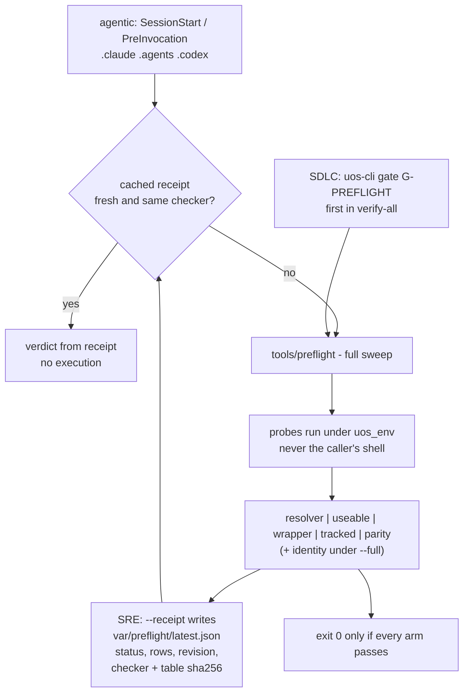

# 20260909-0553 — Preflight wired into SDLC, SRE & agentic processes (SC-NIX-DEVENV-001)

#fractal-l0 #fractal-l3 #fractal-l4 #fractal-l7 #zero-muda #km-triad #stamp-stpa #toolchain #zk-adr

**UOS / Toolchain / Journal** · [Cockpit](http://nas-1.tail55d152.ts.net:4100/) · [Planning](http://nas-1.tail55d152.ts.net:4100/planning) · [Wiki](http://nas-1.tail55d152.ts.net:4100/wiki) · [ZK](http://nas-1.tail55d152.ts.net:4100/zk) · [Checklist](http://nas-1.tail55d152.ts.net:4100/checklist)
**Live document:** [http://nas-1.tail55d152.ts.net:4100/files/docs/journal/20260909-0553-preflight-integration-into-sdlc-sre-and-agentic-processes-journal.md](http://nas-1.tail55d152.ts.net:4100/files/docs/journal/20260909-0553-preflight-integration-into-sdlc-sre-and-agentic-processes-journal.md)
**Predecessor:** [20260909-0425 preflight journal](http://nas-1.tail55d152.ts.net:4100/files/docs/journal/20260909-0425-tracked-and-verifiably-useable-tooling-preflight-journal.md)

Observed at `2026-09-09T03:53Z` (host NTP-synchronised, drift nominal).
Sa-plan: plan `uos-nix-devenv-toolchain-20260908`, worker `claude-opus5-nix-devenv`.

---

## 1. Scope & Trigger

Operator: *"fully harden, wire and integrate into sdlc, sre and agentic processes."*

The previous pass built a gate nobody was obliged to run. Scope here: make it unavoidable at three levels, and harden it so its verdict does not depend on who invoked it.

The first act of wiring found a broken toolchain that four passes of checking had missed.

## 2. Pre-State Assessment

| Property | State before |
|---|---|
| preflight invocation | manual only; nothing referenced it |
| SDLC gate | none — `verify-all` assumed a working toolchain |
| SRE record | none — verdicts vanished with the terminal |
| agentic hooks | three surfaces, all advisory text, no check |
| environment | preflight inherited the **caller's** shell |
| `npm` | reported `9.2.0`; believed healthy |

## 3. Execution Detail

1. **SDLC** — added `G-PREFLIGHT` to `tools/uos/src/main.gleam`. It **executes** the preflight through the existing bounded `uos_ffi:run_command` port (no shell) and names failing arms; wired to run **first** in `verify-all`.
2. **SRE** — `--receipt` writes `var/preflight/latest.json` plus a timestamped copy: `uos.preflight.v1` with status, per-arm rows, JJ revision, and the sha256 of *both* the checker and the resolver table. `--max-age N` answers freshness without executing anything.
3. **Agentic** — hooks on `.claude/settings.json`, `.agents/hooks.json`, `.codex/hooks.json`: cached receipt first, full sweep (~4.5 s) only when missing, stale, or written by a different checker.
4. **Determinism** — the preflight now calls `uos_env` before probing.
5. **Contract** — `SYNC-13` added to the tri-agent coordination contract.
6. Broke every new path on purpose.

## 4. Root Cause Analysis

**Why `npm` was believed healthy.** `toolchains/node-22` was hand-materialised with an **incomplete** npm: 41 bundled `node_modules` entries and no `semver`. `npm --version` never loads config, so it answered `9.2.0`; anything that loads config died with `Cannot find module 'semver/functions/satisfies'`. Present, self-identifying, non-working — the exact class invariant 10 exists to catch, and invisible to `test -x` *and* to a version probe. Nothing in the repository consumes node or npm, so nothing had ever exercised the broken path.

**Why the gate found it and the standalone run did not.** The preflight inherited the caller's environment. From my terminal npm took one path; as a child of the BEAM under `gleam run` it took another. **A check whose verdict depends on who invoked it is not a check.** Wiring it into a second caller is what exposed the difference — integration was itself the test.

**Why a receipt needs the checker's digest.** A cached PASS is evidence about *a specific checker examining a specific table*. Without both digests, editing either would inherit confidence from a run that never saw the current code.

## 5. Fix Taxonomy

| Class | Fix | Count |
|---|---|---|
| SDLC wiring | `G-PREFLIGHT` gate + first in `verify-all` | 2 |
| SRE wiring | `--receipt`, `--max-age`, digest-bound validity | 3 |
| Agentic wiring | hooks on three surfaces | 3 |
| Broken toolchain replaced | `nodejs_22` 22.23.2 / npm 10.9.8 from the locked nixpkgs | 1 |
| Probe corrected | `npm --version` → `npm config get cache` | 1 |
| Determinism | probe under `uos_env` | 1 |
| Reporting | gate names failing arms; verdict on stdout; failure detail 70→240 chars | 3 |
| Contract | `SYNC-13` | 1 |

## 6. Patterns & Anti-Patterns Discovered

**Anti-pattern — the environment-dependent check.** Verdict varied by caller, so "it passes" was true and useless. Fixed by probing under `uos_env` always.

**Anti-pattern — the tool with no consumer.** `node`/`npm` sat in the table with nothing using them, so nobody noticed the install was truncated. An unused entry is not free: it is an untested claim.

**Pattern — integration is a test.** Running the same check from a second caller found a real defect in minutes. Wiring is not paperwork.

**Pattern — cache with provenance.** A receipt carries the digest of the checker and the table it read; change either and the receipt is void.

**Pattern — probe the path that actually broke.** `--version` lied. `npm config get cache` exercises the config load where the missing `semver` bit.

## 7. Verification Matrix

| # | Check | Result |
|---|---|---|
| I1 | `uos-cli gate G-PREFLIGHT` | **PASS** — executes and reports five arms green |
| I2 | `bash tools/preflight` fast tier | **PASS 29/29** |
| I3 | `bash tools/preflight --full` after the node swap | **PASS 31/31**, identity arms green |
| I4 | `devenv test` profile-parity arm | **PASS** — profile still resolves the pinned `…-erlang-29.0.5` |
| I5 | node / npm from Nix | node **22.23.2**, npm **10.9.8**, `npm config get cache` → `/home/an/.npm` |
| I6 | `--receipt` | writes `latest.json` + timestamped copy with both digests and the JJ revision |
| I7 | `--max-age 3600` on a fresh receipt | **PASS (cached receipt, age 12s, 0 failures)** |
| I8 | `.claude` hook, cold start | `{"systemMessage":"UOS toolchain preflight: PASS (29 checks)"}` |
| I9 | `.claude` hook, warm | `PASS (cached receipt, age 0s, 0 failures)` |
| I10 | `.agents` / `.codex` hooks | valid JSON in each surface's own shape |
| I11 | JSON validity of all three hook files | **VALID** |

**Negative tests:**

| # | Path | Perturbation | Result |
|---|---|---|---|
| N8 | receipt freshness | `--max-age 1` vs a 12 s receipt | `receipt STALE (12s > 1s)`, exit 1 |
| N9 | receipt provenance | one byte appended to `tools/preflight` | `receipt INVALID -- checker changed since it was written`, exit 1; file restored, `diff`-verified |
| N10 | receipt absence | `latest.json` moved aside | `NO RECEIPT …`, exit 1 |
| N11 | hook failure path | `z3` → zero-byte executable, receipt cleared | hook emitted `FAIL (2 of 29 checks): [useable/z3 exit 0 but produced NO output (empty executable?)] [parity/ocaml-table preflight command did not run]` — two arms independently; restored, zero strays |

## 8. Files Modified

`tools/uos/src/main.gleam` · `tools/preflight` · `tools/lib/uos-toolchain.sh` · `tools/release_process.ml` · `flake.nix` · `devenv.nix` · `.claude/settings.json` · `.agents/hooks.json` · `.codex/hooks.json` · `contracts/rules/20260907-0653-tri-agent-coordination.md` · `governance/sources/20260908-2103-…json` · this journal · the mandate on four surfaces.

## 9. Architectural Observations

**Where the gate sits (ASCII, per `SC-DIAGRAM-001`):**

```text
  AGENTIC                SDLC                       SRE
  ----------------       --------------------       --------------------------
  SessionStart /         uos-cli gate G-PREFLIGHT   tools/preflight --receipt
  PreInvocation hook     (runs FIRST in verify-all)          |
  .claude .agents .codex          |                          v
        |                         |                 var/preflight/latest.json
        |  cached receipt?        |                 + <ts>-preflight.json
        |     yes -> verdict      |                 (status, rows, revision,
        |     no  -> full sweep   |                  checker+table sha256)
        v                         v                          |
        +----------> tools/preflight <---------- --max-age N reads it
                            |                     WITHOUT executing anything
                            v
             resolver | useable | wrapper | tracked | parity
                        (+ identity under --full)
                            |
                            v
                probes run under uos_env, never the caller's shell
                            |
                            v
                    exit 0 only if every arm passes

  A receipt is void the moment the checker or the resolver table changes.
```



**The gate is cheap enough to be unavoidable.** 4.5 s cold, near-zero warm. Anything slower would be routed around.

## 10. Remaining Gaps

1. **UNRUN** — `G-PREFLIGHT` is not yet a row in `governance/ev-manifest.tsv`; `doctor` does not cover it (`verify-all` does).
2. **BOUNDED** — Quint `agentic_coordination.qnt`: NoError at 1–2 steps, ~4× per step.
3. **OPEN** — the incomplete `toolchains/node-22` tree is out of the PATH and out of both tables, but still on disk. Untracked, so removal is an operator call.
4. **OPEN** — `/home/an/NAS-setup/.git`: empty non-repository outside UOS.
5. **BOUNDARY** — `os_util()` host utilities; `/usr/bin/timeout` here is **uutils**.
6. **BOUNDARY** — `cargo`/`rustc` hashes pin the rustup proxy shim.
7. **UNRUN** — effecting `release_process.ml` commands.
8. **NOT_ADMITTED** — nothing here is admitted.

## 11. Metrics Summary

| Metric | Before | After |
|---|---|---|
| Callers that run the preflight | 0 | **5** (gate, verify-all, 3 hooks) |
| Checks in the gate | 29 / 31 | **29 / 31** (unchanged; wiring, not scope) |
| Broken toolchains found by wiring | — | **1** (`npm`, incomplete since materialisation) |
| Verdict environment-dependent | yes | **no** |
| Durable verdict records | 0 | receipt + timestamped history |
| Guards with a negative test | 8 | **12** |
| Agent surfaces carrying the check | 0/3 | **3/3** |
| Rule surfaces in parity | 4/4 | **4/4** |

## 12. STAMP & Constitutional Alignment

**Controller:** the preflight gate, now with three invocation paths. **Controlled process:** all SDLC, SRE and agentic work assuming a working toolchain.

**UCAs addressed:**
- *Control action not provided:* the check existed but nothing invoked it. Mitigated at all three levels; proven by executing each hook command verbatim.
- *Provided with wrong information:* verdict varied by caller's environment. Mitigated by probing under `uos_env`; this UCA was **detected by** wiring, not by review.
- *Provided too late / stale:* a cached PASS outliving the code it examined. Mitigated by digest-binding; proven by N9.
- *Provided-but-ineffective:* `npm` present, self-identifying, non-working. Mitigated by replacement plus a probe of the path that actually failed.

**L0 alignment.** Two-key semantics held: every positive is paired with an observed failure mode. Zero-Muda — one broken toolchain removed from the resolution path, no new dependency beyond a pinned nixpkgs attribute. VCS discipline intact; receipts live under gitignored `var/`, so runtime state never enters source history. Every wiring point states explicitly that a PASS is toolchain evidence, not Sa-plan completion or admission authority.

## 13. Conclusion

The gate now runs whether or not anyone remembers it: first in `verify-all`, at every session start on three agent surfaces, and as a durable receipt an SRE loop can scrape. Its verdict no longer depends on which shell invoked it.

The result worth keeping is that **wiring found the bug**. `npm` had been broken since the day that tree was materialised, invisible to `test -x`, to `--version`, and to four passes of increasingly careful checking — and it surfaced within minutes of the check acquiring a second caller. Integration is not paperwork around a finished control; it is the test that tells you whether the control was measuring anything.

Nothing in this pass grants deployment or admission authority.

---

## Comprehensive verification checklist

Checked items refer to **this change package only**.

<details>
<summary>Domain 1 — Metadata, timestamp and Tailscale navigation</summary>

- [x] **CHK-01-TIME** — `20260909-0553-` prefix; host NTP-synchronised, drift nominal.
- [x] **CHK-02-TAIL** — Full clickable Tailscale FQDN links.
- [x] **CHK-03-FRACT** — Fractal tags `#fractal-l0 #fractal-l3 #fractal-l4 #fractal-l7`.
- [x] **CHK-04-KM** — Journal, predecessor, manifest, mandate and coordination contract cross-linked.

</details>

<details>
<summary>Domain 2 — Zero-Muda purity and storage safety</summary>

- [x] **CHK-05-MUDA** — A broken toolchain removed from the resolution path; no new dependency beyond a pinned nixpkgs attribute.
- [x] **CHK-06-GRAPH** — No foreign graph NIF introduced.
- [ ] **CHK-07-DRIVE** — Denied OS serial `25503L801736` interlock **UNRUN** (untouched).

</details>

<details>
<summary>Domain 3 — Testing Gold Standard and mathematical gates</summary>

- [x] **CHK-08-C1C8** — Not a UI change; 31/31 gate checks green.
- [ ] **CHK-09-MATH** — H / CCM / D_EA / ITQS **UNRUN**.
- [ ] **CHK-10-9MOD** — 9-modality protocol **UNRUN** for this change.
- [ ] **CHK-11-REGR** — UI regression suite **UNRUN**.

</details>

<details>
<summary>Domain 4 — Cross-language control and observability</summary>

- [x] **CHK-12-GLEAM** — `G-PREFLIGHT` implemented in the Gleam CLI on OTP 29 via the bounded `run_command` port.
- [x] **CHK-13-HERMES** — OCaml table parity arm green; `release_process.ml` table repointed with the parity guard proving it.
- [x] **CHK-14-ZIGVM** — Zig 0.16.0 executed; deterministic-execution evidence **UNRUN**.
- [x] **CHK-15-MAX** — Mojo 1.0.0 executed through the in-project pixi env; inference **UNRUN**.
- [ ] **CHK-16-OTEL** — Receipts carry UTC timestamps and revision, but no W3C trace/span context. **UNRUN**.

</details>

<details>
<summary>Domain 5 — Sovereign governance and standalone Jujutsu</summary>

- [ ] **CHK-17-SOV** — Tri-sovereign candidate review **OUTSTANDING**.
- [x] **CHK-18-JJ** — Standalone non-colocated Jujutsu; `jj` itself pinned; receipts under gitignored `var/`; zero native Git mutations.

</details>

**Previous:** [20260909-0425 preflight journal](http://nas-1.tail55d152.ts.net:4100/files/docs/journal/20260909-0425-tracked-and-verifiably-useable-tooling-preflight-journal.md) · **Next:** [Determinate Nix mandate](http://nas-1.tail55d152.ts.net:4100/files/.claude/rules/20260908-2142-determinate-nix-devenv-mandate.md)
**UOS footer:** `nas-1.tail55d152.ts.net:4100` · peer `vm-1.tail55d152.ts.net:8088` · OTP 29 pinned at `…-erlang-29.0.5` · Sa-plan is the sole execution authority; this journal grants no admission.
