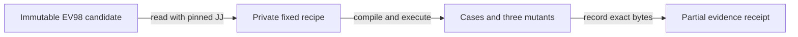

# EV98 native component campaign producer

Observed: 2026-09-09T06:08:03Z. Source candidate: `01c5a09547d7ae060ae72cd4af995bdf0e325cd7`; baseline: `f5f86e7e9841ae20da69f3d6c7fc44f1a2e50396`.

Tags: #fractal-l0 #fractal-l4 #zk-adr #zero-muda

Navigation: [Cockpit](http://nas-1.tail55d152.ts.net:4100/) · [Planning](http://nas-1.tail55d152.ts.net:4100/planning) · [Wiki](http://nas-1.tail55d152.ts.net:4100/wiki) · [Verification record](http://nas-1.tail55d152.ts.net:4100/files/docs/reviews/20260909-0603-ev-campaign-verification.json) · [Provenance contract](http://nas-1.tail55d152.ts.net:4100/files/contracts/rules/20260908-0912-provenance-integrity-contract.md).

## 1. Scope & Trigger

Parent PROGRAM authorized a bounded native EV98 evidence producer under Sa-plan `uos/ev-evidence-campaign/20260909`, task `PRODUCER`, worker `codex-ev-campaign-producer`, attempt 1. The producer executes the reviewed component recipe and records what ran. It does not admit EV98, deploy a mesh, run a formal solver, or write a sovereign decision. The task remains executing for independent review.

## 2. Pre-State Assessment

The prior native receipt validator checked caller-supplied evidence consistency. It did not select or execute an EV98 campaign. The first behavioral test called `observe WORKSPACE 98 REVISION` and failed because that command was absent. Existing EV98 component tests already contained 42 explicit cases; their counts alone did not establish how a future receipt was produced. The provenance ceiling remained EV93, with EV94–EV109 not admitted.

## 3. Execution Detail

### Authority and red observation

Risk preflight passed at 05:41:12Z before the canonical task claim. The actual claim returned attempt 1; the active check passed at 05:41:34Z. An earlier sandbox-limited chrony HOLD was preserved. No coordinator write used the parent's identity. A later 12-file active observation passed at 06:01:40Z with the same executing worker and attempt.

### Fixed recipe and native execution

Five production Gleam modules are read from an explicit full `commit_id(...)`, with regular-file metadata checks and root-relative file selectors. Five acceptance/runner files and the provenance contract must match the recipe's fixed digests. The private manifest contains only the three realized dependencies needed by these cases. The producer verifies their complete file set and pinned bytes, emits its own runner, compiles privately with Gleam, and executes OTP with two schedulers. Caller commands, policy paths, coverage lists and fabricated receipts are not inputs to `observe`.

### Mutations and review correction

Each control changes one exact production-source anchor in a fresh private package. Queue capacity changes from 256 to 257; physical health sample ordering reverses its operands; the deadman nonforward guard changes from `<=` to `==`. All three compile successfully. Each must exit 1 after its designated START marker, without its PASS marker, and with the named test and `gleeunit.equal` panic in the captured stack. A compile error, timeout, output overflow or unrelated process failure cannot satisfy the control.

Independent review found that the first implementation delegated candidate reads to workspace-relative JJ discovery. A private counterfeit reader actually ran in the red regression. The repaired producer invokes the exact hashed JJ executable through its sanitized environment. The same counterexample is then refused without running the counterfeit. Separating stdout and stderr also prevents JJ's private-configuration warning from becoming candidate source bytes. Both failures are preserved.

### Immutable build binding

Eight Dune project files were extracted from candidate `01c5a095...` into `/tmp/uos-campaign-candidate-source-01c5a095`, compared byte-for-byte with the frozen source, and built through the native adapter into `/tmp/uos-campaign-candidate-build`. The resulting executable ran the final campaign and CLI tests. The verification record binds source bytes, executable hashes, the recipe digest, 442 campaign artifacts and 37 subprocess observations. Exact text output and mutant-source copies are retained under timestamped review paths; private compiled binaries remain in `/tmp`.

## 4. Root Cause Analysis

The evidence gap arose because structural validation could check a stated denominator without choosing or executing it. Selecting a closed recipe moves that responsibility into executable code. The reader substitution defect came from reusing a convenience discovery API across a stronger trust boundary: hashing one JJ path did not prove that the reader used it. Exact executable selection and a counterfeit-reader regression now enforce that boundary. The first mutation classifier expected a different assertion spelling; the observed Gleam panic and target stack frame now define the checked control outcome.

## 5. Fix Taxonomy

The implementation uses a fixed acceptance recipe, immutable source extraction, pinned dependency and executable digests, bounded argv-only child execution, per-case start/return markers, and compiled mutation controls. Output streams retain separate byte identities. Shared deadlines and aggregate byte accounting cover candidate reads, captured output and final artifact rehashing. Report fields retain typed scope distinctions: `COMPONENT_OBSERVED`, `Formal_unavailable`, `Sovereign_pending`, `NOT_ESTABLISHED` full EV runtime, and authority `NONE`.

## 6. Patterns & Anti-Patterns Discovered

- Bind the executable actually used by a reader; a separately hashed preferred executable is insufficient.
- Count completed calls in a producer-owned runner and reject omitted, duplicate, reordered and extra markers.
- Require designated assertion failures in compiled mutants; a failed build supplies no mutation-control credit.
- Keep source extraction stdout separate from diagnostics and preserve both streams.
- Preserve negative runs and keep component observations separate from formal, runtime and sovereign authority.

An initial direct OCaml test compilation created local build byproducts; these were removed before the frozen candidate. The retained receipt-validator fixtures were moved to private `/tmp` storage after execution. No compiler cache or fixture is part of the source candidate.

## 7. Verification Matrix

| Observation | Actual result | Limit |
|---|---|---|
| Producer built from eight immutable Dune source files | PASS | Realized local toolchain; release closure not established |
| Closed EV98 component recipe | 42 executed, 42 passed | Private single-host model interaction |
| Compiled source mutation controls | 3 designated assertions rejected mutants | Three specific failure mechanisms |
| Native unit/process tests | 18 passed | Includes timeout, quota, signal, descendant and stream checks |
| CLI and artifact checks | 7 passed | Includes wrong EV/revision, extra policy, old acceptance and counterfeit reader |
| Existing receipt consistency regression | 67 passed | Synthetic consistency fixtures; no admission evidence |
| Counterfeit workspace reader before repair | Failed as intended | Counterfeit was actually invoked |
| Counterfeit workspace reader after repair | PASS | Counterfeit not invoked |
| Independent final review | Pending | Task stays executing |
| Full EV98 runtime, formal key, sovereign decision | Not established / unavailable / pending | No admission granted |

<details>
<summary>18-checkpoint verification structure</summary>

| Domain | Checkpoint | Status |
|---|---|---|
| Metadata and navigation | Timestamp prefix and observed clock | PASS |
| Metadata and navigation | Canonical Tailscale navigation | PASS |
| Metadata and navigation | Immutable source and evidence references | PASS |
| Purity and storage | Native OCaml and Gleam implementation | PASS |
| Purity and storage | No package download or external ingestion | PASS |
| Purity and storage | Private fixtures; no live DB or runtime mutation | PASS |
| Tests and mathematical gates | Behavioral red observation preserved | PASS |
| Tests and mathematical gates | Exact positive execution denominator | PASS |
| Tests and mathematical gates | Three real compiled mutation controls | PASS |
| Tests and mathematical gates | Formal mathematical key | UNAVAILABLE |
| Control and observability | Bounded subprocess and process-group cleanup | PASS |
| Control and observability | Source, dependency, tool and output digests | PASS |
| Control and observability | Full live multi-host behavior | NOT ESTABLISHED |
| Governance and JJ | Canonical task and active attempt | PASS |
| Governance and JJ | Owned sibling and frozen candidate | PASS |
| Governance and JJ | Independent final review | PENDING |
| Provenance | EV93 ceiling retained | PASS |
| Provenance | New sovereign admission | NOT GRANTED |

</details>

## 8. Files Modified

| Source file | Change |
|---|---|
| `tools/ev_receipts/ev98_recipe.ml` | Fixed source, acceptance, policy, case, dependency and tool bindings |
| `tools/ev_receipts/ev_campaign.ml` | Private staging, bounded execution, mutations and partial evidence report |
| `tools/ev_receipts/campaign_test.ml` | Behavioral CLI and actual native process falsifiers |
| `tools/ev_receipts/ev_receipt.ml` | Add closed `observe WORKSPACE 98 REVISION` command |
| `tools/ev_receipts/dune` | Build the producer recipe, library module and test executable |

Timestamped risk assessments, invocation receipts, exact output copies, the verification record and this journal accompany those five implementation files. Existing receipt validation and EV98 production modules are unchanged by this producer slice.

## 9. Architectural Observations

The native layer now owns an executable component evidence campaign. It can demonstrate finite observed behavior without manufacturing the missing authority transitions. The recipe and observation carrier remain separate from any future independently reviewed health-order formal projection.

```text
[Immutable EV98 candidate] --read with pinned JJ--> [Private fixed recipe]
[Private fixed recipe] --compile and execute--> [Cases and three mutants]
[Cases and three mutants] --record exact bytes--> [Partial evidence receipt]
```



## 10. Remaining Gaps

P1 admission prerequisites remain outside this slice: deployed multi-host observations, invocation/producer authentication, an applicable formal key, authenticated sovereign decisions and effect-time fencing. P2 limits include a responsive cooperative local host assumption, no protection against a hostile same-UID process, and no established reproducible compiler/runtime release closure. Private compiled artifacts are not durable deployment artifacts. P3 maintenance requires explicit review when the pinned acceptance files, dependencies, tools or mutation anchors change. Replay protection for an admission or effect consumer is not implemented here; this endpoint always performs a fresh observation and grants no effect authority.

## 11. Metrics Summary

Before the change, the CLI could validate receipt consistency but could not produce a fixed EV98 campaign. After the change, it observes 42 explicit calls, requires three compiled mutants to fail at designated assertions, and passes 18 native unit/process plus seven CLI checks. The recipe digest is `fe167923fa03f7e095dabc28cbadd98486fee1cddc0236e261ce9067f3ac0438`. Final campaign bindings cover 442 artifacts and 37 bounded invocations. All failure records remain available; none was relabeled as a pass.

## 12. STAMP & Constitutional Alignment

The four unsafe-control forms are addressed within the component evidence boundary: missing execution cannot receive a completion marker; incorrect coverage or candidate selection is refused; nonpassing or late subprocess results remain HOLD; repeated or extra markers cannot expand the denominator. Raw FMEA remains severity 5, occurrence 3, detectability 4 in the task assessment; the canonical priority is 2500. These estimates do not authorize effects. Sa-plan remains the execution authority, the parent's workspace lease remains distinct, and Codex does not impersonate AGY. No new EV identifier or admission record is written.

## 13. Conclusion

The frozen implementation supplies a reproducible recipe and fresh native component observations with candidate, source, tool, dependency, output and mutation bindings. It closes the tested reader-substitution failure and retains all red and intermediate failure evidence.

This is a bounded development result awaiting independent review. `PRODUCER` remains executing at attempt 1. EV98 remains not admitted; full runtime evidence, applicable formal evidence and sovereign approval must be supplied and evaluated separately.

Previous: [Provenance contract](http://nas-1.tail55d152.ts.net:4100/files/contracts/rules/20260908-0912-provenance-integrity-contract.md) · Next: [Verification record](http://nas-1.tail55d152.ts.net:4100/files/docs/reviews/20260909-0603-ev-campaign-verification.json).

UOS evidence footer: source-bound component observations only · authority NONE · EV93 admitted ceiling.
