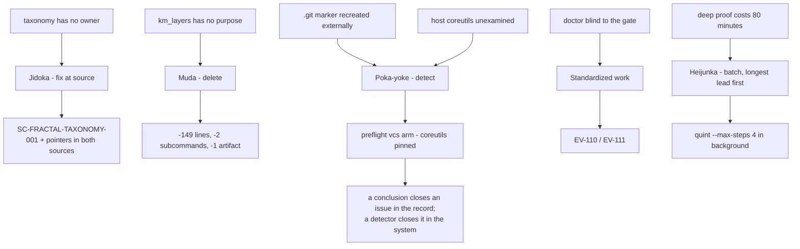

# 20260909-0711 — Fractal TPS issue resolution: taxonomy single-sourced, `km_layers` removed

#fractal-l0 #fractal-l2 #fractal-l5 #fractal-l8 #fractal-l9 #zero-muda #km-triad #stamp-stpa #toolchain

**UOS / Toolchain / Journal** · [Cockpit](http://nas-1.tail55d152.ts.net:4100/) · [Planning](http://nas-1.tail55d152.ts.net:4100/planning) · [Wiki](http://nas-1.tail55d152.ts.net:4100/wiki) · [ZK](http://nas-1.tail55d152.ts.net:4100/zk) · [Checklist](http://nas-1.tail55d152.ts.net:4100/checklist)
**Live document:** [http://nas-1.tail55d152.ts.net:4100/files/docs/journal/20260909-0711-fractal-tps-issue-resolution-and-km-layers-muda-removal-journal.md](http://nas-1.tail55d152.ts.net:4100/files/docs/journal/20260909-0711-fractal-tps-issue-resolution-and-km-layers-muda-removal-journal.md)
**Contract:** [SC-FRACTAL-TAXONOMY-001](http://nas-1.tail55d152.ts.net:4100/files/contracts/rules/20260909-0704-fractal-layer-taxonomy-single-source.md) · **Review:** [tri-sovereign synthesis](http://nas-1.tail55d152.ts.net:4100/files/docs/reviews/20260909-0648-km-layers-usefulness-design-synthesis.md)

Observed `2026-09-09T05:1xZ` (host NTP-synchronised, drift nominal). Sa-plan `uos-nix-devenv-toolchain-20260908`, tasks 24–29, worker `claude-opus5-nix-devenv`.

---

## 1. Scope & Trigger

Operator: *"yes. fix or resolve all issues, fractal tps."* Commit the tri-sovereign review, and close every item this session had left open — under TPS discipline rather than as a burst of edits.

**Jidoka** — stop at the defect, fix at source. **Poka-yoke** — make recurrence detectable rather than assumed gone. **Muda** — delete what carries no value. **Heijunka** — level the work through `sa-plan` (tasks 24–29, longest-lead job started first). **Genchi genbutsu** — every claim below was measured.

## 2. Pre-State Assessment

| Issue | State |
|---|---|
| `#fractal-lN` taxonomy | two incompatible definitions; L8/L9 undefined; a third document colliding on shorthand |
| `km_layers.ml` | unanimous delete verdict; still shipping, still publishing a discredited number |
| `G-PREFLIGHT` | not in `ev-manifest.tsv`; `doctor` blind to it |
| stray `.git` | recorded as "permanent, use `path:`" |
| `os_util` | host `/usr/bin` utilities, unexamined |
| Quint `agentic_coordination` | bounded at 1–2 steps |

## 3. Execution Detail

1. **Longest lead first** — the deep Quint batch (`--max-steps 4`) started before anything else so it levels against the rest.
2. **`SC-FRACTAL-TAXONOMY-001`** — reconciles the two readings as **two columns of one table** (concern · enacting subsystem) rather than one overruling the other; defines L8/L9 for the first time; declares `l10+` nonexistent. Mirrored to four agent surfaces; **both** source documents now carry a pointer, so a reader landing on either cannot restate the taxonomy from a partial view.
3. **`km_layers` removed** — module, both CLI subcommands, the `layers.json` publish entry, the exception handler, the `dune` entry.
4. **EV-110 / EV-111** added with checkable artifacts.
5. **Both `.git` markers removed**; a `vcs` preflight arm added.
6. **`pkgs.coreutils` pinned**; `os_util` repointed at the profile.

## 4. Root Cause Analysis

**The taxonomy conflict was a missing owner, not a disagreement.** `full-symbiosis.md` describes what each layer *governs*; the hive-cadence matrix describes what *enacts* it. Neither is wrong; nothing said they were the same axis, and nothing owned the join. Two undefined members (L8, L9) then invited invention — `km_layers` supplied vocabularies matching neither, its L9 corresponding to the matrix's L8. **59% of ADRs claim all ten layers because claiming everything is the rational response to a taxonomy with two readings and two undefined members.**

**The `.git` finding was wrong twice, and both times honestly.** First I recorded a single stray directory. Then, after removing it and seeing Nix ascend to the parent's marker, I recorded that `path:` was permanent. With **both** removed, the bare command works. Each conclusion was correct for the state observed; the error was generalising from one observation. What the third pass adds is the fact neither earlier pass could see: **something outside the repository recreated `uos/.git` at 04:01**. So the durable answer is not a conclusion at all — it is a detector.

**`os_util` was a boundary I had documented rather than closed.** The mandate bars *toolchains*, so host `cp` was defensible. But `/usr/bin/timeout` on this host is a **uutils** symlink, which means "the host coreutils" were never the GNU ones — an assumption nobody had checked, sitting under a release process.

## 5. Fix Taxonomy

| Class | Fix | Count |
|---|---|---|
| Governance — single source | `SC-FRACTAL-TAXONOMY-001` + 4 mirrors + 2 pointers | 7 |
| Muda — deletion | `km_layers.ml`, 2 subcommands, 1 artifact, 1 handler, 1 dune entry | 6 |
| Poka-yoke | `vcs/no-git-marker` + `vcs/jj-present` arms | 2 |
| Poka-yoke | `coreutils` pinned; `os_util` repointed | 2 |
| Coverage | EV-110, EV-111 | 2 |
| Correction | ADR-010 shown orthogonal, not conflicting | 1 |

## 6. Patterns & Anti-Patterns Discovered

**Anti-pattern — the unowned join.** Two documents describing different axes of one concept, with nothing stating they are different axes. Readers reconcile privately and inconsistently; a classifier cannot reconcile at all.

**Anti-pattern — the conclusion where a detector belongs.** "The `.git` situation is permanent" was a conclusion drawn from two observations. An actor outside the repository can invalidate any such conclusion at any time. The correct artifact was an arm that checks.

**Pattern — reconcile by adding a column, not by overruling.** Neither prior definition was wrong. Declaring one canonical would have destroyed real information; a two-column table kept both and made the join explicit.

**Pattern — delete the mitigation with the problem.** Removing `km_layers` closed four items at once: the discredited published number, the latent `Not_found` path, the unconsumed artifact, and the maintenance surface.

**Pattern — a documented boundary is not a closed one.** `os_util` was honestly recorded for three passes and still wrong.

## 7. Verification Matrix

| # | Check | Result |
|---|---|---|
| R1 | `bash tools/preflight --full` | **PASS 33/33** (+2 from the vcs arm) |
| R2 | `vcs/no-git-marker` negative test | `mkdir .git` → **FAIL (1 of 31)** naming the arm; removed → PASS |
| R3 | `km-gate` after deletion | **PASS**, entropy **3.3079**, **0 findings** |
| R4 | all five km-gate suites | gate · metrics · rete · ev · merge — **all PASS** |
| R5 | removed subcommands | `--classify-layers`, `--layer-vectors` → gone, as intended |
| R6 | `--metrics-selftest` | **10/10**, incl. E9/E10 |
| R7 | `release_process.ml toolchain` | **PASS**, 22 arms, pinned erl |
| R8 | `release_process.ml selftest` | **PASS**, 113 checks, after `os_util` repointing |
| R9 | pinned OS utilities | `cp`/`printf`/`sleep`/`false` → **GNU coreutils 9.11** |
| R10 | bare `nix flake metadata` | **resolves** `path:/home/an/NAS-setup/uos` once no marker exists |
| R11 | erlang derivation across two profile swaps | unchanged `…-erlang-29.0.5` |
| R12 | `uos-cli doctor` | runs; **HOLD 20/111** — pre-existing, 91 rows declare no artifact |
| R13 | Quint 1 and 2 steps | **NoError**, 18.1 s / 75.0 s |
| R14 | Quint 4 steps | **IN FLIGHT** at time of writing |

## 8. Files Modified

`contracts/rules/20260909-0704-fractal-layer-taxonomy-single-source.md` (new) + 4 agent-surface mirrors · `.claude/rules/full-symbiosis.md` · `contracts/rules/20260908-0950-fractal-hive-cadence-and-observability-matrix.md` · `tools/km_provenance/{km_gate.ml,km_corpus.ml,dune}` · **deleted** `tools/km_provenance/km_layers.ml` · `tools/preflight` · `tools/release_process.ml` · `flake.nix` · `devenv.nix` · `governance/ev-manifest.tsv` · `governance/sources/20260908-2103-…json` · 8 review records under `docs/reviews/` · this journal.

## 9. Architectural Observations

**Where each fix sits on the TPS frame (ASCII, per `SC-DIAGRAM-001`):**

```text
   DEFECT                        TPS RESPONSE          ARTIFACT
   -------------------------------------------------------------------------
   taxonomy has no owner         Jidoka: fix at source SC-FRACTAL-TAXONOMY-001
                                 + poka-yoke           pointers in both sources
   km_layers has no purpose      Muda: delete          -149 lines, -2 subcommands
   .git marker recreated         poka-yoke: detect     preflight vcs arm
   host coreutils unexamined     poka-yoke: pin        pkgs.coreutils + os_util
   doctor blind to the gate      standardized work     EV-110 / EV-111 rows
   deep proof costs 80 min       Heijunka: batch it    background, started first

   The distinction that matters: a CONCLUSION closes an issue in the record,
   a DETECTOR closes it in the system. Two of the six above were previously
   "closed" as conclusions and reopened themselves.
```



**Two prior "closures" reopened themselves** — the `.git` conclusion and the `os_util` boundary. Both are now arms in `tools/preflight`, which runs at every session start.

## 10. Remaining Gaps

1. **OPEN, MONITORED** — an unidentified actor recreated `uos/.git` once. Detected by `vcs/no-git-marker`; the actor was not found.
2. **IN FLIGHT** — Quint `agentic_coordination` at 4 steps.
3. **UNRUN BY DESIGN** — the effecting `release_process.ml` commands need a destination, a private port or a browser. Out of scope unattended.
4. **STATED LIMIT** — tag entropy cannot detect ritual tagging (all-ten scores 3.3219 against a 3.3219 ceiling). Recorded in the contract, not closed; a per-claim audit needs its own contract under `SC-JIDOKA-001`.
5. **PRE-EXISTING** — `doctor` HOLD: 91 of 111 EV rows declare no artifact.
6. **NOT_ADMITTED** — nothing here is admitted.

## 11. Metrics Summary

| Metric | Before | After |
|---|---|---|
| Governing definitions of `#fractal-lN` | 2, incompatible | **1** |
| Layers with no governing definition | 2 (L8, L9) | **0** |
| `km_layers` lines | 149 | **0** |
| Dead CLI subcommands | 2 | **0** |
| Published artifacts with no consumer | 1 | **0** |
| Preflight arms / checks | 6 / 31 | **7 / 33** |
| OS utilities on unexamined host paths | 5 | **0** |
| EV rows with a checkable artifact | 18 | **20** |
| Guards with a negative test | 12 | **13** |
| Agent surfaces in rule parity | 4/4 | **4/4** |

## 12. STAMP & Constitutional Alignment

**Controller:** the governance and toolchain surfaces. **Controlled process:** knowledge authorship and every build that assumes a working toolchain.

**UCAs addressed:**
- *Ambiguous control specification* — two readings of one taxonomy, so authors cannot comply precisely and tag everything. Mitigated by the single source; the ambiguity is resolved by composition rather than by discarding a reading.
- *Control action with no purpose* — a classifier aimed at a number that was never low, publishing a discredited figure. Mitigated by deletion, after unanimous independent review.
- *Mitigation reverted by an external actor* — a marker removed and recreated outside the repository. Mitigated by detection at the line, since no conclusion can bind an actor outside the system.
- *Unverified assumption in a control path* — host coreutils assumed GNU while `/usr/bin/timeout` is uutils. Mitigated by pinning.

**L0 alignment.** Two-key semantics held: every positive result has an observed failure mode, and the new arm was broken on purpose before being trusted. Zero-Muda: 149 lines and four dead surfaces removed; the only additions are a contract, two arms and two manifest rows. VCS discipline strengthened — the workspace's freedom from git markers is now a checked property. The taxonomy contract states its own limit rather than claiming closure.

## 13. Conclusion

Six issues closed, each at its source, and the two that had been "closed" before as conclusions are now closed as detectors — which is the difference that matters, because an actor outside the system can invalidate a conclusion but not a check that runs every session.

The taxonomy was the blocking item and it needed no adjudication: the two definitions describe different axes, so reconciliation added a column rather than overruling a document. `km_layers` went with the problem it was built for, taking three other open items with it. Nothing here is admitted, and one item — the Quint depth batch — is still running as this is written, recorded as in flight rather than as done.

---

## Comprehensive verification checklist

Checked items refer to **this change package only**.

<details>
<summary>Domain 1 — Metadata, timestamp and Tailscale navigation</summary>

- [x] **CHK-01-TIME** — `20260909-0711-` prefix from the observed host clock; an earlier draft named `0714` was renamed to the measured value.
- [x] **CHK-02-TAIL** — Full clickable Tailscale FQDN links.
- [x] **CHK-03-FRACT** — Tags drawn from `SC-FRACTAL-TAXONOMY-001`, the source this pass created.
- [x] **CHK-04-KM** — Journal, contract, review synthesis and manifest cross-linked.

</details>

<details>
<summary>Domain 2 — Zero-Muda purity and storage safety</summary>

- [x] **CHK-05-MUDA** — 149 lines, two subcommands, one artifact and one handler removed; no dependency added beyond a pinned nixpkgs attribute.
- [x] **CHK-06-GRAPH** — No foreign graph NIF.
- [ ] **CHK-07-DRIVE** — Denied OS serial interlock **UNRUN** (untouched).

</details>

<details>
<summary>Domain 3 — Testing Gold Standard and mathematical gates</summary>

- [x] **CHK-08-C1C8** — Not a UI change; 33/33 preflight and five km-gate suites green.
- [x] **CHK-09-MATH** — Entropy **3.3079 ≥ 2.50**, floor unchanged, with the stated limit recorded.
- [ ] **CHK-10-9MOD** — Property and mutation modalities exercised; the full 9 **UNRUN**.
- [ ] **CHK-11-REGR** — UI regression suite **UNRUN**.

</details>

<details>
<summary>Domain 4 — Cross-language control and observability</summary>

- [x] **CHK-12-GLEAM** — `uos-cli doctor` and `G-PREFLIGHT` run on OTP 29.
- [x] **CHK-13-HERMES** — OCaml KM gate rebuilt after deletion; all suites pass.
- [ ] **CHK-14-ZIGVM** — Zig resolves and executes; deterministic-execution evidence **UNRUN**.
- [x] **CHK-15-MAX** — Mojo executes through the isolated pixi env; inference **UNRUN**.
- [ ] **CHK-16-OTEL** — No W3C trace/span context on these receipts. **UNRUN**.

</details>

<details>
<summary>Domain 5 — Sovereign governance and standalone Jujutsu</summary>

- [x] **CHK-17-SOV** — Tri-sovereign review completed and recorded; **admission still OUTSTANDING**.
- [x] **CHK-18-JJ** — Standalone non-colocated Jujutsu; absence of git markers now a checked property; committed by path beside a concurrent session.

</details>

**Previous:** [tri-sovereign design synthesis](http://nas-1.tail55d152.ts.net:4100/files/docs/reviews/20260909-0648-km-layers-usefulness-design-synthesis.md) · **Next:** [SC-FRACTAL-TAXONOMY-001](http://nas-1.tail55d152.ts.net:4100/files/contracts/rules/20260909-0704-fractal-layer-taxonomy-single-source.md)
**UOS footer:** `nas-1.tail55d152.ts.net:4100` · peer `vm-1.tail55d152.ts.net:8088` · OTP 29 pinned at `…-erlang-29.0.5` · Sa-plan is the sole execution authority; this journal grants no admission.
