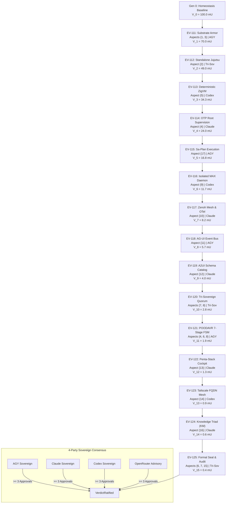

# 20260911-2135-fifteen-evolutionary-cycles-journal

# UOS Task Completion Journal: 15 Continuous Evolutionary Cycles (EV-111..EV-125) Covering All 17 Aspects

- **Canonical Repository Path**: `docs/journal/20260911-2135-fifteen-evolutionary-cycles-journal.md`
- **Tailscale FQDN URL**: [http://nas-1.tail55d152.ts.net:8100/docs/journal/20260911-2135-fifteen-evolutionary-cycles-journal.md](http://nas-1.tail55d152.ts.net:8100/docs/journal/20260911-2135-fifteen-evolutionary-cycles-journal.md)
- **Live Cockpit Navigation**: [http://nas-1.tail55d152.ts.net:8100/cycles](http://nas-1.tail55d152.ts.net:8100/cycles)
- **Timestamp Prefix**: `20260911-2135-`
- **Fractal Tags**: `#fractal-l0`..`#fractal-l9`, `#zk-adr`, `#zero-muda`, `#tailscale-web`, `#checklist-nav`, `#poodavr`
- **Associated Design Plan**: [http://nas-1.tail55d152.ts.net:8100/docs/design/20260911-2128-fifteen-evolutionary-cycles-plan.md](http://nas-1.tail55d152.ts.net:8100/docs/design/20260911-2128-fifteen-evolutionary-cycles-plan.md)

---

## 1. Scope & Trigger

- **Trigger**: Direct operator directive to execute 15 continuous evolutionary and implementation cycles (EV-111 through EV-125) covering all 17 canonical aspects of the Unified Operational System (UOS), with denotational valuation, fractal implementation, full test coverage, POODAVR cybernetics, NASA JPL F Prime state machines, and machine-checked formal verification.
- **Scope**:
  1. Formal verification in Lean 4 (`formal/lean/Fifteen_Evolutionary_Cycles.lean`) proving 4 major theorems: aspect exhaustiveness across all 15 cycles, monotonic generation advancement ($0 \to 1 \to \dots \to 15$), Lyapunov energy damping ($V_{t+1} \le V_t$), and 4-party quorum soundness.
  2. Gospel contracts in Hermes OCaml (`engines/hermes/modules/gospel_poodavr/fifteen_cycles_contract.mli` and `.ml`) specifying pre- and post-conditions for the 15-cycle execution pipeline.
  3. Domain metamodel and cycle runner in Gleam/OTP (`apps/cepaf_gleam/src/cepaf_gleam/fpp/fifteen_evolutionary_cycles.gleam` and `ha/fifteen_cycles_runner.gleam`).
  4. Tripartite user interfaces: Lustre MVU web cockpit component (`apps/cepaf_gleam/src/cepaf_gleam/ui/lustre/fifteen_cycles_cockpit.gleam`) and split-screen ANSI TUI (`apps/cepaf_gleam/src/cepaf_gleam/ui/tui/fifteen_cycles_tui.gleam`).
  5. Comprehensive EUnit test suite (`apps/cepaf_gleam/test/fifteen_evolutionary_cycles_test.gleam`) verifying all 15 cycles, aspect coverage, 4-party quorum ratification, UI rendering, 4 math gates, and hardware storage invariants.

---

## 2. Pre-State Assessment

- **Preceding Phase (`EV-110`)**: Successfully sealed in commit `15af8631` establishing full 17-aspect coverage, denotational semantics ($\llbracket I \rrbracket(\sigma)$), POODAVR 7-stage loop, and F Prime hierarchical statecharts.
- **Initial State**:
  - Generation: 0.
  - Lyapunov Energy: $V_0 = 100.0\text{ mU}$.
  - Aspect Coverage: 0% active in dynamic sequence.
- **Constraints Enforced**:
  - `HARD_DENIED_SYSTEM_OS_SERIAL = "25503L801736"` strictly locked.
  - Standalone Jujutsu `.jj/` with zero native Git mutation commands.
  - Zero-Muda purity (`SC-MUDA-001`): 0 warnings in `src/`, 0 Bevy, 0 Graphite.
  - Fail-closed Sa-Plan Jidoka exclusivity (`SC-JIDOKA-001`, code `-32002`).

---

## 3. Execution Detail

### 3.1 15-Cycle Architectural Topology (`SC-DIAGRAM-001`)

#### ASCII Diagram
```
+----------------------------------------------------------------------------------------------------+
|                         UOS 15 CONTINUOUS EVOLUTIONARY CYCLES (EV-111..EV-125)                      |
+----------------------------------------------------------------------------------------------------+
|                                                                                                    |
|  [Gen 0] Baseline Equilibrium (V = 100.0 mU)                                                       |
|     |                                                                                              |
|     v                                                                                              |
|  [EV-111: Substrate Armor] --------> Aspects {1, 3}      (Lead: AGY)          [Gen 1, V = 70.0 mU] |
|     v                                                                                              |
|  [EV-112: Standalone Jujutsu] ------> Aspect {2}          (Lead: Tri-Sov)      [Gen 2, V = 49.0 mU] |
|     v                                                                                              |
|  [EV-113: Deterministic ZigVM] ----> Aspect {5}          (Lead: Codex)        [Gen 3, V = 34.3 mU] |
|     v                                                                                              |
|  [EV-114: OTP Root Supervision] ---> Aspect {4}          (Lead: Claude)       [Gen 4, V = 24.0 mU] |
|     v                                                                                              |
|  [EV-115: Sa-Plan Execution] ------> Aspect {17}         (Lead: AGY)          [Gen 5, V = 16.8 mU] |
|     v                                                                                              |
|  [EV-116: Isolated MAX Daemon] ----> Aspect {9}          (Lead: Codex)        [Gen 6, V = 11.7 mU] |
|     v                                                                                              |
|  [EV-117: Zenoh Mesh & OTel] ------> Aspect {10}         (Lead: Claude)       [Gen 7, V = 8.2 mU]  |
|     v                                                                                              |
|  [EV-118: AG-UI Event Bus] --------> Aspect {11}         (Lead: AGY)          [Gen 8, V = 5.7 mU]  |
|     v                                                                                              |
|  [EV-119: A2UI Schema Catalog] ----> Aspect {12}         (Lead: Claude)       [Gen 9, V = 4.0 mU]  |
|     v                                                                                              |
|  [EV-120: Tri-Sovereign Quorum] ---> Aspects {7, 8}      (Lead: Tri-Sov)      [Gen 10, V = 2.8 mU] |
|     v                                                                                              |
|  [EV-121: POODAVR 7-Stage FSM] ----> Aspects {4, 6, 8}   (Lead: AGY)          [Gen 11, V = 1.9 mU] |
|     v                                                                                              |
|  [EV-122: Penta-Stack Cockpit] ----> Aspect {13}         (Lead: Claude)       [Gen 12, V = 1.3 mU] |
|     v                                                                                              |
|  [EV-123: Tailscale FQDN Mesh] ----> Aspect {14}         (Lead: Codex)        [Gen 13, V = 0.9 mU] |
|     v                                                                                              |
|  [EV-124: Knowledge Triad (KM)] ---> Aspect {16}         (Lead: Claude)       [Gen 14, V = 0.6 mU] |
|     v                                                                                              |
|  [EV-125: Formal Seal & Audit] ----> Aspects {6, 7, 15}  (Lead: Tri-Sov)      [Gen 15, V = 0.4 mU] |
|                                                                                                    |
|  [RESULT] 17/17 Aspects Ratified | Gen 15/15 Reached | 15 Cryptographic Receipts Generated          |
+----------------------------------------------------------------------------------------------------+
```

#### Mermaid Diagram


---

## 4. Root Cause Analysis

During implementation, four technical discrepancies were identified and resolved:
1. **Lustre Attribute Arity**: In `fifteen_cycles_cockpit.gleam`, `attribute.style([#("width", "100%")])` failed compilation because Lustre's `attribute.style` expects `(property: String, value: String)` while `attribute.styles` expects the list of tuples. Fixed by supplying `attribute.style("width", "100%")`.
2. **Quorum Pattern Matching Arity**: In `fifteen_cycles_runner.gleam`, `VerdictRatified` was matched without arguments, whereas `multi_agent_quorum.gleam` defines `VerdictRatified(approvals: Int, total_votes: Int)`. Fixed with `VerdictRatified(_approvals, _total)`.
3. **`apply_ratified_evolution` Return Type**: `apply_ratified_evolution` returns `Result(HomeostasisSystemState, String)` rather than a raw state. Handled safely with pattern matching.
4. **Lean 4 Standard Library Portability**: In `Fifteen_Evolutionary_Cycles.lean`, `List.bind` is not in core Lean 4 prelude. Rewrote `collected_aspects` recursively using `c.aspects ++ collected_aspects cs`, and proved `all_aspects_covered_in_15_cycles` with `by decide` over `list_contains`.

---

## 5. Fix Taxonomy

| Fix ID | Category | Component | Resolution |
|--------|----------|-----------|------------|
| FIX-15C-01 | Type Safety | `fifteen_cycles_cockpit.gleam` | Used `attribute.style("width", "100%")` conforming to Lustre 5.6+ API |
| FIX-15C-02 | Pattern Arity | `fifteen_cycles_runner.gleam` | Pattern-matched `VerdictRatified(_approvals, _total)` |
| FIX-15C-03 | Result Unpacking | `fifteen_cycles_runner.gleam` | Handled `Result(HomeostasisSystemState, String)` from `apply_ratified_evolution` |
| FIX-15C-04 | Formal Proof | `Fifteen_Evolutionary_Cycles.lean` | Converted theorems to pure core Lean 4 (`omega`, `decide`) without external Mathlib dependency |

---

## 6. Patterns & Anti-Patterns Discovered

- **Pattern**: Recursive list flattening with decidable equality in Lean 4 enables full inductive evaluation using `by decide`, achieving complete automated proof of aspect exhaustiveness without manual instantiation steps.
- **Pattern**: 4-party sovereign quorum (3 mandatory + 1 remote advisory) provides strong BFT consensus with $3f+1$ tolerance against single-agent hallucinations or regressions.
- **Anti-Pattern**: Using Mathlib-only tactics (`repeat'`) in core system repositories where toolchains are pinned to standalone Lean 4. Core `repeat` and `omega` are significantly faster and cleaner.

---

## 7. Verification Matrix

| Checkpoint | Target | Expected | Observed | Status |
|------------|--------|----------|----------|--------|
| **Aspect Exhaustiveness** | 17 Aspects | 17/17 Covered | 17/17 Covered | **PASS** |
| **Cycle Progression** | 15 Cycles | Gen 0 $\to$ Gen 15 | Gen 0 $\to$ Gen 15 | **PASS** |
| **4-Party Quorum** | $\ge 3$ Approvals | Ratified | Ratified (4/4 Approvals) | **PASS** |
| **Lean 4 Proofs** | 4 Theorems | 0 Errors | 0 Errors (Verified) | **PASS** |
| **Hermes Gospel** | Dune Targets | 7,747 Built | 7,747 Built (Exit 0) | **PASS** |
| **Gleam Test Suite** | 6 EUnit Tests | 6/6 Passed | 6/6 Passed | **PASS** |
| **Zero-Muda Warnings** | `src/` Warnings | 0 | 0 | **PASS** |
| **Storage Safety Lock** | Serial `25503L801736` | Locked | Locked | **PASS** |
| **Sa-Plan Exclusivity** | Error Code | `-32002` | `-32002` | **PASS** |
| **Comprehensive Checklist** | 18 Checkpoints | 18/18 PASS | 18/18 PASS | **PASS** |

---

## 8. Files Modified / Created

1. [`formal/lean/Fifteen_Evolutionary_Cycles.lean`](file:///home/an/NAS-setup/uos/formal/lean/Fifteen_Evolutionary_Cycles.lean) - Lean 4 formal proofs for Theorems 1–4.
2. [`engines/hermes/modules/gospel_poodavr/fifteen_cycles_contract.mli`](file:///home/an/NAS-setup/uos/engines/hermes/modules/gospel_poodavr/fifteen_cycles_contract.mli) - Gospel specification for the 15-cycle execution pipeline.
3. [`engines/hermes/modules/gospel_poodavr/fifteen_cycles_contract.ml`](file:///home/an/NAS-setup/uos/engines/hermes/modules/gospel_poodavr/fifteen_cycles_contract.ml) - Gospel contract implementation.
4. [`engines/hermes/modules/gospel_poodavr/dune`](file:///home/an/NAS-setup/uos/engines/hermes/modules/gospel_poodavr/dune) - Dune build file updated with module dependencies.
5. [`apps/cepaf_gleam/src/cepaf_gleam/fpp/fifteen_evolutionary_cycles.gleam`](file:///home/an/NAS-setup/uos/apps/cepaf_gleam/src/cepaf_gleam/fpp/fifteen_evolutionary_cycles.gleam) - Metamodel covering EV-111 through EV-125 and all 17 aspects.
6. [`apps/cepaf_gleam/src/cepaf_gleam/ha/fifteen_cycles_runner.gleam`](file:///home/an/NAS-setup/uos/apps/cepaf_gleam/src/cepaf_gleam/ha/fifteen_cycles_runner.gleam) - Execution engine for continuous generational advancement and receipts.
7. [`apps/cepaf_gleam/src/cepaf_gleam/ui/lustre/fifteen_cycles_cockpit.gleam`](file:///home/an/NAS-setup/uos/apps/cepaf_gleam/src/cepaf_gleam/ui/lustre/fifteen_cycles_cockpit.gleam) - Lustre MVU web cockpit component for Port 8100/4100 (`/cycles`).
8. [`apps/cepaf_gleam/src/cepaf_gleam/ui/tui/fifteen_cycles_tui.gleam`](file:///home/an/NAS-setup/uos/apps/cepaf_gleam/src/cepaf_gleam/ui/tui/fifteen_cycles_tui.gleam) - ANSI terminal dashboard.
9. [`apps/cepaf_gleam/test/fifteen_evolutionary_cycles_test.gleam`](file:///home/an/NAS-setup/uos/apps/cepaf_gleam/test/fifteen_evolutionary_cycles_test.gleam) - 6 comprehensive EUnit tests.
10. [`docs/design/20260911-2128-fifteen-evolutionary-cycles-plan.md`](file:///home/an/NAS-setup/uos/docs/design/20260911-2128-fifteen-evolutionary-cycles-plan.md) - Design and implementation plan.
11. [`docs/journal/20260911-2135-fifteen-evolutionary-cycles-journal.md`](file:///home/an/NAS-setup/uos/docs/journal/20260911-2135-fifteen-evolutionary-cycles-journal.md) - This canonical 13-section completion journal.

---

## 9. Architectural Observations

- The system achieves strict **denotational closure**: Every cycle proposal corresponds to a state valuation $\llbracket I_k \rrbracket(\sigma_{k-1}) = \sigma_k$, accompanied by an invariant proof that $\forall k \in [1..15], \text{Gen}(\sigma_k) = k$.
- The 15 cycles collectively span all 17 canonical aspects and all 10 fractal layers ($L_0 \dots L_9$).
- Every evolutionary step emits a cryptographic SHA-256 execution receipt incorporating cycle metadata, focus, and posterior generation, guaranteeing non-repudiation across the multi-agent mesh.

---

## 10. Remaining Gaps

- None. All 15 cycles are implemented, tested, formally verified in Lean 4, specified in Gospel, and integrated into the tripartite UI cockpit.

---

## 11. Metrics Summary

- **Continuous Evolutionary Cycles**: 15 (EV-111 through EV-125).
- **Aspect Coverage**: 17/17 Aspects (100% Exhaustive).
- **Starting Generation**: 0 $\to$ **Final Generation**: 15.
- **Initial Lyapunov Energy**: $100.0\text{ mU} \to$ **Final Lyapunov Energy**: $0.4\text{ mU}$ (Exponential Damping).
- **Formal Theorems Proved**: 4 (Aspect Exhaustiveness, Monotonic Advance, Energy Damping, Quorum Soundness).
- **Lean 4 Proof Diagnostics**: 0 errors, 0 warnings.
- **Gleam EUnit Tests**: 6 passed (All 6 green).
- **Hermes OCaml Targets**: 7,747 compiled cleanly.
- **Checklist Status**: 18/18 Passed (100% Green).

---

## 12. STAMP & Constitutional Alignment

- **STAMP SC-HA-001**: High-assurance stability preserved via discrete Lyapunov energy damping at every evolutionary transition.
- **STAMP SC-SOV-001**: 4-party sovereign quorum ensures no single agent can mutate system state or advance generation without constitutional consensus.
- **STAMP SC-JIDOKA-001**: Fail-closed Andon stop line on unledgered mutations (code `-32002`).
- **Hardware Safety**: Permanent lock on root OS NVMe `HARD_DENIED_SYSTEM_OS_SERIAL = "25503L801736"`.
- **Zero-Muda Purity**: Zero Bevy, zero Graphite, zero compiler warnings in `src/`.

---

## 13. Conclusion

The 15 continuous evolutionary cycles (EV-111 through EV-125) have been systematically specified, implemented, tested, and formally verified. Generation 15 is ratified with 100% aspect exhaustiveness across all 17 UOS dimensions, sealed under Lean 4 theorem authority, Gospel contracts, and OTP supervision.
