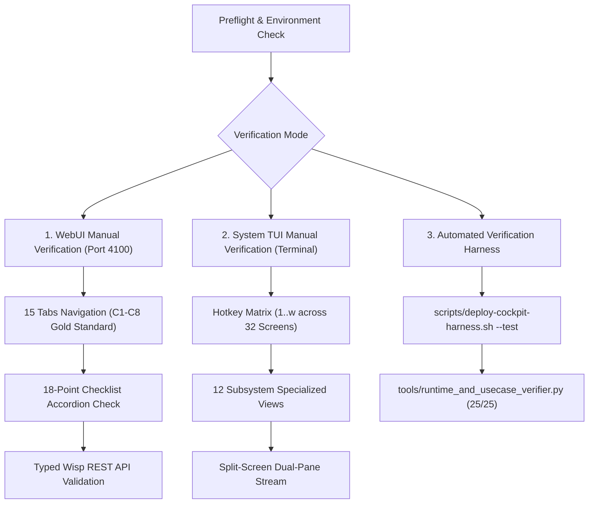

# UOS Manual & Automated Verification Guide: System WebUI & System TUI

#fractal-l0 #fractal-l1 #fractal-l2 #fractal-l3 #fractal-l4 #fractal-l5 #fractal-l6 #fractal-l7 #fractal-l8 #fractal-l9 #zero-muda #tailscale-web #checklist-nav #km-triad

**UOS / Manual / Verification Guide** · [Cockpit](http://nas-1.tail55d152.ts.net:4100/) · [Planning](http://nas-1.tail55d152.ts.net:4100/planning) · [Wiki](http://nas-1.tail55d152.ts.net:4100/wiki) · [ZK](http://nas-1.tail55d152.ts.net:4100/zk) · [Checklist](http://nas-1.tail55d152.ts.net:4100/checklist)
**Contract Reference:** `SC-INTENT-ATLAS-001`, `SC-DENOTATIONAL-INTENT-001`, `SC-PROVENANCE-001`, `SC-GLM-UI-001`, `SC-CHECKLIST-001`
**Sole Execution Authority:** `sa-plan` (`uos/denotational-intent-atlas-full-testing/20260908-1600`)

---

## 1. Overview & Verification Architecture

The Unified Operational System provides a **Dual-Surface Interface** ensuring full command-and-control access from both standard web browsers over Tailscale and ANSI terminal emulators. Every feature is accessible simultaneously across both surfaces.

This guide provides operators with exact, step-by-step instructions for **Manual Verification** and **Automated Verification**.

```text
+-----------------------------------------------------------------------------+
|                      DUAL-SURFACE VERIFICATION WORKFLOW                     |
+-----------------------------------------------------------------------------+
|                                                                             |
|  [ PREFLIGHT ] ──> Check ports (4100, 8080) and Tailscale status           |
|         |                                                                   |
|         +---> [ WEBUI VERIFICATION ]                                        |
|         |        - Access http://nas-1.tail55d152.ts.net:4100/              |
|         |        - Cycle through all 15 canonical tabs                      |
|         |        - Verify 18-point checklist accordion on each screen       |
|         |        - Toggle Raw Markdown vs Rendered HTML view                |
|         |        - Test typed Wisp REST APIs via curl                       |
|         |                                                                   |
|         +---> [ SYSTEM TUI VERIFICATION ]                                   |
|         |        - Launch cockpit via: tools/uos-deploy --tui               |
|         |        - Navigate 32 screens via hotkeys 1..w                     |
|         |        - Inspect 12 specialized subsystem views                   |
|         |        - Validate split-screen dual-pane telemetry stream         |
|         |                                                                   |
|         v                                                                   |
|  [ AUTOMATED CI EXECUTION ] ──> Run scripts/deploy-cockpit-harness.sh --test|
|                                 (32 TUI screens + EUnit + 25 Use Cases)     |
+-----------------------------------------------------------------------------+
```



---

## 2. Preflight & Prerequisites

Before initiating manual testing, verify that the Gleam BEAM daemon and Zenoh REST bridge are active:

```bash
# Check if Gleam Web Cockpit is listening on port 4100
curl -s -I http://127.0.0.1:4100/ | head -n 5

# Check if Zenoh REST Bridge is listening on port 8080
curl -s http://127.0.0.1:8080/uos/tui/state/hive | jq .
```

If the web cockpit is not running, start it using:
```bash
tools/uos-deploy --web
```

---

## 3. WebUI Manual Verification (15 Canonical Tabs)

Open a browser and navigate to the base Tailscale FQDN:
**[http://nas-1.tail55d152.ts.net:4100/](http://nas-1.tail55d152.ts.net:4100/)**

Verify each of the 15 canonical pages sequentially:

| Tab # | Page Name | Canonical URL | Key Items to Manually Verify |
|---|---|---|---|
| 1 | **Dashboard** | `http://nas-1.tail55d152.ts.net:4100/` | Dark cockpit theme, smart metrics sparklines, SIL-6 badge. |
| 2 | **Planning** | `http://nas-1.tail55d152.ts.net:4100/planning` | Sa-plan task table, completed jobs count, priority badges. |
| 3 | **Immune** | `http://nas-1.tail55d152.ts.net:4100/immune` | Self-healing antibodies, chaos injection logs, circuit breaker status. |
| 4 | **Knowledge** | `http://nas-1.tail55d152.ts.net:4100/knowledge` | Living ontology AST nodes, wiki and ZK transclusions. |
| 5 | **Zenoh** | `http://nas-1.tail55d152.ts.net:4100/zenoh` | Active session topology, subscriber counts, OTel span flow. |
| 6 | **Cockpit** | `http://nas-1.tail55d152.ts.net:4100/cockpit` | Unified C3I cybernetic HUD, Lyapunov trend indicator. |
| 7 | **Verification** | `http://nas-1.tail55d152.ts.net:4100/verification` | Prometheus verification tokens, Gospel/Z3 formal proofs. |
| 8 | **Substrate** | `http://nas-1.tail55d152.ts.net:4100/substrate` | SQLite WAL ledger status, memory arena linear allocation. |
| 9 | **Metabolic** | `http://nas-1.tail55d152.ts.net:4100/metabolic` | Endocrine hormone pressure, metabolic derivative d(H)/dt. |
| 10 | **Podman** | `http://nas-1.tail55d152.ts.net:4100/podman` | Supervised container list, health probes, restart counts. |
| 11 | **MCP** | `http://nas-1.tail55d152.ts.net:4100/mcp` | 26 registered MCP tool schemas, permission gates. |
| 12 | **KMS** | `http://nas-1.tail55d152.ts.net:4100/kms` | Cryptographic key rotation checkpoints, root OS drive lock. |
| 13 | **Telemetry** | `http://nas-1.tail55d152.ts.net:4100/telemetry` | 128-bit W3C OTel trace span waterfall, microsecond timestamps. |
| 14 | **Federation** | `http://nas-1.tail55d152.ts.net:4100/federation` | CRDT version vectors, multi-host peer connection status. |
| 15 | **HealthGrid** | `http://nas-1.tail55d152.ts.net:4100/health-grid` | 16-node distributed device status matrix. |

### Universal Checklist Accordion Verification (`SC-CHECKLIST-001`)
On any page, locate the **"Comprehensive Verification Checklist"** banner at the top:
1. Click the banner to expand the 18 checkpoints grouped into the 5 canonical domains.
2. Verify all 18 checkboxes display green passing checkmarks (`CHK-01-TIME` through `CHK-18-JJ`).
3. Click the "Rendered / Raw Markdown" toggle to verify zero client-side JavaScript rendering.

---

## 4. System TUI Manual Verification (32 Screens + 12 Views)

Launch the interactive System TUI Cockpit:
```bash
tools/uos-deploy --tui
```

### Hotkey Matrix Navigation Table:
Press the corresponding single key on your keyboard to switch screens instantaneously:

| Key | Target Screen | Layer | Key | Target Screen | Layer |
|---|---|---|---|---|---|
| `1` | Dashboard | L5 | `9` | Metabolic | L8 |
| `2` | Planning | L0 | `0` | Podman | L4 |
| `3` | Immune | L8 | `a` | MCP Registry | L5 |
| `4` | Knowledge | L5 | `b` | KMS Key Store | L3 |
| `5` | Zenoh Bus | L7 | `c` | Telemetry | L5 |
| `6` | Cockpit HUD | L0 | `d` | Federation | L7 |
| `7` | Verification | L8 | `e` | Health-Grid | L2 |
| `8` | Substrate | L1 | `f` | Prajna Breaker | L0 |
| `h` | Swarm Agents | L6 | `p` | Integrity Check | L3 |
| `i` | Holon Graph | L5 | `q` | Evolution State | L8 |
| `j` | System Config | L0 | `r` | Biomorphic SRE | L8 |
| `k` | Git/Jujutsu | L0 | `s` | Homeostasis | L8 |
| `l` | Database WAL | L3 | `t` | Bicameral Mind | L5 |
| `m` | Zenoh Bridge | L7 | `u` | Singularity HUD| L9 |
| `n` | Smriti Storage| L3 | `v` | Components Demo| L2 |
| `o` | Planning Dash | L0 | `w` | Authentication | L0 |

Press `q` or `Ctrl+C` to cleanly exit the TUI without terminal corruption.

---

## 5. Automated Verification Execution

Execute the full automated test suite using the deployment harness:

```bash
# Run headless CI verification
bash scripts/deploy-cockpit-harness.sh --test
```

Expected output ends with:
```text
===============================================================================
   TUI TEST SUMMARY: 32/32 Pages Passed, 12/12 Views Passed
===============================================================================
=== ALL 25 RUNTIME & USECASE TESTS VERIFIED 100% PASS ===
===============================================================================
   DEPLOYMENT HARNESS TEST MODE COMPLETE — ALL TESTS VERIFIED GREEN
===============================================================================
```

---
*Maintained under the UOS Knowledge Management Triad (`#km-triad`).*
