# UOS System TUI & WebGUI Human Operator Manual Verification Guide

#fractal-l0 #fractal-l1 #fractal-l2 #fractal-l3 #fractal-l4 #fractal-l5 #fractal-l6 #fractal-l7 #fractal-l8 #fractal-l9 #zk-adr #zero-muda #tailscale-web #checklist-nav #km-triad #manual-guide #mojo-runner

**UOS / Manual / 20260908-1630** · [Cockpit](http://nas-1.tail55d152.ts.net:4100/) · [Planning](http://nas-1.tail55d152.ts.net:4100/planning) · [Wiki](http://nas-1.tail55d152.ts.net:4100/wiki) · [ZK](http://nas-1.tail55d152.ts.net:4100/zk) · [Checklist](http://nas-1.tail55d152.ts.net:4100/checklist)
**Contract Reference:** `SC-GLM-UI-001`, `SC-TAILSCALE-WEB-001`, `SC-CHECKLIST-001`, `SC-ZERO-MUDA-001`
**Companion ADR:** `[[zk:20260908-1630-adr-091-pure-gleam-mojo-intent-atlas-web-tui-testing]]`
**Timestamp:** `20260908-1630-`

---

## 1. Introduction & Overview

This guide provides exhaustive, actionable instructions for a human operator to manually test, inspect, and verify both the **System Terminal User Interface (TUI)** and the **Web Graphical User Interface (WebGUI)** across all operational layers $L_0 \dots L_9$.

All manual verification steps are accompanied by the **Mojo-based automated verification runner** (`services/inference/max/uos_tui_webui_runner.mojo`), ensuring zero bash dependency (`-- no bash -- use only mojo`).

---

## 2. Interactive Architecture Diagram (`SC-DIAGRAM-001`)

### ASCII Navigation Model

```text
+-----------------------------------------------------------------------------+
|                      UOS DUAL-SURFACE OPERATIONAL COCKPIT                   |
+-----------------------------------------------------------------------------+
|                                                                             |
|      +---------------------------------------------------------------+      |
|      |                  HUMAN OPERATOR / VERIFIER                    |      |
|      +---------------------------------------------------------------+      |
|                      |                               |                      |
|                      v (Terminal)                    v (Browser / Tailnet)  |
|      +-------------------------------+ +-----------------------------+      |
|      |          SYSTEM TUI           | |        SYSTEM WEBGUI        |      |
|      |  Port: Local ANSI CLI         | |  Port: 4100 (Tailscale)     |      |
|      |  Clusters: A, B, C, D         | |  Tabs: 15 Canonical Views   |      |
|      |  Views: 12 Subsystems         | |  Checklist: 18/18 Domains   |      |
|      +-------------------------------+ +-----------------------------+      |
|                      |                               |                      |
|                      +---------------+---------------+                      |
|                                      |                                      |
|                                      v                                      |
|      +---------------------------------------------------------------+      |
|      |          MODULAR MAX / MOJO VERIFICATION & RUNNER             |      |
|      |      /home/an/.local/bin/mojo run .../uos_tui_webui_runner.mojo|      |
|      |  Modes: auto-test | manual-instructions | deploy-full         |      |
|      +---------------------------------------------------------------+      |
+-----------------------------------------------------------------------------+
```

### Mermaid Navigation Model

```mermaid
graph TD
    Operator["Human Operator"]
    
    subgraph TUI["System Terminal UI (ANSI)"]
        CA["Cluster A: Infrastructure (1-8)"]
        CB["Cluster B: Security & OODA (9-16)"]
        CC["Cluster C: Swarms & Mesh (17-24)"]
        CD["Cluster D: AI & Sovereignty (25-32)"]
        Views["12 Diagnostic Subsystem Views"]
        Split["Split-Screen Dual-Pane"]
    end
    
    subgraph WebGUI["System WebGUI (Tailscale FQDN: 4100)"]
        CoreTabs["Core: Dashboard, Planning, Testing, AG-UI, Cockpit"]
        InfraTabs["Infra: Verification, Substrate, Storage, KMS"]
        MeshTabs["Mesh: Telemetry, Zenoh, Federation"]
        AITabs["Resilience: Immune, Metabolic, MCP"]
    end
    
    subgraph MojoRunner["Pure Mojo Runner (Zero-Bash)"]
        Mojo["uos_tui_webui_runner.mojo"]
    end

    Operator --> CA
    Operator --> CB
    Operator --> CC
    Operator --> CD
    Operator --> Views
    Operator --> Split
    Operator --> CoreTabs
    Operator --> InfraTabs
    Operator --> MeshTabs
    Operator --> AITabs
    Mojo --> TUI
    Mojo --> WebGUI
```



---

## 3. System TUI Manual Verification Protocol

### 3.1 Launching the Terminal UI
Execute the native BEAM runner:
```bash
cd /home/an/NAS-setup/uos/apps/cepaf_gleam && gleam run -m cepaf_gleam/ui/tui/app
```

### 3.2 Keyboard Navigation Controls
| Key | Action | Expected Visual Feedback |
|---|---|---|
| `1` | Jump to **Cluster A** | Displays Screens 1–8: Cockpit, Node Mesh, NVMe Sensors, OTP Tree. |
| `2` | Jump to **Cluster B** | Displays Screens 9–16: Security, Firewall, Ledgers, OODA Ring, ZK ADRs. |
| `3` | Jump to **Cluster C** | Displays Screens 17–24: Swarms, Leases, Work-Stealing, OTel, Zenoh Bus. |
| `4` | Jump to **Cluster D** | Displays Screens 25–32: MAX Daemon, SIMD Vectors, Lean Prover, Jidoka. |
| `Tab` | Next Screen | Cycles sequentially to the next screen in the active cluster. |
| `Shift+Tab` | Prev Screen | Cycles backward to the preceding screen in the active cluster. |
| `s` | Toggle Split-Screen | Splitting terminal into dual panes (Left: Swarms, Right: OTel Trace). |
| `v` then `0`..`9` | Subsystem View | Opens dedicated deep-dive view (e.g. `v0` = Metabolic, `v1` = Immune). |
| `q` | Quit | Graceful shutdown, resetting ANSI terminal modes. |

### 3.3 Checkpoint Steps for Cluster Inspection
1. **Root Drive Safety Lock Verification**:
   - Navigate to **Cluster A, Screen 3** (Hardware Sensors).
   - Verify that NVMe Serial `25503L801736` is marked with badge `[READ-ONLY LOCKED]` in bright green.
   - Confirm that no format or partition operations are selectable for this drive.
2. **Constitutional Consensus Verification**:
   - Navigate to **Cluster B, Screen 12** (OODA Ring).
   - Observe live telemetry ticks. Trigger a simulated state divergence and verify that 2oo3 consensus fails closed into safe state.
3. **Swarm Mesh & Task Leases**:
   - Navigate to **Cluster C, Screen 18** (Task Leases).
   - Verify active plan `uos/pure-gleam-intent-atlas-full-testing` and completed tasks `t0`..`t19`.
4. **Split-Screen Telemetry Rendering**:
   - Press `s`. Verify dual-pane display splits horizontally or vertically with clear boundary borders and zero character overlap.

---

## 4. WebGUI Manual Verification Protocol over Tailscale

All 15 canonical pages are served live over the Tailnet at base URL `http://nas-1.tail55d152.ts.net:4100`.

### 4.1 Canonical Pages Directory
Click and verify each of the 15 pages in order:
1. **Cockpit Dashboard**: [http://nas-1.tail55d152.ts.net:4100/](http://nas-1.tail55d152.ts.net:4100/)
2. **Planning Cockpit**: [http://nas-1.tail55d152.ts.net:4100/planning](http://nas-1.tail55d152.ts.net:4100/planning)
3. **Testing Gold Standard**: [http://nas-1.tail55d152.ts.net:4100/testing](http://nas-1.tail55d152.ts.net:4100/testing)
4. **AG-UI Real-Time Stream**: [http://nas-1.tail55d152.ts.net:4100/ag-ui/events](http://nas-1.tail55d152.ts.net:4100/ag-ui/events)
5. **Cockpit Operations**: [http://nas-1.tail55d152.ts.net:4100/cockpit](http://nas-1.tail55d152.ts.net:4100/cockpit)
6. **Formal Verification Plane**: [http://nas-1.tail55d152.ts.net:4100/verification](http://nas-1.tail55d152.ts.net:4100/verification)
7. **Substrate & Host Hardware**: [http://nas-1.tail55d152.ts.net:4100/substrate](http://nas-1.tail55d152.ts.net:4100/substrate)
8. **Storage & Ceph Topology**: [http://nas-1.tail55d152.ts.net:4100/storage](http://nas-1.tail55d152.ts.net:4100/storage)
9. **KMS & Cryptographic Ledgers**: [http://nas-1.tail55d152.ts.net:4100/kms](http://nas-1.tail55d152.ts.net:4100/kms)
10. **Telemetry & OTel Trace Plane**: [http://nas-1.tail55d152.ts.net:4100/telemetry](http://nas-1.tail55d152.ts.net:4100/telemetry)
11. **Zenoh Mesh Broker**: [http://nas-1.tail55d152.ts.net:4100/zenoh](http://nas-1.tail55d152.ts.net:4100/zenoh)
12. **Federation & Regional Mesh**: [http://nas-1.tail55d152.ts.net:4100/federation](http://nas-1.tail55d152.ts.net:4100/federation)
13. **Immune Learning & Antibodies**: [http://nas-1.tail55d152.ts.net:4100/immune](http://nas-1.tail55d152.ts.net:4100/immune)
14. **Metabolic Subsystem**: [http://nas-1.tail55d152.ts.net:4100/metabolic](http://nas-1.tail55d152.ts.net:4100/metabolic)
15. **MCP Tool Catalog**: [http://nas-1.tail55d152.ts.net:4100/mcp](http://nas-1.tail55d152.ts.net:4100/mcp)

### 4.2 Universal Checklist Verification Accordion (`SC-CHECKLIST-001`)
On every single page above, expand the **Comprehensive Verification Checklist** at the top and confirm that all 18 checkpoints are checked green:
- **Domain 1**: `CHK-01-TIME` (Timestamp format `YYYYMMDD-HHSS-`), `CHK-02-TAIL` (Clickable Tailscale FQDN with copy button), `CHK-03-FRACT` (Fractal tags #fractal-l0..l9), `CHK-04-KM` (Transclusions).
- **Domain 2**: `CHK-05-MUDA` (0 Bevy, 0 Graphite), `CHK-06-GRAPH` (Pure Erlang graphene facade), `CHK-07-DRIVE` (NVMe `25503L801736` locked).
- **Domain 3**: `CHK-08-C1C8` (All 8 categories rendered), `CHK-09-MATH` (H ≥ 2.5b, CCM ≥ 90%), `CHK-10-9MOD` (9 modalities green), `CHK-11-REGR` (UI regressions passing).
- **Domain 4**: `CHK-12-GLEAM` (OTP 29 supervisor root), `CHK-13-HERMES` (Hermes ledgers), `CHK-14-ZIGVM` (ZigVM VFS), `CHK-15-MAX` (MAX inference daemon), `CHK-16-OTEL` (Microsecond ISO 8601 UTC timestamps).
- **Domain 5**: `CHK-17-SOV` (Tri-sovereign consensus active), `CHK-18-JJ` (Standalone Jujutsu monorepo).

---

## 5. Pure Mojo Automation Execution (`-- no bash -- use only mojo`)

To run automated multi-surface validation or generate instructions programmatically without bash scripts:
```bash
# Automated headless verification
/home/an/.local/bin/mojo run services/inference/max/uos_tui_webui_runner.mojo auto-test

# Interactive instructions
/home/an/.local/bin/mojo run services/inference/max/uos_tui_webui_runner.mojo manual-instructions

# Full deployment cycle
/home/an/.local/bin/mojo run services/inference/max/uos_tui_webui_runner.mojo deploy-full
```
