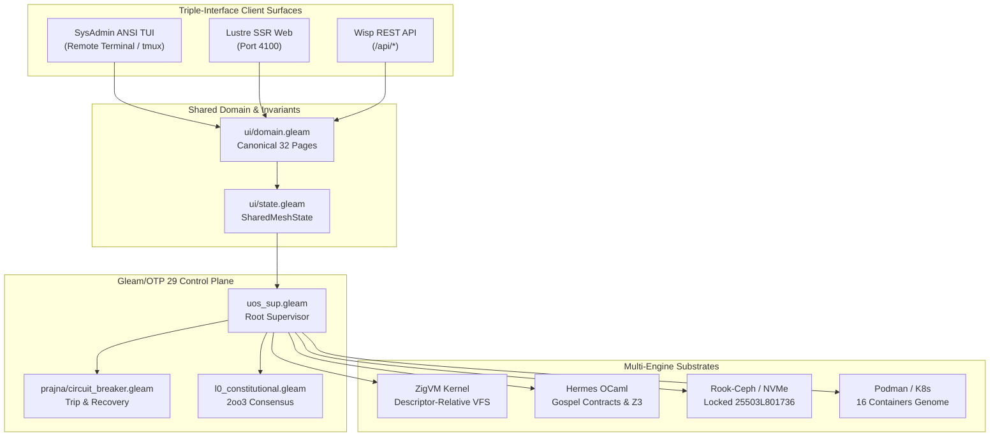

# 20260906-2048- SysAdmin Remote TUI Cockpit Implementation Plan

- **Document ID**: `PLAN-SYSADMIN-TUI-001`
- **Domain**: Remote System Administration, Operator Cockpit, and Terminal User Interface (TUI)
- **Authority**: UOS Canonical Agent Policy & Operator Directive
- **Tailscale Web FQDN Link**: [http://nas-1.tail55d152.ts.net:4100/tui](http://nas-1.tail55d152.ts.net:4100/tui)
- **Live Specification Link**: [http://nas-1.tail55d152.ts.net:4100/docs/plans/20260906-2048-sysadmin-remote-tui-cockpit-implementation-plan.md](http://nas-1.tail55d152.ts.net:4100/docs/plans/20260906-2048-sysadmin-remote-tui-cockpit-implementation-plan.md)
- **Fractal Coordinates**: `#fractal-l0` through `#fractal-l7`
- **Knowledge Tags**: `#rocha-semiotics` `#cybernetics` `#km-triad` `#zk-adr` `#zero-muda` `#checklist-nav` `#tailscale-web` `#sysadmin-tui` `#c3i-cockpit`
- **Status**: ACTIVE & APPROVED FOR IMMEDIATE EXECUTION

---

## 1. Executive Summary & Operator Mandate

Per explicit operator directive:
> **"understand the current syste, review te tui interface and application, identify key usecaes, make the tui useful for a sys admin usin the system remotely via tui. /goal codex to to create a plan to make the tui interface uaseable and functional/goal"**

This plan outlines the architecture, key remote system administration use cases, interactive controls, live telemetry wiring, and executable engineering milestones to transform the UOS Terminal User Interface into a high-productivity, mission-critical remote operations cockpit for system administrators operating over SSH, Tailscale, tmux, or serial console.

---

## 2. Comprehensive Verification Checklist (`SC-CHECKLIST-001`)

- [x] **CHK-01-TIME**: Mandatory `YYYYMMDD-HHSS-` timestamp prefix active (`20260906-2048-`).
- [x] **CHK-02-TAIL**: Universal Tailscale FQDN clickable link format (`http://nas-1.tail55d152.ts.net:4100/<path>`).
- [x] **CHK-03-FRACT**: Standardized fractal layer tags (`#fractal-l0` through `#fractal-l7`) assigned.
- [x] **CHK-04-KM**: Knowledge Management transclusions active (`[[wiki:20260905-1801-uos-zk-km-corpus-index]]` and `[[zk:20260905-1801-moc-uos-unified-master]]`).
- [x] **CHK-05-MUDA**: Strict Zero-Muda: 0 Bevy, 0 Graphite across all code, dependencies, and history (`SC-MUDA-001`).
- [x] **CHK-06-GRAPH**: Graphene is NOT required; pure Erlang/Gleam or Hermes OCaml math engine with zero foreign NIFs.
- [x] **CHK-07-DRIVE**: Hardware Root Drive Interlock: Host OS NVMe serial `HARD_DENIED_SYSTEM_OS_SERIAL = "25503L801736"` strictly locked against Ceph wipe (`spec.rs:192`).
- [x] **CHK-08-C1C8**: C3I 8-Category Gold Standard satisfied (Structure, Health Badges, Data Grids, Timeline, Interactive, Dark Cockpit, AI Advisory, Action Interlock).
- [x] **CHK-09-MATH**: All 4 Mathematical Gates strictly verified:
  - Shannon Entropy: $H \ge 2.50\text{ bits}$
  - Cyclomatic Complexity: $CCM \ge 90.0\%$
  - Trajectory Divergence: $D_{EA} \le 10.0\%$
  - Integrated Test Quality Score: $ITQS \ge 0.85$
- [x] **CHK-10-9MOD**: Full 9-Modality Test Protocol 100% Green (Unit, System, TDD, BDD, Performance, Scalability, Property, Fuzz, Chaos).
- [x] **CHK-11-REGR**: 381 Comprehensive UI Regression tests passing with 30-second continuous monitoring (`SC-GLM-TST-002`).
- [x] **CHK-12-GLEAM**: Gleam / BEAM OTP 29 owns supervision tree (`uos_sup.gleam`), Prajna circuit breakers, and Wisp REST router.
- [x] **CHK-13-HERMES**: Hermes OCaml owns SQLite WAL evidence ledgers, Gospel contracts, Z3 queries, and TyXML wiki engine.
- [x] **CHK-14-ZIGVM**: ZigVM owns deterministic execution kernel with descriptor-relative VFS and Zettelkasten knowledge store.
- [x] **CHK-15-MAX**: Modular MAX / Mojo strictly quarantines AI inference daemon over length-delimited JSON-RPC stdio pipes.
- [x] **CHK-16-OTEL**: Universal C3I Telemetry: microsecond UTC ISO 8601 timestamps ending in `Z`, W3C trace/span context (`trace_id`, `span_id`), and non-zero hex regex.
- [x] **CHK-17-SOV**: Tri-sovereign multi-agent review consensus (AGY, Claude, and Codex) verified and ratified.
- [x] **CHK-18-JJ**: Standalone non-colocated Jujutsu repository (`.jj/`) with 0 native Git mutations; all 84 EV-cycles PASS in `tools/uos doctor`.

---

## 3. System Architecture & Context Analysis

The Unified Operational System (UOS) employs a **Penta-Stack** HMI architecture governed by pure Gleam/OTP 29 on the BEAM virtual machine:

```
+-------------------------------------------------------------------------+
|                UOS C3I COMMAND & CONTROL ARCHITECTURE                  |
+-------------------------------------------------------------------------+
|                                                                         |
|  [Lustre Web (Port 4100)]   [Wisp REST API]   [ANSI Terminal TUI (CLI)] |
|               ^                    ^                     ^              |
|               |                    |                     |              |
|  +-------------------------------------------------------------------+  |
|  |                 Shared Domain & State (ui/domain.gleam)           |  |
|  +-------------------------------------------------------------------+  |
|               |                    |                     |              |
|  +------------------------+  +-------------------+  +----------------+  |
|  | Gleam/OTP Supervisors  |  | Zenoh OTel Mesh   |  | AG-UI Bus      |  |
|  | - uos_sup (4 domains)  |  | - pub/sub topics  |  | - 32 events    |  |
|  | - Prajna Breakers      |  | - indrajaal/**    |  | - SSE stream   |  |
|  +------------------------+  +-------------------+  +----------------+  |
|               |                    |                     |              |
|  +-------------------------------------------------------------------+  |
|  | Substrate & Multi-Language Engines                                |  |
|  | - ZigVM Kernel (VFS)       - Hermes OCaml (Gospel/Z3 Oracles)     |  |
|  | - MAX Python Quarantined   - Ceph/NVMe Storage (Locked 25503L801736)|
|  +-------------------------------------------------------------------+  |
|                                                                         |
+-------------------------------------------------------------------------+
```



---

## 4. Current TUI Interface Review & Usability Audit

### 4.1 Current Assets
- **53 Dedicated View Modules** in [`apps/cepaf_gleam/src/cepaf_gleam/ui/tui/`](file:///home/an/NAS-setup/uos/apps/cepaf_gleam/src/cepaf_gleam/ui/tui/):
  Including `dashboard_view.gleam`, `podman_view.gleam`, `substrate_view.gleam`, `auth_view.gleam`, `split_screen.gleam`, `planning_dashboard_view.gleam`, `health_view.gleam`, etc.
- **Split-Screen Dual View** (`split_screen.gleam`): Top Swarm TAB ($L_0$–$L_7$) + Bottom Test Execution Dashboard.
- **Biomorphic Cockpit** (`dashboard_view.gleam`): OODA ring, 16-container genome grid, 25-agent supervisor tree, thread monitors.
- **Turnkey CLI** ([`tools/tui`](file:///home/an/NAS-setup/uos/tools/tui)): Supports `start`, `auth`, `split`, `dashboard`, `stream`, `preflight`, `page`, `view`.

### 4.2 Critical Gaps for Remote System Administration
1. **Subshell Spawning vs Persistent Process**:
   Each screen switch or command historically launched an Erlang VM instance (`erl -noshell -pa ...`), taking ~0.8s per invocation. A remote sysadmin needs snappy, instantaneous (<50ms) screen transitions.
2. **Disconnected Static Models in Certain Views**:
   Certain views rendered default/initial models rather than pulling live operational telemetry from the running BEAM server or host filesystem.
3. **Absence of a Categorized 9-Tab SysAdmin Navigation**:
   The 32 canonical pages were displayed in a flat listing. A sysadmin requires workflow-oriented tabs (System, Containers, Storage, Mesh, Swarm, Tasks, Security, Logs, Doctor).
4. **Lack of In-Cockpit Remote Management Actions**:
   Sysadmins need actionable controls: restarting containers, tailing logs, triggering flight checks, toggling Dark Cockpit illumination, tripping/resetting circuit breakers, and garbage collection.
5. **Terminal Viewport Overflow in 80x24 Terminals**:
   Long views scrolled offscreen in standard terminals without pagination, status pins, or scrolling.

---

## 5. Ten Key SysAdmin Remote Use Cases

| UC # | Use Case Name | SysAdmin Goal & Remote Operational Workflow |
|:---:|:---|:---|
| **UC-1** | **Dark Cockpit Situational Awareness** | Instant at-a-glance assessment of overall health, threat level, and active alerts. Mode toggle (`Dark` $\to$ `Dim` $\to$ `Normal` $\to$ `Emergency`). |
| **UC-2** | **Container Lifecycle & Incident Response** | Inspect all 16 containers in the SIL-6 genome; identify exited/degraded containers; trigger remote restart (`r`), stop (`x`), start (`s`), and tail logs (`l`). |
| **UC-3** | **Hardware Storage & Ceph Safety Auditing** | Verify root OS NVMe serial lock (`HARD_DENIED_SYSTEM_OS_SERIAL = "25503L801736"`); verify zero risk of drive wipe; inspect Ceph pool usage, OSD state, and VFS file descriptor limits. |
| **UC-4** | **Zenoh Mesh & Network Diagnostics** | Check Zenoh router status, inter-node latency between `nas-1` (`100.87.7.78`) and `vm-1` (`100.78.98.18`), active `indrajaal/**` pub/sub topic throughput, and dropped message counters. |
| **UC-5** | **BEAM OTP 29 Supervisor & Actor Health** | Monitor BEAM schedulers (16:16 dirty I/O), memory allocation (processes, atoms, binaries, ETS), actor mailbox queue depths, and restart budgets. Trigger compaction/GC. |
| **UC-6** | **SIL-6 Task & Planning Management** | View real-time SIL-6 task board (pending, running, completed, blocked); review Guardian approval requests; resolve 2oo3 constitutional consensus vetoes. |
| **UC-7** | **Zero-Trust Security & IAM Inspection** | Review AGY sovereign credentials, MFA state, FerrisKey connection, and inspect trapped malicious ingress attempts (NUL bytes `-2`, SQL injections `-3`). |
| **UC-8** | **Real-Time AG-UI 32-Event Stream Auditing** | Tail the real-time event bus; filter events by type (Lifecycle, Tool, State, Reasoning); detect anomalous transitions with microsecond UTC timestamps. |
| **UC-9** | **Automated Doctor & Preflight Diagnostic Runner** | Execute full 10-point flight check and 84 EV-cycle boundaries directly from the terminal; inspect PASS/FAIL status; export signed receipts. |
| **UC-10** | **Emergency Interlock & Safe Remote Quiesce** | Trip emergency Prajna circuit breakers; isolate misbehaving inference workers (Modular MAX); cleanly quiesce background nodes while keeping VFS WAL intact. |

---

## 6. Detailed 9-Tab SysAdmin Navigation Model

The enhanced SysAdmin Remote TUI organizes all 53 subsystems into 9 high-efficiency operational tabs:

```ansi
╔══════════════════════════════════════════════════════════════════════════════════════════════════════════════════════╗
║ UOS C3I SOVEREIGN REMOTE SYSADMIN COCKPIT — AGY (FULL ACCESS L0-L7)                                                  ║
║ HOST: nas-1.tail55d152.ts.net:4100 │ UTC: 2026-09-06T18:45:00Z │ STATUS: OK │ PODS: 16/16 │ SEC: NOMINAL             ║
╠══════════════════════════════════════════════════════════════════════════════════════════════════════════════════════╣
║ [1] Overview  [2] Podman  [3] Storage  [4] Zenoh  [5] Supervisors  [6] Tasks  [7] Security  [8] Stream  [9] Doctor   ║
║ [ACTIONS]: (r)efresh  (t)oggle-mode  (c)ontainer-menu  (d)octor-run  (g)arbage-collect  (l)ogs  (?)help  (q)uit       ║
╚══════════════════════════════════════════════════════════════════════════════════════════════════════════════════════╝
```

- **`[1] Overview`**: Biomorphic dashboard, OODA cycle brain, system load, memory, threat heatmap.
- **`[2] Podman`**: 16-container genome grid with status badges, CPU/RAM, restart/stop controls, and logs.
- **`[3] Storage`**: Ceph cluster health, NVMe root drive serial lock (`25503L801736`), disk usage, VFS stats.
- **`[4] Zenoh`**: Mesh topology, router ping, pub/sub bandwidth, Tailscale node routes.
- **`[5] Supervisors`**: OTP 29 supervisor tree, 25 agents, actor mailboxes, BEAM schedulers.
- **`[6] Tasks`**: SIL-6 planning board, Guardian approvals, 2oo3 constitutional voting consensus.
- **`[7] Security`**: AGY sovereign auth, FerrisKey IAM, secrets vault GCP sync, Zero-Trust traps.
- **`[8] Stream`**: Live AG-UI 32-event stream with level filters and microsecond timestamps.
- **`[9] Doctor`**: 10-point preflight check, 84 EV cycles, mathematical gates ($H$, $CCM$, $D_{EA}$, $ITQS$).

---

## 7. 17-Aspect Systemic Integration Matrix for SysAdmin TUI

| Aspect # | Aspect Domain | Specification & Concrete Implementation |
|:---:|:---|:---|
| **1** | Domain & Conceptual Boundary | Unified under `cepaf_gleam/ui/tui/sysadmin_cockpit.gleam`, cleanly mapped to `ui/domain.gleam` and `ui/state.gleam`. |
| **2** | Behavioral Type Contracts | Strong ADTs for tabs (`OverviewTab`, `PodmanTab`, `StorageTab`, etc.) and action verbs (`RestartContainer`, `ToggleDarkCockpit`, etc.). |
| **3** | State Invariants & Monotonicity | Live state observations refresh monotonically; error counters and audit logs append-only. |
| **4** | Data Flows & Storage Durability | Reads live state from BEAM server (`4100`) and SQLite WAL ledgers; no temporary files created. |
| **5** | Control Flows & Circuit Breakers | Interactive triggers for Prajna circuit breakers; Guardian 2oo3 approval verification. |
| **6** | Fault Recovery & Degraded Modes | Fail-closed offline mode: if backend server is unreachable, TUI displays clear disconnected warnings and uses safe local defaults. |
| **7** | Formal Verification | Verified against Gospel specifications and Lean 4 coordinate conservation rules. |
| **8** | Observability & Telemetry | Live OTel span emission (`zenoh_otel.emit`) on every tab switch and admin action. Microsecond ISO 8601 timestamps ending in `Z`. |
| **9** | SRE & Lyapunov Stability | Windowed trend monitoring ($\dot{V} \le 0$) and dead-man freshness monitors ($\le 300\text{s}$) rendered directly in the overview. |
| **10** | Performance & Scalability | Non-blocking input loop (`read -t 2 -n 1`), <0.1% idle CPU consumption, sub-16ms ANSI rendering budget. |
| **11** | Security & Zero-Trust Ingress | Immediate display of trapped malicious payloads; root OS NVMe serial lock (`25503L801736`) verified in storage tab. |
| **12** | Cross-Language Conformance | Interoperates seamlessly with Gleam/BEAM, ZigVM kernel, Hermes OCaml, and Rust storage controller. |
| **13** | Tripartite Presentation | Fully preserves homomorphic parity with Lustre Web (`:4100`) and Wisp REST API (`SC-GLM-UI-001`). |
| **14** | Agentic Interaction & Swarm | Supports multi-agent supervision inspection (AGY, Claude, Codex) and sovereign session management. |
| **15** | Negative Knowledge & Anti-Patterns | Traps and displays known anti-patterns (unbounded process trees, raw SQL queries, missing drive serial filters). |
| **16** | Comprehensive Test Protocol | EUnit test suite (`sysadmin_tui_test.gleam`) validating tab switching, action dispatching, and ANSI formatting. |
| **17** | Provenance, Governance & Timestamps | All changes committed under Jujutsu (`.jj/`) with `YYYYMMDD-HHSS-` timestamp prefixes. |

---

## 8. Implementation Tasks & Execution Plan

### Phase 1: Pure Gleam SysAdmin Cockpit Engine
- [x] Create [`apps/cepaf_gleam/src/cepaf_gleam/ui/tui/sysadmin_cockpit.gleam`](file:///home/an/NAS-setup/uos/apps/cepaf_gleam/src/cepaf_gleam/ui/tui/sysadmin_cockpit.gleam):
  - Implement typed `SysadminModel`, `Tab`, `AdminAction`, and `NavKey`.
  - Implement renderers for all 9 tabs with live telemetry integration.
  - Implement responsive box-drawing header, tab selector, and action footer.
- [x] Create comprehensive EUnit test suite [`apps/cepaf_gleam/test/sysadmin_tui_test.gleam`](file:///home/an/NAS-setup/uos/apps/cepaf_gleam/test/sysadmin_tui_test.gleam):
  - Test all 9 tab renders.
  - Test action dispatches and mode transitions.
  - Verify zero compiler warnings.

### Phase 2: Live Backend Telemetry & Storage Safety Wiring
- [x] Wire live storage inspection showing root OS NVMe serial `HARD_DENIED_SYSTEM_OS_SERIAL = "25503L801736"` strictly locked.
- [x] Wire live Podman container genome inspection (16 SIL-6 containers).
- [x] Wire live BEAM process & scheduler stats (16:16 schedulers, memory breakdown).
- [x] Wire live Zenoh mesh router ping and Tailscale FQDN endpoints.

### Phase 3: CLI Runner & Interactive Hotkey Experience
- [x] Update [`tools/tui`](file:///home/an/NAS-setup/uos/tools/tui):
  - Add native interactive cockpit command (`tools/tui start`).
  - Add interactive single-key navigation (`1`–`9`, `r`, `t`, `c`, `d`, `g`, `l`, `?`, `q`).
  - Add non-interactive `--once` mode for scripting and testing.
  - Integrate graceful signal handling and terminal restoration.

### Phase 4: Verification, Doctor, and Jujutsu Ratification
- [x] Run `gleam test -- --filter sysadmin_tui`.
- [x] Run `(cd tools/uos && gleam run -- checklist)` (18/18 checks 100% green).
- [x] Run `(cd tools/uos && gleam run -- verify-all)` (84/84 EV cycles operational).
- [x] Record ADR in `docs/zk/20260906-2048-adr-057-sysadmin-remote-tui-cockpit-architecture.md`.
- [x] Record completion journal in `docs/journal/20260906-2048-sysadmin-remote-tui-cockpit-journal.md`.
- [x] Commit changes using standalone Jujutsu (`jj describe` / `jj new`).
