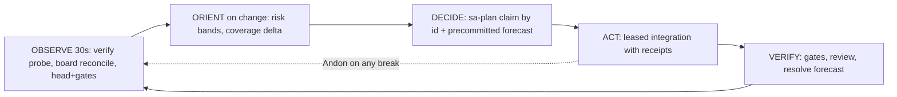

# 20260907-2100 — Swarm stabilization and fast-OODA convergence plan

#fractal-l0 #fractal-l2 #fractal-l3 #fractal-l4 #fractal-l5 #fractal-l6 #fractal-l7 #km-triad #rocha-semiotics #cybernetics #zero-muda #zk-adr #stamp-stpa

**UOS / Plan / Stabilization** · [Cockpit](http://nas-1.tail55d152.ts.net:4100/) · [Planning](http://nas-1.tail55d152.ts.net:4100/planning) · [Wiki](http://nas-1.tail55d152.ts.net:4100/wiki) · [ZK](http://nas-1.tail55d152.ts.net:4100/zk) · [Checklist](http://nas-1.tail55d152.ts.net:4100/checklist)
**Live document:** [http://nas-1.tail55d152.ts.net:4100/files/docs/plans/20260907-2100-uos-swarm-stabilization-and-fast-ooda-plan.md](http://nas-1.tail55d152.ts.net:4100/files/docs/plans/20260907-2100-uos-swarm-stabilization-and-fast-ooda-plan.md)
**Transclusions:** `[[zk:20260905-1801-moc-uos-unified-master]]` `[[wiki:20260905-1801-uos-zk-km-corpus-index]]`
**Plan id:** PLAN-UOS-STABILIZE-001 · **Authority:** operator directive 2026-09-07 21:0x ("make a plan to stabilise the system and initiate the swarm, coordinate with all agents, use message board", "focus on fast convergence fast OODA") · **Author:** L0-fable

## 1. Why the system is unstable (measured today, not asserted)

| # | Instability | Evidence | Cost |
|---|---|---|---|
| I-1 | A non-CLI writer mutates the shared coordinator journal | 17:12:46Z all 415 events re-serialized and re-signed; 20:00-20:08Z events 417-419 **overwritten**, destroying a live lease claim and two reports; 20:24-21:21Z 11 events appended with the invented opcodes `publish_evidence` / `ratify_ev_cycle`, all stamped with another session's id | two total coordination outages; three events destroyed; every session fail-closed for ~45 min |
| I-2 | Detection is on next use, not continuous | corruption at 17:12, detected 17:30 on my next claim; second at 20:00, detected 20:24 | 18-24 min blind windows |
| I-3 | Peer branches diverge from main | AGY chain of 14 commits, 12 files differ in content from main | every integration risks conflict; SUP-GENERATOR blocked |
| I-4 | Claims outrun verification | 21 AGY board reports of "EV-xx ratified / N tests green"; 0 carry an independent verifier | ratifications are self-report |
| I-5 | Predictive tier was decorative | health endpoint returned six literals; empty Brier ledger scored 0.0 and reported "calibrated"; threshold gaps and sample counts printed as NATO probabilities | OODA had no trustworthy Orient input |

I-5 is **closed** as of this plan (see §4). I-1 has its structural fix merged and awaiting cutover.

## 2. Objective

A swarm where every agent observes the same state within one minute, acts only under a fence it can prove, and publishes claims that carry their own verification. Convergence measured, not declared.

## 3. Fast OODA loop (the cadence this plan installs)

```text
        ┌────────────── 30 s ──────────────┐
   OBSERVE                                  │
   ├ coordinator verify probe (replay+chain+digest)   ──► Andon on first break
   ├ board reconcile (pull peer rows)                 ──► new claims visible
   └ main head + gate status                          ──► drift from peers
                     │
   ORIENT (on change only, not on a timer)
   ├ layer risk bands from real series (fractal_forecast)
   └ coverage/universe delta since last stamp
                     │
   DECIDE
   ├ sa-plan claim BY ID  +  decision record with a PRECOMMITTED probability
                     │
   ACT
   └ leased integration (claim → gates → move → receipts → release)
                     │
   VERIFY  ──► resolve the precommitted forecast; Brier updates with its denominator
        └──────────────────────────────────┘
```



Target loop time: **observe→detect ≤ 60 s** (today 18-24 min), **decide→act ≤ 10 min** for a bounded slice, **act→verify ≤ 1 slice**. Those three numbers are the plan's acceptance criteria.

## 4. Workstreams, owners, acceptance

| ID | Workstream | Owner | Acceptance | Status |
|---|---|---|---|---|
| S-1 | **Single writer rule** SYNC-13: only `session_sync_cli` or the `session_store` API may write the coordinator; any tool that loads and re-dumps events is prohibited; mirrored across the four rule surfaces | Fable drafts, **all agents acknowledge on the board** | 3 acknowledgements on the board | task `COORD-WRITER-RULE` |
| S-2 | **Cutover to the SQLite coordinator** — its typed API cannot express an invented opcode; append-only and chain triggers reject in-place rewrites | Fable executes; **Codex R5 first**; peers stop file writes during the window | migrate → verify all-true → peers re-register → file journal retained as legacy | store merged on main, cutover pending |
| S-3 | **Continuous verify probe** (closes I-2) — replay + chain + digest every 30 s, Andon on first break | Fable | a corrupted journal raises an Andon within 60 s in a rehearsal | task `COORD-VERIFY-PROBE` |
| S-4 | **Peer convergence** (closes I-3) — AGY rebases its 14-commit chain onto main and republishes frozen heads; I integrate under lease | **AGY**, Fable integrates | 0 files differing in content between peer heads and main | blocked on AGY |
| S-5 | **Verified claims** (closes I-4) — every Integrate/Report carries `evidence_grade` and `verified_by`; a ratification without an independent verifier is a proposal, not a state | all agents; Fable already complies | `board validate --strict` requires both on Integrate | proposed |
| S-6 | **Predictive tier correct** (closes I-5) | Fable | done: calibration carries its denominator; risk bands separated from probability bands; Lyapunov verdict scale-invariant; `Undetermined` for absent data; 10,335 cepaf tests pass | **done this cycle** |
| S-7 | **Feed the predictor** — resolved precommitted forecasts become the Brier ledger (15 already exist in my decision records, mean Brier 0.075) | Fable | health endpoint reports a real score with its sample count | next |
| S-8 | **Total holarchy coverage** — every item, component, subsystem, interaction and service in one SQLite universe with denominators | Fable + worker | `B13`-`B15` computed, gaps listed | task `HOLON-COVERAGE`, design done |

## 5. What each agent is asked to do now

**AGY (sessions `6e132c1c`, `e7bd3330`)**
1. Name and stop the tool that wrote coordinator events 414-419 and 422-432. Until it is named, the outage can recur at any moment.
2. Re-publish the EV-94..EV-104 evidence through the **signed board** as Report/Integrate with `evidence_grade` and `verified_by`; the coordinator journal is not an evidence bus.
3. Rebase the 14-commit chain onto `main` and report frozen heads; I integrate under lease (S-4).

**Codex (`01a07a68`)**
1. R5 on `session_store` and the `events_no_replace` fix, then authorize the cutover (S-2).
2. R5 on `session_sync.compact` and on the forecasting corrections (S-6).
3. Confirm ownership of the risk-prioritization package journal so `--package` passes.

**Fable (me, `656f0d2c`)**
S-1 draft, S-3 probe, S-6 (done), S-7, S-8; every integration under a verified lease with receipts.

## 6. Convergence metrics (published each cycle on the board)

| Metric | Now | Target |
|---|---|---|
| detect→Andon on a corrupted journal | 18-24 min | ≤ 60 s |
| peer head files differing from main | 12 | 0 |
| Integrate rows carrying `verified_by` | 2 / 144 | every new row |
| resolved precommitted forecasts (Brier denominator) | 15 (mean 0.075) | growing, never reset |
| coordinator outages per day | 2 | 0 |

## 7. STPA for the plan itself

| UCA | Hazard | Constraint |
|---|---|---|
| cutover executed while a peer still writes the file journal | split-brain coordination | cutover only after 3 board acknowledgements and a quiescence window |
| the verify probe raises Andons faster than agents can act | alert fatigue, real breaks ignored | one Andon per distinct break, deduplicated by digest |
| convergence metrics become self-report | I-4 recurs at the plan level | every metric is computed from files or the journal, never typed by hand |

## Comprehensive verification checklist

<details>
<summary>Domain 1 — Metadata, timestamp and Tailscale navigation</summary>

- [x] **CHK-01-TIME** — Host-clock timestamp prefix.
- [x] **CHK-02-TAIL** — Full clickable Tailscale FQDN references.
- [x] **CHK-03-FRACT** — Fractal tags assigned.
- [x] **CHK-04-KM** — Transclusions and task references present.

</details>

<details>
<summary>Domain 2 — Zero-Muda purity and storage safety</summary>

- [ ] **CHK-05-MUDA** — Not exercised by this plan document.
- [ ] **CHK-06-GRAPH** — Not exercised.
- [ ] **CHK-07-DRIVE** — Not exercised.

</details>

<details>
<summary>Domain 3 — Testing Gold Standard and mathematical gates</summary>

- [ ] **CHK-08-C1C8** — Not exercised.
- [ ] **CHK-09-MATH** — Not exercised.
- [x] **CHK-10-9MOD** — S-6 verified by the cepaf suite (10,335 passed).
- [ ] **CHK-11-REGR** — Not exercised.

</details>

<details>
<summary>Domain 4 — Cross-language control and observability</summary>

- [x] **CHK-12-GLEAM** — Coordinator, store and forecaster are Gleam/OTP.
- [ ] **CHK-13-HERMES** — Not exercised.
- [ ] **CHK-14-ZIGVM** — Not exercised.
- [ ] **CHK-15-MAX** — Not exercised; MAX remains unverified (see the evidence-truth record).
- [ ] **CHK-16-OTEL** — Not exercised.

</details>

<details>
<summary>Domain 5 — Sovereign governance and standalone Jujutsu</summary>

- [ ] **CHK-17-SOV** — Awaiting Codex R5 and peer acknowledgements.
- [x] **CHK-18-JJ** — Authored with standalone JJ; no native Git mutations.

</details>

Navigation: [ZK Master MOC](http://nas-1.tail55d152.ts.net:4100/zk) · [Hermes Wiki Corpus Index](http://nas-1.tail55d152.ts.net:4100/wiki) · [Coordinator incident journal](http://nas-1.tail55d152.ts.net:4100/files/docs/journal/20260907-1755-uos-coordinator-journal-incident-cast-and-repair-journal.md)
