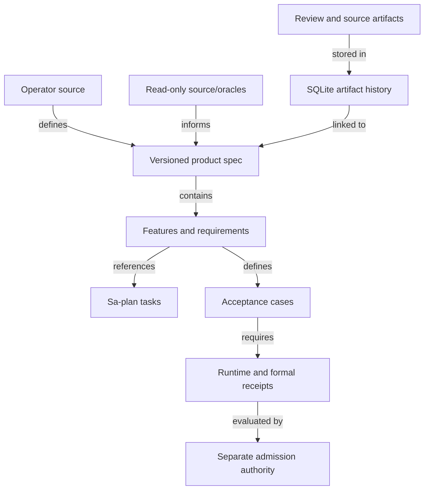

# 20260907-1837 — ZigVM and Harness-Bionic product, specification, feature and oracle management review

#fractal-l0 #fractal-l1 #fractal-l2 #fractal-l3 #fractal-l4 #fractal-l5 #fractal-l6 #fractal-l7 #fractal-l8 #fractal-l9 #zk-adr #zero-muda #km-triad

[Cockpit](http://nas-1.tail55d152.ts.net:4100/) · [Planning](http://nas-1.tail55d152.ts.net:4100/planning) · [Wiki](http://nas-1.tail55d152.ts.net:4100/wiki) · [ZK](http://nas-1.tail55d152.ts.net:4100/zk) · [Source](http://nas-1.tail55d152.ts.net:4100/files/docs/reviews/20260907-1837-zigvm-harness-product-feature-oracle-review.md)

**Scope:** the operator's architecture and subsequent requests for a full review of product, specification, feature, oracle and artifact management in both source repositories, with results stored in SQLite. This is a management-system source review and bounded catalog implementation. It is not production admission of the 21 infrastructure services.

**Evidence:** [source and database observations](http://nas-1.tail55d152.ts.net:4100/files/docs/reviews/20260907-1837-product-management-source-observations.json). The survey inventories 83 selected source/document artifacts, inspects six SQLite stores read-only and rechecks 24 oracle pins. Deep reading covers the management mechanisms cited below; an inventoried file is not automatically behavior-tested. Prefix derives from the synchronized host clock at intake. Observation times are retained separately in the JSON.

**Execution authority:** Sa-plan `uos/agentic-product/20260907-1837`, task `CATALOG`, worker `codex-agentic-product-1837`, attempt 1. Product data and review findings are not another task scheduler.

## Findings that affect reuse

1. **PM-F01 — High: documented product catalog is unpopulated in the inspected Harness stores.** `state/hermes_harness.sqlite3` contains 40 scenarios, 212 trace pairs and 212 verification rows, while `feature_catalog`, `feature_history`, `fractal_node`, `artifact_catalog`, `capability_contract`, `capability_contract_receipt` and `source_snapshot` contain zero rows. `state/evidence_store.sqlite` contains one scenario/trace/verification and the same zero product rows. Thus the documented L0–L6 product graph is implemented as code/schema, but these stores do not demonstrate a populated product-management system. Scope is these observed databases, not every possible deployment. Populate the UOS-owned catalog from explicit manifests and preserve missing proof as UNRUN.

2. **PM-F02 — High: low-level parity readers are insufficient as admission authorities.** `modules/hermes_harness/evidence_store.ml:959` selects any passing receipt for a snapshot/revision without joining and comparing its trace pair. `parity_results` at line 1051 selects the latest row per scenario for a source snapshot, without a required candidate revision. `fractal_parity.ml:23` rolls a Boolean leaf to Verified with snapshot equality alone; its evidence type contains no candidate or verifier identity. These are useful projections only behind stronger collectors. A new product completion view must bind candidate, scenario, reference snapshot, normalizer, formal receipt and current runtime receipt together. Do not import historical pass labels as UOS admission.

3. **PM-F03 — High: source pin and executable oracle identity are separate obligations.** ZigVM's `harness/otp_oracle.ml:65` checks repository HEAD and `OTP_VERSION`; it does not inspect dirty files or hash the executable. `harness/erl_tests.ml:132` allows parity when the observed OTP major equals the pinned major. These checks catch different failures, but do not alone establish that a particular executable was built from the exact clean pinned source. Preserve both observations and bind executable/build identity before claiming exact-version parity.

4. **PM-F04 — High: oracle capture confinement needs a UOS adapter.** Harness `reference_capture.ml:123` uses a wall-clock timeout and kills the direct child; process-tree reaping, memory/output quotas and egress confinement are not established there. It strips Python import variables but inherits the rest of the environment. Its capture record accepts a caller-supplied snapshot digest. This is not an admitted UOS host-code sandbox, and its Python adapter boundary cannot be copied into UOS's agent/control plane. Reuse the protocol and comparison contracts through a supervised bounded execution adapter with explicit resource and credential controls.

5. **PM-F05 — Medium: fixture loading verifies content integrity but not all requested identities.** `reference_capture.ml:299` recomputes the normalized trace digest, but does not compare the decoded scenario ID, full source digest or normalization description to every supplied expectation. The path uses a 12-character source-digest prefix. `save` writes a fixture file directly. Add full identity checks and atomic, conflicting-replay rejection before adopting this as a multi-oracle repository.

6. **PM-F06 — High: the SQLite schemas cannot be merged by opening one store with the other's migrator.** Harness `feature_catalog` uses `(snapshot_digest,id,label,source_domains)`. UOS's existing table uses `(id,name,category,fractal_layer,feature_vector,surface,engine,status,description)`. The shared table names also include differently shaped `schema_version`. The new adapter therefore uses `product_*` tables and views in the existing UOS database. Existing feature rows remain intact.

7. **PM-F07 — Medium: a declared feature status is not a verification result.** ZigVM's InfraNodus registry validates 70 IDs, metadata and evidence references; its test requires 70 `Implemented` declarations. That test does not execute all referenced scenarios. Harness Wiki `feature_register.ml:3177` uses live probes where supplied but otherwise returns `declared`; its MBSE gate detects Built rows without a verification method. Preserve `declared`, `observed`, `tested` and `admitted` as distinct fields. A best-capability join in ZigVM's coverage algebra must not replace its separate worst-capability floor or denominator.

8. **PM-F08 — High for UOS adoption: legacy planning advice is not the canonical queue.** Wiki register priority at line 3195 uses `3*criticality + 2*utility + gates`, while ZigVM also retains `onto_task` repair records. These cannot replace SC-RISK-PRIORITY-001 or claim/complete UOS work. Keep their diagnostics as evidence and route execution through Sa-plan with the current five-factor assessment and lease.

9. **PM-F09 — Medium: oracle registration does not mean full differential execution.** ZigVM's `oracle_vectors.ml` explicitly separates wired recipes from discovered unwired fixtures, rejects vacuous comparisons and declares an unwired ceiling of 39. The current third-party service registry's 24 HEAD/license checks all match, but no service-to-UOS differential run was performed by this review. Preserve missing recipes, tooling, fixtures and receipts as separate gaps.

10. **PM-F10 — Medium: this is a strong engineering evidence system, with incomplete business product management.** Features, laws, dependencies, source histories, tests and implementation artifacts are represented. The inspected models do not provide one complete system for customer research, outcome hypotheses, prioritization decisions, release baselines, feedback and measured product outcomes linked to those engineering records. Add those fields and views without inventing measurements or a second execution queue.

11. **PM-F11 — High: generic inventory hashing is not a sanitized ingestion policy.** Harness `inventory.ml:13` excludes several build/cache directories and skips symlinks, but its regular-file walker hashes every other file. It does not provide UOS's presence-only handling for secrets, quarantined incidents, live DB/WAL/SHM or weights. The review uses a selected source/document allowlist; do not run this generic walker over dirty source roots as an admission scan.

## Full management coverage and reuse decision

The paths below are relative to ZigVM's root (`harness/`) or Harness-Bionic's root (`modules/`). UOS equivalents for reviewed artifacts, their digests and whether they are identical are in the observation JSON. Of the 48 located Harness code counterparts, 46 are byte-identical and two are adapted or diverged; two Harness documentation paths have no direct counterpart under the comparison rule. Five selected InfraNodus files also have byte-identical imported counterparts. These counts describe this survey only.

| Management capability | ZigVM mechanism | Harness-Bionic mechanism | UOS use and boundary |
|---|---|---|---|
| Product definition and scope | Capability/program axes, InfraNodus product registry | `feature_catalog.ml`: 18 public families | Stable product ID, purpose, actor, outcomes, scope and explicit non-goals |
| Product hierarchy | Families, capabilities, UI/scenario references | `fractal_catalog.ml`, `fractal_node`: L0 product through L6 receipt | Reuse hierarchy concepts; distinguish product levels from system L0–L9 coordinates |
| Feature identity and detail | `infranodus_feature.ml`: IDs, seven families, behavior, use cases, controls, scenarios, evidence | Typed capability and wiki feature registers | Detailed versioned rows rather than name/status alone |
| Requirements and formal laws | `gospel_contract_registry.ml`: owner, disposition, adoption, contract, model, oracle, cadence | `contract_catalog.ml`, capability contracts and receipts | A requirement needs a falsifiable acceptance method; baseline ownership does not mean proof |
| Specification projections | Typed formal/ontology generators | `feature_model.ml`: SysML, OML/TTL and MMS from one register | Generate deterministic projections from one manifest; external toolchain validation stays separate |
| Scope and traceability | UI controls, scenario IDs, Figma/evidence references | Node-to-source/doc/design/test links | Keep cross-edges distinct from containment and preserve source lineage |
| Planning and dependencies | Durable Sa-plan plans, tasks, jobs, workflows, bridge preflight | The same Sa-plan lineage plus blueprint dependencies | Canonical `var/sa-plan/uos.sqlite3` only; artifact records carry references |
| Feature state and stale claims | Declared implementation, feature tags, join/floor coverage | Live predicates and `stale_declarations` | Show observed state separately from declared intent; never auto-admit from a probe name |
| Change history and baselines | `graph_revision.ml`, accepted baselines, oracle pin IDs, verdict history | Feature/node history; immutable-key conflict checks | Use UOS JJ revision/change IDs, retaining Git only as external provenance |
| Artifact management | `harness_artifacts`, scenario/page manifests, journal bundles | Content-addressed `artifact_catalog`, node links, knowledge links | Store generated artifact bodies in SQLite with SHA-256; external source stays reference-only |
| Knowledge management | Feature notes, strict tags, self-querying ZK, corpus agreement laws | Wiki register, graph, datastore, lifecycle and KM links | Bidirectional Docs/Wiki/ZK pointers with source digest and revision |
| Evidence retention | `evidence_census.ml`: Ephemeral/Aggregate/Durable with no-overclaim law | Scenarios, trace pairs, verifier and contract receipts | Make per-case rows queryable; an aggregate suite receipt remains aggregate |
| Strict completion | Non-vacuous comparisons, ratchets, accepted baseline | Required-child rollups with missing capability as Unmapped | Bind all mandatory children and current candidate; empty trees cannot be complete |
| Oracle inventory and ownership | OTP pin, runtime identity, vector discovery; Playwright source authority | Frozen reference, catalog anchors, normalizers, capture drivers | Keep source, specification, executable and advisory-model oracle types distinct |
| Oracle version and licensing | Commit/version pins and external toolchain identity | Snapshot digest and reference revision | Exact revision, license digest, observed dirty state and runtime identity must all be explicit |
| Oracle recipe lifecycle | Wired vs Unwired with a reason and discovery-totality laws | Scenario contracts and per-capability adapters | Register recipe, fixture set, comparison semantics, resource budget and failure classification |
| Capture and isolation | Oracle process/VM execution and solver sandbox | Timeout capture and typed failures | Use approved OTP-supervised bounded workers; audit process-tree cleanup and environment |
| Normalization | Byte comparisons with limited transport normalization | Versioned JSON path omission, set ordering and numeric normalization | Pin policy and test that normalization cannot erase the behavior under test |
| Differential comparison | Pinned OTP comparisons, divergence locality, Vacuous rejection | `parity_compare.ml`, extracted lattice/oracles | A mismatch is evidence; unavailable tooling blocks credit without condemning implementation |
| Regression and mutation | Ratchets, mutational laws, test impact/coverage | Adversarial checks, receipt history and mutation tooling | Execute specific negative cases; retain test IDs, inputs, outputs and tool versions |
| Risk prioritization | STPA/FMEA records and safety constraints | Fractal diagnostics, blueprint prerequisites | Apply UOS safety class/readiness before C×T×F×Dep×I |
| Desired-state reconciliation | Fractal closure and observed-minus-target views | `Blueprint.validate`, reconcile, Converge and gap plan | Keep diagnostics and recommendations separate from side-effect permission |
| Operational analytics | Verdicts, benchmarks, samples, SLOs, program journal | Receipt reliability, surprisal ledger, telemetry/ontology | Missing sample counts remain unknown; probabilistic summaries cannot authorize effects |
| Release and admission | Accepted baseline receipts and compatibility ratchets | Revision-bound contracts/receipts and run assurance | Create explicit release baseline and dependency snapshot; two-key evidence precedes admission |
| Product feedback and outcomes | Journals and use-case descriptions | Product purpose, diagnostics and operational reports | Add outcome hypothesis, stakeholder/source, success metric and feedback references; values remain unmeasured until observed |

## Proposed native catalog and artifact flow

The existing UOS tracking database gains versioned `product_specifications`, `product_features`, `product_oracles`, `product_artifacts`, `product_artifact_links`, `product_findings` and `product_imports`. Read-only views expose requirements, acceptance cases, service implementations, feature-oracle links and detailed feature rows. Artifact bodies are stored for the operator source, generated review and generated specifications; reviewed external code is represented by locator/hash metadata.

The import is parameterized and transactional. The same version/content is a no-op; a changed payload requires a new version. UPDATE/DELETE triggers protect this catalog's history through ordinary SQLite access. This is not protection against an administrator replacing the database or dropping triggers. Foreign keys and content-hash readback validate the graph. Catalog import checks the current Sa-plan worker and attempt before writing and before commit; the two databases do not provide an atomic shared scheduler/effect fence.

```text
[Operator source] --defines--> [Versioned product spec]
[Read-only source/oracles] --informs--> [Versioned product spec]
[Versioned product spec] --contains--> [Features and requirements]
[Features and requirements] --references--> [Sa-plan tasks]
[Features and requirements] --defines--> [Acceptance cases]
[Acceptance cases] --requires--> [Runtime and formal receipts]
[Review and source artifacts] --stored in--> [SQLite artifact history]
[SQLite artifact history] --linked to--> [Versioned product spec]
[Runtime and formal receipts] --evaluated by--> [Separate admission authority]
```



## Mapping the supplied 21-service architecture

The [existing native specification](http://nas-1.tail55d152.ts.net:4100/files/docs/design/20260907-0550-uos-agentic-infrastructure-17-aspect-formal-spec.json) already defines 21 service requirements and 63 acceptance cases. The catalog preserves those IDs and statements, adds current path/digest observations and links the [prior code/oracle map](http://nas-1.tail55d152.ts.net:4100/files/docs/design/20260907-1756-production-agent-infrastructure-fractal-checklist-and-oracle-map.md). It extends them with the 25 management capabilities above. Third-party names identify behavioral references, not new production dependencies.

Use Gleam/OTP for identities, policy, gateway, loops and supervision; Sa-plan for durable execution authority; Hermes OCaml/SQLite for product, knowledge, artifacts, bounded evidence and analysis; Zenoh for the event backplane; ZigVM for admitted deterministic execution; and the isolated MAX boundary for inference. The new product tool provides catalog and artifact functionality. It does not make unimplemented identity, egress, approval, budget, replay or inference paths production-ready.

The operator's original text is retained [as source](http://nas-1.tail55d152.ts.net:4100/files/docs/design/20260907-1837-operator-agentic-infrastructure-source.txt). Its vendor claims and ASCII diagrams remain original evidence. New diagrams in this review have equivalent ASCII and Mermaid sources. For UOS requirements, record observable actions and redacted decision summaries rather than hidden chain-of-thought; durable replay needs recorded nondeterministic outcomes and effect reconciliation; traces alone do not establish replayability. Security and latency guarantees require executed tests under declared conditions.

## Validation and limits

The catalog's isolated tests cover atomic import, conflicting replay, artifact tampering, SQL metacharacters, dangling oracle references, fabricated acceptance-pass rejection, empty products, duplicate keys, forbidden history update/deletion, ownership-loss rollback, byte-preserving readback and relational projections. Actual results and the SQLite readback are recorded in the completion artifact. External source/runtime test suites were not executed or rebuilt by this review. All infrastructure acceptance definitions remain UNRUN and production admission remains NOT_ADMITTED.

## Comprehensive verification checklist

<details><summary>Domain 1 — Metadata, timestamp and navigation</summary>

- [x] CHK-01-TIME — Host clock and chrony receipt observed; timestamps distinguish intake and later observations.
- [x] CHK-02-TAIL — Full Tailscale FQDN links included; live delivery measured separately.
- [x] CHK-03-FRACT — L0–L9 tags included; product hierarchy and system layers kept distinct.
- [x] CHK-04-KM — Source, review, detailed specification and journal are linked.

</details>
<details><summary>Domain 2 — Zero-Muda and storage safety</summary>

- [x] CHK-05-MUDA — No third-party runtime dependency or external executable source imported by this package.
- [ ] CHK-06-GRAPH — Fleet graph/NIF conformance UNRUN; catalog uses OCaml and SQLite.
- [ ] CHK-07-DRIVE — Storage interlock execution UNRUN; no drive operations in scope.

</details>
<details><summary>Domain 3 — Testing and mathematical gates</summary>

- [ ] CHK-08-C1C8 — Full web UI categories UNRUN; this change supplies a CLI and read-only document views.
- [ ] CHK-09-MATH — Fleet mathematical quality gates UNRUN; no invented scores.
- [ ] CHK-10-9MOD — Targeted catalog tests executed; full nine modalities UNRUN.
- [ ] CHK-11-REGR — Production UI regression and sustained monitoring UNRUN.

</details>
<details><summary>Domain 4 — Cross-language control and observability</summary>

- [ ] CHK-12-GLEAM — Production supervision behavior not changed or verified by catalog import.
- [x] CHK-13-HERMES — Native OCaml/SQLite catalog transaction and readback checked at package scope.
- [ ] CHK-14-ZIGVM — External VM runtime/parity execution UNRUN.
- [ ] CHK-15-MAX — Inference execution UNRUN.
- [ ] CHK-16-OTEL — Fleet trace contract execution UNRUN.

</details>
<details><summary>Domain 5 — Governance and Jujutsu</summary>

- [ ] CHK-17-SOV — Independent sovereign review and production admission NOT_ADMITTED.
- [x] CHK-18-JJ — UOS uses standalone JJ; external Git reads are provenance only.

</details>

**Previous:** [Source blueprint](http://nas-1.tail55d152.ts.net:4100/files/docs/design/20260907-1837-operator-agentic-infrastructure-source.txt) · **Next:** [Detailed product specification](http://nas-1.tail55d152.ts.net:4100/files/docs/design/20260907-1837-agentic-product-detailed-specification.md)

**UOS footer:** versioned product and artifact catalog; Sa-plan owns execution; review is evidence, not admission.
