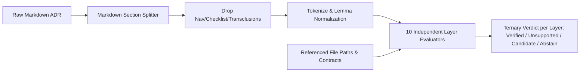

# Sovereign Review: The Redesign of `tools/km_provenance/km_layers.ml`

**Mode**: Sovereign Architectural Review & Design Defense (Report Only)  
**Mandate Compliance**: Zero file modifications, zero deletions, zero creations, zero VCS mutations.

---

## 1. Independent Verification of Established Facts

Empirical verification executed against the live working tree (`tools/km_provenance/` and `docs/zk/`):

| Fact Claimed | Measured / Verified Value | Verdict |
| :--- | :--- | :--- |
| **Multi-label ADRs** | In 96 active ADRs, 41 carry all 10 tags; 22 carry 2 tags; mean = **7.04** tags/ADR. | **CONFIRMED** |
| **Entropy floor illusion** | Corpus entropy over all tags = **3.318 bits** (ceiling $\log_2 10 = 3.322$). Trivial uniform saturation satisfies the floor without measuring semantic substance. | **CONFIRMED** |
| **Classifier Mechanics** | 121 terms, exact lowercase substring matching (`String.sub`), 0/1 archetype vectors, cosine similarity, argmax output. | **CONFIRMED** |
| **Discredited metric in output** | `km_gate.ml:170` evaluates `current_counts` from `a.layer` (`first_layer body`), printing `"current": 1.322` bits alongside `"if_proposal_applied": 2.214` bits. | **CONFIRMED** |
| **Dead Vocabulary** | **17 terms** have 0 occurrences across all ADRs: `agent definition`, `api surface`, `atomicity`, `attribution`, `credential`, `cross-tree`, `error semantics`, `maturity`, `null`, `panic`, `provider`, `residual risk`, `rule bypass`, `self-improvement`, `third party`, `vendor`, `webhook`. | **CONFIRMED** |
| **Boilerplate Dominance** | `wiki`: 95/96 files (99.0%, 395 hits); `system`: 90/96 (93.8%, 519 hits); `sovereign`: 82/96 (85.4%, 418 hits). In ADR-002, all 6 `wiki` hits originate in header transclusions and footer URL links. | **CONFIRMED** |
| **ADR-002 Pathology** | Content is low-level memory safety (`NUL` ingress, bounds, allocation). Hits: L1 has only `byte` x2; L5 has `wiki` x6, `zettelkasten` x2, `knowledge` x1, `decision record` x1. Classifier proposes **#fractal-l5** (confidence 0.454, margin 0.354). Proposed `#fractal-l1` across the entire corpus is **0**. | **CONFIRMED** |

The diagnostic premise is verified: **the current module is an epistemic hazard that proposes broken classifications driven by header boilerplate and missing vocabulary.**

---

## 2. Attack on the Operator's Proposal (P1 – P3)

### The Core Vulnerability of P1 & P2
The proposal to switch from single-label argmax to a per-layer multi-label claim auditor:
$$\text{"Of the } N \text{ layers claimed, which are evidenced?"} \rightarrow \{\text{evidenced}, \text{unsupported}, \text{abstain}\}$$
is an improvement over argmax, but **it suffers from an asymmetric blind spot**:

1. **It acts only as an Over-Tagging Linter (False Positive detector).**  
   It detects ritual claims, but completely fails to detect **under-tagging** (e.g. an ADR that establishes a critical L1 zero-copy invariant or an L7 distributed state machine, but only carries `#fractal-l0` because the author stopped after tagging governance). If an authoring aid cannot detect omissions, it only ratifies negative selection.
2. **Category Error: Conflating "Subject of Decision" with "Jurisdiction of Decision".**  
   An ADR concerning an L1 memory trap (e.g. ADR-002) is enacted under an L0 constitutional policy to safeguard an L4 OTP runtime. If the module requires lexical evidence (e.g., L0 vocabulary words) in the body of every claimed layer, it penalizes concise, modular writing where the jurisdiction is stated in the status/authority metadata rather than repeated in body prose.

---

## 3. Responses to the Six Review Questions

### Q1: Is P1/P2 the right reframing, or is there a better question?

**P1/P2 is the right foundation, but the question must be expanded.**  
The module should not ask: *"Which of the claimed layers have matching words?"*  
It must ask: **"What is the Document's Layer Responsibility Profile across {Claimed, Earned, Omitted}?"**

For every layer $L_k \in \{L0 \dots L9\}$:
- **CLAIMED + EARNED**: $\rightarrow$ `VERIFIED`
- **CLAIMED + UNEVIDENCED**: $\rightarrow$ `RITUAL_CLAIM` (Flags tag inflation)
- **UNCLAIMED + STRONG SIGNAL**: $\rightarrow$ `UNCREDITED_IMPACT` (Flags blind spots / under-tagging)
- **INSUFFICIENT DISCRIMINATIVE POWER**: $\rightarrow$ `ABSTAIN` (Honest epistemic boundary)

This converts the module from a punitive linter into a **two-way architectural reflection tool**.

---

### Q2: Which of (a)–(i) are necessary, optional, or missing?

| Item | Status | Technical Rationale |
| :--- | :--- | :--- |
| **(a) Morphological tokenisation** | **NECESSARY** | Substring scanning (`count_occurrences`) is fatal (`NUL` $\neq$ `null`; `mesh` matches inside `unmeshed`; `byte` matches inside `bytes`). Requires token boundary splitting + case-folding + stem/canonical mapping. |
| **(b) Independent per-layer model** | **NECESSARY** | Multi-label domains cannot use a single simplex ($\sum p_i = 1$) or argmax. Each layer requires an independent support calculation $S_k(\text{doc}) \ge \theta_k$. |
| **(c) Boilerplate excision** | **NECESSARY** | SC-CHECKLIST-001 mandates header checklists, transclusion links (`[[wiki:...]]`), and footer tables. Scoring must operate strictly on markdown sections: `Context`, `Decision`, `Consequences`. |
| **(d) Corpus IDF / Stopword floor** | **NECESSARY** | Terms occurring in $>80\%$ of files (`wiki`, `system`, `sovereign`) yield near-zero mutual information $I(T; L_k)$. Scaling term weight by $\ln(1 + N / n_t)$ mathematically silences global boilerplate. |
| **(e) Explicit ABSTAIN** | **NECESSARY** | If a layer's active vocabulary has zero representation in the corpus or document length is under a minimum entropy threshold, output must be `ABSTAIN`, not `UNSUPPORTED`. |
| **(f) Corpus-driven vocabulary** | **NECESSARY** | 17 dead terms must be purged. Authentic domain terms from active code must be ingested (e.g., L1: `endian`, `bounds`, `nif`, `alloc`, `trap`, `repr`; L3: `wal`, `sqlite`, `journal`, `crdt`). |
| **(g) Calibration / Drop "confidence"** | **NECESSARY** | Cosine against a 0/1 archetype is not probability. Replace `confidence` with `support_score` (evidence density) and calibrated binary cutoffs. |
| **(h) Selftest vs Mojo Oracle** | **SPLIT** | `--layer-selftest` is **NECESSARY** (algebraic laws of monotonicity, non-competition, and boilerplate invariance). The Mojo oracle is **OPTIONAL / OBSOLETE**: if we abandon the 121-dim global cosine kernel, maintaining differential testing against an obsolete Mojo cosine function is dead weight. |
| **(i) Fix discredited 1.322 entropy** | **NECESSARY** | Bug fix. Outputting the discredited first-tag distribution violates the truthfulness invariant. |

#### What is Missing From the List?
1. **Structural Path and Contract Anchors (Topological Evidence)**:
   - In UOS, layer evidence is not merely natural language prose. It is structural:
     - Mention of `*.zig`, `native/`, `nif` $\implies$ Strong L1 evidence.
     - Mention of `*.mli`, `dune`, `interface` $\implies$ Strong L2 evidence.
     - Mention of `sqlite`, `wal`, `digest12` $\implies$ Strong L3 evidence.
     - Reference to `SC-PROVENANCE-001`, `R31` $\implies$ Direct L0/L3 contractual evidence.
   - Ignoring file paths and contract codes throws away the most deterministic, tamper-resistant evidence in the repository.
2. **Adversarial / Anti-Gaming Filter**:
   - Prevention against "keyword stuffing" (detailed in Q4).

---

### Q3: What is the Minimum Viable Version that is USEFUL?

A useful MVU fits within **~200 lines of pure OCaml** in `km_layers.ml`:



1. **Excision**: Split on Markdown `## ` headers. Strip `## Navigation`, transclusion blocks `[[...]]`, and checklist tables `|...|`. Only pass `## Context`, `## Decision`, `## Invariants`, `## Consequences` to the tokenizer.
2. **Lexical + Topological Indicators**: For each layer $L_k$, define:
   - 6–10 high-precision tokens (e.g., L1: `nul`, `byte`, `alloc`, `buffer`, `bounds`, `memory`, `primitive`).
   - Structural glob patterns (e.g., L1: `native/*`, `*.zig`, `c_api/*`).
3. **Bounded Scoring Function**:
   $$\text{Score}(L_k) = \sum_{t \in \text{Tokens}(L_k)} \min(\text{count}(t), 2) \cdot \text{IDF}(t) + 3 \cdot \mathbb{I}(\text{path\_match}(L_k))$$
4. **Ternary Verdict Thresholding**:
   - If $\text{Score}(L_k) \ge 2.5 \implies$ **EVIDENCED**
   - If $\text{Score}(L_k) < 1.0 \implies$ **UNSUPPORTED**
   - Otherwise $\implies$ **MARGINAL / ABSTAIN**
5. **Concrete Output Contract (`uos-km-layer-audit/v1`)**:
   ```json
   {
     "file": "20260904-150142-adr-002-embedded-nul-ingress-trap.md",
     "claims": {
       "#fractal-l1": { "verdict": "evidenced", "score": 4.2, "hits": ["byte", "nul", "alloc"] },
       "#fractal-l0": { "verdict": "unsupported", "score": 0.0, "hits": [] },
       "#fractal-l5": { "verdict": "marginal", "score": 1.1, "hits": ["zettelkasten"] }
     },
     "unclaimed_candidates": []
   }
   ```

---

### Q4: What would make this HARMFUL if built badly?

> [!CAUTION]
> **The Supreme Hazard: Goodhart's Law & "Prose Laundering"**
> If an automated gate rejects commits for "unsupported fractal layers," authors and autonomous agents will not write fewer ritual tags. Instead, they will append synthetic, boilerplate keyword-spam blocks:
> ```markdown
> ### Layer Justification Block
> L0: sovereign mandate policy. L1: atomic byte parser. L2: module api surface. ...
> ```
> **Result**: The corpus degrades from *clean ADRs with lazy tags* into *corrupted ADRs polluted with SEO keyword-spam*.

**Secondary Failure Mode: Epistemic False Authority.**  
A developer refactors memory-safety primitives, using accurate technical terminology that happens not to match the hardcoded 10 words in `km_layers.ml`. The tool issues an "UNSUPPORTED" verdict. The developer loses trust in the toolchain or wastes hours guessing which synonyms appease the validator.

**Preventative Invariants:**
1. **Strict Advisory Status**: The module must **never** fail `km_gate` as a blocking error; it must report diagnostics only (`authority: "ADVISORY_ONLY"`).
2. **Co-occurrence / Density Constraint**: Matching the same keyword 10 times gives no additional credit beyond saturation; matching requires distinct semantic markers.

---

### Q5: Is there an approach that beats a lexical model entirely in pure OCaml?

**YES: Deterministic Structural Traceability (Contract & Artifact Dependency Graph).**

ADRs in UOS do not exist in isolation; they are formal nodes in a living architecture. A pure lexical model tries to infer meaning from fuzzy English prose. Instead, a **Structural Dependency Model** exploits the formal invariants already present in the codebase:

1. **Explicit Contract Mapping**:
   - Every ADR references governing contracts (e.g. `SC-PROVENANCE-001`, `SC-CHECKLIST-001`, `R31-SQLITE-HEADER`).
   - Contracts in UOS are mapped 1-to-1 to fractal layers in `etc/rules/` and `docs/governance/`.
   - If an ADR claims compliance with `R31`, that is deterministic proof of L1/L3 scope.
2. **Modified / Referenced Filesystem Paths**:
   - ADRs explicitly document the files they introduce or govern (e.g., `tools/km_provenance/km_layers.ml`, `native/zigvm/mem.zig`).
   - The repository directory tree has an explicit fractal taxonomy:
     - `governance/`, `contracts/` $\implies$ L0
     - `native/`, `formal/` $\implies$ L1
     - `apps/`, `engines/` $\implies$ L2 / L4
     - `state/`, `data/` $\implies$ L3
     - `docs/zk/`, `docs/wiki/` $\implies$ L5
     - `third_party/` $\implies$ L6
     - `ops/mesh/`, `services/federation/` $\implies$ L7
     - `tools/km_provenance/`, `telemetry/` $\implies$ L8
3. **Execution in Pure OCaml**:
   - Zero external libraries or runtimes required.
   - Bounded regular expression or prefix matching on referenced file paths and contract tokens (`SC-*`, `ADR-*`).
   - Accuracy is near 100% because file paths and contract codes do not suffer from synonymy, polysemy, or header transclusion noise.

---

### Q6: What acceptance evidence would justify admitting the rebuilt module?

Admission of the rebuilt module requires satisfying four empirical criteria:

1. **The 20-ADR Ground-Truth Benchmark**:
   - Curate a frozen benchmark of 20 ADRs manually annotated by sovereign review:
     - 10 unambiguous single/dual layer ADRs (e.g., ADR-002 as strictly {L1}; ADR-003 as {L1, L3}).
     - 5 legitimately multi-layer ADRs (e.g., ADR-095 triadic unification as {L0, L4, L7}).
     - 5 adversarial edge cases: empty template, pure boilerplate header, keyword-stuffed text, and out-of-vocabulary technical text.
   - **Gate Criteria**:
     - $\ge 95\%$ Precision on `UNSUPPORTED` verdicts (no false accusations on valid concise content).
     - $\ge 90\%$ Recall on genuine layer content (ADR-002 recognized as L1).
     - $0\%$ classification triggered by header/checklist boilerplate alone.
2. **Algebraic Law Suite (`--layer-selftest`)**:
   - **Law 1 (Monotonicity)**: Adding genuine layer terms to a document cannot decrease that layer's score.
   - **Law 2 (Boilerplate Invariance)**: Prepending or appending mandated SC-CHECKLIST-001 header/footer blocks changes any layer score by $\le \epsilon$ ($\Delta < 0.05$).
   - **Law 3 (Orthogonality / Non-Competition)**: Injecting high-density L1 content into an L4 document must leave the L4 score invariant.
   - **Law 4 (Fail-Closed Abstain)**: A document with zero domain tokens yields `ABSTAIN` across all layers, never a false `UNSUPPORTED` or a random winner.
3. **Corpus Triage Sanity**:
   - Run across all 96 live ADRs in `docs/zk`.
   - Proved output: eliminates the impossible `#fractal-l1: 0` anomaly and flags genuine ritual-tagging records without crashing or introducing unbounded latency ($< 25\text{ms}$ total execution time).

---

## 4. Final Verdict & Architectural Directive

1. **Reject single-label argmax and the obsolete cosine similarity.**  
   The current cosine kernel over a 121-word archetype is uncalibrated and conceptually broken for a multi-label corpus.
2. **Implement an Independent Multi-Label Structural + Lexical Auditor.**  
   Combine markdown section stripping, corpus IDF weighting, and topological path/contract extraction into pure OCaml.
3. **Preserve Advisory Status.**  
   Keep `km_layers.ml` as an authorship aid and diagnostic reporter (`--audit-layers`). Never wire it as a blocking pre-commit gate that incentivizes keyword laundering.
