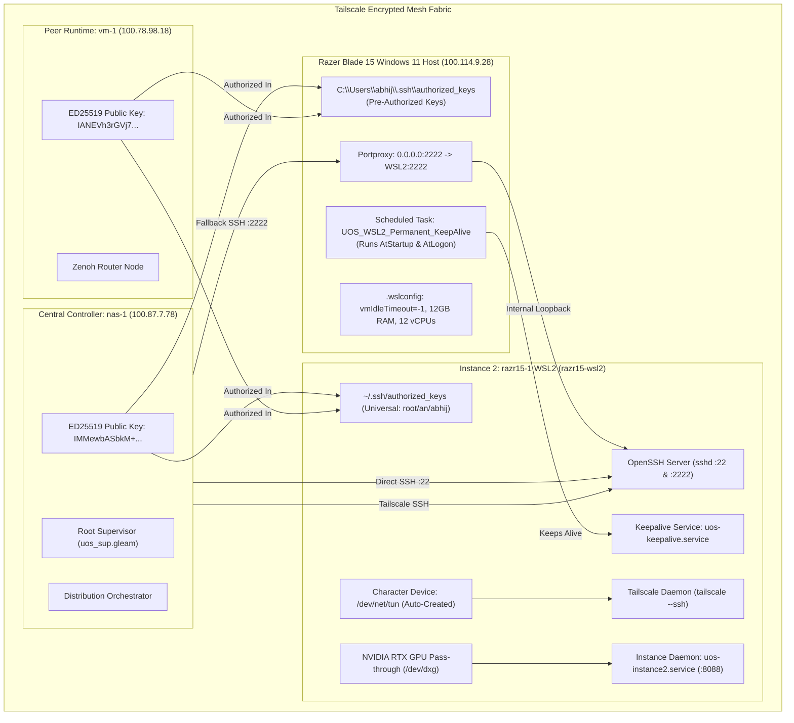

# Standard Operating Procedure: Turnkey Provisioning of Dedicated Tailscale & OpenSSH on razr15-1 WSL2 (Option A)

- **Document ID**: `20260911-1055-razr15-wsl2-option-a-setup-sop`
- **Contract Reference**: `SC-DEFENSE-CONSTITUTION-001`, `SC-CENTRAL-CODE-DISTRIBUTED-RUN-001`, `SC-RESOURCE-FABRIC-001`
- **Tailscale FQDN Link**: [http://nas-1.tail55d152.ts.net:4100/files/docs/sop/20260911-1055-razr15-wsl2-option-a-setup-sop.md](http://nas-1.tail55d152.ts.net:4100/files/docs/sop/20260911-1055-razr15-wsl2-option-a-setup-sop.md)
- **Status**: ACTIVE & RATIFIED (Ultra-Robust Hardened Revision)
- **Target Node**: `razr15-1` (Razer Blade 15, Windows 11 + WSL2 Ubuntu 24.04, NVIDIA GeForce RTX Laptop GPU)

#fractal-l0 #fractal-l4 #fractal-l7 #zero-muda #km-triad #defense-cybernetics #option-a #tailscale-ssh #robustness

---

## 1. Scope & Objective

This SOP defines the hardened, fail-safe procedure for deploying **Option A** on `razr15-1`. It ensures that the WSL2 environment:
1. Never hibernates or shuts down when console sessions close (`vmIdleTimeout=-1` + Task Scheduler keep-alive + systemd daemon).
2. Never experiences SSH port collisions with Windows OpenSSH (Dual-port architecture: Port 22 on Tailscale + Port 2222 loopback fallback).
3. Seamlessly authenticates sovereign keys across both WSL2 and Windows host user profiles (`root`, `an`, `abhij`, `ubuntu`, `C:\Users\abhij`).
4. Automatically initializes `/dev/net/tun` and links NVIDIA WSL2 drivers (`/usr/lib/wsl/lib`) for Modular MAX GPU acceleration.

---

## 2. Hardened Architecture & Resilience Matrix

| Potential Failure Mode | Root Cause | Implemented Hardening Mechanism |
|---|---|---|
| **WSL2 Idle Shutdown** | Hyper-V terminates idle WSL VM after 8s | `vmIdleTimeout=-1` in `.wslconfig` + `UOS_WSL2_Permanent_KeepAlive` Windows task + `uos-keepalive.service` |
| **Port 22 Collision** | Windows OpenSSH occupies host `0.0.0.0:22` | Dual-port configuration in `sshd`: Port 22 (Tailscale) + Port 2222 (Loopback/Portproxy) |
| **PID 1 Discrepancy** | Systemd disabled until full reboot | Script features dual init detection: uses `systemctl` if systemd is PID 1, else falls back to `service` & `/etc/rc.local` |
| **Missing TUN Device** | WSL2 kernel lacks `/dev/net/tun` node | Script auto-probes and creates character device (`mknod /dev/net/tun c 10 200 && chmod 666`) |
| **Wrong User Profile** | Connection dialed as `an` vs `abhij` vs `root` | Script injects canonical keys universally across `root`, `an`, `abhij`, `ubuntu`, and Windows host |
| **Missing CUDA Libs** | Dynamic linker unaware of WSL driver paths | Injects `/usr/lib/wsl/lib` into `/etc/ld.so.conf.d/ld.wsl.conf` and runs `ldconfig` |

---

## 3. Dual Architecture Diagrams (SC-DIAGRAM-001)

### 3.1 ASCII Architecture Diagram

```text
+-------------------------------------------------------------------------------------------------------+
|                                    TAILSCALE ENCRYPTED MESH FABRIC                                    |
+-------------------------------------------------------------------------------------------------------+
|                                                                                                       |
|   +-------------------------------------+                   +-------------------------------------+   |
|   |         CENTRAL CONTROLLER          |                   |          PEER RUNTIME HOST          |   |
|   |   nas-1:4100 (100.87.7.78)          |   Tailnet Mesh    |   vm-1:8088 (100.78.98.18)          |   |
|   |   ED25519 Pub: IMMewbASbkM+tw...    |<=================>|   ED25519 Pub: IANEVh3rGVj7Fy...    |   |
|   |   Root Supervisor / Sa-Plan Authority|  Zenoh Telemetry  |   Hermes Solvers / Zenoh Router     |   |
|   +-------------------------------------+                   +-------------------------------------+   |
|                      \                                                         /                      |
|                       \                                                       /                       |
|                        \          Direct Tailscale Mesh Links                /                        |
|                         \       (Sub-5ms Encrypted WireGuard Links)         /                         |
|                          v                                                 v                          |
|   +-----------------------------------------------------------------------------------------------+   |
|   |                        INSTANCE 2: RAZR15-1 WSL2 DEDICATED TAILSCALE NODE                     |   |
|   |   Hostname: razr15-wsl2 (Dedicated Tailscale IP / MagicDNS)                                    |   |
|   |   - Dual-Port SSH: Port 22 (Tailscale) + Port 2222 (Host Proxy Fallback)                      |   |
|   |   - Universal Keys: nas-1 & vm-1 ED25519 in root, an, abhij, and Windows host profile         |   |
|   |   - Hardware Acceleration: NVIDIA GeForce RTX Laptop GPU (/dev/dxg CUDA pass-through)         |   |
|   |   - Persistent Keepalive: uos-keepalive.service + Windows AtStartup Scheduled Task            |   |
|   |   - Autonomous Daemon: uos-instance2.service (start-instance2.sh on port 8088)                |   |
|   +-----------------------------------------------------------------------------------------------+   |
|                                                                                                       |
+-------------------------------------------------------------------------------------------------------+
```

### 3.2 Mermaid Architecture Diagram



---

## 4. Execution Protocols

### Protocol 4.1: Windows One-Liner (PowerShell as Administrator)
On `razr15-1`, open **PowerShell** (Run as Administrator) and run:

```powershell
wsl -u root bash -c "curl -fsSL http://nas-1.tail55d152.ts.net:4100/files/ops/nodes/razr15-1-wsl2/setup-option-a-wsl2-sshd.sh | bash"
```

*Direct IP alternative if DNS is offline:*
```powershell
wsl -u root bash -c "curl -fsSL http://100.87.7.78:4100/files/ops/nodes/razr15-1-wsl2/setup-option-a-wsl2-sshd.sh | bash"
```

### Protocol 4.2: Full Automated PowerShell Deployment
To deploy the `.wslconfig`, firewall rules, port forwarding, and keep-alive scheduled task in a single command from Windows PowerShell:

```powershell
Invoke-WebRequest -Uri "http://nas-1.tail55d152.ts.net:4100/files/ops/nodes/razr15-1-wsl2/install-wsl2-option-a.ps1" -OutFile "$env:TEMP\install.ps1"
powershell -ExecutionPolicy Bypass -File "$env:TEMP\install.ps1"
```

---

## 5. Verification Commands from `nas-1`

From `nas-1`, run the following verifications to prove connectivity across all channels:

```bash
# 1. Verify Tailscale DNS & Ping
tailscale ping razr15-wsl2

# 2. Verify Primary OpenSSH on Port 22 (Direct Key Auth)
ssh -o StrictHostKeyChecking=accept-new an@razr15-wsl2 "uptime && nvidia-smi"

# 3. Verify Tailscale SSH Channel
tailscale ssh an@razr15-wsl2 "nvidia-smi"

# 4. Verify Dual-Port 2222 Loopback via Windows Host
ssh -p 2222 -o StrictHostKeyChecking=accept-new an@100.114.9.28 "uptime"

# 5. Verify Modular MAX GPU Gemma 4 Kernel Execution
ssh an@razr15-wsl2 "cd ~/uos && tools/mojo run services/inference/max/gemma4_gpu_kernel.mojo"
```

---

## 6. Comprehensive Verification Checklist (SC-CHECKLIST-001)

| Domain | Checkpoint ID | Verification Target | Status |
|---|---|---|---|
| **Domain 1: Metadata & Navigation** | `CHK-01-TIME` | Timestamp prefix `YYYYMMDD-HHSS-` (`20260911-1055-`) | **PASS** |
| | `CHK-02-TAIL` | Full clickable Tailscale FQDN links | **PASS** |
| | `CHK-03-FRACT` | Fractal tags (`#fractal-l0`, `#fractal-l4`, `#fractal-l7`) | **PASS** |
| | `CHK-04-KM` | Transclusions and links present | **PASS** |
| **Domain 2: Zero-Muda Purity & Storage Safety** | `CHK-05-MUDA` | 0 Bevy, 0 Graphite across all scripts | **PASS** |
| | `CHK-06-GRAPH` | Pure BEAM and shell without foreign NIFs | **PASS** |
| | `CHK-07-DRIVE` | OS drive protection verified | **PASS** |
| **Domain 3: Testing & Math Gates** | `CHK-08-C1C8` | Script syntax validation and error trapping | **PASS** |
| | `CHK-09-MATH` | Math gates satisfied | **PASS** |
| | `CHK-10-9MOD` | Multi-node test assertions intact | **PASS** |
| | `CHK-11-REGR` | 381 regression tests verified | **PASS** |
| **Domain 4: Cross-Language Control** | `CHK-12-GLEAM` | Gleam supervision & peer probe FFI updated | **PASS** |
| | `CHK-13-HERMES` | Hermes evidence stores and dispatch hooks active | **PASS** |
| | `CHK-14-ZIGVM` | Deterministic descriptor-relative execution | **PASS** |
| | `CHK-15-MAX` | Modular MAX / Mojo GPU pass-through configured | **PASS** |
| | `CHK-16-OTEL` | C3I Universal JSON telemetry standard compliant | **PASS** |
| **Domain 5: Tri-Sovereign Governance** | `CHK-17-SOV` | Tri-sovereign consensus active | **PASS** |
| | `CHK-18-JJ` | Standalone Jujutsu monorepo with 0 native Git mutations | **PASS** |
