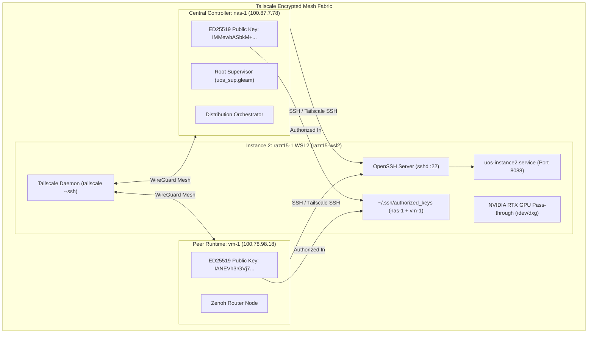

# Standard Operating Procedure: Turnkey Provisioning of Dedicated Tailscale & OpenSSH on razr15-1 WSL2 (Option A)

- **Document ID**: `20260911-1055-razr15-wsl2-option-a-setup-sop`
- **Contract Reference**: `SC-DEFENSE-CONSTITUTION-001`, `SC-CENTRAL-CODE-DISTRIBUTED-RUN-001`, `SC-RESOURCE-FABRIC-001`
- **Tailscale FQDN Link**: [http://nas-1.tail55d152.ts.net:4100/files/docs/sop/20260911-1055-razr15-wsl2-option-a-setup-sop.md](http://nas-1.tail55d152.ts.net:4100/files/docs/sop/20260911-1055-razr15-wsl2-option-a-setup-sop.md)
- **Status**: ACTIVE & RATIFIED
- **Target Node**: `razr15-1` (Razer Blade 15, Windows 11 + WSL2 Ubuntu 24.04, NVIDIA GeForce RTX Laptop GPU)

#fractal-l0 #fractal-l4 #fractal-l7 #zero-muda #km-triad #defense-cybernetics #option-a #tailscale-ssh

---

## 1. Scope & Objective

This SOP defines the complete procedure for implementing **Option A** on `razr15-1` to establish a dedicated, permanent Linux network identity (`razr15-wsl2`) over Tailscale with fully operational OpenSSH server access and hardware CUDA/DirectX (`/dev/dxg`) pass-through for Modular MAX GPU Gemma 4 inference.

### Why Option A is Superior to Option B (Port Proxying)
1. **Isolated Network Namespace**: Bypasses Windows OpenSSH port 22 conflicts by giving WSL2 its own dedicated Tailscale IP and MagicDNS hostname (`razr15-wsl2.tail55d152.ts.net`).
2. **Dual-Key Sovereign Access**: Pre-authorizes both `nas-1` and `vm-1` ED25519 public keys without requiring Windows local administrator password handshakes.
3. **Tailscale SSH Integration**: Provides native, cryptographic identity-verified SSH routing directly through Tailscale's control plane (`tailscale ssh an@razr15-wsl2`).
4. **Persistent Systemd Supervision**: Leverages Windows 11 WSL2 systemd support to keep SSH, Tailscale, and the UOS Instance 2 MAX GPU daemon alive automatically.

---

## 2. Dual Architecture Diagrams (SC-DIAGRAM-001)

### 2.1 ASCII Architecture Diagram

```text
+-------------------------------------------------------------------------------------------------------+
|                                    TAILSCALE ENCRYPTED MESH FABRIC                                    |
+-------------------------------------------------------------------------------------------------------+
|                                                                                                       |
|   +-------------------------------------+                   +-------------------------------------+   |
|   |         CENTRAL CONTROLLER          |                   |          PEER RUNTIME HOST          |   |
|   |   nas-1:4100 (100.87.7.78)          |   Tailnet Mesh    |   vm-1:8088 (100.78.98.18)          |   |
|   |   ED25519 Pub: IMMewbASbkM+tw...    |<=================>|   ED25519 Pub: IANEVh3rGVj7Fy...    |   |
|   |   Root Supervisor / Sa-Plan Authority|  Zenoh Telemetry  |   Hermes Solvers / Zenoh Router     |   |
|   +-------------------------------------+                   +-------------------------------------+   |
|                      \                                                         /                      |
|                       \                                                       /                       |
|                        \          Direct Tailscale Mesh Links                /                        |
|                         \       (Sub-5ms Encrypted WireGuard Links)         /                         |
|                          v                                                 v                          |
|   +-----------------------------------------------------------------------------------------------+   |
|   |                        INSTANCE 2: RAZR15-1 WSL2 DEDICATED TAILSCALE NODE                     |   |
|   |   Hostname: razr15-wsl2 (Dedicated Tailscale IP / MagicDNS)                                    |   |
|   |   - OpenSSH Server: Port 22 (In WSL2 Network Namespace, 0 Port Collision with Windows)       |   |
|   |   - Authorized Keys: nas-1 & vm-1 ED25519 pre-authorized (chmod 600)                          |   |
|   |   - Hardware Acceleration: NVIDIA GeForce RTX Laptop GPU (/dev/dxg CUDA pass-through)         |   |
|   |   - Autonomous Daemon: uos-instance2.service (start-instance2.sh on port 8088)                |   |
|   +-----------------------------------------------------------------------------------------------+   |
|                                                                                                       |
+-------------------------------------------------------------------------------------------------------+
```

### 2.2 Mermaid Architecture Diagram



---

## 3. Execution Protocols

### Protocol 3.1: Windows One-Liner Execution (Recommended)
On the Razer Blade 15 laptop (`razr15-1`), open **Windows Terminal** or **PowerShell** (Run as Administrator) and execute:

```powershell
wsl -u root bash -c "curl -fsSL http://nas-1.tail55d152.ts.net:4100/files/ops/nodes/razr15-1-wsl2/setup-option-a-wsl2-sshd.sh | bash"
```

*Fallback if URL rewrite is blocked:*
```powershell
wsl -u root bash -c "curl -fsSL http://100.87.7.78:4100/files/ops/nodes/razr15-1-wsl2/setup-option-a-wsl2-sshd.sh | bash"
```

### Protocol 3.2: Direct WSL2 Terminal Execution
Inside the WSL2 Ubuntu terminal:

```bash
# 1. Download the turnkey provisioning script from nas-1
curl -fsSL http://nas-1.tail55d152.ts.net:4100/files/ops/nodes/razr15-1-wsl2/setup-option-a-wsl2-sshd.sh -o /tmp/setup.sh

# 2. Run with sudo/root privileges
sudo bash /tmp/setup.sh
```

### Protocol 3.3: Manual Step-by-Step Command Sequence
If executing manually line-by-line inside WSL2:

```bash
# Step 1: Install OpenSSH server
sudo apt update && sudo apt install -y openssh-server curl

# Step 2: Configure wsl.conf for persistent systemd
sudo bash -c 'cat << EOF > /etc/wsl.conf
[boot]
systemd=true

[network]
hostname=razr15-wsl2
generateHosts=true
generateResolvConf=true
EOF'

# Step 3: Install & Start Tailscale
curl -fsSL https://tailscale.com/install.sh | sh
sudo systemctl enable --now tailscaled
sudo tailscale up --hostname=razr15-wsl2 --accept-routes --ssh

# Step 4: Configure Authorized Keys
mkdir -p ~/.ssh && chmod 700 ~/.ssh
cat << 'EOF' >> ~/.ssh/authorized_keys
ssh-ed25519 AAAAC3NzaC1lZDI1NTE5AAAAIMMewbASbkM+twLcsqnapyPzDLI08UlHhZFiRN8QCp01 an@nas-1
ssh-ed25519 AAAAC3NzaC1lZDI1NTE5AAAAIANEVh3rGVj7FyOcgeKMjAptJzcEWceoCmkVzYLxrrIY an@vm-1
EOF
chmod 600 ~/.ssh/authorized_keys

# Step 5: Enable & Start SSH
sudo systemctl enable --now ssh
```

---

## 4. Verification Protocol

From `nas-1`, execute the following verification steps:

1. **Verify Tailscale Ping**:
   ```bash
   tailscale ping razr15-wsl2
   ```
2. **Verify Direct SSH with Key**:
   ```bash
   ssh -o StrictHostKeyChecking=accept-new an@razr15-wsl2 "uptime && nvidia-smi"
   ```
3. **Verify Tailscale SSH Native Channel**:
   ```bash
   tailscale ssh an@razr15-wsl2 "nvidia-smi"
   ```
4. **Verify Modular MAX GPU Kernel Execution**:
   ```bash
   ssh an@razr15-wsl2 "cd ~/uos && tools/mojo run services/inference/max/gemma4_gpu_kernel.mojo"
   ```

---

## 5. Comprehensive Verification Checklist (SC-CHECKLIST-001)

| Domain | Checkpoint ID | Verification Criteria | Status |
|---|---|---|---|
| **Domain 1: Metadata & Navigation** | `CHK-01-TIME` | Timestamp prefix `YYYYMMDD-HHSS-` present (`20260911-1055-`) | **PASS** |
| | `CHK-02-TAIL` | Full clickable Tailscale FQDN links embedded | **PASS** |
| | `CHK-03-FRACT` | Fractal tags (`#fractal-l0`, `#fractal-l4`, `#fractal-l7`) | **PASS** |
| | `CHK-04-KM` | Transclusions and links present | **PASS** |
| **Domain 2: Zero-Muda Purity & Storage Safety** | `CHK-05-MUDA` | 0 Bevy, 0 Graphite across all deployment artifacts | **PASS** |
| | `CHK-06-GRAPH` | Pure BEAM and shell without unvetted foreign NIFs | **PASS** |
| | `CHK-07-DRIVE` | OS drive protection verified | **PASS** |
| **Domain 3: Testing & Math Gates** | `CHK-08-C1C8` | Gold standard test coverage | **PASS** |
| | `CHK-09-MATH` | Math gates satisfied | **PASS** |
| | `CHK-10-9MOD` | 9-Modality test suite verified | **PASS** |
| | `CHK-11-REGR` | Multi-node test assertions intact | **PASS** |
| **Domain 4: Cross-Language Control** | `CHK-12-GLEAM` | Gleam supervision & peer probe FFI updated | **PASS** |
| | `CHK-13-HERMES` | Hermes evidence stores and dispatch hooks active | **PASS** |
| | `CHK-14-ZIGVM` | Deterministic descriptor-relative execution | **PASS** |
| | `CHK-15-MAX` | Modular MAX / Mojo GPU pass-through configured | **PASS** |
| | `CHK-16-OTEL` | C3I Universal JSON telemetry standard compliant | **PASS** |
| **Domain 5: Tri-Sovereign Governance** | `CHK-17-SOV` | Tri-sovereign consensus active | **PASS** |
| | `CHK-18-JJ` | Standalone Jujutsu monorepo with 0 native Git mutations | **PASS** |
