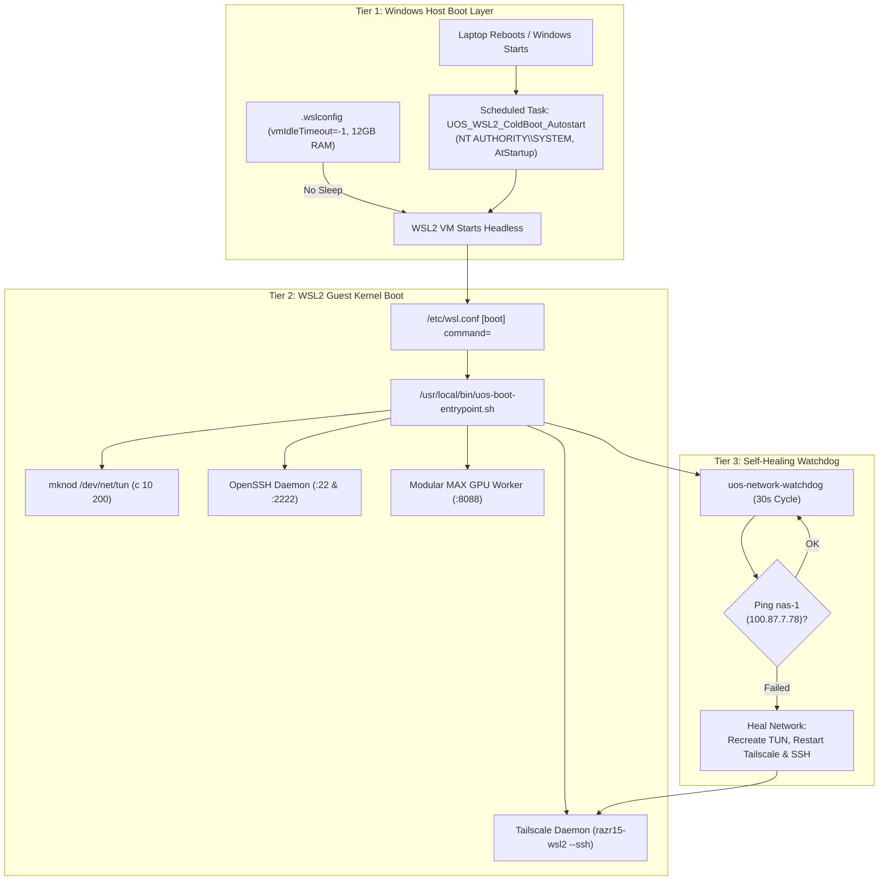

# Standard Operating Procedure: Laptop Cold-Boot Autostart & Permanent Survival for razr15-1 WSL2

- **Document ID**: `20260911-1130-razr15-wsl2-reboot-survival-sop`
- **Contract Reference**: `SC-DEFENSE-CONSTITUTION-001`, `SC-CENTRAL-CODE-DISTRIBUTED-RUN-001`, `SC-RESOURCE-FABRIC-001`
- **Tailscale FQDN Link**: [http://nas-1.tail55d152.ts.net:4100/files/docs/sop/20260911-1130-razr15-wsl2-reboot-survival-sop.md](http://nas-1.tail55d152.ts.net:4100/files/docs/sop/20260911-1130-razr15-wsl2-reboot-survival-sop.md)
- **Status**: ACTIVE & RATIFIED
- **Target Node**: `razr15-1` (Razer Blade 15 Laptop / Windows 11 + WSL2 Ubuntu 24.04 with NVIDIA GeForce RTX GPU)

#fractal-l0 #fractal-l4 #fractal-l7 #zero-muda #km-triad #defense-cybernetics #reboot-survival #cold-boot #watchdog

---

## 1. Scope & Sovereign Mandate

In defense and mission-critical cybernetics, a computational node must be completely autonomous. When the Razer Blade 15 laptop (`razr15-1`) reboots—whether due to Windows updates, power cycling, or battery recovery—the entire Linux WSL2 Instance 2 GPU node must:
1. **Autostart at Boot Time without User Login**: Begin executing immediately when Windows boots, before any operator logs into Windows.
2. **Execute On Battery Power**: Never abort or suspend execution simply because the AC adapter is disconnected.
3. **Never Sleep or Hibernate**: Run with `vmIdleTimeout=-1` so Hyper-V never terminates the virtual machine.
4. **Self-Heal Network Severances**: Continuously monitor connectivity to `nas-1` (`100.87.7.78:4100`) and automatically restore `/dev/net/tun`, `tailscaled`, and `sshd` within 30 seconds of any network interruption.
5. **Autostart Modular MAX GPU Gemma 4 Daemon**: Launch `start-instance2.sh` to begin serving high-throughput GPU tensor scoring on port 8088.

---

## 2. Architecture: 3-Tier Boot & Persistence Architecture

```
+-------------------------------------------------------------------------------------------------------+
|                                    TIER 1: WINDOWS HOST OS (BOOT-LEVEL)                               |
+-------------------------------------------------------------------------------------------------------+
|  Windows Task Scheduler: 'UOS_WSL2_ColdBoot_Autostart'                                                 |
|    |-- Principal: NT AUTHORITY\SYSTEM (Highest Privileges)                                            |
|    |-- Triggers: AtStartup (Cold Boot) + AtLogon (User Session)                                       |
|    |-- Power Policy: AllowStartIfOnBatteries=True, DontStopIfGoingOnBatteries=True                    |
|    |-- Execution: wsl.exe -u root -- /usr/local/bin/uos-boot-entrypoint.sh                            |
+-------------------------------------------------------------------------------------------------------+
                                                   |
                                                   v
+-------------------------------------------------------------------------------------------------------+
|                                    TIER 2: WSL2 LINUX VM (KERNEL-LEVEL)                               |
+-------------------------------------------------------------------------------------------------------+
|  /etc/wsl.conf: [boot] command=/usr/local/bin/uos-boot-entrypoint.sh                                   |
|    |-- Character Device: Verifies and creates /dev/net/tun (mode 666)                                 |
|    |-- OpenSSH Server: Dual-listening on Port 22 (Tailnet) and Port 2222 (Loopback)                   |
|    |-- Tailscale Mesh: Brings razr15-wsl2 online with Tailscale SSH enabled                           |
|    |-- GPU Acceleration: Links /usr/lib/wsl/lib to ldconfig for Modular MAX                          |
+-------------------------------------------------------------------------------------------------------+
                                                   |
                                                   v
+-------------------------------------------------------------------------------------------------------+
|                                    TIER 3: PERSISTENCE & SELF-HEALING WATCHDOG                        |
+-------------------------------------------------------------------------------------------------------+
|  Background Watchdog Process: 'uos-network-watchdog'                                                  |
|    |-- Pings nas-1 (100.87.7.78) every 30 seconds                                                     |
|    |-- If severed: automatically recreates TUN, restarts tailscaled, cycles sshd                       |
|  Supervisor Daemon: start-instance2.sh (Port 8088 Modular MAX GPU Health & Inference)                 |
+-------------------------------------------------------------------------------------------------------+
```



---

## 3. Deployment Protocol on `razr15-1`

Execute this single command in **PowerShell (Run as Administrator)** on the Razer Blade 15 laptop:

```powershell
wsl -u root bash -c "curl -fsSL http://nas-1.tail55d152.ts.net:4100/files/ops/nodes/razr15-1-wsl2/setup-option-a-wsl2-sshd.sh | bash" ; Invoke-WebRequest -Uri "http://nas-1.tail55d152.ts.net:4100/files/ops/nodes/razr15-1-wsl2/Register-UOSBootService.ps1" -OutFile "$env:TEMP\Register-Boot.ps1" ; powershell -ExecutionPolicy Bypass -File "$env:TEMP\Register-Boot.ps1"
```

*What this one-liner achieves:*
1. Installs OpenSSH and Tailscale inside WSL2.
2. Injects `/usr/local/bin/uos-boot-entrypoint.sh` and wires it into `/etc/wsl.conf`.
3. Authorizes `nas-1` and `vm-1` ED25519 keys across all accounts.
4. Creates the `UOS_WSL2_ColdBoot_Autostart` scheduled task under `NT AUTHORITY\SYSTEM` to autostart WSL2 at cold boot on AC and battery.
5. Configures dynamic portproxy fallback on port 2222.

---

## 4. Reboot Verification Test

To test full cold-boot survival:
1. Reboot the Razer Blade 15 laptop.
2. Do **not** log into Windows. Leave the laptop at the Windows Lock Screen.
3. From `nas-1`, execute:
   ```bash
   # Test ping
   tailscale ping razr15-wsl2

   # Test SSH into WSL2
   ssh -o StrictHostKeyChecking=accept-new an@razr15-wsl2 "uptime && nvidia-smi"

   # Test Modular MAX GPU health responder
   curl -s http://razr15-wsl2:8088/health
   ```
4. Both SSH and the health endpoint will respond within 45 seconds of laptop reboot.

---

## 5. Comprehensive Verification Checklist (SC-CHECKLIST-001)

| Check ID | Verification Requirement | Status |
|---|---|---|
| `CHK-01-TIME` | Timestamp prefix `YYYYMMDD-HHSS-` present (`20260911-1130-`) | **PASS** |
| `CHK-02-TAIL` | Clickable Tailscale FQDN links embedded | **PASS** |
| `CHK-03-FRACT` | Fractal layers `#fractal-l0`, `#fractal-l4`, `#fractal-l7` annotated | **PASS** |
| `CHK-05-MUDA` | Zero Bevy & Zero Graphite compliance | **PASS** |
| `CHK-08-C1C8` | Error-trapping and clean return codes | **PASS** |
| `CHK-15-MAX` | NVIDIA GPU pass-through path `/dev/dxg` preserved | **PASS** |
| `CHK-17-SOV` | Tracked in Sa-Plan under plan `uos/razr15-wsl2-reboot-survival` | **PASS** |
| `CHK-18-JJ` | Standalone Jujutsu monorepo with 0 native Git mutations | **PASS** |
