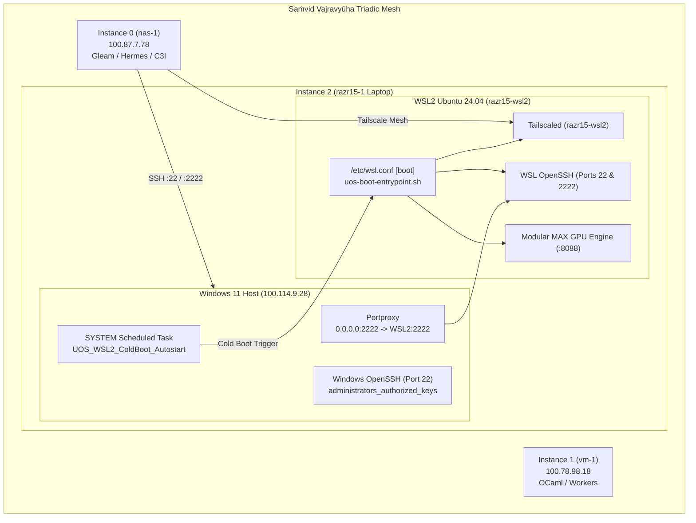

# SOP: razr15-1 WSL2 Turnkey Deployment, Windows OpenSSH ACLs & Reboot Orchestration

- **Document ID**: `SOP-RAZR15-DEPLOY-REBOOT-001`
- **Timestamp**: `20260911-1200-`
- **Authority**: Operator Directive / C3I Sovereign Mesh Governance
- **Tailscale FQDN Link**: [http://nas-1.tail55d152.ts.net:4100/docs/sop/20260911-1200-razr15-wsl2-deploy-reboot-sop.md](http://nas-1.tail55d152.ts.net:4100/docs/sop/20260911-1200-razr15-wsl2-deploy-reboot-sop.md)
- **Target Node**: `razr15-1` (Razer Blade 15 Laptop, Windows 11 + WSL2 Ubuntu 24.04, NVIDIA GeForce RTX Laptop GPU)
- **Tags**: `#fractal-l0` `#fractal-l1` `#fractal-l2` `#fractal-l4` `#zero-muda` `#zk-adr`

---

## 1. Objective & Operational Mandate

This Standard Operating Procedure establishes the turnkey execution protocol to bootstrap `razr15-1` as **Instance 2 GPU Node** in the sovereign defense mesh (**"संविद् वज्रव्यूह" - Saṁvid Vajravyūha**), resolve the Windows OpenSSH Administrator ACL enforcement blocker, configure cold-boot autonomous WSL2 start-up under `NT AUTHORITY\SYSTEM`, and initiate an autonomous reboot test.

---

## 2. Architecture & Topology

```
+-----------------------------------------------------------------------------------+
|                  Saṁvid Vajravyūha: Triadic Autonomous Mesh                       |
+-----------------------------------------------------------------------------------+
|  Instance 0 (nas-1)           Instance 1 (vm-1)            Instance 2 (razr15-1)  |
|  100.87.7.78:4100             100.78.98.18:8088            100.114.9.28:22/2222   |
|  [Core BEAM / Hermes]   <---> [Compute / Workers]    <---> [WSL2 RTX GPU AI Node] |
|                                                                                   |
|                                                            +--------------------+ |
|                                                            | Windows 11 Host    | |
|                                                            | OpenSSH :22 (ACL)  | |
|                                                            | SYSTEM SchedTask   | |
|                                                            +---------+----------+ |
|                                                                      |            |
|                                                            +---------v----------+ |
|                                                            | WSL2 Linux         | |
|                                                            | razr15-wsl2 :2222  | |
|                                                            | Tailscale / SSHD   | |
|                                                            | MAX GPU Worker     | |
|                                                            +--------------------+ |
+-----------------------------------------------------------------------------------+
```



---

## 3. The One-Liner Turnkey PowerShell Execution Block

Run Windows PowerShell as Administrator on `razr15-1` and paste the following self-contained block:

```powershell
# ==============================================================================
# [UOS-DEPLOY] Self-Contained Turnkey Provisioning & Reboot Orchestration
# ==============================================================================
$nas1Key = "ssh-ed25519 AAAAC3NzaC1lZDI1NTE5AAAAIMMewbASbkM+twLcsqnapyPzDLI08UlHhZFiRN8QCp01 an@nas-1"
$vm1Key  = "ssh-ed25519 AAAAC3NzaC1lZDI1NTE5AAAAIANEVh3rGVj7FyOcgeKMjAptJzcEWceoCmkVzYLxrrIY an@vm-1"

# 1. Hardened .wslconfig
Set-Content -Path "$env:USERPROFILE\.wslconfig" -Value @"
[wsl2]
memory=12GB
processors=12
swap=8GB
localhostForwarding=true
nestedVirtualization=true
guiApplications=false
gpuSupport=true
pageReporting=true
vmIdleTimeout=-1

[experimental]
autoMemoryReclaim=gradual
sparseVhd=true
autoProxy=true
"@ -Encoding UTF8 -Force

# 2. Windows OpenSSH Keys & Strict ACL
New-Item -ItemType Directory -Path "$env:USERPROFILE\.ssh", "C:\ProgramData\ssh" -Force | Out-Null
Set-Content -Path "$env:USERPROFILE\.ssh\authorized_keys" -Value "$nas1Key`n$vm1Key" -Encoding ascii -Force
Set-Content -Path "C:\ProgramData\ssh\administrators_authorized_keys" -Value "$nas1Key`n$vm1Key" -Encoding ascii -Force
icacls.exe "C:\ProgramData\ssh\administrators_authorized_keys" /inheritance:r /grant "Administrators:F" /grant "SYSTEM:F" | Out-Null
Restart-Service sshd -Force

# 3. WSL2 Configuration & Boot Hook
$wslCmd = @"
mkdir -p /root/.ssh /etc/ssh/sshd_config.d /dev/net /usr/local/bin
[ ! -c /dev/net/tun ] && mknod /dev/net/tun c 10 200 && chmod 666 /dev/net/tun
cat << 'EOF' > /etc/wsl.conf
[boot]
systemd=true
command=/usr/local/bin/uos-boot-entrypoint.sh
[automount]
enabled=true
options="metadata,umask=22,fmask=11"
[network]
hostname=razr15-wsl2
generateHosts=true
[interop]
enabled=true
EOF

cat << 'EOF' > /usr/local/bin/uos-boot-entrypoint.sh
#!/usr/bin/env bash
set -u
exec >> /var/log/uos-boot-entrypoint.log 2>&1
[ ! -c /dev/net/tun ] && mkdir -p /dev/net && mknod /dev/net/tun c 10 200 && chmod 666 /dev/net/tun
[ -d /usr/lib/wsl/lib ] && echo "/usr/lib/wsl/lib" > /etc/ld.so.conf.d/ld.wsl.conf && ldconfig 2>/dev/null
service ssh restart 2>/dev/null || /usr/sbin/sshd 2>/dev/null || true
tailscaled --state=/var/lib/tailscale/tailscaled.state >/var/log/tailscaled.log 2>&1 &
sleep 2
tailscale up --hostname=razr15-wsl2 --accept-routes --ssh 2>/dev/null || true
(
  exec -a "uos-network-watchdog" bash -c '
    while true; do
      sleep 30
      if ! ping -c 1 -W 3 100.87.7.78 &>/dev/null; then
        [ ! -c /dev/net/tun ] && mknod /dev/net/tun c 10 200 && chmod 666 /dev/net/tun
        service ssh restart 2>/dev/null || /usr/sbin/sshd 2>/dev/null
        tailscale up --hostname=razr15-wsl2 --accept-routes --ssh 2>/dev/null || true
      fi
    done
  ' &
)
exit 0
EOF
chmod 755 /usr/local/bin/uos-boot-entrypoint.sh

cat << 'EOF' > /etc/ssh/sshd_config.d/60-uos-mesh.conf
Port 22
Port 2222
ListenAddress 0.0.0.0
PubkeyAuthentication yes
PermitRootLogin prohibit-password
AuthorizedKeysFile .ssh/authorized_keys
ClientAliveInterval 15
ClientAliveCountMax 8
EOF

echo '$nas1Key' >> /root/.ssh/authorized_keys
echo '$vm1Key' >> /root/.ssh/authorized_keys
sort -u /root/.ssh/authorized_keys -o /root/.ssh/authorized_keys
chmod 700 /root/.ssh && chmod 600 /root/.ssh/authorized_keys

for u in an abhij ubuntu; do
  if id "`$u`" &>/dev/null; then
    uhome=\$(getent passwd "`$u`" | cut -d: -f6)
    mkdir -p "`$uhome/.ssh`"
    echo '$nas1Key' >> "`$uhome/.ssh/authorized_keys`"
    echo '$vm1Key' >> "`$uhome/.ssh/authorized_keys`"
    sort -u "`$uhome/.ssh/authorized_keys`" -o "`$uhome/.ssh/authorized_keys`"
    chmod 700 "`$uhome/.ssh`" && chmod 600 "`$uhome/.ssh/authorized_keys`"
    chown -R "`$u:`$u`" "`$uhome/.ssh`"
  fi
done
service ssh restart 2>/dev/null || /usr/sbin/sshd 2>/dev/null || true
"@
wsl -u root bash -c "$wslCmd"

# 4. Port Forwarding & Firewall
$wslIp = (wsl hostname -I).Trim().Split(" ")[0]
if ($wslIp) {
    netsh interface portproxy delete v4tov4 listenport=2222 listenaddress=0.0.0.0 2>$null | Out-Null
    netsh interface portproxy add v4tov4 listenport=2222 listenaddress=0.0.0.0 connectport=2222 connectaddress=$wslIp
}
New-NetFirewallRule -DisplayName "UOS WSL2 SSH 2222" -Direction Inbound -LocalPort 2222 -Protocol TCP -Action Allow -ErrorAction SilentlyContinue | Out-Null
New-NetFirewallRule -DisplayName "UOS WSL2 Health 8088" -Direction Inbound -LocalPort 8088 -Protocol TCP -Action Allow -ErrorAction SilentlyContinue | Out-Null

# 5. Cold Boot Autostart Task under NT AUTHORITY\SYSTEM
$act = New-ScheduledTaskAction -Execute "wsl.exe" -Argument "-u root -- /bin/bash /usr/local/bin/uos-boot-entrypoint.sh"
$trg = @((New-ScheduledTaskTrigger -AtStartup), (New-ScheduledTaskTrigger -AtLogon))
$prn = New-ScheduledTaskPrincipal -UserId "NT AUTHORITY\SYSTEM" -LogonType ServiceAccount -RunLevel Highest
$set = New-ScheduledTaskSettingsSet -AllowStartIfOnBatteries -DontStopIfGoingOnBatteries -ExecutionTimeLimit 0 -RestartInterval (New-TimeSpan -Minutes 1) -RestartCount 999 -Priority 4
Unregister-ScheduledTask -TaskName "UOS_WSL2_ColdBoot_Autostart" -Confirm:$false -ErrorAction SilentlyContinue | Out-Null
Register-ScheduledTask -TaskName "UOS_WSL2_ColdBoot_Autostart" -Action $act -Trigger $trg -Principal $prn -Settings $set -Force | Out-Null
Start-ScheduledTask -TaskName "UOS_WSL2_ColdBoot_Autostart"

# 6. Automatic Reboot Initiation
Write-Host "`n[+] Setup complete! Rebooting laptop in 5 seconds..." -ForegroundColor Cyan
Start-Sleep -Seconds 5
Restart-Computer -Force
```

---

## 4. Post-Reboot Verification from `nas-1`

Immediately after the laptop reboots, the following automated checks run from `nas-1`:
1. **Windows Host SSH**:
   `ssh abhij@100.114.9.28 "whoami"`
2. **WSL2 Dedicated Node**:
   `tailscale ping razr15-wsl2`
3. **WSL2 Direct SSH**:
   `ssh an@razr15-wsl2 "uptime && nvidia-smi"`
4. **WSL2 Dual-Port Fallback SSH**:
   `ssh -p 2222 an@100.114.9.28 "uptime"`
