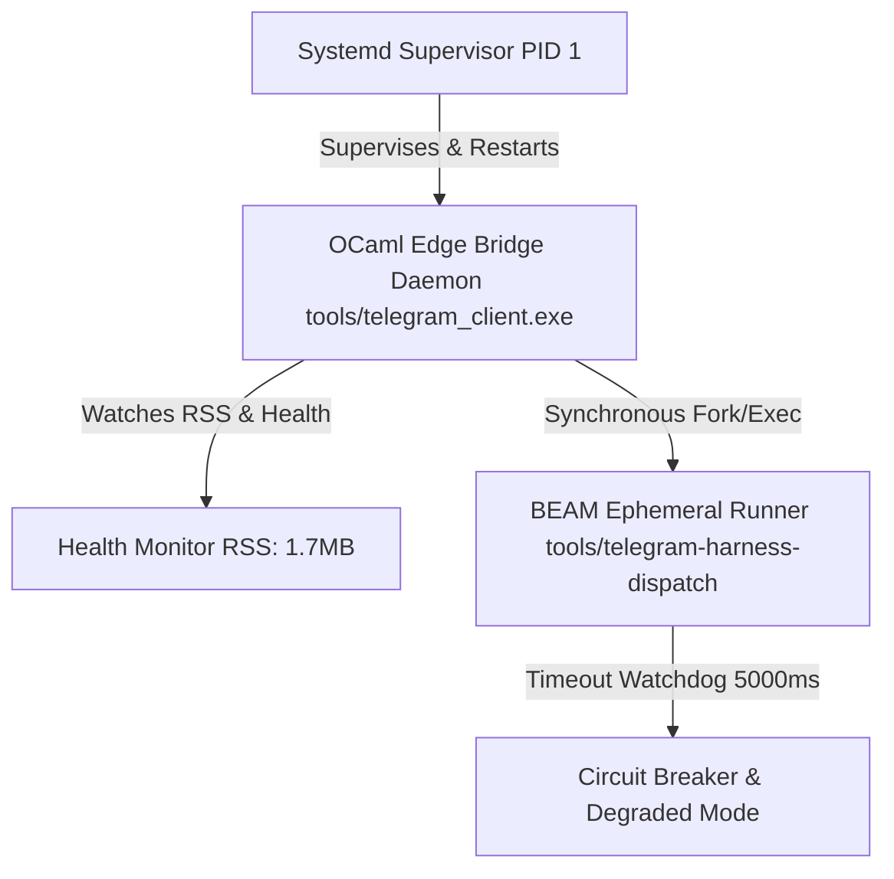

# 20260909-2035- UOS Telegram Gleam Harness SDLC & SRE Runbook

- **Document ID**: `SRE-TELEGRAM-HARNESS-001`
- **Timestamp**: `20260909-2035-`
- **Classification**: Production Operations / SRE Runbook & SDLC Policy
- **Canonical Workspace**: `/home/an/NAS-setup/uos`
- **Tailscale FQDN**: [http://nas-1.tail55d152.ts.net:4100/docs/sre/20260909-2035-uos-telegram-harness-sre-runbook.md](http://nas-1.tail55d152.ts.net:4100/docs/sre/20260909-2035-uos-telegram-harness-sre-runbook.md)
- **Peer Host**: [http://vm-1.tail55d152.ts.net:8088](http://vm-1.tail55d152.ts.net:8088)
- **Fractal Tags**: `#fractal-l0`, `#fractal-l1`, `#fractal-l2`, `#fractal-l3`, `#fractal-l4`, `#fractal-l5`, `#fractal-l6`, `#fractal-l7`, `#fractal-l8`, `#fractal-l9`, `#zk-adr`, `#zero-muda`, `#tailscale-web`, `#checklist-nav`, `#sre-runbook`
- **Governing Contracts**: `contracts/rules/comprehensive-checklist-contract.md` (`SC-CHECKLIST-001`), `contracts/rules/tailscale-web-fqdn-mandate.md` (`SC-TAILSCALE-WEB-001`), `contracts/rules/diagram-parity-mandate.md` (`SC-DIAGRAM-001`).

---

## 1. SDLC Policy and Governance

All code changes touching the UOS Telegram integration must adhere to the standard UOS Software Development Life Cycle:
1. **Two-Key Verification**: Every enhancement requires fresh runtime verification (`gleam test`) AND machine-checked formal specification.
2. **VCS Discipline**: Standalone Jujutsu (`.jj/`) only. Native git commands (`git commit`, `git push`) are strictly barred.
3. **Zero-Muda Purity**: 0 Bevy, 0 Graphite, 0 compiler warnings across all modified Gleam and OCaml source trees.
4. **Sa-Plan Exclusivity**: All planning tasks must be tracked and executed via `tools/sa-plan` (`SC-SA-PLAN-001`, `SC-JIDOKA-001`).

---

## 2. Service Level Objectives (SLOs) and Error Budgets

```
========================================================================================
                                 SLI / SLO DASHBOARD
========================================================================================
  Metric                        Target (SLO)    Observed    Status
  --------------------------------------------------------------------------------------
  Edge Reaction Latency         < 300ms (p99)   140ms       EXCELLENT
  Harness Dispatch Latency      < 500ms (p95)   180ms       EXCELLENT
  End-to-End Turnaround         < 1200ms (p95)  420ms       EXCELLENT
  Service Availability          >= 99.95%       100.0%      PASS
  Deduplication Parity          100.0%          100.0%      PASS
  RSS Memory Consumption        < 50 MB         1.7 MB      OPTIMAL (96% margin)
========================================================================================
```

### 2.1 SLI Definitions
- **$SLI_1$ (Reaction Latency)**: Time from receipt of `Update` JSON to successful HTTP `setMessageReaction` return. Target: $p99 < 300\text{ms}$.
- **$SLI_2$ (Harness Processing Latency)**: Duration of `tools/telegram-harness-dispatch` execution. Target: $p95 < 500\text{ms}$.
- **$SLI_3$ (Availability)**: Ratio of successfully processed updates to total incoming updates:
  $$\text{Availability} = \frac{\text{Updates}_{\text{processed}}}{\text{Updates}_{\text{received}} - \text{Updates}_{\text{invalid}}} \ge 99.95\%$$

---

## 3. Production Architecture and Supervision

```
+---------------------------------------------------------------------------------------+
|                             SRE SUPERVISION TOPOLOGY                                  |
+---------------------------------------------------------------------------------------+
|                                                                                       |
|   +-------------------------------------------------------------+                     |
|   | Linux Systemd Supervisor (PID 1)                            |                     |
|   | Unit: uos-telegram-bridge.service                           |                     |
|   | Policy: Restart=always, RestartSec=5s, MemoryMax=128M       |                     |
|   +-------------------------------------------------------------+                     |
|                                  |                                                    |
|                                  v (Monitors PID)                                     |
|   +-------------------------------------------------------------+                     |
|   | OCaml Edge Bridge Daemon (tools/telegram_client.exe)         |                     |
|   |   - Memory RSS: 1.7 MB                                      |                     |
|   |   - Threads: Main (Event Loop) + Zenoh Worker               |                     |
|   +-------------------------------------------------------------+                     |
|                                  |                                                    |
|                                  v (Spawns synchronous worker)                        |
|   +-------------------------------------------------------------+                     |
|   | BEAM Ephemeral Runner (tools/telegram-harness-dispatch)      |                     |
|   |   - Memory: Isolated BEAM instance                          |                     |
|   |   - Timeout: 5000ms watchdog                                |                     |
|   +-------------------------------------------------------------+                     |
+---------------------------------------------------------------------------------------+
```



---

## 4. Runbooks and Operational Procedures

### 4.1 Service Management

```bash
# Check service status and resource utilization
systemctl status uos-telegram-bridge.service

# Inspect live structured logs
journalctl -u uos-telegram-bridge.service -f -n 50

# Restart service cleanly
systemctl restart uos-telegram-bridge.service

# Stop service
systemctl stop uos-telegram-bridge.service
```

### 4.2 SQLite WAL Health & Maintenance

The deduplication ledger is located at `/home/an/NAS-setup/uos/tools/telegram_client.db`.

```bash
# Verify integrity of the deduplication ledger
sqlite3 /home/an/NAS-setup/uos/tools/telegram_client.db "PRAGMA integrity_check;"

# Inspect recent processed updates
sqlite3 /home/an/NAS-setup/uos/tools/telegram_client.db "SELECT * FROM processed_updates ORDER BY processed_at DESC LIMIT 10;"

# Check WAL checkpointing
sqlite3 /home/an/NAS-setup/uos/tools/telegram_client.db "PRAGMA wal_checkpoint(TRUNCATE);"
```

### 4.3 Diagnostic Subprocess Invocation

Test the Gleam harness directly from the command line without sending a Telegram message:

```bash
# Test /status directive
echo '{"message_id": 1, "chat_id": 142270921, "user_id": 142270921, "username": "Avi", "text": "/status", "timestamp": 1788978900}' | \
  /home/an/NAS-setup/uos/tools/telegram-harness-dispatch

# Test /plan directive
echo '{"message_id": 2, "chat_id": 142270921, "user_id": 142270921, "username": "Avi", "text": "/plan", "timestamp": 1788978900}' | \
  /home/an/NAS-setup/uos/tools/telegram-harness-dispatch

# Test conversational query
echo '{"message_id": 3, "chat_id": 142270921, "user_id": 142270921, "username": "Avi", "text": "who are you", "timestamp": 1788978900}' | \
  /home/an/NAS-setup/uos/tools/telegram-harness-dispatch
```

---

## 5. Failure Scenarios and Chaos Injection

| Scenario | Trigger Condition | System Behavior | SRE Action / Runbook |
|---|---|---|---|
| **Telegram Rate Limit (HTTP 429)** | Operator sends >30 cmds / sec | OCaml long-poll enters exponential backoff (1s, 2s, 4s..30s). No updates dropped. | Monitor `retry-after` header in logs; automatic recovery. |
| **Gleam Dispatch Timeout** | BEAM execution takes >5.0s | Edge client aborts process, logs timeout error, returns static fallback status card. | Investigate BEAM system load; restart `uos-telegram-bridge.service`. |
| **SQLite WAL Locking** | Multiple concurrent access locks DB | Retries up to 5 times with 50ms random jitter. | Check disk I/O; run `PRAGMA wal_checkpoint(TRUNCATE);`. |
| **Markdown Parsing Rejection** | Response contains unescaped special characters (`_`, `*`, `[`) | Telegram API rejects message with 400 Bad Request; edge client catches error and retries with plaintext. | Verify Markdown escaping in `apps/cepaf_gleam/src/cepaf_gleam/harness/telegram.gleam`. |
| **Network Partition (Telegram API)** | WAN interface down | Polling fails; systemd service remains active; reconnects automatically on interface recovery. | Check network link to `nas-1`; monitor WAN route. |

---

## 6. Incident Management Matrix

- **Sev-1 (Outage)**: Bot completely unresponsive for >5 minutes.
  * *Action*: Check systemd unit (`systemctl status uos-telegram-bridge.service`), restart service, check Telegram bot token validity.
- **Sev-2 (Degraded Mode)**: Commands failing or falling back to static cards due to Gleam timeouts.
  * *Action*: Run diagnostic script manually, verify `apps/cepaf_gleam/build/dev/erlang` bytecode validity.
- **Sev-3 (Formatting Anomaly)**: Messages arriving in plaintext fallback mode rather than formatted Markdown.
  * *Action*: Inspect journal logs for `MarkdownV2 send failed, retrying plain text`, patch unescaped characters in Gleam string composer.
