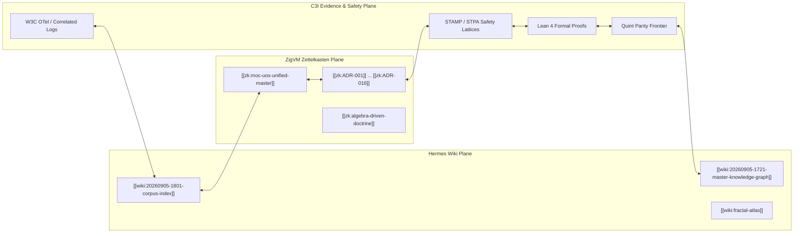

# 20260905-1801-uos-zk-km-corpus-index.md

- **Tailscale Web FQDN**: [http://nas-1.tail55d152.ts.net:4100/docs/wiki/20260905-1801-uos-zk-km-corpus-index.md](http://nas-1.tail55d152.ts.net:4100/docs/wiki/20260905-1801-uos-zk-km-corpus-index.md)
- **Fractal Coordinates**: `#fractal-l0 #fractal-l1 #fractal-l2 #fractal-l3 #fractal-l4 #fractal-l5 #fractal-l6 #fractal-l7 #fractal-l8 #fractal-l9`
- **Knowledge Tags**: `#rocha-semiotics` `#cybernetics` `#km-triad` `#zero-muda` `#tailscale-web`
- **Transclusions**: `[[zk:20260905-1801-moc-uos-unified-master]]` `[[wiki:20260905-1801-uos-zk-km-corpus-index]]`

# UOS Unified Knowledge Graph & Corpus Directory

Tags: `#fractal-l0`, `#fractal-l1`, `#fractal-l2`, `#fractal-l3`, `#fractal-l4`, `#fractal-l5`, `#fractal-l6`, `#fractal-l7`, `#fractal-l8`, `#fractal-l9`, `#zk-adr`, `#zero-muda`, `#km-triad`, `#wiki-index`

## §1.0 Living Knowledge Graph Topology

The Unified Operational System (UOS) synthesizes knowledge artifacts from all language domains and development lineages into a unified directed hypergraph. Each node represents a verified theorem, architectural decision, code contract, or operational standard.

---

## §2.0 Fractal Layer Taxonomy & Knowledge Coordinate Matrix

Every artifact in the knowledge base is located by an explicit 13D trace coordinate:
$$(L, C, F, S, I, P, M, \Phi)$$
where:
- $L \in \{L_0, L_1, \dots, L_9\}$ (Fractal Layer)
- $C$ = Component Identity
- $F$ = Feature Identity
- $S$ = Surface Plane (Lustre Web / Wisp REST / ANSI TUI)
- $I$ = Interaction Semantic
- $P$ = Operational Plane (Control / Data / Evidence / Intelligence)
- $M$ = Migration Disposition
- $\Phi$ = Formal Verification Profile (Lean 4 / Quint / Gospel / Rete-UL)

### Fractal Classification Table

| Layer | Semantic Designation | Governing Specification | ZK Decision Record | Invariant & Proof |
|---|---|---|---|---|
| **$L_0$** | Microkernel Allocator & Constitutional Safety | `contracts/rules/km-wiki-zk-contract.md` | `[[zk:ADR-006]]`, `[[zk:ADR-016]]` | $\Psi_0$: Absolute root NVMe lock (`HARD_DENIED_SYSTEM_OS_SERIAL = "25503L801736"`) |
| **$L_1$** | Term JIT & Atomic Operations | `apps/cepaf_gleam/src/cepaf_gleam/ha/trace_context.gleam` | `[[zk:ADR-002]]`, `[[zk:ADR-003]]` | $\Psi_1$: W3C 128-bit distributed trace correlation; NUL byte ingress trap |
| **$L_2$** | Instruction Dispatch & Domain Components | `apps/cepaf_gleam/src/graphene_nif.erl` | `[[zk:ADR-008]]`, `[[zk:ADR-009]]` | $\Psi_2$: Zero-Muda Graphene exclusion; pure Erlang 2D vector calculation |
| **$L_3$** | Byte Parity & State Transactions | `formal/lean/TwoLattice_STM.lean` | `[[zk:ADR-003]]` | $\Psi_3$: Single-writer exclusive lease; 100-byte SQLite header check |
| **$L_4$** | STM Concurrency & System Runtime | `apps/cepaf_gleam/src/cepaf_gleam/substrate/file_system.gleam` | `[[zk:ADR-011]]` | $\Psi_4$: Non-interference of telemetry reads with WAL writes; Jujutsu monorepo isolation |
| **$L_5$** | Actor Supervision & Cognitive OODA | `apps/cepaf_gleam/src/cepaf_gleam/uos_sup.gleam` | `[[zk:ADR-001]]`, `[[zk:ADR-007]]` | $\Psi_5$: 2oo3 multi-agent consensus; OTP 29 supervisor isolation budgets |
| **$L_6$** | Zero-Trust Gate & Security Interceptor | `engines/hermes/modules/hermes_harness/agent_dispatch_hook.ml` | `[[zk:ADR-002]]`, `[[zk:ADR-004]]` | $\Psi_6$: Authentic Cryptokit SHA-256 tool payload verification; SQL injection trap |
| **$L_7$** | Probabilistic Telemetry & Federation | `contracts/evidence/c3i_fractal_observability_spec.json` | `[[zk:ADR-004]]`, `[[zk:ADR-005]]` | $\Psi_7$: Universal structured C3I JSON logging with non-zero trace ID |
| **$L_8$** | Living Ontology & Knowledge Graph | `docs/wiki/20260905-1721-uos-master-knowledge-graph-and-living-ontology.md` | `[[zk:ADR-010]]`, `[[zk:ADR-014]]` | $\Psi_8$: Bidirectional transclusion completeness; 100% functional mapping |
| **$L_9$** | Autonomous Federation & Self-Evolution | `governance/capability-inventory/wiki-zk-km.toml` | `[[zk:ADR-015]]`, `[[zk:ADR-016]]` | $\Psi_9$: Sovereign operational transfer; 17/17 EV-cycle doctor gates operational |

---

## §3.0 Cross-Language C3I Control Architecture Implementation

The operational system coordinates across five distinct language tiers:

1. **Gleam/OTP 29 (`apps/cepaf_gleam/`)**:
   - High-level actor supervision (`uos_sup.gleam`), MVU presentation (Lustre), REST API (Wisp), ANSI terminal (TUI).
   - Pure functional OODA state loops across all fractal layers.
2. **Hermes OCaml 5.5 (`engines/hermes/`)**:
   - Zero-trust MCP interception (`run_agent_dispatch_hook.exe`) using Cryptokit SHA-256.
   - Wiki lifecycle, AST compilation, and TyXML rendering (`engines/hermes/modules/hermes_wiki`).
   - Differential parity testing and honest skip telemetry reporting (`test_quint_frontier.ml`).
3. **Pure Erlang Engine (`apps/cepaf_gleam/src/graphene_nif.erl`)**:
   - Zero-Muda 2D vector mathematics, polygon transforms, and SVG pipeline.
   - Zero C/Rust NIF shared libraries loaded; 100% pure functional BEAM VM execution.
4. **Rust / Kubernetes Safety Controller (`ops/kubernetes/nas-k8s-lab/`)**:
   - Storage safety interlock locking root NVMe serial `HARD_DENIED_SYSTEM_OS_SERIAL = "25503L801736"`.
   - Library-level invariant enforcement in `kube_apply::apply_all`.
5. **Modular MAX Worker (`services/inference/max/`)**:
   - Isolated AI inference worker running under supervised stdio pipes.

---

## §4.0 Bi-Directional Transclusion Registry

- Permanent MOC: `[[zk:20260905-1801-moc-uos-unified-master]]`
- ADR Directory:
  - `[[zk:ADR-001]]` Closed Rete Fact Schema
  - `[[zk:ADR-002]]` Embedded NUL Byte Trap
  - `[[zk:ADR-003]]` 100-Byte SQLite Header
  - `[[zk:ADR-004]]` Persistent Zenoh Session
  - `[[zk:ADR-005]]` Dual-Host Tailnet Topology
  - `[[zk:ADR-006]]` Twelve-Pillar Fractal Architecture
  - `[[zk:ADR-007]]` Tripartite Cross-Agent Review
  - `[[zk:ADR-008]]` Codebase Unification Strategy
  - `[[zk:ADR-009]]` Functional Relocation into Gleam
  - `[[zk:ADR-010]]` Seven-Level Fractal Granularity
  - `[[zk:ADR-011]]` Tripartite Surface Parity
  - `[[zk:ADR-012]]` Four-Cycle Tripartite Audit
  - `[[zk:ADR-013]]` Multi-Domain Verification
  - `[[zk:ADR-014]]` Comprehensive KPI Integration
  - `[[zk:ADR-015]]` Sovereign Operational Transfer
  - `[[zk:ADR-016]]` Master Fractal Ratification
- Formal Proofs:
  - `[[zk:TwoLattice_STM]]` (`formal/lean/TwoLattice_STM.lean`)
  - `[[zk:Traceability]]` (`formal/lean/Traceability.lean`)
  - `[[zk:parity_frontier]]` (`formal/quint/parity_frontier.qnt`)
- Rule Contracts & Synthesis Tomes:
  - `[[wiki:20260905-2020-uos-grand-synthesis-review-tome-wiki-zk-km]]` ([Grand Synthesis Review Tome](http://nas-1.tail55d152.ts.net:4100/docs/design/20260905-2020-uos-grand-synthesis-review-tome-wiki-zk-km.md))
  - `[[wiki:20260905-1845-uos-wiki-zk-km-synthesis-review-tome]]` ([Synthesis Review Tome](http://nas-1.tail55d152.ts.net:4100/docs/design/20260905-1845-uos-wiki-zk-km-synthesis-review-tome.md))
  - `[[wiki:rocha-semiotics-cybernetics-contract]]` (`contracts/rules/rocha-semiotics-cybernetics-contract.md`)
  - `[[wiki:comprehensive-checklist-contract]]` (`contracts/rules/comprehensive-checklist-contract.md`)
  - `[[wiki:km-wiki-zk-contract]]` (`contracts/rules/km-wiki-zk-contract.md`)
  - `[[wiki:dmc-tcm-mandate]]` (`contracts/rules/dmc-tcm-mandate.md`)
  - `[[wiki:timestamp-mandate]]` (`contracts/rules/timestamp-mandate.md`)
  - `[[wiki:20260906-1635-uos-sa-plan-ocaml-engine-and-actor-ecosystem-wiki]]` ([Sa-Plan Engine & Actor Ecosystem Wiki](http://nas-1.tail55d152.ts.net:4100/docs/docs/wiki/20260906-1635-uos-sa-plan-ocaml-engine-and-actor-ecosystem-wiki.md))
  - `[[wiki:20260906-1700-uos-hermes-bionic-full-integration-wiki]]` ([Hermes-Bionic Full Integration Wiki](http://nas-1.tail55d152.ts.net:4100/docs/docs/wiki/20260906-1700-uos-hermes-bionic-full-integration-wiki.md))
  - `[[zk:ADR-048]]` Hermes-Bionic Full Integration Ratification ([ADR-048 Live View](http://nas-1.tail55d152.ts.net:4100/docs/docs/zk/20260906-1700-adr-048-hermes-bionic-full-integration-ratification.md))
  - `[[wiki:20260906-1730-uos-omni-fractal-matrix-and-17-aspect-wiki]]` ([Omni-Fractal Matrix & 17-Aspect Wiki](http://nas-1.tail55d152.ts.net:4100/docs/docs/wiki/20260906-1730-uos-omni-fractal-matrix-and-17-aspect-wiki.md))
  - `[[zk:ADR-049]]` Omni-Fractal Systemic Symbiosis Ratification ([ADR-049 Live View](http://nas-1.tail55d152.ts.net:4100/docs/docs/zk/20260906-1730-adr-049-omni-fractal-systemic-symbiosis-ratification.md))
  - `[[wiki:20260906-1745-uos-omni-fractal-mainline-merge-and-sovereign-closure-wiki]]` ([Omni-Fractal Mainline Merge & Sovereign Closure Wiki](http://nas-1.tail55d152.ts.net:4100/docs/docs/wiki/20260906-1745-uos-omni-fractal-mainline-merge-and-sovereign-closure-wiki.md))
  - `[[zk:ADR-050]]` Omni-Fractal Mainline Merge & Sovereign Closure ([ADR-050 Live View](http://nas-1.tail55d152.ts.net:4100/docs/docs/zk/20260906-1745-adr-050-omni-fractal-mainline-merge-and-sovereign-closure.md))
  - `[[wiki:20260906-1755-uos-omni-fractal-full-generation-and-systemic-ratification-wiki]]` ([Omni-Fractal Full Generation & Systemic Ratification Wiki](http://nas-1.tail55d152.ts.net:4100/docs/wiki/20260906-1755-uos-omni-fractal-full-generation-and-systemic-ratification-wiki.md))
  - `[[zk:ADR-051]]` Omni-Fractal Cartesian Tensor Generation & Systemic Ratification ([ADR-051 Live View](http://nas-1.tail55d152.ts.net:4100/docs/zk/20260906-1755-adr-051-omni-fractal-full-generation-and-systemic-ratification.md))
  - `[[wiki:20260906-1800-uos-omni-fractal-systemic-cartesian-tensor-closure-wiki]]` ([Omni-Fractal Systemic Cartesian Tensor Closure Wiki](http://nas-1.tail55d152.ts.net:4100/docs/wiki/20260906-1800-uos-omni-fractal-systemic-cartesian-tensor-closure-wiki.md))
  - `[[zk:ADR-052]]` Omni-Fractal Systemic Cartesian Tensor Closure & Live Telemetry Wiring ([ADR-052 Live View](http://nas-1.tail55d152.ts.net:4100/docs/zk/20260906-1800-adr-052-omni-fractal-systemic-cartesian-tensor-closure.md))
  - `[[wiki:20260906-1800-uos-codex-session-handover-and-cartesian-tensor-wiki]]` ([Codex Session Handover Wiki](http://nas-1.tail55d152.ts.net:4100/docs/wiki/20260906-1800-uos-codex-session-handover-and-cartesian-tensor-wiki.md))
  - `[[zk:ADR-053]]` Master Session Handover to OpenAI Codex ([ADR-053 Live View](http://nas-1.tail55d152.ts.net:4100/docs/zk/20260906-1800-adr-053-master-session-handover-to-codex-cartesian-tensor-closure.md))
  - `[[wiki:20260906-1830-uos-15-evolutionary-and-functional-cycles-wiki]]` ([15 Evolutionary & Functional Cycles Wiki](http://nas-1.tail55d152.ts.net:4100/docs/wiki/20260906-1830-uos-15-evolutionary-and-functional-cycles-wiki.md))
  - `[[zk:ADR-054]]` 15 Evolutionary & Functional Cycles Ratification ([ADR-054 Live View](http://nas-1.tail55d152.ts.net:4100/docs/zk/20260906-1830-adr-054-15-evolutionary-and-functional-cycles-ratification.md))
  - `[[wiki:20260906-1900-uos-c3i-integrated-knowledge-runtime-wiki]]` ([C3I Integrated Knowledge Runtime Wiki](http://nas-1.tail55d152.ts.net:4100/docs/wiki/20260906-1900-uos-c3i-integrated-knowledge-runtime-wiki.md))
  - `[[zk:ADR-055]]` C3I Integrated Knowledge Runtime & 15 Evolutionary Cycles Ratification ([ADR-055 Live View](http://nas-1.tail55d152.ts.net:4100/docs/zk/20260906-1900-adr-055-c3i-integrated-knowledge-runtime-and-15-cycles-ratification.md))
  - `[[wiki:20260906-1930-uos-c3i-artifacts-ingestion-and-15-cycles-wiki]]` ([C3I Artifact Ingestion & 15 Wave 3 Cycles Wiki](http://nas-1.tail55d152.ts.net:4100/docs/wiki/20260906-1930-uos-c3i-artifacts-ingestion-and-15-cycles-wiki.md))
  - `[[zk:ADR-056]]` C3I VM-1 Artifacts Ingestion, Gleam Knowledge Actors & 15 Cycles Ratification ([ADR-056 Live View](http://nas-1.tail55d152.ts.net:4100/docs/zk/20260906-1930-adr-056-c3i-artifacts-ingestion-and-15-cycles-ratification.md))
  - `[[wiki:20260906-2000-uos-codex-session-handover-and-wave3-synthesis-wiki]]` ([Codex Session Handover & Wave 3 Synthesis Wiki](http://nas-1.tail55d152.ts.net:4100/docs/wiki/20260906-2000-uos-codex-session-handover-and-wave3-synthesis-wiki.md))
  - `[[zk:ADR-057]]` Master Session Handover to OpenAI Codex & 69 Cycles Transfer ([ADR-057 Live View](http://nas-1.tail55d152.ts.net:4100/docs/zk/20260906-2000-adr-057-master-session-handover-to-codex-and-69-cycles-transfer.md))
  - `[[wiki:20260906-2100-uos-c3i-vertical-slice-and-wave4-synthesis-wiki]]` ([C3I Vertical Slice & Wave 4 Synthesis Wiki](http://nas-1.tail55d152.ts.net:4100/docs/wiki/20260906-2100-uos-c3i-vertical-slice-and-wave4-synthesis-wiki.md))
  - `[[zk:ADR-058]]` C3I Knowledge Runtime Vertical Slice & 15 Wave 4 Evolutionary Cycles Ratification ([ADR-058 Live View](http://nas-1.tail55d152.ts.net:4100/docs/zk/20260906-2100-adr-058-c3i-vertical-slice-and-wave4-evolutionary-cycles.md))
  - `[[wiki:20260906-2200-uos-codex-session-handover-and-wave4-synthesis-wiki]]` ([Codex Session Handover & Wave 4 Synthesis Wiki](http://nas-1.tail55d152.ts.net:4100/docs/wiki/20260906-2200-uos-codex-session-handover-and-wave4-synthesis-wiki.md))
  - `[[zk:ADR-059]]` Master Session Handover to OpenAI Codex & 84 Cycles Transfer ([ADR-059 Live View](http://nas-1.tail55d152.ts.net:4100/docs/zk/20260906-2200-adr-059-master-session-handover-to-codex-and-84-cycles-transfer.md))
  - `[[wiki:20260907-1530-uos-sa-plan-fractal-jidoka-tps-guide]]` ([Sa-Plan Fractal Jidoka & TPS Operational Guide](http://nas-1.tail55d152.ts.net:4100/docs/wiki/20260907-1530-uos-sa-plan-fractal-jidoka-tps-guide.md))
  - `[[wiki:20260907-1550-uos-fractal-tps-and-jidoka-sublimation-specification]]` ([Fractal TPS & Jidoka Sublimation Specification](http://nas-1.tail55d152.ts.net:4100/docs/wiki/20260907-1550-uos-fractal-tps-and-jidoka-sublimation-specification.md))
  - `[[zk:ADR-066]]` Sa-Plan Exclusivity, Fractal Jidoka & TPS Universal Execution Authority ([ADR-066 Live View](http://nas-1.tail55d152.ts.net:4100/docs/zk/20260907-1530-adr-066-sa-plan-fractal-jidoka-tps-and-universal-execution-authority.md))
  - `[[zk:ADR-067]]` Fractal Symbiosis, Sa-Plan Sublimation & EV-91 Ratification ([ADR-067 Live View](http://nas-1.tail55d152.ts.net:4100/docs/zk/20260907-1550-adr-067-fractal-symbiosis-sa-plan-sublimation-and-ev91-ratification.md))
  - `[[zk:ADR-068]]` Multidimensional Fractal Vectors & 10-Layer × 7-Surface Sa-Plan TPS Matrix ([ADR-068 Live View](http://nas-1.tail55d152.ts.net:4100/docs/zk/20260907-1605-adr-068-multidimensional-fractal-vectors-sa-plan-tps-matrix.md))

