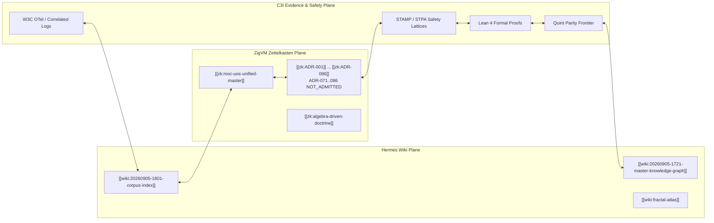

# 20260905-1801-uos-zk-km-corpus-index.md

- **Tailscale Web FQDN**: [http://nas-1.tail55d152.ts.net:4100/docs/wiki/20260905-1801-uos-zk-km-corpus-index.md](http://nas-1.tail55d152.ts.net:4100/docs/wiki/20260905-1801-uos-zk-km-corpus-index.md)
- **Fractal Coordinates**: `#fractal-l0 #fractal-l1 #fractal-l2 #fractal-l3 #fractal-l4 #fractal-l5 #fractal-l6 #fractal-l7 #fractal-l8 #fractal-l9`
- **Knowledge Tags**: `#rocha-semiotics` `#cybernetics` `#km-triad` `#zero-muda` `#tailscale-web`
- **Transclusions**: `[[zk:20260905-1801-moc-uos-unified-master]]` `[[wiki:20260905-1801-uos-zk-km-corpus-index]]`

# UOS Unified Knowledge Graph & Corpus Directory

Tags: `#fractal-l0`, `#fractal-l1`, `#fractal-l2`, `#fractal-l3`, `#fractal-l4`, `#fractal-l5`, `#fractal-l6`, `#fractal-l7`, `#fractal-l8`, `#fractal-l9`, `#zk-adr`, `#zero-muda`, `#km-triad`, `#wiki-index`

## §1.0 Living Knowledge Graph Topology

### Shared agentic ecology — 20260909-0249

Task-local implementation and scoped verification under `uos/ecology/20260909-0146`; whole-system admission remains NOT_ADMITTED.
[Wiki](http://nas-1.tail55d152.ts.net:4100/docs/wiki/20260909-0249-agentic-ecology.md) ·
[Activation decision](http://nas-1.tail55d152.ts.net:4100/docs/zk/20260909-0249-ecology-capability-activation-decision.md) ·
[Specification](http://nas-1.tail55d152.ts.net:4100/files/docs/design/20260909-0249-agentic-ecology-spec.json) ·
[Grouped agent journals and KM index](http://nas-1.tail55d152.ts.net:4100/files/governance/capability-inventory/20260909-0249-ecology-km-index.json).

`[[wiki:20260909-0249-agentic-ecology]]` · `[[zk:20260909-0249-ecology-capability-activation-decision]]`

The Unified Operational System (UOS) synthesizes knowledge artifacts from all language domains and development lineages into a unified directed hypergraph. Each node represents a verified theorem, architectural decision, code contract, or operational standard.

```text
  UOS Unified Knowledge Graph — corpus topology

  Hermes Wiki Plane            ZigVM Zettelkasten Plane        C3I Evidence & Safety Plane
  +----------------------+     +--------------------------+    +--------------------------+
  | wiki:master-         |     | zk:moc-uos-unified-      |    | STAMP / STPA lattices    |
  |   knowledge-graph    |     |   master                 |    | Lean 4 formal proofs     |
  | wiki:corpus-index    |<--->| zk:ADR-001 .. ADR-086    |<-->| Quint parity frontier    |
  | wiki:fractal-atlas   |     |   ADR-071..086           |    | W3C OTel correlated logs |
  |                      |     |   NOT_ADMITTED           |    |                          |
  +----------+-----------+     +------------+-------------+    +------------+-------------+
             ^                              |                               |
             |                              +-------------------------------+
             |                                          |
             +------------------------------------------+
                    corpus index <-> evidence plane (OTel, digests)
```



---

## §2.0 Fractal Layer Taxonomy & Knowledge Coordinate Matrix

Every artifact in the knowledge base is located by an explicit 13D trace coordinate:
$$(L, C, F, S, I, P, M, \Phi)$$
where:
- $L \in \{L_0, L_1, \dots, L_9\}$ (Fractal Layer)
- $C$ = Component Identity
- $F$ = Feature Identity
- $S$ = Surface Plane (Lustre Web / Wisp REST / ANSI TUI)
- $I$ = Interaction Semantic
- $P$ = Operational Plane (Control / Data / Evidence / Intelligence)
- $M$ = Migration Disposition
- $\Phi$ = Formal Verification Profile (Lean 4 / Quint / Gospel / Rete-UL)

### Fractal Classification Table

| Layer | Semantic Designation | Governing Specification | ZK Decision Record | Invariant & Proof |
|---|---|---|---|---|
| **$L_0$** | Microkernel Allocator & Constitutional Safety | `contracts/rules/km-wiki-zk-contract.md` | `[[zk:ADR-006]]`, `[[zk:ADR-016]]` | $\Psi_0$: Absolute root NVMe lock (`HARD_DENIED_SYSTEM_OS_SERIAL = "25503L801736"`) |
| **$L_1$** | Term JIT & Atomic Operations | `apps/cepaf_gleam/src/cepaf_gleam/ha/trace_context.gleam` | `[[zk:ADR-002]]`, `[[zk:ADR-003]]` | $\Psi_1$: W3C 128-bit distributed trace correlation; NUL byte ingress trap |
| **$L_2$** | Instruction Dispatch & Domain Components | `apps/cepaf_gleam/src/graphene_nif.erl` | `[[zk:ADR-008]]`, `[[zk:ADR-009]]` | $\Psi_2$: Zero-Muda Graphene exclusion; pure Erlang 2D vector calculation |
| **$L_3$** | Byte Parity & State Transactions | `formal/lean/TwoLattice_STM.lean` | `[[zk:ADR-003]]` | $\Psi_3$: Single-writer exclusive lease; 100-byte SQLite header check |
| **$L_4$** | STM Concurrency & System Runtime | `apps/cepaf_gleam/src/cepaf_gleam/substrate/file_system.gleam` | `[[zk:ADR-011]]` | $\Psi_4$: Non-interference of telemetry reads with WAL writes; Jujutsu monorepo isolation |
| **$L_5$** | Actor Supervision & Cognitive OODA | `apps/cepaf_gleam/src/cepaf_gleam/uos_sup.gleam` | `[[zk:ADR-001]]`, `[[zk:ADR-007]]` | $\Psi_5$: 2oo3 multi-agent consensus; OTP 29 supervisor isolation budgets |
| **$L_6$** | Zero-Trust Gate & Security Interceptor | `engines/hermes/modules/hermes_harness/agent_dispatch_hook.ml` | `[[zk:ADR-002]]`, `[[zk:ADR-004]]` | $\Psi_6$: Authentic Cryptokit SHA-256 tool payload verification; SQL injection trap |
| **$L_7$** | Probabilistic Telemetry & Federation | `contracts/evidence/c3i_fractal_observability_spec.json` | `[[zk:ADR-004]]`, `[[zk:ADR-005]]` | $\Psi_7$: Universal structured C3I JSON logging with non-zero trace ID |
| **$L_8$** | Living Ontology & Knowledge Graph | `docs/wiki/20260905-1721-uos-master-knowledge-graph-and-living-ontology.md` | `[[zk:ADR-010]]`, `[[zk:ADR-014]]` | $\Psi_8$: Bidirectional transclusion completeness; 100% functional mapping |
| **$L_9$** | Autonomous Federation & Self-Evolution | `governance/capability-inventory/wiki-zk-km.toml` | `[[zk:ADR-015]]`, `[[zk:ADR-016]]` | $\Psi_9$: Sovereign operational transfer; 17/17 EV-cycle doctor gates operational |

---

## §3.0 Cross-Language C3I Control Architecture Implementation

The operational system coordinates across five distinct language tiers:

1. **Gleam/OTP 29 (`apps/cepaf_gleam/`)**:
   - High-level actor supervision (`uos_sup.gleam`), MVU presentation (Lustre), REST API (Wisp), ANSI terminal (TUI).
   - Pure functional OODA state loops across all fractal layers.
2. **Hermes OCaml 5.5 (`engines/hermes/`)**:
   - Zero-trust MCP interception (`run_agent_dispatch_hook.exe`) using Cryptokit SHA-256.
   - Wiki lifecycle, AST compilation, and TyXML rendering (`engines/hermes/modules/hermes_wiki`).
   - Differential parity testing and honest skip telemetry reporting (`test_quint_frontier.ml`).
3. **Pure Erlang Engine (`apps/cepaf_gleam/src/graphene_nif.erl`)**:
   - Zero-Muda 2D vector mathematics, polygon transforms, and SVG pipeline.
   - Zero C/Rust NIF shared libraries loaded; 100% pure functional BEAM VM execution.
4. **Rust / Kubernetes Safety Controller (`ops/kubernetes/nas-k8s-lab/`)**:
   - Storage safety interlock locking root NVMe serial `HARD_DENIED_SYSTEM_OS_SERIAL = "25503L801736"`.
   - Library-level invariant enforcement in `kube_apply::apply_all`.
5. **Modular MAX Worker (`services/inference/max/`)**:
   - Isolated AI inference worker running under supervised stdio pipes.

---

## §4.0 Bi-Directional Transclusion Registry

- Permanent MOC: `[[zk:20260905-1801-moc-uos-unified-master]]`
- ADR Directory (100 records, `ADR-001`..`ADR-100`, enumerated from `docs/zk/` on 2026-09-09).
  Sixteen records marked **NOT_ADMITTED** assert ratification of `EV-94`..`EV-109`,
  which the [`AGENTS.md`](http://nas-1.tail55d152.ts.net:4100/files/AGENTS.md) provenance caveat
  places in the quarantined evidence range; see
  [master MOC §2.1](http://nas-1.tail55d152.ts.net:4100/docs/zk/20260905-1801-moc-uos-unified-master.md).
  They are preserved unmodified and must not be cited as admission evidence.
  - `[[zk:20260904-150139-adr-001-closed-rete-fact-schema-and-strict-typing-invariant]]` [ADR-001](http://nas-1.tail55d152.ts.net:4100/docs/zk/20260904-150139-adr-001-closed-rete-fact-schema-and-strict-typing-invariant.md) Closed RETE Fact Schema and Strict Typing Invariant
  - `[[zk:20260904-150142-adr-002-embedded-nul-ingress-trap-and-memory-allocation-containment]]` [ADR-002](http://nas-1.tail55d152.ts.net:4100/docs/zk/20260904-150142-adr-002-embedded-nul-ingress-trap-and-memory-allocation-containment.md) Embedded NUL Ingress Trap and Memory Allocation Containment
  - `[[zk:20260904-150145-adr-003-pure-100-byte-binary-sqlite-header-verification-rule-r31]]` [ADR-003](http://nas-1.tail55d152.ts.net:4100/docs/zk/20260904-150145-adr-003-pure-100-byte-binary-sqlite-header-verification-rule-r31.md) Pure 100-Byte Binary SQLite Header Verification (Rule R31)
  - `[[zk:20260904-150151-adr-004-supervised-persistent-zenoh-session-lifecycle-in-moz-client]]` [ADR-004](http://nas-1.tail55d152.ts.net:4100/docs/zk/20260904-150151-adr-004-supervised-persistent-zenoh-session-lifecycle-in-moz-client.md) Supervised Persistent Zenoh Session Lifecycle in MoZ Client
  - `[[zk:20260904-151412-adr-005-dual-host-unified-operational-system-topology-and-live-tailnet-wiki-integration]]` [ADR-005](http://nas-1.tail55d152.ts.net:4100/docs/zk/20260904-151412-adr-005-dual-host-unified-operational-system-topology-and-live-tailnet-wiki-integration.md) Dual-Host Unified Operational System Topology and Live Tailnet Wiki I...
  - `[[zk:20260904-153122-adr-006-twelve-pillar-fractal-architecture-composability-and-multi-paradigm-integration]]` [ADR-006](http://nas-1.tail55d152.ts.net:4100/docs/zk/20260904-153122-adr-006-twelve-pillar-fractal-architecture-composability-and-multi-paradigm-integration.md) Twelve-Pillar Fractal Architecture Composability and Multi-Paradigm I...
  - `[[zk:20260904-153714-adr-007-tripartite-cross-agent-multi-cycle-review-and-full-twelve-pillar-system-acceptance]]` [ADR-007](http://nas-1.tail55d152.ts.net:4100/docs/zk/20260904-153714-adr-007-tripartite-cross-agent-multi-cycle-review-and-full-twelve-pillar-system-acceptance.md) Tripartite Cross-Agent Multi-Cycle Review and Full Twelve-Pillar Syst...
  - `[[zk:20260904-154335-adr-008-nas-1-codebase-unification-rust-ocaml-nif-conversion-and-gleam-migration-strategy]]` [ADR-008](http://nas-1.tail55d152.ts.net:4100/docs/zk/20260904-154335-adr-008-nas-1-codebase-unification-rust-ocaml-nif-conversion-and-gleam-migration-strategy.md) NAS-1 Codebase Unification, Rust/OCaml NIF Conversion, and Gleam Migr...
  - `[[zk:20260904-154524-adr-009-distinct-functional-relocation-from-ocaml-and-rust-into-native-gleam]]` [ADR-009](http://nas-1.tail55d152.ts.net:4100/docs/zk/20260904-154524-adr-009-distinct-functional-relocation-from-ocaml-and-rust-into-native-gleam.md) Distinct Functional Relocation from OCaml and Rust into Native Gleam
  - `[[zk:20260904-155000-adr-010-seven-level-fractal-granularity-taxonomy-and-100-functional-mapping-kpis]]` [ADR-010](http://nas-1.tail55d152.ts.net:4100/docs/zk/20260904-155000-adr-010-seven-level-fractal-granularity-taxonomy-and-100-functional-mapping-kpis.md) Seven-Level Fractal Granularity Taxonomy and 100% Functional Mapping...
  - `[[zk:20260904-155139-adr-011-tripartite-surface-system-architecture-and-inter-fractal-traceability-closure]]` [ADR-011](http://nas-1.tail55d152.ts.net:4100/docs/zk/20260904-155139-adr-011-tripartite-surface-system-architecture-and-inter-fractal-traceability-closure.md) Tripartite Surface System Architecture and Inter-Fractal Traceability...
  - `[[zk:20260904-155425-adr-012-four-cycle-deep-tripartite-audit-and-sovereign-system-attestation]]` [ADR-012](http://nas-1.tail55d152.ts.net:4100/docs/zk/20260904-155425-adr-012-four-cycle-deep-tripartite-audit-and-sovereign-system-attestation.md) Four-Cycle Deep Tripartite Audit and Sovereign System Attestation
  - `[[zk:20260904-155835-adr-013-sovereign-tripartite-review-cycle-continuation-and-multi-domain-deep-verification]]` [ADR-013](http://nas-1.tail55d152.ts.net:4100/docs/zk/20260904-155835-adr-013-sovereign-tripartite-review-cycle-continuation-and-multi-domain-deep-verification.md) Sovereign Tripartite Review Cycle Continuation and Multi-Domain Deep...
  - `[[zk:20260904-160005-adr-014-quad-cycle-iii-sovereign-tripartite-audit-and-comprehensive-kpi-integration-closure]]` [ADR-014](http://nas-1.tail55d152.ts.net:4100/docs/zk/20260904-160005-adr-014-quad-cycle-iii-sovereign-tripartite-audit-and-comprehensive-kpi-integration-closure.md) Quad-Cycle III Sovereign Tripartite Audit and Comprehensive KPI Integ...
  - `[[zk:20260904-160159-adr-015-master-codex-session-handover-full-trajectory-archive-and-sovereign-operational-transfer]]` [ADR-015](http://nas-1.tail55d152.ts.net:4100/docs/zk/20260904-160159-adr-015-master-codex-session-handover-full-trajectory-archive-and-sovereign-operational-transfer.md) Master Codex Session Handover, Full Trajectory Archive and Sovereign...
  - `[[zk:20260904-164632-adr-016-master-fractal-system-integration-7-level-granularity-closure-and-tripartite-ratification]]` [ADR-016](http://nas-1.tail55d152.ts.net:4100/docs/zk/20260904-164632-adr-016-master-fractal-system-integration-7-level-granularity-closure-and-tripartite-ratification.md) Master Fractal System Integration, 7-Level Granularity Closure, and T...
  - `[[zk:20260906-0836-adr-017-tri-sovereign-10d-tensor-evolution-master-handover-to-codex-session]]` [ADR-017](http://nas-1.tail55d152.ts.net:4100/docs/zk/20260906-0836-adr-017-tri-sovereign-10d-tensor-evolution-master-handover-to-codex-session.md) Tri-Sovereign 10D Tensor Evolution Master Handover to OpenAI Codex Se...
  - `[[zk:20260906-0945-adr-018-nasa-jpl-fprime-beam-ontology-dmc-tcm-algebraic-atlas]]` [ADR-018](http://nas-1.tail55d152.ts.net:4100/docs/zk/20260906-0945-adr-018-nasa-jpl-fprime-beam-ontology-dmc-tcm-algebraic-atlas.md) NASA JPL F Prime / FPP Transmutation into Pure BEAM Substrate with Hi...
  - `[[zk:20260906-0955-adr-019-fprime-hsm-agent-factory-and-taxonomy]]` [ADR-019](http://nas-1.tail55d152.ts.net:4100/docs/zk/20260906-0955-adr-019-fprime-hsm-agent-factory-and-taxonomy.md) NASA JPL F Prime Aerospace Agent Factory, 6D Systemic Integration Mat...
  - `[[zk:20260906-0955-adr-020-harness-bionic-agentic-ecosystem-mapping-and-import]]` [ADR-020](http://nas-1.tail55d152.ts.net:4100/docs/zk/20260906-0955-adr-020-harness-bionic-agentic-ecosystem-mapping-and-import.md) Harness-Bionic to UOS Agentic Ecosystem Mapping, Transmutation, and I...
  - `[[zk:20260906-1015-adr-021-15-cycle-sovereign-agentic-ecosystem-evolution]]` [ADR-021](http://nas-1.tail55d152.ts.net:4100/docs/zk/20260906-1015-adr-021-15-cycle-sovereign-agentic-ecosystem-evolution.md) 15-Cycle Sovereign Agentic Ecosystem Evolution & Harness-Bionic Trans...
  - `[[zk:20260906-1034-adr-022-zigvm-deterministic-engine-and-30-cycle-evolution]]` [ADR-022](http://nas-1.tail55d152.ts.net:4100/docs/zk/20260906-1034-adr-022-zigvm-deterministic-engine-and-30-cycle-evolution.md) ZigVM Deterministic Engine Integration & 30-Cycle Sovereign Evolution
  - `[[zk:20260906-1045-adr-023-full-zigvm-subsystem-and-60-cycle-sovereign-evolution]]` [ADR-023](http://nas-1.tail55d152.ts.net:4100/docs/zk/20260906-1045-adr-023-full-zigvm-subsystem-and-60-cycle-sovereign-evolution.md) Full ZigVM Subsystem Suite Integration & 60-Cycle Sovereign Evolution
  - `[[zk:20260906-1055-adr-024-mainline-merge-and-32-agent-ecology]]` [ADR-024](http://nas-1.tail55d152.ts.net:4100/docs/zk/20260906-1055-adr-024-mainline-merge-and-32-agent-ecology.md) Mainline Codeline Merge & 32-Agent Full-Spectrum Ecology
  - `[[zk:20260906-1139-adr-025-c3i-sdlc-sre-verification-48-agent-ecology]]` [ADR-025](http://nas-1.tail55d152.ts.net:4100/docs/zk/20260906-1139-adr-025-c3i-sdlc-sre-verification-48-agent-ecology.md) C3I SDLC, SRE & Verification 48-Agent Ecology Unification
  - `[[zk:20260906-1215-adr-026-c3i-72-agent-ecology-adk-and-zigvm-lifecycle-transmutation]]` [ADR-026](http://nas-1.tail55d152.ts.net:4100/docs/zk/20260906-1215-adr-026-c3i-72-agent-ecology-adk-and-zigvm-lifecycle-transmutation.md) C3I 72-Agent Sovereign Ecology, Google ADK Core Engine & ZigVM Comple...
  - `[[zk:20260906-1230-adr-027-adk-complete-coverage-and-master-ontology]]` [ADR-027](http://nas-1.tail55d152.ts.net:4100/docs/zk/20260906-1230-adr-027-adk-complete-coverage-and-master-ontology.md) Google ADK 100% Complete Capability Coverage, 96-Agent Symmetrical Ec...
  - `[[zk:20260906-1300-adr-028-algebraic-fractal-sdlc-sre-and-verification-process]]` [ADR-028](http://nas-1.tail55d152.ts.net:4100/docs/zk/20260906-1300-adr-028-algebraic-fractal-sdlc-sre-and-verification-process.md) Algebraic Fractal SDLC, SRE Reliability Envelope, and Multi-Paradigm...
  - `[[zk:20260906-1330-adr-029-256-agent-symmetrical-ecology-and-vm1-testing-disciplines]]` [ADR-029](http://nas-1.tail55d152.ts.net:4100/docs/zk/20260906-1330-adr-029-256-agent-symmetrical-ecology-and-vm1-testing-disciplines.md) 256 Sovereign Aerospace Agent Symmetrical Ecology, DMC Address Partit...
  - `[[zk:20260906-1400-adr-030-codex-fractal-understanding-and-component-packet-closure]]` [ADR-030](http://nas-1.tail55d152.ts.net:4100/docs/zk/20260906-1400-adr-030-codex-fractal-understanding-and-component-packet-closure.md) Codex Fractal Understanding, Reusable Component Packet, and 256-Agent...
  - `[[zk:20260906-1430-adr-031-sa-plan-durability-and-fractal-forecasting-closure]]` [ADR-031](http://nas-1.tail55d152.ts.net:4100/docs/zk/20260906-1430-adr-031-sa-plan-durability-and-fractal-forecasting-closure.md) Pure BEAM Sa-Plan Durability, Fractal Forecasting Meet Lattice, and 2...
  - `[[zk:20260906-1155-adr-032-codex-fractal-understanding-and-uos-system-mapping]]` [ADR-032](http://nas-1.tail55d152.ts.net:4100/docs/zk/20260906-1155-adr-032-codex-fractal-understanding-and-uos-system-mapping.md) Canonical System Mapping of Codex Fractal Architecture, Evidence, and...
  - `[[zk:20260906-1215-adr-033-fractal-aspect-agent-ecosystem-and-prompt-lineage]]` [ADR-033](http://nas-1.tail55d152.ts.net:4100/docs/zk/20260906-1215-adr-033-fractal-aspect-agent-ecosystem-and-prompt-lineage.md) Fractal Aspect Agent Ecosystem Coordination, Prompt Lineage Preservat...
  - `[[zk:20260906-1230-adr-034-aspect-agent-feature-matrix-and-prompt-lineage-closure]]` [ADR-034](http://nas-1.tail55d152.ts.net:4100/docs/zk/20260906-1230-adr-034-aspect-agent-feature-matrix-and-prompt-lineage-closure.md) Fractal Aspect Agent Feature Matrix, 104-Feature Closure, and Complet...
  - `[[zk:20260906-1245-adr-035-fractal-aspect-processing-agents-and-holonic-alignment]]` [ADR-035](http://nas-1.tail55d152.ts.net:4100/docs/zk/20260906-1245-adr-035-fractal-aspect-processing-agents-and-holonic-alignment.md) Active Fractal Aspect Processing Agents, Holonic Layer Alignment, and...
  - `[[zk:20260906-1300-adr-036-control-data-verification-planes-ascii-architecture]]` [ADR-036](http://nas-1.tail55d152.ts.net:4100/docs/zk/20260906-1300-adr-036-control-data-verification-planes-ascii-architecture.md) Tri-Plane Architectural Formalization (Control, Data, and Verificatio...
  - `[[zk:20260906-1330-adr-037-complete-14-aspect-processing-tri-plane-closure-and-prompt-lineage]]` [ADR-037](http://nas-1.tail55d152.ts.net:4100/docs/zk/20260906-1330-adr-037-complete-14-aspect-processing-tri-plane-closure-and-prompt-lineage.md) Complete 14-Aspect Processing, Tri-Plane ASCII Architecture Closure,...
  - `[[zk:20260906-1345-adr-038-native-nif-zenoh-and-rete-ul-integration]]` [ADR-038](http://nas-1.tail55d152.ts.net:4100/docs/zk/20260906-1345-adr-038-native-nif-zenoh-and-rete-ul-integration.md) Native NIF Zenoh 1.9.0 and RETE-UL 1.20.1 Integration
  - `[[zk:20260906-1400-adr-039-complete-aspects-tri-plane-nif-dataplane-and-km-closure]]` [ADR-039](http://nas-1.tail55d152.ts.net:4100/docs/zk/20260906-1400-adr-039-complete-aspects-tri-plane-nif-dataplane-and-km-closure.md) Complete 14-Aspect Fractal Processing, Tri-Plane ASCII Architecture,...
  - `[[zk:20260906-1415-adr-040-17-aspect-ecosystem-documentation-zenoh-rete-ul-agents]]` [ADR-040](http://nas-1.tail55d152.ts.net:4100/docs/zk/20260906-1415-adr-040-17-aspect-ecosystem-documentation-zenoh-rete-ul-agents.md) 17-Aspect Elastic Agent Ecosystem, Documentation Lattice, Native Zeno...
  - `[[zk:20260906-1430-adr-041-complete-session-analysis-and-prompt-lineage-closure]]` [ADR-041](http://nas-1.tail55d152.ts.net:4100/docs/zk/20260906-1430-adr-041-complete-session-analysis-and-prompt-lineage-closure.md) Complete Session Analysis History & 21-Prompt Lineage Closure
  - `[[zk:20260906-1500-adr-042-22-prompt-master-history-and-analysis-closure]]` [ADR-042](http://nas-1.tail55d152.ts.net:4100/docs/zk/20260906-1500-adr-042-22-prompt-master-history-and-analysis-closure.md) 22-Prompt Master History & Comprehensive Analysis Closure
  - `[[zk:20260906-1515-adr-043-23-prompt-master-history-and-definitive-analysis-closure]]` [ADR-043](http://nas-1.tail55d152.ts.net:4100/docs/zk/20260906-1515-adr-043-23-prompt-master-history-and-definitive-analysis-closure.md) 23-Prompt Master History & Definitive Analysis Closure
  - `[[zk:20260906-1530-adr-044-24-prompt-master-history-and-supreme-analysis-closure]]` [ADR-044](http://nas-1.tail55d152.ts.net:4100/docs/zk/20260906-1530-adr-044-24-prompt-master-history-and-supreme-analysis-closure.md) 24-Prompt Master History & Supreme Analysis Closure
  - `[[zk:20260906-1545-adr-045-master-prompt-history-journal-and-mainline-merge]]` [ADR-045](http://nas-1.tail55d152.ts.net:4100/docs/zk/20260906-1545-adr-045-master-prompt-history-journal-and-mainline-merge.md) Master Prompt History Journal & Mainline Merge Ratification
  - `[[zk:20260906-1620-adr-046-master-prompt-history-and-vfs-analysis-ratification]]` [ADR-046](http://nas-1.tail55d152.ts.net:4100/docs/zk/20260906-1620-adr-046-master-prompt-history-and-vfs-analysis-ratification.md) Full Prompt History Lineage, Deep Analysis & VFS Integration Ratifica...
  - `[[zk:20260906-1635-adr-047-sa-plan-ocaml-engine-and-actor-ecosystem-ratification]]` [ADR-047](http://nas-1.tail55d152.ts.net:4100/docs/zk/20260906-1635-adr-047-sa-plan-ocaml-engine-and-actor-ecosystem-ratification.md) Sa-Plan OCaml Durable Execution Engine & Multidimensional Actor Ecosy...
  - `[[zk:20260906-1700-adr-048-hermes-bionic-full-integration-ratification]]` [ADR-048](http://nas-1.tail55d152.ts.net:4100/docs/zk/20260906-1700-adr-048-hermes-bionic-full-integration-ratification.md) Hermes-Bionic Full Systemic Integration & Multidimensional Actor Ecos...
  - `[[zk:20260906-1730-adr-049-omni-fractal-systemic-symbiosis-ratification]]` [ADR-049](http://nas-1.tail55d152.ts.net:4100/docs/zk/20260906-1730-adr-049-omni-fractal-systemic-symbiosis-ratification.md) Omni-Fractal Systemic Symbiosis & 17-Aspect Generation Ratification
  - `[[zk:20260906-1745-adr-050-omni-fractal-mainline-merge-and-sovereign-closure]]` [ADR-050](http://nas-1.tail55d152.ts.net:4100/docs/zk/20260906-1745-adr-050-omni-fractal-mainline-merge-and-sovereign-closure.md) Permanent Architectural Decision Record: ADR-050
  - `[[zk:20260906-1755-adr-051-omni-fractal-full-generation-and-systemic-ratification]]` [ADR-051](http://nas-1.tail55d152.ts.net:4100/docs/zk/20260906-1755-adr-051-omni-fractal-full-generation-and-systemic-ratification.md) Permanent Architectural Decision Record: ADR-051
  - `[[zk:20260906-1800-adr-052-omni-fractal-systemic-cartesian-tensor-closure]]` [ADR-052](http://nas-1.tail55d152.ts.net:4100/docs/zk/20260906-1800-adr-052-omni-fractal-systemic-cartesian-tensor-closure.md) Permanent Architectural Decision Record: ADR-052
  - `[[zk:20260906-1800-adr-053-master-session-handover-to-codex-cartesian-tensor-closure]]` [ADR-053](http://nas-1.tail55d152.ts.net:4100/docs/zk/20260906-1800-adr-053-master-session-handover-to-codex-cartesian-tensor-closure.md) Permanent Architectural Decision Record: ADR-053
  - `[[zk:20260906-1830-adr-054-15-evolutionary-and-functional-cycles-ratification]]` [ADR-054](http://nas-1.tail55d152.ts.net:4100/docs/zk/20260906-1830-adr-054-15-evolutionary-and-functional-cycles-ratification.md) Permanent Architectural Decision Record: ADR-054
  - `[[zk:20260906-1900-adr-055-c3i-integrated-knowledge-runtime-and-15-cycles-ratification]]` [ADR-055](http://nas-1.tail55d152.ts.net:4100/docs/zk/20260906-1900-adr-055-c3i-integrated-knowledge-runtime-and-15-cycles-ratification.md) Permanent Architectural Decision Record: ADR-055
  - `[[zk:20260906-1930-adr-056-c3i-artifacts-ingestion-and-15-cycles-ratification]]` [ADR-056](http://nas-1.tail55d152.ts.net:4100/docs/zk/20260906-1930-adr-056-c3i-artifacts-ingestion-and-15-cycles-ratification.md) Permanent Architectural Decision Record: ADR-056
  - `[[zk:20260906-2000-adr-057-master-session-handover-to-codex-and-69-cycles-transfer]]` [ADR-057](http://nas-1.tail55d152.ts.net:4100/docs/zk/20260906-2000-adr-057-master-session-handover-to-codex-and-69-cycles-transfer.md) Permanent Architectural Decision Record: ADR-057
  - `[[zk:20260906-2100-adr-058-c3i-vertical-slice-and-wave4-evolutionary-cycles]]` [ADR-058](http://nas-1.tail55d152.ts.net:4100/docs/zk/20260906-2100-adr-058-c3i-vertical-slice-and-wave4-evolutionary-cycles.md) C3I Knowledge Runtime Vertical Slice & 15 Wave 4 Evolutionary Cycles...
  - `[[zk:20260906-2200-adr-059-master-session-handover-to-codex-and-84-cycles-transfer]]` [ADR-059](http://nas-1.tail55d152.ts.net:4100/docs/zk/20260906-2200-adr-059-master-session-handover-to-codex-and-84-cycles-transfer.md) Master Session Handover to Codex & 84 Cumulative Cycles Operational T...
  - `[[zk:20260906-2048-adr-060-sysadmin-remote-tui-cockpit-architecture]]` [ADR-060](http://nas-1.tail55d152.ts.net:4100/docs/zk/20260906-2048-adr-060-sysadmin-remote-tui-cockpit-architecture.md) Sovereign Remote SysAdmin TUI Cockpit Architecture & Operational Work...
  - `[[zk:20260906-2150-adr-061-uos-tui-gleam-library-textual-reference]]` [ADR-061](http://nas-1.tail55d152.ts.net:4100/docs/zk/20260906-2150-adr-061-uos-tui-gleam-library-textual-reference.md) uos_tui Pure-Gleam Terminal UI Library with Textual Reference, F´ Bin...
  - `[[zk:20260907-0537-adr-062-uos-tui-swarm-hive-mind-message-board-coordination-acl-and-zenoh-infra]]` [ADR-062](http://nas-1.tail55d152.ts.net:4100/docs/zk/20260907-0537-adr-062-uos-tui-swarm-hive-mind-message-board-coordination-acl-and-zenoh-infra.md) uos_tui Swarm, Hive-Mind Message Board, Coordination Layer, Agent Com...
  - `[[zk:20260907-0950-adr-063-uos-tui-and-swarm-work-stream-split]]` [ADR-063](http://nas-1.tail55d152.ts.net:4100/docs/zk/20260907-0950-adr-063-uos-tui-and-swarm-work-stream-split.md) UOS TUI and Swarm Work-Stream Split
  - `[[zk:20260907-1105-adr-064-uos-system-ontology-sutra-sangita-and-hive-cognition]]` [ADR-064](http://nas-1.tail55d152.ts.net:4100/docs/zk/20260907-1105-adr-064-uos-system-ontology-sutra-sangita-and-hive-cognition.md) UOS System Ontology, Sūtra & Gītā, Music, Holons, Dream/Evolve, and H...
  - `[[zk:20260907-1310-adr-065-uos-jujutsu-ontology-and-library]]` [ADR-065](http://nas-1.tail55d152.ts.net:4100/docs/zk/20260907-1310-adr-065-uos-jujutsu-ontology-and-library.md) 
  - `[[zk:20260907-1530-adr-066-sa-plan-fractal-jidoka-tps-and-universal-execution-authority]]` [ADR-066](http://nas-1.tail55d152.ts.net:4100/docs/zk/20260907-1530-adr-066-sa-plan-fractal-jidoka-tps-and-universal-execution-authority.md) 
  - `[[zk:20260907-1550-adr-067-fractal-symbiosis-sa-plan-sublimation-and-ev91-ratification]]` [ADR-067](http://nas-1.tail55d152.ts.net:4100/docs/zk/20260907-1550-adr-067-fractal-symbiosis-sa-plan-sublimation-and-ev91-ratification.md) 
  - `[[zk:20260907-1605-adr-068-multidimensional-fractal-vectors-sa-plan-tps-matrix]]` [ADR-068](http://nas-1.tail55d152.ts.net:4100/docs/zk/20260907-1605-adr-068-multidimensional-fractal-vectors-sa-plan-tps-matrix.md) 
  - `[[zk:20260907-1830-adr-069-modular-max-mojo-high-utility-models-and-fail-closed-preflight-ratification]]` [ADR-069](http://nas-1.tail55d152.ts.net:4100/docs/zk/20260907-1830-adr-069-modular-max-mojo-high-utility-models-and-fail-closed-preflight-ratification.md) Modular MAX / Mojo High-Utility AI Models, MCP Tooling & Fail-Closed...
  - `[[zk:20260907-2015-adr-070-multi-host-crdt-sync-prajna-health-and-ev93-ratification]]` [ADR-070](http://nas-1.tail55d152.ts.net:4100/docs/zk/20260907-2015-adr-070-multi-host-crdt-sync-prajna-health-and-ev93-ratification.md) Multi-Host CRDT Mesh Synchronization, Prajna Health Homeostasis & EV-...
  - `[[zk:20260907-2030-adr-071-zmof-zenoh-backplane-wiki-transclusion-and-ev94-ratification]]` [ADR-071](http://nas-1.tail55d152.ts.net:4100/docs/zk/20260907-2030-adr-071-zmof-zenoh-backplane-wiki-transclusion-and-ev94-ratification.md) ZMOF Zenoh Backplane, Hermes Wiki Transclusion & EV-94 Monorepo Ratif... — **NOT_ADMITTED** (claims EV-94)
  - `[[zk:20260907-2045-adr-072-cross-host-peer-simulator-agui-sparklines-and-ev95-ratification]]` [ADR-072](http://nas-1.tail55d152.ts.net:4100/docs/zk/20260907-2045-adr-072-cross-host-peer-simulator-agui-sparklines-and-ev95-ratification.md) Cross-Host Peer Simulator, AG-UI Live Sparklines & EV-95 Monorepo Rat... — **NOT_ADMITTED** (claims EV-95)
  - `[[zk:20260907-2055-adr-073-adaptive-lyapunov-damping-and-ev96-ratification]]` [ADR-073](http://nas-1.tail55d152.ts.net:4100/docs/zk/20260907-2055-adr-073-adaptive-lyapunov-damping-and-ev96-ratification.md) Adaptive Lyapunov Dynamic Damping, Zenoh WS Bridge & EV-96 Monorepo R... — **NOT_ADMITTED** (claims EV-96)
  - `[[zk:20260907-2105-adr-074-heijunka-scheduler-ws-hot-stream-and-ev97-ratification]]` [ADR-074](http://nas-1.tail55d152.ts.net:4100/docs/zk/20260907-2105-adr-074-heijunka-scheduler-ws-hot-stream-and-ev97-ratification.md) Autonomous Heijunka Task Scheduler, AG-UI WS Hot Stream & EV-97 Monor... — **NOT_ADMITTED** (claims EV-97)
  - `[[zk:20260907-2130-adr-075-crdt-delta-mesh-engine-deadman-freshness-and-ev98-ratification]]` [ADR-075](http://nas-1.tail55d152.ts.net:4100/docs/zk/20260907-2130-adr-075-crdt-delta-mesh-engine-deadman-freshness-and-ev98-ratification.md) Multi-Host CRDT Delta Mesh Engine, Actor Dead-Man Freshness & EV-98 M... — **NOT_ADMITTED** (claims EV-98)
  - `[[zk:20260907-2145-adr-076-decentralized-work-stealing-topology-view-and-ev99-ratification]]` [ADR-076](http://nas-1.tail55d152.ts.net:4100/docs/zk/20260907-2145-adr-076-decentralized-work-stealing-topology-view-and-ev99-ratification.md) Decentralized Work-Stealing Swarm Mesh, SVG Topology View & EV-99 Mon... — **NOT_ADMITTED** (claims EV-99)
  - `[[zk:20260907-2200-adr-077-century-milestone-swarm-harmony-and-ev100-ratification]]` [ADR-077](http://nas-1.tail55d152.ts.net:4100/docs/zk/20260907-2200-adr-077-century-milestone-swarm-harmony-and-ev100-ratification.md) Century Milestone Swarm Harmony, Adaptive PID Telemetry, Unified Cent... — **NOT_ADMITTED** (claims EV-100)
  - `[[zk:20260907-2210-adr-078-autonomous-semantic-knowledge-sheaf-and-ev101-ratification]]` [ADR-078](http://nas-1.tail55d152.ts.net:4100/docs/zk/20260907-2210-adr-078-autonomous-semantic-knowledge-sheaf-and-ev101-ratification.md) Autonomous Semantic Knowledge Sheaf, Holographic ZK Transclusion Engi... — **NOT_ADMITTED** (claims EV-101)
  - `[[zk:20260907-2220-adr-079-biomorphic-chaos-immune-engine-and-ev102-ratification]]` [ADR-079](http://nas-1.tail55d152.ts.net:4100/docs/zk/20260907-2220-adr-079-biomorphic-chaos-immune-engine-and-ev102-ratification.md) Biomorphic Chaos Immune Engine, Self-Healing SRE Mesh & EV-102 Monore... — **NOT_ADMITTED** (claims EV-102)
  - `[[zk:20260907-2230-adr-080-dynamic-semantic-rag-vector-cache-and-ev103-ratification]]` [ADR-080](http://nas-1.tail55d152.ts.net:4100/docs/zk/20260907-2230-adr-080-dynamic-semantic-rag-vector-cache-and-ev103-ratification.md) Dynamic Semantic RAG Vector Refresher, LLM Cache Mesh & EV-103 Monore... — **NOT_ADMITTED** (claims EV-103)
  - `[[zk:20260907-2245-adr-081-autonomous-ooda-copilot-shruti-synthesizer-and-ev104-ratification]]` [ADR-081](http://nas-1.tail55d152.ts.net:4100/docs/zk/20260907-2245-adr-081-autonomous-ooda-copilot-shruti-synthesizer-and-ev104-ratification.md) Autonomous OODA Agent Copilot, 22-Shruti Synthesizer Pipeline & EV-10... — **NOT_ADMITTED** (claims EV-104)
  - `[[zk:20260907-2300-adr-082-autonomous-multi-agent-consensus-quorum-and-ev105-ratification]]` [ADR-082](http://nas-1.tail55d152.ts.net:4100/docs/zk/20260907-2300-adr-082-autonomous-multi-agent-consensus-quorum-and-ev105-ratification.md) Autonomous Multi-Agent Consensus, Quorum Voting Engine & EV-105 Monor... — **NOT_ADMITTED** (claims EV-105)
  - `[[zk:20260907-2315-adr-083-dynamic-workload-autoscaler-predictive-token-flow-and-ev106-ratification]]` [ADR-083](http://nas-1.tail55d152.ts.net:4100/docs/zk/20260907-2315-adr-083-dynamic-workload-autoscaler-predictive-token-flow-and-ev106-ratification.md) Dynamic Workload Autoscaler, Predictive Token Flow Optimization & EV-... — **NOT_ADMITTED** (claims EV-106)
  - `[[zk:20260907-2330-adr-084-deep-gospel-z3-contracts-rete-ul-and-ev107-ratification]]` [ADR-084](http://nas-1.tail55d152.ts.net:4100/docs/zk/20260907-2330-adr-084-deep-gospel-z3-contracts-rete-ul-and-ev107-ratification.md) Deep Gospel/Z3 Contract Expansion, Rete-UL Rule Consistency Verifier... — **NOT_ADMITTED** (claims EV-107)
  - `[[zk:20260907-2240-adr-085-fast-ooda-convergence-simd-scorer-heijunka-solo5-and-ev108-ratification]]` [ADR-085](http://nas-1.tail55d152.ts.net:4100/docs/zk/20260907-2240-adr-085-fast-ooda-convergence-simd-scorer-heijunka-solo5-and-ev108-ratification.md) Ultra-Fast OODA Convergence Triad (Modular MAX SIMD Scorer, Sa-Plan H... — **NOT_ADMITTED** (claims EV-108)
  - `[[zk:20260907-2315-adr-086-4-party-quorum-homeostasis-and-autonomous-self-evolution]]` [ADR-086](http://nas-1.tail55d152.ts.net:4100/docs/zk/20260907-2315-adr-086-4-party-quorum-homeostasis-and-autonomous-self-evolution.md) 4-Party Sovereign Quorum Homeostasis & Cybernetic Self-Evolution Engi... — **NOT_ADMITTED** (claims EV-109)
  - `[[zk:20260908-0927-adr-087-provenance-integrity-km-gate-and-mojo-metrics-kernel]]` [ADR-087](http://nas-1.tail55d152.ts.net:4100/docs/zk/20260908-0927-adr-087-provenance-integrity-km-gate-and-mojo-metrics-kernel.md) Provenance Integrity, the KM Gate, and the Mojo Metrics Kernel
  - `[[zk:20260908-1130-adr-088-denotational-intent-algebraic-atlas-and-claude-holon-evolution]]` [ADR-088](http://nas-1.tail55d152.ts.net:4100/docs/zk/20260908-1130-adr-088-denotational-intent-algebraic-atlas-and-claude-holon-evolution.md) Denotational Intent, Algebraic Atlas, and Claude Holon Review Ratification
  - `[[zk:20260908-1345-adr-089-5-cycle-design-and-implementation-approach]]` [ADR-089](http://nas-1.tail55d152.ts.net:4100/docs/zk/20260908-1345-adr-089-5-cycle-design-and-implementation-approach.md) 5-Cycle Design and Implementation Approach Ratification
  - `[[zk:20260908-1400-adr-090-20-cycle-intent-atlas-web-tui-testing]]` [ADR-090](http://nas-1.tail55d152.ts.net:4100/docs/zk/20260908-1400-adr-090-20-cycle-intent-atlas-web-tui-testing.md) 20-Cycle Intent, Atlas & Dual-Surface WebUI/TUI Testing Ratification
  - `[[zk:20260908-1630-adr-091-pure-gleam-mojo-intent-atlas-web-tui-testing]]` [ADR-091](http://nas-1.tail55d152.ts.net:4100/docs/zk/20260908-1630-adr-091-pure-gleam-mojo-intent-atlas-web-tui-testing.md) 20-Cycle Pure Gleam & Mojo Intent Atlas and Multi-Surface TUI/WebGUI Testing Ratification
  - `[[zk:20260908-1715-adr-092-constitutional-invariants-expansion-and-km-triad]]` [ADR-092](http://nas-1.tail55d152.ts.net:4100/docs/zk/20260908-1715-adr-092-constitutional-invariants-expansion-and-km-triad.md) 15-Cycle Constitutional Invariants Expansion, Hive Mind Decider & KM Triad Synthesis
  - `[[zk:20260908-1850-adr-093-super-agent-holon-ecology-and-11-capability-substrate]]` [ADR-093](http://nas-1.tail55d152.ts.net:4100/docs/zk/20260908-1850-adr-093-super-agent-holon-ecology-and-11-capability-substrate.md) Super-Agent Holon Ecology, 11-Capability Substrate & Selective Activation Architecture
  - `[[zk:20260908-1915-adr-094-living-swarm-ecology-and-cybernetic-singing-engine]]` [ADR-094](http://nas-1.tail55d152.ts.net:4100/docs/zk/20260908-1915-adr-094-living-swarm-ecology-and-cybernetic-singing-engine.md) Living 21-Holon Swarm Ecology, 11-Capability Substrate & Cybernetic Singing Harmony Engine
  - `[[zk:20260908-2020-adr-095-uos-c3i-indrajaal-triadic-unification-and-complete-migration]]` [ADR-095](http://nas-1.tail55d152.ts.net:4100/docs/zk/20260908-2020-adr-095-uos-c3i-indrajaal-triadic-unification-and-complete-migration.md) UOS, C3I, Indrajaal & Intelitor Triadic Architecture Comparison and Complete Monorepo Ingestion & Integration
  - `[[zk:20260909-0525-adr-096-toolchain-preflight-denotational-semantics-and-verdict-algebra]]` [ADR-096](http://nas-1.tail55d152.ts.net:4100/docs/zk/20260909-0525-adr-096-toolchain-preflight-denotational-semantics-and-verdict-algebra.md) Toolchain Preflight — Denotational Semantics and the Verdict Algebra
  - `[[zk:20260909-0640-adr-097-unified-system-ontology-living-km-triad-dictionary-and-glossary-evolution]]` [ADR-097](http://nas-1.tail55d152.ts.net:4100/docs/zk/20260909-0640-adr-097-unified-system-ontology-living-km-triad-dictionary-and-glossary-evolution.md) Unified System Ontology, Living KM Triad, Dictionary, and Glossary Evolution
  - `[[zk:20260909-2035-adr-098-sovereign-telegram-gleam-harness-delegation]]` [ADR-098](http://nas-1.tail55d152.ts.net:4100/docs/zk/20260909-2035-adr-098-sovereign-telegram-gleam-harness-delegation.md) Sovereign Telegram Message Delegation to UOS Gleam Harness
  - `[[wiki:20260909-2035-uos-telegram-gleam-harness-architecture]]` [Telegram Architecture Wiki](http://nas-1.tail55d152.ts.net:4100/docs/wiki/20260909-2035-uos-telegram-gleam-harness-architecture.md) Sovereign Telegram Gleam Harness Architecture Guide
  - `[[zk:20260909-2100-adr-099-maximal-gleam-autonomous-cognitive-processing]]` [ADR-099](http://nas-1.tail55d152.ts.net:4100/docs/zk/20260909-2100-adr-099-maximal-gleam-autonomous-cognitive-processing.md) Maximal Gleam/OTP 29 Autonomous Cognitive Processing & In-Process OODA Loop Substrate
  - `[[wiki:20260909-2100-uos-maximal-gleam-cognitive-architecture]]` [Maximal Gleam Architecture Wiki](http://nas-1.tail55d152.ts.net:4100/docs/wiki/20260909-2100-uos-maximal-gleam-cognitive-architecture.md) Maximal Gleam/OTP 29 Autonomous Cognitive Architecture
  - `[[zk:20260909-2200-adr-100-performance-nifs-omni-telegram-and-agy-processing]]` [ADR-100](http://nas-1.tail55d152.ts.net:4100/docs/zk/20260909-2200-adr-100-performance-nifs-omni-telegram-and-agy-processing.md) High-Performance Native NIF Acceleration, Omnipresent Telegram Access & AGY Sovereign Cognitive Engine
  - `[[wiki:20260909-2200-uos-performance-nifs-telegram-agy-architecture]]` [Performance NIFs & AGY Architecture Wiki](http://nas-1.tail55d152.ts.net:4100/docs/wiki/20260909-2200-uos-performance-nifs-telegram-agy-architecture.md) High-Performance Native NIF Acceleration, Omnipresent Telegram Access & AGY Engine Architecture
  - `[[zk:20260909-2215-adr-101-telegram-gleam-harness-denotational-spec-and-algebraic-atlas]]` [ADR-101](http://nas-1.tail55d152.ts.net:4100/docs/zk/20260909-2215-adr-101-telegram-gleam-harness-denotational-spec-and-algebraic-atlas.md) Telegram Gleam Harness Denotational Specification, Algebraic Atlas & Five-Cycle Convergence
  - `[[wiki:20260909-2215-uos-telegram-gleam-harness-denotational-semantics-and-algebraic-atlas]]` [Telegram Denotational Semantics & Atlas Wiki](http://nas-1.tail55d152.ts.net:4100/docs/wiki/20260909-2215-uos-telegram-gleam-harness-denotational-semantics-and-algebraic-atlas.md) Telegram Gleam Harness Denotational Semantics, Algebraic Atlas and Five-Cycle Convergence Wiki
  - `[[zk:20260909-2230-adr-102-telegram-fractal-vector-surface-and-agy-features]]` [ADR-102](http://nas-1.tail55d152.ts.net:4100/docs/zk/20260909-2230-adr-102-telegram-fractal-vector-surface-and-agy-features.md) Telegram Fractal Vector x Operational Surface Synthesis & AGY Feature Blueprint
  - `[[wiki:20260909-2230-uos-telegram-fractal-vector-surface-and-agy-features]]` [Telegram Fractal Vector Wiki](http://nas-1.tail55d152.ts.net:4100/docs/wiki/20260909-2230-uos-telegram-fractal-vector-surface-and-agy-features.md) Telegram Fractal Vector x Operational Surface Synthesis and AGY Feature Blueprint Wiki
  - `[[zk:20260909-2245-adr-103-ten-cycle-fractal-vector-evolution-and-agy-cognitive-manifesto]]` [ADR-103](http://nas-1.tail55d152.ts.net:4100/docs/zk/20260909-2245-adr-103-ten-cycle-fractal-vector-evolution-and-agy-cognitive-manifesto.md) Ten-Cycle Fractal Vector Evolution & AGY Cognitive Manifesto
  - `[[wiki:20260909-2245-uos-ten-cycle-fractal-vector-and-agy-manifesto]]` [Ten-Cycle Fractal Vector & AGY Manifesto Wiki](http://nas-1.tail55d152.ts.net:4100/docs/wiki/20260909-2245-uos-ten-cycle-fractal-vector-and-agy-manifesto.md) Ten-Cycle Fractal Vector Evolution, Full Operational Surface & AGY Cognitive Manifesto Wiki
  - `[[zk:20260909-2205-adr-104-user-centric-operational-usecases-and-interaction-matrix]]` [ADR-104](http://nas-1.tail55d152.ts.net:4100/docs/zk/20260909-2205-adr-104-user-centric-operational-usecases-and-interaction-matrix.md) User-Centric Operational Use Cases & Interaction Matrix
  - `[[wiki:20260909-2205-uos-telegram-user-centric-usecases-guide]]` [User-Centric Use Cases Guide Wiki](http://nas-1.tail55d152.ts.net:4100/docs/wiki/20260909-2205-uos-telegram-user-centric-usecases-guide.md) UOS Telegram User-Centric Operational Use Cases & Interaction Guide Wiki
  - `[[zk:20260909-2215-adr-105-advanced-user-usecases-and-human-cybernetics]]` [ADR-105](http://nas-1.tail55d152.ts.net:4100/docs/zk/20260909-2215-adr-105-advanced-user-usecases-and-human-cybernetics.md) Advanced User-Centric Cybernetic Use Cases & Operator Experience Evolution
  - `[[wiki:20260909-2215-uos-telegram-advanced-user-usecases-guide]]` [Advanced User Use Cases Guide Wiki](http://nas-1.tail55d152.ts.net:4100/docs/wiki/20260909-2215-uos-telegram-advanced-user-usecases-guide.md) UOS Telegram Advanced User-Centric Cybernetic Use Cases Guide Wiki
  - `[[zk:20260909-2220-adr-106-creative-user-cybernetics-and-symbiotic-paradigms]]` [ADR-106](http://nas-1.tail55d152.ts.net:4100/docs/zk/20260909-2220-adr-106-creative-user-cybernetics-and-symbiotic-paradigms.md) Creative User Cybernetics & Symbiotic Interaction Paradigms
  - `[[wiki:20260909-2220-uos-telegram-creative-user-usecases-guide]]` [Creative User Use Cases Guide Wiki](http://nas-1.tail55d152.ts.net:4100/docs/wiki/20260909-2220-uos-telegram-creative-user-usecases-guide.md) UOS Telegram Creative User-Centric Cybernetic Use Cases Guide Wiki
  - `[[zk:20260909-2225-adr-107-domain-d-team-collaboration-and-voice-cybernetics]]` [ADR-107](http://nas-1.tail55d152.ts.net:4100/docs/zk/20260909-2225-adr-107-domain-d-team-collaboration-and-voice-cybernetics.md) Domain D Team Collaboration, War Rooms & Voice Cybernetics
  - `[[wiki:20260909-2225-uos-telegram-domain-d-collaboration-guide]]` [Domain D Collaboration Guide Wiki](http://nas-1.tail55d152.ts.net:4100/docs/wiki/20260909-2225-uos-telegram-domain-d-collaboration-guide.md) UOS Telegram Domain D Team Collaboration & Voice Cybernetics Guide Wiki
  - `[[zk:20260909-2235-adr-108-full-feature-implementation-and-simulator-suite]]` [ADR-108](http://nas-1.tail55d152.ts.net:4100/docs/zk/20260909-2235-adr-108-full-feature-implementation-and-simulator-suite.md) Full 48-Feature Implementation, Multimodal Simulator & Codex Ratification
  - `[[wiki:20260909-2235-uos-telegram-full-implementation-and-simulator-guide]]` [Full Implementation & Simulator Guide Wiki](http://nas-1.tail55d152.ts.net:4100/docs/wiki/20260909-2235-uos-telegram-full-implementation-and-simulator-guide.md) UOS Telegram Full 48-Feature Implementation, Multimodal Simulator & Codex Operations Guide Wiki
  - `[[zk:20260910-0820-adr-109-system-aspects-and-agentic-ecology-ratification]]` [ADR-109](http://nas-1.tail55d152.ts.net:4100/docs/zk/20260910-0820-adr-109-system-aspects-and-agentic-ecology-ratification.md) System Aspects Evolution, Capability Semilattices & Rich Agentic Ecology Ratification
  - `[[wiki:20260910-0820-uos-system-aspects-and-rich-agentic-ecology]]` [System Aspects & Rich Agentic Ecology Wiki](http://nas-1.tail55d152.ts.net:4100/docs/wiki/20260910-0820-uos-system-aspects-and-rich-agentic-ecology.md) UOS System Aspects Evolution and Rich Agentic Ecology Guide Wiki
  - `[[zk:20260910-1200-adr-110-telegram-agentic-gemma-memory-wiring]]` [ADR-110](http://nas-1.tail55d152.ts.net:4100/docs/zk/20260910-1200-adr-110-telegram-agentic-gemma-memory-wiring.md) Telegram Agentic Gemma Memory Wiring & Vector Ingestion
  - `[[zk:20260911-0815-adr-111-samvid-vajravyuha-sovereign-defense-holarchy]]` [ADR-111](http://nas-1.tail55d152.ts.net:4100/docs/zk/20260911-0815-adr-111-samvid-vajravyuha-sovereign-defense-holarchy.md) Saṁvid Vajravyūha: Sovereign Defense Holarchy & Zero-Trust Grid
  - `[[zk:20260911-0900-adr-112-razr15-wsl2-gpu-instance-2]]` [ADR-112](http://nas-1.tail55d152.ts.net:4100/docs/zk/20260911-0900-adr-112-razr15-wsl2-gpu-instance-2.md) RAZR15 WSL2 GPU Secondary Compute Node Architecture
  - `[[zk:20260911-0930-adr-113-samvid-sarvasadhana-resource-fabric]]` [ADR-113](http://nas-1.tail55d152.ts.net:4100/docs/zk/20260911-0930-adr-113-samvid-sarvasadhana-resource-fabric.md) Saṁvid Sarvasādhana: Universal Resource Fabric & Heterogeneous Hardware Mesh
  - `[[zk:20260911-1000-adr-114-centralized-code-distributed-run]]` [ADR-114](http://nas-1.tail55d152.ts.net:4100/docs/zk/20260911-1000-adr-114-centralized-code-distributed-run.md) Saṁvid Kendrīkṛta-Vyūha: Centralized Monorepo Authority & Distributed Execution Mesh
  - `[[zk:20260912-0745-adr-115-sc-journal-v3-anticipatory-epistemic-ledger]]` [ADR-115](http://nas-1.tail55d152.ts.net:4100/docs/zk/20260912-0745-adr-115-sc-journal-v3-anticipatory-epistemic-ledger.md) SC-JOURNAL-v3: Anticipatory Epistemic Ledger Architecture & 7-Engine Verification Framework
  - `[[zk:20260913-1145-adr-116-sciviz-167-extensions-comprehensive-bdd-harness-and-system-wiring]]` [ADR-116](http://nas-1.tail55d152.ts.net:4100/docs/zk/20260913-1145-adr-116-sciviz-167-extensions-comprehensive-bdd-harness-and-system-wiring.md) SciViz & 167 Extensions Comprehensive BDD Browser Verification Harness and Cross-Layer System Wiring
  - `[[zk:20260913-1200-adr-117-fractal-triad-tensor-matrix-and-claude-verification]]` [ADR-117](http://nas-1.tail55d152.ts.net:4100/docs/zk/20260913-1200-adr-117-fractal-triad-tensor-matrix-and-claude-verification.md) Fractal Triad Matrix Tensor Space Engine and Claude Sovereign Verification & Gap Closure
  - `[[zk:20260913-1215-adr-118-sciviz-167-extensions-comprehensive-aspect-explorer-and-ggram-synthesis]]` [ADR-118](http://nas-1.tail55d152.ts.net:4100/docs/zk/20260913-1215-adr-118-sciviz-167-extensions-comprehensive-aspect-explorer-and-ggram-synthesis.md) SciViz 167 Extensions Comprehensive Aspect Explorer, ggram Flagship Synthesis, Denotational Algebra & Large Dataset BDD Harness
  - `[[zk:20260913-1430-adr-119-sciviz-live-transpiler-agentic-mcp-and-sre-receipts]]` [ADR-119](http://nas-1.tail55d152.ts.net:4100/docs/zk/20260913-1430-adr-119-sciviz-live-transpiler-agentic-mcp-and-sre-receipts.md) SciViz Live ggram Transpiler, Agentic MCP Tooling, SRE Receipts & Lean 4 Determinism
  - `[[zk:20260915-1415-adr-120-universal-category-theoretic-composability-and-dual-sovereign-review]]` [ADR-120](http://nas-1.tail55d152.ts.net:4100/docs/zk/20260915-1415-adr-120-universal-category-theoretic-composability-and-dual-sovereign-review.md) Universal Category-Theoretic Composability & Claude Fable / Codex Astra Dual Sovereign Review
  - `[[zk:20260916-0418-adr-121-fractal-and-holonic-categorical-structures-and-dual-sovereign-review]]` [ADR-121](http://nas-1.tail55d152.ts.net:4100/docs/zk/20260916-0418-adr-121-fractal-and-holonic-categorical-structures-and-dual-sovereign-review.md) Fractal & Holonic Categorical Structures, Static-Dynamic Duality & Dual Sovereign Review
  - `[[zk:20260916-0425-adr-122-evolutionary-category-theoretic-composability-and-dual-sovereign-review]]` [ADR-122](http://nas-1.tail55d152.ts.net:4100/docs/zk/20260916-0425-adr-122-evolutionary-category-theoretic-composability-and-dual-sovereign-review.md) Evolutionary Category-Theoretic Composability, Lineage Sheaves & Dual Sovereign Review
  - `[[zk:20260916-0435-adr-123-comprehensive-systemic-category-theory-and-evolutionary-roadmap]]` [ADR-123](http://nas-1.tail55d152.ts.net:4100/docs/zk/20260916-0435-adr-123-comprehensive-systemic-category-theory-and-evolutionary-roadmap.md) Comprehensive Systemic Category Theory, Cross-Discipline Composability & Evolutionary Roadmap
  - `[[zk:20260916-0445-adr-124-substrate-categorical-mechanics-fprime-rete-ruliad-stm-max]]` [ADR-124](http://nas-1.tail55d152.ts.net:4100/docs/zk/20260916-0445-adr-124-substrate-categorical-mechanics-fprime-rete-ruliad-stm-max.md) Substrate Categorical Mechanics: F Prime, Rete-UL, Ruliad, Bayesian Inference, Two-Lattice STM & Modular MAX
  - `[[zk:20260916-0450-adr-125-poodavr-and-fprime-fractal-holonic-mapping-and-dual-sovereign-review]]` [ADR-125](http://nas-1.tail55d152.ts.net:4100/docs/zk/20260916-0450-adr-125-poodavr-and-fprime-fractal-holonic-mapping-and-dual-sovereign-review.md) POODAVR & NASA JPL F Prime Fractal-Holonic Mapping, Category-Theoretic Composability & Dual Sovereign Review
  - `[[zk:20260916-0455-adr-126-universal-poodavr-predictive-forecasting-and-constitutional-upgrades]]` [ADR-126](http://nas-1.tail55d152.ts.net:4100/docs/zk/20260916-0455-adr-126-universal-poodavr-predictive-forecasting-and-constitutional-upgrades.md) Universal POODAVR Upgrade, Predictive & Forecasting Category Theory, and Constitutional Rule Upgrades
  - `[[zk:20260916-0505-adr-127-five-cycle-category-theoretic-transmutation-and-dual-sovereign-review]]` [ADR-127](http://nas-1.tail55d152.ts.net:4100/docs/zk/20260916-0505-adr-127-five-cycle-category-theoretic-transmutation-and-dual-sovereign-review.md) Five-Cycle Category-Theoretic Transmutation, AS-IS vs TO-BE Synthesis, and Dual Sovereign Review
  - `[[zk:20260916-0945-adr-128-topos-internal-logic-and-double-category-hot-upgrades]]` [ADR-128](http://nas-1.tail55d152.ts.net:4100/docs/zk/20260916-0945-adr-128-topos-internal-logic-and-double-category-hot-upgrades.md) Topos-Theoretic Internal Logic, Double Category Architecture for Zero-Downtime Hot Upgrades, and Dual Sovereign Review
  - `[[zk:20260916-0950-adr-129-comprehensive-category-theoretic-transmutation-sheaf-cohomology-swarm-operads-compilers-kan]]` [ADR-129](http://nas-1.tail55d152.ts.net:4100/docs/zk/20260916-0950-adr-129-comprehensive-category-theoretic-transmutation-sheaf-cohomology-swarm-operads-compilers-kan.md) Comprehensive Category-Theoretic Transmutation: Sheaf Cohomology, Swarm Operads, Monoidal Closed Compilers, Kan Extensions, and Dual Sovereign Review
  - `[[zk:20260916-1000-adr-130-criticality-utility-stpa-fmea-category-theoretic-evolution]]` [ADR-130](http://nas-1.tail55d152.ts.net:4100/docs/zk/20260916-1000-adr-130-criticality-utility-stpa-fmea-category-theoretic-evolution.md) Criticality, Utility, STPA Safety, FMEA Risk Product, and Categorical Evolution
  - `[[zk:20260916-1030-adr-131-criticality-lattices-utility-adjunctions-stpa-fmea-co-evolution]]` [ADR-131](http://nas-1.tail55d152.ts.net:4100/docs/zk/20260916-1030-adr-131-criticality-lattices-utility-adjunctions-stpa-fmea-co-evolution.md) Categorical Criticality Lattices, Utility Adjunctions, STPA Feedback Control, FMEA Graded Monads, and Co-Evolution
  - `[[zk:20260916-1130-adr-132-master-feature-categorical-composability-and-unified-evolution]]` [ADR-132](http://nas-1.tail55d152.ts.net:4100/docs/zk/20260916-1130-adr-132-master-feature-categorical-composability-and-unified-evolution.md) Master Feature Categorical Composability, Dynamic Swarms, CRDT Fiber Bundles, and Unified Evolutionary Theory
  - `[[zk:20260916-1200-adr-133-all-features-runtime-implementation-and-sovereign-ratification]]` [ADR-133](http://nas-1.tail55d152.ts.net:4100/docs/zk/20260916-1200-adr-133-all-features-runtime-implementation-and-sovereign-ratification.md) All Features Runtime Implementation, Distributed Tensor Monoids, Heijunka Work-Stealing, and Sheaf Byzantine Consensus
- Formal Proofs:
  - `[[zk:TwoLattice_STM]]` (`formal/lean/TwoLattice_STM.lean`)
  - `[[zk:Traceability]]` (`formal/lean/Traceability.lean`)
  - `[[zk:parity_frontier]]` (`formal/quint/parity_frontier.qnt`)
- Rule Contracts & Synthesis Tomes:
  - `[[wiki:20260905-2020-uos-grand-synthesis-review-tome-wiki-zk-km]]` ([Grand Synthesis Review Tome](http://nas-1.tail55d152.ts.net:4100/docs/design/20260905-2020-uos-grand-synthesis-review-tome-wiki-zk-km.md))
  - `[[wiki:20260905-1845-uos-wiki-zk-km-synthesis-review-tome]]` ([Synthesis Review Tome](http://nas-1.tail55d152.ts.net:4100/docs/design/20260905-1845-uos-wiki-zk-km-synthesis-review-tome.md))
  - `[[wiki:rocha-semiotics-cybernetics-contract]]` (`contracts/rules/rocha-semiotics-cybernetics-contract.md`)
  - `[[wiki:comprehensive-checklist-contract]]` (`contracts/rules/comprehensive-checklist-contract.md`)
  - `[[wiki:km-wiki-zk-contract]]` (`contracts/rules/km-wiki-zk-contract.md`)
  - `[[wiki:dmc-tcm-mandate]]` (`contracts/rules/dmc-tcm-mandate.md`)
  - `[[wiki:timestamp-mandate]]` (`contracts/rules/timestamp-mandate.md`)
  - `[[wiki:20260906-1635-uos-sa-plan-ocaml-engine-and-actor-ecosystem-wiki]]` ([Sa-Plan Engine & Actor Ecosystem Wiki](http://nas-1.tail55d152.ts.net:4100/docs/wiki/20260906-1635-uos-sa-plan-ocaml-engine-and-actor-ecosystem-wiki.md))
  - `[[wiki:20260906-1700-uos-hermes-bionic-full-integration-wiki]]` ([Hermes-Bionic Full Integration Wiki](http://nas-1.tail55d152.ts.net:4100/docs/wiki/20260906-1700-uos-hermes-bionic-full-integration-wiki.md))
  - `[[zk:ADR-048]]` Hermes-Bionic Full Integration Ratification ([ADR-048 Live View](http://nas-1.tail55d152.ts.net:4100/docs/zk/20260906-1700-adr-048-hermes-bionic-full-integration-ratification.md))
  - `[[wiki:20260906-1730-uos-omni-fractal-matrix-and-17-aspect-wiki]]` ([Omni-Fractal Matrix & 17-Aspect Wiki](http://nas-1.tail55d152.ts.net:4100/docs/wiki/20260906-1730-uos-omni-fractal-matrix-and-17-aspect-wiki.md))
  - `[[zk:ADR-049]]` Omni-Fractal Systemic Symbiosis Ratification ([ADR-049 Live View](http://nas-1.tail55d152.ts.net:4100/docs/zk/20260906-1730-adr-049-omni-fractal-systemic-symbiosis-ratification.md))
  - `[[wiki:20260906-1745-uos-omni-fractal-mainline-merge-and-sovereign-closure-wiki]]` ([Omni-Fractal Mainline Merge & Sovereign Closure Wiki](http://nas-1.tail55d152.ts.net:4100/docs/wiki/20260906-1745-uos-omni-fractal-mainline-merge-and-sovereign-closure-wiki.md))
  - `[[zk:ADR-050]]` Omni-Fractal Mainline Merge & Sovereign Closure ([ADR-050 Live View](http://nas-1.tail55d152.ts.net:4100/docs/zk/20260906-1745-adr-050-omni-fractal-mainline-merge-and-sovereign-closure.md))
  - `[[wiki:20260906-1755-uos-omni-fractal-full-generation-and-systemic-ratification-wiki]]` ([Omni-Fractal Full Generation & Systemic Ratification Wiki](http://nas-1.tail55d152.ts.net:4100/docs/wiki/20260906-1755-uos-omni-fractal-full-generation-and-systemic-ratification-wiki.md))
  - `[[zk:ADR-051]]` Omni-Fractal Cartesian Tensor Generation & Systemic Ratification ([ADR-051 Live View](http://nas-1.tail55d152.ts.net:4100/docs/zk/20260906-1755-adr-051-omni-fractal-full-generation-and-systemic-ratification.md))
  - `[[wiki:20260906-1800-uos-omni-fractal-systemic-cartesian-tensor-closure-wiki]]` ([Omni-Fractal Systemic Cartesian Tensor Closure Wiki](http://nas-1.tail55d152.ts.net:4100/docs/wiki/20260906-1800-uos-omni-fractal-systemic-cartesian-tensor-closure-wiki.md))
  - `[[zk:ADR-052]]` Omni-Fractal Systemic Cartesian Tensor Closure & Live Telemetry Wiring ([ADR-052 Live View](http://nas-1.tail55d152.ts.net:4100/docs/zk/20260906-1800-adr-052-omni-fractal-systemic-cartesian-tensor-closure.md))
  - `[[wiki:20260906-1800-uos-codex-session-handover-and-cartesian-tensor-wiki]]` ([Codex Session Handover Wiki](http://nas-1.tail55d152.ts.net:4100/docs/wiki/20260906-1800-uos-codex-session-handover-and-cartesian-tensor-wiki.md))
  - `[[zk:ADR-053]]` Master Session Handover to OpenAI Codex ([ADR-053 Live View](http://nas-1.tail55d152.ts.net:4100/docs/zk/20260906-1800-adr-053-master-session-handover-to-codex-cartesian-tensor-closure.md))
  - `[[wiki:20260906-1830-uos-15-evolutionary-and-functional-cycles-wiki]]` ([15 Evolutionary & Functional Cycles Wiki](http://nas-1.tail55d152.ts.net:4100/docs/wiki/20260906-1830-uos-15-evolutionary-and-functional-cycles-wiki.md))
  - `[[zk:ADR-054]]` 15 Evolutionary & Functional Cycles Ratification ([ADR-054 Live View](http://nas-1.tail55d152.ts.net:4100/docs/zk/20260906-1830-adr-054-15-evolutionary-and-functional-cycles-ratification.md))
  - `[[wiki:20260906-1900-uos-c3i-integrated-knowledge-runtime-wiki]]` ([C3I Integrated Knowledge Runtime Wiki](http://nas-1.tail55d152.ts.net:4100/docs/wiki/20260906-1900-uos-c3i-integrated-knowledge-runtime-wiki.md))
  - `[[zk:ADR-055]]` C3I Integrated Knowledge Runtime & 15 Evolutionary Cycles Ratification ([ADR-055 Live View](http://nas-1.tail55d152.ts.net:4100/docs/zk/20260906-1900-adr-055-c3i-integrated-knowledge-runtime-and-15-cycles-ratification.md))
  - `[[wiki:20260906-1930-uos-c3i-artifacts-ingestion-and-15-cycles-wiki]]` ([C3I Artifact Ingestion & 15 Wave 3 Cycles Wiki](http://nas-1.tail55d152.ts.net:4100/docs/wiki/20260906-1930-uos-c3i-artifacts-ingestion-and-15-cycles-wiki.md))
  - `[[zk:ADR-056]]` C3I VM-1 Artifacts Ingestion, Gleam Knowledge Actors & 15 Cycles Ratification ([ADR-056 Live View](http://nas-1.tail55d152.ts.net:4100/docs/zk/20260906-1930-adr-056-c3i-artifacts-ingestion-and-15-cycles-ratification.md))
  - `[[wiki:20260906-2000-uos-codex-session-handover-and-wave3-synthesis-wiki]]` ([Codex Session Handover & Wave 3 Synthesis Wiki](http://nas-1.tail55d152.ts.net:4100/docs/wiki/20260906-2000-uos-codex-session-handover-and-wave3-synthesis-wiki.md))
  - `[[zk:ADR-057]]` Master Session Handover to OpenAI Codex & 69 Cycles Transfer ([ADR-057 Live View](http://nas-1.tail55d152.ts.net:4100/docs/zk/20260906-2000-adr-057-master-session-handover-to-codex-and-69-cycles-transfer.md))
  - `[[wiki:20260906-2100-uos-c3i-vertical-slice-and-wave4-synthesis-wiki]]` ([C3I Vertical Slice & Wave 4 Synthesis Wiki](http://nas-1.tail55d152.ts.net:4100/docs/wiki/20260906-2100-uos-c3i-vertical-slice-and-wave4-synthesis-wiki.md))
  - `[[zk:ADR-058]]` C3I Knowledge Runtime Vertical Slice & 15 Wave 4 Evolutionary Cycles Ratification ([ADR-058 Live View](http://nas-1.tail55d152.ts.net:4100/docs/zk/20260906-2100-adr-058-c3i-vertical-slice-and-wave4-evolutionary-cycles.md))
  - `[[wiki:20260906-2200-uos-codex-session-handover-and-wave4-synthesis-wiki]]` ([Codex Session Handover & Wave 4 Synthesis Wiki](http://nas-1.tail55d152.ts.net:4100/docs/wiki/20260906-2200-uos-codex-session-handover-and-wave4-synthesis-wiki.md))
  - `[[zk:ADR-059]]` Master Session Handover to OpenAI Codex & 84 Cycles Transfer ([ADR-059 Live View](http://nas-1.tail55d152.ts.net:4100/docs/zk/20260906-2200-adr-059-master-session-handover-to-codex-and-84-cycles-transfer.md))
  - `[[wiki:20260907-1530-uos-sa-plan-fractal-jidoka-tps-guide]]` ([Sa-Plan Fractal Jidoka & TPS Operational Guide](http://nas-1.tail55d152.ts.net:4100/docs/wiki/20260907-1530-uos-sa-plan-fractal-jidoka-tps-guide.md))
  - `[[wiki:20260907-1550-uos-fractal-tps-and-jidoka-sublimation-specification]]` ([Fractal TPS & Jidoka Sublimation Specification](http://nas-1.tail55d152.ts.net:4100/docs/wiki/20260907-1550-uos-fractal-tps-and-jidoka-sublimation-specification.md))
  - `[[zk:ADR-066]]` Sa-Plan Exclusivity, Fractal Jidoka & TPS Universal Execution Authority ([ADR-066 Live View](http://nas-1.tail55d152.ts.net:4100/docs/zk/20260907-1530-adr-066-sa-plan-fractal-jidoka-tps-and-universal-execution-authority.md))
  - `[[zk:ADR-067]]` Fractal Symbiosis, Sa-Plan Sublimation & EV-91 Ratification ([ADR-067 Live View](http://nas-1.tail55d152.ts.net:4100/docs/zk/20260907-1550-adr-067-fractal-symbiosis-sa-plan-sublimation-and-ev91-ratification.md))
  - `[[zk:ADR-068]]` Multidimensional Fractal Vectors & 10-Layer × 7-Surface Sa-Plan TPS Matrix ([ADR-068 Live View](http://nas-1.tail55d152.ts.net:4100/docs/zk/20260907-1605-adr-068-multidimensional-fractal-vectors-sa-plan-tps-matrix.md))
  - `[[wiki:20260908-1325-tui-and-gui-manual-verification-guide]]` ([Manual TUI & GUI Verification Guide](http://nas-1.tail55d152.ts.net:4100/docs/manual/20260908-1325-tui-and-gui-manual-verification-guide.md))
  - `[[wiki:20260909-0640-uos-system-ontology-dictionary-and-glossary-guide]]` ([System Ontology, Living KM Triad, Dictionary & Glossary Guide](http://nas-1.tail55d152.ts.net:4100/docs/wiki/20260909-0640-uos-system-ontology-dictionary-and-glossary-guide.md))

---

## §5.0 System Architecture & Operational Guides Directory (`docs/wiki/`)

The canonical `docs/wiki/` corpus houses deep technical specifications, multi-agent ecologies, and operational runbooks:

- `[[wiki:20260905-2026-uos-comprehensive-zigvm-wiki-zk-km-catalogue]]` ([Comprehensive Catalogue of ZigVM Wiki, Zettelkasten & Knowledge Management Corpus](http://nas-1.tail55d152.ts.net:4100/docs/wiki/20260905-2026-uos-comprehensive-zigvm-wiki-zk-km-catalogue.md))
- `[[wiki:20260906-0945-uos-fprime-ontology-dmc-tcm-algebraic-atlas]]` ([NASA JPL F Prime / FPP Transmutation: Hierarchical State Machines, Living Ontology, DMC+TCM, and 5-Tier Algebraic Atlas](http://nas-1.tail55d152.ts.net:4100/docs/wiki/20260906-0945-uos-fprime-ontology-dmc-tcm-algebraic-atlas.md))
- `[[wiki:20260906-0955-uos-fprime-agent-ecosystem-and-taxonomy]]` ([UOS Master Wiki Tome: NASA JPL F Prime Aerospace Agent Ecosystem, 6D Systemic Integration Matrix, and 16 Canonical Agent Taxonomy on Pure BEAM / Gleam OTP 29](http://nas-1.tail55d152.ts.net:4100/docs/wiki/20260906-0955-uos-fprime-agent-ecosystem-and-taxonomy.md))
- `[[wiki:20260906-0955-uos-harness-bionic-import-and-agentic-architecture]]` ([UOS Master Wiki Tome: Harness-Bionic to UOS Agentic Ecosystem Mapping, Transmutation & Integration: Functionality, Code, SOPs, Skills, and Superpowers](http://nas-1.tail55d152.ts.net:4100/docs/wiki/20260906-0955-uos-harness-bionic-import-and-agentic-architecture.md))
- `[[wiki:20260906-1215-uos-adk-and-zigvm-ontology-to-code-lifecycle-guide]]` ([20260906-1215-UOS Google ADK & ZigVM Complete Ontology-to-Code Lifecycle Guide](http://nas-1.tail55d152.ts.net:4100/docs/wiki/20260906-1215-uos-adk-and-zigvm-ontology-to-code-lifecycle-guide.md))
- `[[wiki:20260906-1230-uos-adk-c3i-master-ontology-guide]]` ([UOS Master Guide: Google ADK Complete Coverage, 96-Agent Sovereign Ecology & Master Ontology Graph](http://nas-1.tail55d152.ts.net:4100/docs/wiki/20260906-1230-uos-adk-c3i-master-ontology-guide.md))
- `[[wiki:20260906-1300-uos-sdlc-sre-verification-process-guide]]` ([20260906-1300-uos-sdlc-sre-verification-process-guide.md — UOS Algebraic Fractal SDLC, SRE & Verification Operational Guide](http://nas-1.tail55d152.ts.net:4100/docs/wiki/20260906-1300-uos-sdlc-sre-verification-process-guide.md))
- `[[wiki:20260906-1330-uos-256-agent-ecology-and-testing-disciplines-guide]]` ([UOS 256-Agent Ecology and Multi-Paradigm Testing Disciplines Guide](http://nas-1.tail55d152.ts.net:4100/docs/wiki/20260906-1330-uos-256-agent-ecology-and-testing-disciplines-guide.md))
- `[[wiki:20260906-1400-uos-14-aspect-tri-plane-and-native-nif-dataplane-wiki]]` ([UOS Hermes Wiki: 14-Aspect Fractal Processing, Tri-Plane ASCII Architecture, and Native NIF Dataplane](http://nas-1.tail55d152.ts.net:4100/docs/wiki/20260906-1400-uos-14-aspect-tri-plane-and-native-nif-dataplane-wiki.md))
- `[[wiki:20260906-1415-uos-17-aspect-tri-plane-and-native-nif-dataplane-wiki]]` ([Unified Operational System (UOS) — 17-Aspect Elastic Agent Ecosystem, Native NIF Dataplane & Knowledge Corpus](http://nas-1.tail55d152.ts.net:4100/docs/wiki/20260906-1415-uos-17-aspect-tri-plane-and-native-nif-dataplane-wiki.md))
- `[[wiki:20260906-1430-uos-complete-session-analysis-and-prompt-history-wiki]]` ([Hermes Wiki: Master Session Analysis History & 21-Prompt Lineage](http://nas-1.tail55d152.ts.net:4100/docs/wiki/20260906-1430-uos-complete-session-analysis-and-prompt-history-wiki.md))
- `[[wiki:20260906-1500-uos-master-prompt-history-and-comprehensive-analysis-wiki]]` ([Hermes Wiki: Master Prompt History & Comprehensive Analysis Portal](http://nas-1.tail55d152.ts.net:4100/docs/wiki/20260906-1500-uos-master-prompt-history-and-comprehensive-analysis-wiki.md))
- `[[wiki:20260906-1515-uos-master-prompt-history-and-definitive-analysis-wiki]]` ([Hermes Wiki: Master Prompt History & Definitive Analysis Portal](http://nas-1.tail55d152.ts.net:4100/docs/wiki/20260906-1515-uos-master-prompt-history-and-definitive-analysis-wiki.md))
- `[[wiki:20260906-1530-uos-master-prompt-history-and-supreme-analysis-wiki]]` ([Hermes Wiki: Master Prompt History & Supreme Analysis Portal](http://nas-1.tail55d152.ts.net:4100/docs/wiki/20260906-1530-uos-master-prompt-history-and-supreme-analysis-wiki.md))
- `[[wiki:20260906-1545-uos-master-prompt-history-and-mainline-merge-wiki]]` ([Hermes Wiki: Master Prompt History & Mainline Merge Portal](http://nas-1.tail55d152.ts.net:4100/docs/wiki/20260906-1545-uos-master-prompt-history-and-mainline-merge-wiki.md))
- `[[wiki:20260906-1620-uos-master-prompt-history-and-vfs-analysis-wiki]]` ([Hermes Wiki: Master Prompt History Lineage, Systemic Analysis & VFS Integration](http://nas-1.tail55d152.ts.net:4100/docs/wiki/20260906-1620-uos-master-prompt-history-and-vfs-analysis-wiki.md))
- `[[wiki:20260906-2150-textual-applications-review-and-uos-tui-lessons-wiki]]` ([20260906-2150- Textual Applications Review & Lessons for uos_tui](http://nas-1.tail55d152.ts.net:4100/docs/wiki/20260906-2150-textual-applications-review-and-uos-tui-lessons-wiki.md))
- `[[wiki:20260906-2150-uos-fractal-textual-ontology-wiki]]` ([20260906-2150- UOS Fractal Textual Ontology (Textual → uos_tui across L0..L9)](http://nas-1.tail55d152.ts.net:4100/docs/wiki/20260906-2150-uos-fractal-textual-ontology-wiki.md))
- `[[wiki:20260907-0440-textual-widget-gallery-parity-matrix-wiki]]` ([20260907-0440- Textual Widget Gallery Parity Matrix (Textual → uos_tui)](http://nas-1.tail55d152.ts.net:4100/docs/wiki/20260907-0440-textual-widget-gallery-parity-matrix-wiki.md))
- `[[wiki:20260907-0537-uos-hive-mind-architecture-wiki]]` ([20260907-0537- UOS Hive Mind: Message Board, Coordination, Language and Holarchy (samūha-buddhi · समूह-बुद्धि)](http://nas-1.tail55d152.ts.net:4100/docs/wiki/20260907-0537-uos-hive-mind-architecture-wiki.md))
- `[[wiki:20260907-0550-uos-agentic-infrastructure-building-blocks]]` ([UOS agentic infrastructure — building blocks and implementation map](http://nas-1.tail55d152.ts.net:4100/docs/wiki/20260907-0550-uos-agentic-infrastructure-building-blocks.md))
- `[[wiki:20260907-0653-uos-tri-agent-swarm-operations]]` ([20260907-0653 — UOS three-agent swarm operating runbook](http://nas-1.tail55d152.ts.net:4100/docs/wiki/20260907-0653-uos-tri-agent-swarm-operations.md))
- `[[wiki:20260907-1105-uos-km-index-round-o]]` ([UOS Knowledge Management Index — Round O](http://nas-1.tail55d152.ts.net:4100/docs/wiki/20260907-1105-uos-km-index-round-o.md))
- `[[wiki:20260907-1105-uos-system-ontology-and-hive-cognition-wiki]]` ([UOS System Ontology & Hive Cognition Wiki](http://nas-1.tail55d152.ts.net:4100/docs/wiki/20260907-1105-uos-system-ontology-and-hive-cognition-wiki.md))
- `[[wiki:20260907-1310-uos-jujutsu-ontology-and-library-wiki]]` ([Uos Jujutsu Ontology And Library Wiki](http://nas-1.tail55d152.ts.net:4100/docs/wiki/20260907-1310-uos-jujutsu-ontology-and-library-wiki.md))
- `[[wiki:20260907-1559-risk-prioritization-guide]]` ([20260907-1559 — Use the UOS risk prioritization process](http://nas-1.tail55d152.ts.net:4100/docs/wiki/20260907-1559-risk-prioritization-guide.md))
- `[[wiki:20260907-1606-risk-checkers-guide]]` ([20260907-1606 — Running the UOS risk checkers](http://nas-1.tail55d152.ts.net:4100/docs/wiki/20260907-1606-risk-checkers-guide.md))
- `[[wiki:20260907-1830-uos-modular-max-high-utility-models-guide]]` ([Unified Operational System: Modular MAX / Mojo High-Utility AI Models Operator Guide](http://nas-1.tail55d152.ts.net:4100/docs/wiki/20260907-1830-uos-modular-max-high-utility-models-guide.md))
- `[[wiki:20260908-0844-unification-evidence-guide]]` ([Unification evidence navigation](http://nas-1.tail55d152.ts.net:4100/docs/wiki/20260908-0844-unification-evidence-guide.md))
- `[[wiki:20260908-0927-uos-provenance-integrity-and-km-gate-guide]]` ([UOS Provenance Integrity & KM Gate — Operational Guide](http://nas-1.tail55d152.ts.net:4100/docs/wiki/20260908-0927-uos-provenance-integrity-and-km-gate-guide.md))
- `[[wiki:20260908-1345-uos-intent-based-config-and-algebraic-atlas-guide]]` ([UOS Operator Guide: Intent-Based Configuration & Algebraic Atlas](http://nas-1.tail55d152.ts.net:4100/docs/wiki/20260908-1345-uos-intent-based-config-and-algebraic-atlas-guide.md))
- `[[wiki:20260908-1715-uos-constitutional-invariants-and-directives-guide]]` ([UOS Constitutional Invariants (Ψ) & Operational Directives (Ω) Guide](http://nas-1.tail55d152.ts.net:4100/docs/wiki/20260908-1715-uos-constitutional-invariants-and-directives-guide.md))
- `[[wiki:20260909-0525-uos-toolchain-preflight-guide]]` ([UOS Operator Guide: Toolchain Preflight](http://nas-1.tail55d152.ts.net:4100/docs/wiki/20260909-0525-uos-toolchain-preflight-guide.md))
- `[[wiki:20260909-0626-harness-evolution-completion-status]]` ([Harness evolution: live completion status](http://nas-1.tail55d152.ts.net:4100/docs/wiki/20260909-0626-harness-evolution-completion-status.md))
- `[[wiki:20260909-0720-harness-evolution-completion-status]]` ([Harness evolution completion status](http://nas-1.tail55d152.ts.net:4100/docs/wiki/20260909-0720-harness-evolution-completion-status.md))

---

## §6.0 UOS Holarchy Multi-Agent Census (`docs/wiki/holons/`)

The UOS agentic substrate organizes 158 autonomous holons across all 10 fractal layers ($L_0 \dots L_9$). The complete holon catalog is mapped in `[[wiki:20260907-1645-moc-uos-holarchy]]` ([Holarchy Map of Content](http://nas-1.tail55d152.ts.net:4100/docs/wiki/20260907-1645-moc-uos-holarchy.md)).

Representative holonic layers and nodes include:
- **$L_0$ Constitutional & Core**: `[[wiki:holon-kernel]]`, `[[wiki:holon-constitution]]`, `[[wiki:holon-allocator]]`
- **$L_1$ Atomic & JIT**: `[[wiki:holon-trace-context]]`, `[[wiki:holon-nif-facade]]`, `[[wiki:holon-timer-wheel]]`
- **$L_2$ Component & Vector**: `[[wiki:holon-graphene-vector]]`, `[[wiki:holon-badge-grid]]`, `[[wiki:holon-sparkline-canvas]]`
- **$L_3$ Byte Parity & State**: `[[wiki:holon-sqlite-header]]`, `[[wiki:holon-stm-lease]]`, `[[wiki:holon-wal-fencing]]`
- **$L_4$ System Concurrency**: `[[wiki:holon-sa-plan-scheduler]]`, `[[wiki:holon-filesystem-vfs]]`, `[[wiki:holon-podman-orchestrator]]`
- **$L_5$ Cognitive & OODA**: `[[wiki:holon-uos-supervisor]]`, `[[wiki:holon-prajna-breaker]]`, `[[wiki:holon-telegram-bridge]]`, `[[wiki:holon-fast-ooda]]`
- **$L_6$ Defense & Interception**: `[[wiki:holon-samvid-vajravyuha]]`, `[[wiki:holon-mcp-interceptor]]`, `[[wiki:holon-zero-trust-gate]]`
- **$L_7$ Federation & Telemetry**: `[[wiki:holon-zenoh-mesh]]`, `[[wiki:holon-otel-publisher]]`, `[[wiki:holon-crdt-synchronizer]]`
- **$L_8$ Knowledge & Living Ontology**: `[[wiki:holon-wiki-engine]]`, `[[wiki:holon-zk-manager]]`, `[[wiki:holon-ontology-catalog]]`
- **$L_9$ Self-Evolution & Quorum**: `[[wiki:holon-century-harmony]]`, `[[wiki:holon-tri-sovereign-quorum]]`, `[[wiki:holon-heijunka-balancer]]`

All 158 holon documents are directly accessible under `/docs/wiki/holons/` (e.g. [Holon Master MOC](http://nas-1.tail55d152.ts.net:4100/docs/wiki/20260907-1645-moc-uos-holarchy.md)).

---

## §7.0 Foundational Architectural Maps of Content & Invariants (`docs/zk/`)

Permanent architectural decision anchors, maps of content, and formal design invariants:

- `[[zk:2026-08-04-0859-oais-package-algebra]]` ([An archival bundle is a SIP-to-AIP-to-DIP algebra](http://nas-1.tail55d152.ts.net:4100/docs/zk/2026-08-04-0859-oais-package-algebra.md))
- `[[zk:20260725-zk-wiki-system-architecture]]` ([The ZK/wiki as the system's symbiotic memory & process surface](http://nas-1.tail55d152.ts.net:4100/docs/zk/20260725-zk-wiki-system-architecture.md))
- `[[zk:20260729-fractal-atlas]]` ([Fractal Atlas — every object × every layer, one graph](http://nas-1.tail55d152.ts.net:4100/docs/zk/20260729-fractal-atlas.md))
- `[[zk:20260729-zk-bridge-and-orphan-index]]` ([ZK bridge — connecting the islands (healing pass, 2026-07-29)](http://nas-1.tail55d152.ts.net:4100/docs/zk/20260729-zk-bridge-and-orphan-index.md))
- `[[zk:20260731-instr-loader-coupling-inherent]]` ([S13 instruction ↔ loading/dispatch coupling is inherent, not a layering violation](http://nas-1.tail55d152.ts.net:4100/docs/zk/20260731-instr-loader-coupling-inherent.md))
- `[[zk:20260804-094248-sa-plan-c3i-parity-fractal-audit]]` ([Sa-plan C3I/Rust parity fractal audit](http://nas-1.tail55d152.ts.net:4100/docs/zk/20260804-094248-sa-plan-c3i-parity-fractal-audit.md))
- `[[zk:20260804-121012-sa-plan-remaining-impact]]` ([Sa-plan remaining-task impact](http://nas-1.tail55d152.ts.net:4100/docs/zk/20260804-121012-sa-plan-remaining-impact.md))
- `[[zk:20260804-125557-sa-plan-pipeline-observability]]` ([Sa-plan, web, wiki, and ZK pipeline observability](http://nas-1.tail55d152.ts.net:4100/docs/zk/20260804-125557-sa-plan-pipeline-observability.md))
- `[[zk:20260804-131604-sa-plan-c3i-admission]]` ([Sa-plan C3I observability, differential parity, and admission](http://nas-1.tail55d152.ts.net:4100/docs/zk/20260804-131604-sa-plan-c3i-admission.md))
- `[[zk:20260804-155119-codex-harness-mcp-zenoh-bridge]]` ([MCP control plus Zenoh event transport](http://nas-1.tail55d152.ts.net:4100/docs/zk/20260804-155119-codex-harness-mcp-zenoh-bridge.md))
- `[[zk:20260804-215818-s7-stitch-generation-operator-unavailable-observed-ach-verdict-sc-f38-39]]` ([S7 Stitch generation operator Unavailable_observed — ACH verdict + SC-F38/39](http://nas-1.tail55d152.ts.net:4100/docs/zk/20260804-215818-s7-stitch-generation-operator-unavailable-observed-ach-verdict-sc-f38-39.md))
- `[[zk:20260804-222210-integrated-w0-w8-design-workflow-lattice-p0-p9-walk-sc-f40-wiki-projection-advisory]]` ([Integrated W0–W8 design workflow lattice + P0→P9 walk; SC-F40 wiki-projection-advisory](http://nas-1.tail55d152.ts.net:4100/docs/zk/20260804-222210-integrated-w0-w8-design-workflow-lattice-p0-p9-walk-sc-f40-wiki-projection-advisory.md))
- `[[zk:20260804-ooda-sa-plan-control-plane]]` ([OODA to Sa-plan mandatory control-plane bridge](http://nas-1.tail55d152.ts.net:4100/docs/zk/20260804-ooda-sa-plan-control-plane.md))
- `[[zk:20260804-wiki-zk-parallel-pipeline]]` ([Indexed and bounded-parallel wiki/Zettelkasten processing](http://nas-1.tail55d152.ts.net:4100/docs/zk/20260804-wiki-zk-parallel-pipeline.md))
- `[[zk:20260805-010325-design-governance-mechanized-check-design-armed-sc-design-rules]]` ([Design governance MECHANIZED — check_design gate + armed SC-DESIGN Rete rules (DIVERGENCE 755)](http://nas-1.tail55d152.ts.net:4100/docs/zk/20260805-010325-design-governance-mechanized-check-design-armed-sc-design-rules.md))
- `[[zk:20260805-061231-phase-activity-runbook-and-activity-fractal-layer-sc-f42]]` ([Phase activity runbook + the ACTIVITY fractal layer (SC-F42, phase-totality armed) — DIVERGENCE 756](http://nas-1.tail55d152.ts.net:4100/docs/zk/20260805-061231-phase-activity-runbook-and-activity-fractal-layer-sc-f42.md))
- `[[zk:20260805-065319-design-onboarding-and-functional-domain-artifacts]]` ([Design onboarding + functional domain artifacts — guide, ontology instance, model and glossary, IPO per phase](http://nas-1.tail55d152.ts.net:4100/docs/zk/20260805-065319-design-onboarding-and-functional-domain-artifacts.md))
- `[[zk:20260805-091406-doc-lint-programme-handover]]` ([Document-lint programme — record and handover](http://nas-1.tail55d152.ts.net:4100/docs/zk/20260805-091406-doc-lint-programme-handover.md))
- `[[zk:20260814-support-infrastructure-unification-atlas]]` ([Support Infrastructure Unification & Capability Atlas](http://nas-1.tail55d152.ts.net:4100/docs/zk/20260814-support-infrastructure-unification-atlas.md))
- `[[zk:20260904-150155-two-lattice-software-transactional-memory-and-mathematical-non-interference]]` ([Two-Lattice Software Transactional Memory and Mathematical Non-Interference](http://nas-1.tail55d152.ts.net:4100/docs/zk/20260904-150155-two-lattice-software-transactional-memory-and-mathematical-non-interference.md))
- `[[zk:20260904-150201-sil-6-zero-trust-rete-gate-salience-hierarchy-and-fail-closed-emergency-precedence]]` ([SIL-6 Zero-Trust RETE Gate Salience Hierarchy and Fail-Closed Emergency Precedence](http://nas-1.tail55d152.ts.net:4100/docs/zk/20260904-150201-sil-6-zero-trust-rete-gate-salience-hierarchy-and-fail-closed-emergency-precedence.md))
- `[[zk:20260904-150206-source-backed-operational-catalogue-and-living-ontology-traceability]]` ([Source-Backed Operational Catalogue and Living Ontology Traceability](http://nas-1.tail55d152.ts.net:4100/docs/zk/20260904-150206-source-backed-operational-catalogue-and-living-ontology-traceability.md))
- `[[zk:20260904-150844-zigvm-functional-sdlc-sre-and-verification-catalogue]]` ([ZigVM functional, SDLC, SRE, and verification catalogue](http://nas-1.tail55d152.ts.net:4100/docs/zk/20260904-150844-zigvm-functional-sdlc-sre-and-verification-catalogue.md))
- `[[zk:20260904-153128-twelve-pillar-fractal-architecture-and-multi-paradigm-operational-integration]]` ([Twelve-Pillar Fractal Architecture and Multi-Paradigm Operational Integration](http://nas-1.tail55d152.ts.net:4100/docs/zk/20260904-153128-twelve-pillar-fractal-architecture-and-multi-paradigm-operational-integration.md))
- `[[zk:20260904-zigvm-functional-sre-catalog]]` ([ZigVM functional, SDLC, SRE, and verification catalogue](http://nas-1.tail55d152.ts.net:4100/docs/zk/20260904-zigvm-functional-sre-catalog.md))
- `[[zk:20260906-0606-agy-handover-understanding-and-actor-ecology-plan]]` ([20260906-0606- AGY handover: new understanding and actor ecology implementation plan](http://nas-1.tail55d152.ts.net:4100/docs/zk/20260906-0606-agy-handover-understanding-and-actor-ecology-plan.md))
- `[[zk:20260907-0550-adr-uos-agentic-infrastructure-native-building-blocks]]` ([ADR-UOS-AINF-001 — compose agentic infrastructure from UOS building blocks](http://nas-1.tail55d152.ts.net:4100/docs/zk/20260907-0550-adr-uos-agentic-infrastructure-native-building-blocks.md))
- `[[zk:20260907-1559-adr-risk-prioritization]]` ([20260907-1559 — ADR: one risk prioritization policy across UOS](http://nas-1.tail55d152.ts.net:4100/docs/zk/20260907-1559-adr-risk-prioritization.md))
- `[[zk:20260907-1645-moc-uos-holarchy]]` ([UOS Holarchy Map of Content](http://nas-1.tail55d152.ts.net:4100/docs/zk/20260907-1645-moc-uos-holarchy.md))
- `[[zk:20260907-2220-plan-swarm-stabilization-and-initiation]]` ([20260907-2220 — Permanent ZK Anchor: Swarm Stabilization, Initiation & Multi-Agent Coordination Plan](http://nas-1.tail55d152.ts.net:4100/docs/zk/20260907-2220-plan-swarm-stabilization-and-initiation.md))
- `[[zk:20260908-0844-unification-evidence-note]]` ([Evidence note: preserve failed observations during repair](http://nas-1.tail55d152.ts.net:4100/docs/zk/20260908-0844-unification-evidence-note.md))
- `[[zk:20260909-0626-harness-tracking-is-not-completion]]` ([Tracking is evidence of work, not evidence that work is complete](http://nas-1.tail55d152.ts.net:4100/docs/zk/20260909-0626-harness-tracking-is-not-completion.md))
- `[[zk:20260909-0720-harness-reviews-and-execution-evidence]]` ([Bind the observation to the property being claimed](http://nas-1.tail55d152.ts.net:4100/docs/zk/20260909-0720-harness-reviews-and-execution-evidence.md))
- `[[zk:moc-20260729-051217-s-epoch-smp-coordinator-lock-fractal]]` ([MoC: S-epoch — eliminating the residual coordinator `L_v` (the last Amdahl term)](http://nas-1.tail55d152.ts.net:4100/docs/zk/moc-20260729-051217-s-epoch-smp-coordinator-lock-fractal.md))
- `[[zk:moc-agent-handover]]` ([MoC: Agent handover — vendor-neutral operating manual](http://nas-1.tail55d152.ts.net:4100/docs/zk/moc-agent-handover.md))
- `[[zk:moc-agents-codex-symbiosis-supervisor]]` ([MoC: Codex Symbiosis Supervisor](http://nas-1.tail55d152.ts.net:4100/docs/zk/moc-agents-codex-symbiosis-supervisor.md))
- `[[zk:moc-algebra-driven-ocaml-doctrine]]` ([MoC: Algebra-Driven OCaml Doctrine: System Integration Ontology](http://nas-1.tail55d152.ts.net:4100/docs/zk/moc-algebra-driven-ocaml-doctrine.md))
- `[[zk:moc-features-notion-agent-audit]]` ([MoC: Agent action audit log (2026) (Notion)](http://nas-1.tail55d152.ts.net:4100/docs/zk/moc-features-notion-agent-audit.md))
- `[[zk:moc-features-notion-ontology]]` ([MoC: Notion ontology — the concept model](http://nas-1.tail55d152.ts.net:4100/docs/zk/moc-features-notion-ontology.md))
- `[[zk:moc-handoff]]` ([MoC: HANDOFF — beam-zig, ALL 14 MILESTONES COMPLETE (2026-07-11)](http://nas-1.tail55d152.ts.net:4100/docs/zk/moc-handoff.md))
- `[[zk:moc-journal-20260718-zigvm-otp-parity-full-plan-journal]]` ([MoC: ZigVM → OTP 30-rc Full Equivalence — Program Plan (As-Is vs To-Be, KPIs)](http://nas-1.tail55d152.ts.net:4100/docs/zk/moc-journal-20260718-zigvm-otp-parity-full-plan-journal.md))
- `[[zk:moc-journal-20260731-full-system-audit-and-fractal-execution-plan]]` ([MoC: 2026-07-31 — Full-system audit (5 lanes) + fractal execution plan — prompts & results](http://nas-1.tail55d152.ts.net:4100/docs/zk/moc-journal-20260731-full-system-audit-and-fractal-execution-plan.md))

---

## §8.0 Hermes Wiki Engine Formal Specifications (240 Pages)

The Hermes formal wiki engine (`engines/hermes/modules/hermes_wiki/pages/`) maintains 240 structured specifications with Gospel contract bindings and AST transclusion:
- **Feature Parity Models (184 pages)**: Complete bidirectional modeling of Notion and Obsidian knowledge capabilities.
- **Task & Process Journals (14 pages)**: Epistemic task execution records and verification transcripts.
- **Playbooks & SRE Runbooks (8 pages)**: Operational contingency procedures, failover sequences, and incident remediation.
- **Bonsai UI Architecture (9 pages)**: Server-side declarative component specifications and render trees.
- **ZK Test Fixtures & Transclusions (6 pages)**: Formal fixtures validating recursive transclusion cycle containment ($d \le 8$).
- **System Algebras & Category Models (5 pages)**: Denotational intent algebras and presheaf consistency models.
- **Master Structure Indices (6 pages)**: Corpus entrypoints, tag taxonomies, and lexical search indexes.

Accessible via the Hermes Wiki Engine and viewed live at [Hermes Wiki Explorer](http://nas-1.tail55d152.ts.net:4100/wiki).

---

## §9.0 Grand Synthesis Tomes & Canonical Governance Contracts

Core architectural tomes and governing constitutional rules:
- `[[wiki:grand-synthesis-tome]]` ([Grand Synthesis Review Tome](http://nas-1.tail55d152.ts.net:4100/docs/design/20260905-2020-uos-grand-synthesis-review-tome-wiki-zk-km.md))
- `[[wiki:master-encyclopedia-tome]]` ([Master Encyclopedia Tome](http://nas-1.tail55d152.ts.net:4100/docs/design/20260905-2025-uos-master-encyclopedia-tome-wiki-zk-km.md))
- `[[wiki:unified-web-wiki-zk-semantics]]` ([Unified Web, Wiki & ZK Semantics Specification](http://nas-1.tail55d152.ts.net:4100/docs/design/20260912-1050-uos-unified-web-wiki-zk-semantics-and-component-specification.md))
- `[[wiki:monorepo-implementation-plan]]` ([Standalone Jujutsu Monorepo Implementation Plan](http://nas-1.tail55d152.ts.net:4100/docs/design/2026-09-05-uos-standalone-jujutsu-monorepo-implementation-plan.md))
- `[[wiki:rocha-semiotics-contract]]` ([Rocha Biosemiotics Cybernetics Contract SC-ROCHA-001](http://nas-1.tail55d152.ts.net:4100/files/contracts/rules/rocha-semiotics-cybernetics-contract.md))
- `[[wiki:comprehensive-checklist-contract]]` ([Universal 18-Checkpoint Checklist Contract SC-CHECKLIST-001](http://nas-1.tail55d152.ts.net:4100/files/contracts/rules/comprehensive-checklist-contract.md))
- `[[wiki:sa-plan-tps-mandate]]` ([Sa-Plan Exclusivity & Fractal Jidoka Mandate SC-JIDOKA-001](http://nas-1.tail55d152.ts.net:4100/files/contracts/rules/20260907-1530-sa-plan-tps-mandate.md))
- `[[wiki:timestamp-mandate]]` ([Mandatory Timestamp Prefix Mandate SC-TIME](http://nas-1.tail55d152.ts.net:4100/files/contracts/rules/timestamp-mandate.md))
- `[[wiki:determinate-nix-mandate]]` ([Determinate Nix & Devenv Toolchain Mandate SC-NIX-DEVENV-001](http://nas-1.tail55d152.ts.net:4100/files/contracts/rules/20260908-2142-determinate-nix-devenv-mandate.md))

