# 20260906-1215-UOS Google ADK & ZigVM Complete Ontology-to-Code Lifecycle Guide

- **Document ID**: `WIKI-ADK-ZIGVM-001`
- **Timestamp**: `20260906-1215-`
- **Status**: `ACTIVE & RATIFIED`
- **Authority**: Tri-Sovereign Architecture Board (AGY, Claude, Codex)
- **Applicable Contracts**: `SC-ADK-001`..`SC-ADK-010`, `SC-ONTO-001`, `SC-DMC-001`, `SC-CHECKLIST-001`, `SC-MUDA-001`, `SC-ROCHA-001`
- **Tags**: `#km-triad`, `#adk-engine`, `#fractal-l0`, `#fractal-l1`, `#fractal-l2`, `#fractal-l3`, `#fractal-l4`, `#fractal-l5`, `#fractal-l6`, `#fractal-l7`, `#fractal-l8`, `#fractal-l9`, `#rocha-semiotics`, `#cybernetics`, `#zero-muda`, `#tailscale-web`
- **Tailscale Navigation**:
  - Live Cockpit: [http://nas-1.tail55d152.ts.net:4100/fpp-agents](http://nas-1.tail55d152.ts.net:4100/fpp-agents)
  - REST API: [http://nas-1.tail55d152.ts.net:4100/api/fpp/agents](http://nas-1.tail55d152.ts.net:4100/api/fpp/agents)
  - Wiki Index: [http://nas-1.tail55d152.ts.net:4100/wiki](http://nas-1.tail55d152.ts.net:4100/wiki)
  - ZK Master MOC: [http://nas-1.tail55d152.ts.net:4100/zk](http://nas-1.tail55d152.ts.net:4100/zk)

---

## 1. Overview & Architectural Convergence

This wiki article provides the comprehensive operating guide for the Unified Operational System's dual-architecture synthesis:
1. **Google Agent Development Kit (ADK) Engine**: High-order multi-agent orchestration, graph workflows, runner execution lifecycle hooks, stateful sessions, episodic/semantic memory, and evaluation rubrics ([https://adk.dev](https://adk.dev), [https://github.com/google/adk-python](https://github.com/google/adk-python)).
2. **ZigVM Complete Ontology-to-Code Lifecycle**: End-to-end transformation pipeline from semantic ontology models to formal mathematical designs, deterministic BEAM code synthesis, full 9-modality verification, and SRE resilience.

---

## 2. The 6-Stage ZigVM Lifecycle Pipeline

### 2.1 ASCII Pipeline Diagram

```text
[Stage 1: Ontology]
  - Infranodus Semantic Network (Centrality & Structural Gaps)
  - Notion Domain Ontology (Entities & Relations)
  - Gospel/Ortac Specification Contracts
  - Figma UI Design Contracts (tokens.json)
         |
         v
[Stage 2: Mathematical Design]
  - Denotational Intent Calculus (Actor, Action, Target, Serial)
  - 12-Layer Algebraic Atlas & 13D TCM Conservation (Delta T_13 = 0)
  - DMC Biosemiotics (Rocha Cut Decoupling: Symbol vs Dynamics)
  - Route, Table & HTML Algebras
         |
         v
[Stage 3: BEAM Code & FPP Transmutation]
  - Pure BEAM Bytecode Synthesizer (Instructions, Heaps, Heapsort)
  - FPP Aerospace Component & Port Topology Generator
  - Appup Hot Reload Coordinator (Zero Downtime)
  - Safe Native C-ABI Facades (0 Foreign NIF Shared Libs)
         |
         v
[Stage 4: Verification & Oracles]
  - Full 9-Modality Test Protocol (Unit, Sys, TDD, BDD, Perf, Scale, Prop, Chaos, Mutant)
  - Lean 4 Coordinate Conservation & TwoLattice_STM Proofs
  - Pinned OTP 30 Differential Parity Comparator
  - Sheaf-Theoretic Gluing Consistency Verifier
         |
         v
[Stage 5: SRE & Cybernetic Resilience]
  - Lyapunov Trend Predictor (Negative Exponent lambda < 0)
  - Freshness Monitor & Dead-Man's-Switch (<= 30s)
  - Sa-Plan Durable Task Leaser (At-Least-Once, Idempotent)
  - Rete-UL Forward-Chaining Fail-Closed Rule Gate
  - Hardware Storage Safety Interlock (OS NVMe 25503L801736 Locked)
         |
         v
[Stage 6: Knowledge Management & ZK-KM]
  - Permanent Architectural Decision Records (ADR-001..ADR-026)
  - Hermes Wiki Transclusion Engine ([[wiki:...]], [[zk:...]])
  - SQLite WAL Living Ledger & Document Currency Sync
  - Mandatory YYYYMMDD-HHSS- Timestamp Prefix
```

### 2.2 Mermaid Pipeline Diagram

```mermaid
flowchart TD
    subgraph STG1["Stage 1: Ontology & Semantics"]
        O1["Infranodus Semantic Network"]
        O2["Notion Domain Ontology"]
        O3["Gospel/Ortac Contracts"]
        O4["Figma UI Tokens"]
    end

    subgraph STG2["Stage 2: Mathematical Design"]
        D1["Denotational Intent Calculus"]
        D2["12-Layer Algebraic Atlas"]
        D3["13D TCM Coordinate Conservation"]
        D4["Rocha Semiotic Cut Decoupling"]
    end

    subgraph STG3["Stage 3: Code & FPP Transmutation"]
        C1["Pure BEAM Bytecode Synthesizer"]
        C2["FPP Component/Port Topologies"]
        C3["Appup Hot Reload Coordinator"]
        C4["Zero Foreign NIF Purity"]
    end

    subgraph STG4["Stage 4: Verification & Oracles"]
        V1["Full 9-Modality Test Protocol"]
        V2["Lean 4 & Quint Formal Oracles"]
        V3["Pinned OTP 30 Differential"]
        V4["Sheaf Gluing Consistency"]
    end

    subgraph STG5["Stage 5: SRE & Resilience"]
        R1["Lyapunov Stability (lambda < 0)"]
        R2["Freshness Monitor (<= 30s)"]
        R3["Sa-Plan Durable Task Leasing"]
        R4["Rete Fail-Closed Gate"]
        R5["Hardware OS NVMe 25503L801736 Lock"]
    end

    subgraph STG6["Stage 6: KM & ZK-Triad"]
        K1["Permanent ADRs (ADR-001..ADR-026)"]
        K2["Hermes Wiki Engine"]
        K3["SQLite WAL Living Ledgers"]
        K4["Mandatory YYYYMMDD-HHSS- Prefix"]
    end

    STG1 --> STG2
    STG2 --> STG3
    STG3 --> STG4
    STG4 --> STG5
    STG5 --> STG6
```



---

## 3. Google ADK Integration Matrix

The ADK substrate (`apps/cepaf_gleam/src/cepaf_gleam/adk/adk_core.gleam`) provides native BEAM implementations of all 10 core ADK capabilities:

| ADK Capability | Category | Protocol / Implementation | Model Agnostic | HITL Support | Evidence Contract |
|---|---|---|---|---|---|
| `LlmAgent & BaseAgent` | Agent Runtime | Pure Gleam Record (`AdkAgent`) | Yes | Yes | `SC-ADK-001` |
| `Graph Workflows` | Orchestration | `AdkWorkflowGraph`, `WorkflowNode`, `WorkflowEdge` | Yes | Yes | `SC-ADK-002` |
| `Runner Lifecycle Hooks` | Execution | 6-Phase: Before/After Agent, Model, Tool | Yes | No | `SC-ADK-003` |
| `Stateful Sessions` | State Management | `AdkSession` with RFC-6902 Deltas & Snapshots | Yes | No | `SC-ADK-004` |
| `Memory Store` | Long-term Store | Episodic & Semantic Memory Tools | Yes | No | `SC-ADK-005` |
| `MCP Protocol` | Vertical Tools | JSON-RPC 2.0 / stdio / Zenoh pub/sub | Yes | No | `SC-ADK-006` |
| `A2A Protocol` | Horizontal Swarm | Inter-Agent Remote Tool Delegation | Yes | Yes | `SC-ADK-007` |
| `Evaluation Framework` | Quality Assurance | `adk eval` Trajectory Rubric Scoring | Yes | No | `SC-ADK-008` |
| `Simulation Substrate` | Testing | Synthetic User/Environment Dialogue Generator | Yes | No | `SC-ADK-009` |
| `Security Plugins` | Governance | Input/Output Sanitizer & Quota Governor | Yes | Yes | `SC-ADK-010` |

---

## 4. Hardware Storage Safety Invariant

Under no circumstances may any agent mutate the host OS NVMe drive:
```gleam
pub const hard_denied_system_os_serial = "25503L801736"
```
Any command, task, or intent targeting this drive serial immediately triggers an irreversible `IntentDenied` response with status code 403 Forbidden.

---

## 5. Bidirectional Transclusions

- Master ZK MOC: [[zk:20260905-1801-moc-uos-unified-master]]
- ADR-026: [[zk:20260906-1215-adr-026-c3i-72-agent-ecology-adk-and-zigvm-lifecycle-transmutation]]
- Corpus Index: [[wiki:20260905-1801-uos-zk-km-corpus-index]]
