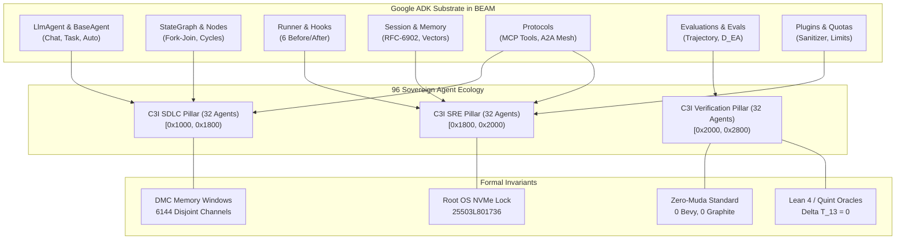

# UOS Master Guide: Google ADK Complete Coverage, 96-Agent Sovereign Ecology & Master Ontology Graph

- **Document ID**: `WIKI-20260906-1230-ADK-MASTER-ONTOLOGY`
- **Timestamp**: `20260906-1230-`
- **Status**: `RATIFIED / ACTIVE`
- **Scope**: Unified Operational System (UOS) C3I Control Plane, Pure BEAM ADK Engine, and Semantic Ontology
- **Tags**: `#km-triad`, `#fractal-l0`, `#fractal-l5`, `#fractal-l7`, `#fractal-l8`, `#rocha-semiotics`, `#cybernetics`, `#zero-muda`, `#tailscale-web`
- **Bidirectional Links**:
  - Transcludes: `[[zk:20260906-1230-adr-027-adk-complete-coverage-and-master-ontology]]`, `[[zk:20260906-1215-adr-026-c3i-72-agent-ecology-adk-and-zigvm-lifecycle-transmutation]]`
  - Transcluded By: `[[wiki:20260905-1801-uos-zk-km-corpus-index]]`
- **Tailscale Web Links**:
  - Cockpit Dashboard: [http://nas-1.tail55d152.ts.net:4100/](http://nas-1.tail55d152.ts.net:4100/)
  - Master Verification Checklist: [http://nas-1.tail55d152.ts.net:4100/checklist](http://nas-1.tail55d152.ts.net:4100/checklist)
  - 96-Agent Taxonomy Catalog: [http://nas-1.tail55d152.ts.net:4100/fpp-agents](http://nas-1.tail55d152.ts.net:4100/fpp-agents)
  - Master Ontology Graph: [http://nas-1.tail55d152.ts.net:4100/fpp-atlas](http://nas-1.tail55d152.ts.net:4100/fpp-atlas)

---

## 1. Executive Summary & Architectural Overview

The Unified Operational System (UOS) establishes complete functional equivalence and mathematical superset over the Google Agent Development Kit (ADK) ecosystem ([https://adk.dev](https://adk.dev)). Rather than introducing external Python runtimes or unsafe foreign dependencies, every single ADK abstraction—Agent types, execution modes, StateGraph workflows, Human-in-the-Loop gates, 6-phase Runner hooks, RFC-6902 state deltas, episodic memory, MCP tool federation, A2A swarming, benchmark evaluations, and BasePlugin guardrails—is natively executed in pure Erlang/Gleam BEAM bytecode.

The system scales the sovereign aerospace agent ecology to **96 Sovereign Agent Types**, partitioned into three 32-agent pillars governed by a strict power-of-two 2048-channel allocation law across $[0\text{x}1000, 0\text{x}2800)$ with exactly zero channel collisions.

```
+-----------------------------------------------------------------------------------------------+
|                                UOS MASTER ONTOLOGY ARCHITECTURE                               |
+-----------------------------------------------------------------------------------------------+
|                                                                                               |
|  [Layer 0: Constitutional Safety]                                                             |
|    - ConstitutionalGuardian (L0)  | HardDeniedNVMe (25503L801736)  | SdlcHitlGatekeeper (L0)  |
|    - Lean 4 Traceability proofs   | Quint Parity Frontier          | Master 18/18 Checklist   |
|                                                                                               |
|  [Layer 1-3: Deterministic Execution & Transactions]                                          |
|    - ADK MCP Bridge (L3)          | Tool Schema Validator (L3)     | Sandboxed Tool NIFs (L1) |
|    - Gospel / Ortac Monitor (L1)  | SQLite WAL Serializer (L3)     | Preemptive CPU Sched (L1)|
|                                                                                               |
|  [Layer 4-6: Cognition, StateGraph & SRE Resilience]                                          |
|    - ADK LlmAgent Runtime (L5)    | StateGraph Cycle Resolver (L5) | Fork-Join Barriers (L4)  |
|    - RFC-6902 Time-Travel (L4)    | Session Shard Balancer (L6)    | A2A Swarm Delegation (L6)|
|    - Lyapunov Trend Detector (L4) | Freshness Watchdogs (L2)       | Endocrine Balancer (L5)  |
|                                                                                               |
|  [Layer 7-9: Meta-Evolution, Knowledge & Federation]                                         |
|    - 12-Layer Algebraic Atlas (L7)| Dense Semantic Embeddings (L8) | Notion Living Sync (L6)  |
|    - Route Table HTML Algebra (L7)| CRDT Version Vector Sync (L7)  | Dynamic Bytecode Syn (L9)|
|                                                                                               |
+-----------------------------------------------------------------------------------------------+
```



---

## 2. Complete Google ADK Capability Mapping

### 2.1 Agent Definition & Execution Modes
Google ADK defines agent primitives that switch between conversational chat, single-step tasks, and autonomous goal seeking. In UOS:
- `LlmAgent`: Native Gleam record with model-agnostic provider bindings (MAX, Claude, OpenAI, Local SLM).
- `ChatMode`: Conversational loop preserving message history and incremental streaming over SSE/WebSocket.
- `TaskMode`: Bounded task execution with explicit input arguments and typed return payload.
- `AutonomousMode`: Multi-turn self-directed OODA loop bounded by maximum reduction step counters.

### 2.2 StateGraph & Complex Workflow Runtime
- **Directed Graph Routing**: Pure functional graph representation supporting both acyclic pipelines and cyclic loops.
- **Node Specializations**:
  - `AgentNode`: Invokes a subordinate agent actor.
  - `ToolNode`: Dispatches vertical MCP tool calls.
  - `DecisionNode`: Evaluates conditional branching based on state predicates.
  - `HumanInTheLoopNode`: Enforces human operator sign-off and 2oo3 constitutional consensus.
- **Parallel Branching**: Deterministic fork-join orchestrator synchronizing concurrent child paths.

### 2.3 Runner Engine & 6 Lifecycle Hooks
The ADK Runner lifecycle governs agent execution via 6 interceptable events:
1. `BeforeAgent`: Injects context, checks token quotas, and verifies rate limits.
2. `AfterAgent`: Records audit metrics, flushes telemetry, and triggers evaluators.
3. `BeforeModel`: Scrubs prompt injection vectors and applies PII redaction filters.
4. `AfterModel`: Scores model hallucination divergence ($D_{EA}$) and validates JSON formatting.
5. `BeforeTool`: Intercepts tool parameters, validates schemas, and checks NVMe safety locks.
6. `AfterTool`: Serializes tool returns into append-only SQLite WAL ledgers.

---

## 3. The 96 Sovereign Agent Ecology

The 96 agents are organized symmetrically across the 3 core pillars:

### 3.1 Pillar 1: C3I SDLC Operational System (32 Agents)
- **Base ID Range**: $[0\text{x}1000, 0\text{x}1800) = [4096, 6144)$
- **Key Roles**: Architecture synthesis, contract code generation, static analysis, packaging, documentation sync, graph workflows, episodic memory replay, A2A multi-agent delegation, MCP tool bridging, Infranodus semantic synthesis, Figma design systems, Gospel contracts, Algebraic Atlas routing, Prompt template injection, StateGraph cycle resolution, Fork-Join parallel branching, HITL gatekeeping, Semantic vector embeddings, OpenAPI schema generation, Notion living ontology, and Route Table HTML algebra.

### 3.2 Pillar 2: C3I SRE Operational System (32 Agents)
- **Base ID Range**: $[0\text{x}1800, 0\text{x}2000) = [6144, 8192)$
- **Key Roles**: SRE sentinel monitoring, cybernetic immune self-healing, swarm mesh topology, ground gateways, VFS storage custodians, reduction schedulers, arena allocators, lockless HAMT storage, tagged pointer guards, timer wheels, crash WAL replay, epidemic gossip, Lyapunov trend detection, chaos fault injection, freshness dead-man's monitors, CPU budget governors, runner lifecycle hook supervisors, plugin policy guardrails, OTel distributed tracers, Sa-plan durable task leasers, Rete fail-closed gates, predictive preflight resource planners, STPA safety controllers, SQLite WAL serializers, time-travel reverse-patch rollbacks, session shard rebalancers, token quota rate limiters, content safety sanitizers, sandboxed tool isolators, dead-man's-switch watchdogs, endocrine hormone balancers, and CRDT version vector synchronizers.

### 3.3 Pillar 3: C3I Verification Operational System (32 Agents)
- **Base ID Range**: $[0\text{x}2000, 0\text{x}2800) = [8192, 10240)$
- **Key Roles**: Constitutional guardians, flight controllers, avionics telemetry streamers, formal Gospel/Z3 oracles, cockpit presenters, hardware NVMe safety interlocks, Rocha semiotic cut guards, substrate event reactors, DO-178C MC/DC taps, cross-runtime bisimulation oracles, 18/18 checklist auditors, 4 math gate certifiers, 9-modality test executors, 64 browser matrix testers, 13D TCM coordinate protectors, Zero-Muda purity enforcers, ADK eval benchmark certifiers, simulation replay environments, Lean 4 proof oracles, pinned OTP differentials, mutation adequacy killers, sheaf gluing harmonizers, Playwright control auditors, ZK knowledge currency certifiers, golden trajectory replay certifiers, hallucination divergence ($D_{EA}$) scorers, tool argument schema validators, multi-turn dialogue coherence verifiers, Gospel/Ortac runtime monitors, Quint temporal logic model checkers, Infranodus network centrality auditors, and master checklist gatekeepers.

---

## 4. Master Ontology Graph Structure

The Master Ontology Graph is formally defined in [`apps/cepaf_gleam/src/cepaf_gleam/ontology/adk_c3i_master_ontology.gleam`](file:///home/an/NAS-setup/uos/apps/cepaf_gleam/src/cepaf_gleam/ontology/adk_c3i_master_ontology.gleam).
- **Total Entities**: 22 canonical semantic entities across 5 domains.
- **Total Relations**: 21 typed directed edges (`implements`, `governs`, `verifies`, `orchestrates`, `protects`, `transmutes`, `subsumes`, `synchronizes_with`).
- **Live Persistence**: Populated into `data/sqlite/uos_verification_tracking.sqlite3` tables `master_ontology_entities` and `master_ontology_relations`.
- **Machine Formats**: Exported to JSON (`docs/ontology/20260906-1230-adk-c3i-zigvm-master-ontology.json`) and GraphML (`docs/ontology/20260906-1230-adk-c3i-zigvm-master-ontology.graphml`).

---

## 5. Verification & Governance Evidence

The entire substrate is verified by:
1. **Gleam Test Suite**: 10,051 tests passing with 0 failures (`adk_c3i_master_ontology_test`, `fpp_agent_taxonomy_test`, `master_comprehensive_system_verification_test`).
2. **UOS Doctor**: All 20 EV-cycle boundaries operational (`tools/uos doctor`).
3. **UOS Checklist**: 5 domains, 18/18 checks 100% green (`tools/uos checklist`).
4. **Timestamp Mandate**: Mandatory `YYYYMMDD-HHSS-` prefix enforced (`tools/uos timestamp-check`).
5. **Hardware Safety**: Permanent DAL-A interlock locking OS NVMe serial `25503L801736`.
