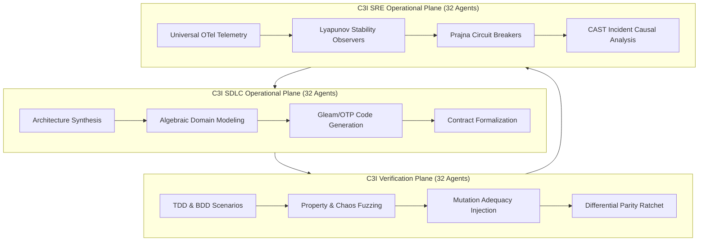

# 20260906-1300-uos-sdlc-sre-verification-process-guide.md — UOS Algebraic Fractal SDLC, SRE & Verification Operational Guide

- **Authority**: `UOS-CANONICAL-AGENT-POLICY`
- **Contract**: `SC-SDLC-SRE-001` ([`sdlc-sre-verification-process-contract.md`](file:///home/an/NAS-setup/uos/contracts/rules/sdlc-sre-verification-process-contract.md))
- **Status**: ACTIVE & OPERATIONAL
- **Lineage**: Transmuted from VM-1 `/home/an/dev/ver/zigvm/` key engineering corpus
- **Tailscale Web Cockpit**: [http://nas-1.tail55d152.ts.net:4100/checklist](http://nas-1.tail55d152.ts.net:4100/checklist)
- **Tags**: `#wiki-guide`, `#sdlc`, `#sre`, `#verification`, `#fractal-l0`, `#fractal-l4`, `#rocha-semiotics`, `#cybernetics`, `#km-triad`, `#zero-muda`
- **Bidirectional Links**:
  - Transcludes: `[[zk:20260906-1300-adr-028-algebraic-fractal-sdlc-sre-and-verification-process]]`, `[[zk:20260905-1801-moc-uos-unified-master]]`
  - Transcluded By: `[[wiki:20260905-1801-uos-zk-km-corpus-index]]`

---

## 1. Executive Summary & Purpose

This operational guide details the unified lifecycle, reliability engineering, and verification disciplines governing the Unified Operational System (UOS). Drawing from the rigorous foundation established in VM-1's `zigvm` and `harness-bionic` repositories, this guide establishes the standards for all 96 autonomous agents and human operators developing software in pure Erlang/Gleam and Hermes OCaml.

```text
===============================================================================
                    UOS UNIFIED SYSTEM DEVELOPMENT PLANE
===============================================================================
 [SDLC 32 Agents]         [SRE 32 Agents]           [Verification 32 Agents]
   Architecture             Telemetry                 Differential Oracles
   Algebraic Design         Lyapunov Observers        Mutation Testing
   State Machine Synthesis  Circuit Breakers          Property Generators
   Gleam/OTP Codegen        CAST Incident RCA         STPA Safety Interlocks
===============================================================================
```



---

## 2. The 5-Tier Fractal Lifecycle

Every software evolution and operational cycle within UOS must execute within one of the 5 fractal OODA loops:

| Loop Tier | SDLC Stage Mapping | Entry Artifact | Exit Criterion | Mandatory Verification Gate |
|---|---|---|---|---|
| **Operation** | Code (TDD micro-cycle) | Failing law test | Law test green, zero leaks, 0 warnings | Compiler & EUnit |
| **Task** | Plan $\to$ Build $\to$ Review $\to$ Integrate | Task brief / Issue spec | Two review verdicts clean; gate green; precise-scope commit | Code Review & Gate |
| **Slice** | Feature lifecycle | Component + Safety packets | Named laws + $\ge 2$ killed mutants + docs synced + SQLite evidence | `MUTATION_LOG.md` |
| **Epoch** | Release cycle | Epoch charter (+ task plan) | Exit gate + ratchets + baseline accepted + 13-section journal | `doctor` EV-cycles |
| **Pin** | Platform upgrade cycle | Re-pin ledger entry | Differential oracle green + full re-baseline | Parity suites |

### 2.1 Micro-Cycle Workflow (Operation Loop)
1. Write an assertion expressing an algebraic homomorphism law in `test/<module>_test.gleam`.
2. Run single-module EUnit:
   ```bash
   cd apps/cepaf_gleam && erl -noshell -pa build/dev/erlang/*/ebin build/test/erlang/*/ebin -eval "eunit:test([<module>_test], [verbose]), halt()."
   ```
3. Observe failure (RED).
4. Implement minimal pure Gleam logic in `src/cepaf_gleam/<module>.gleam`.
5. Re-run EUnit and verify pass (GREEN) in $<60\text{ms}$.
6. Verify zero compiler warnings via `gleam check`.

---

## 3. The 7-Step Mandatory Algebraic Loop

Per `SC-SDLC-SRE-001`, all architectural additions must complete the 7-step invariant cycle:

```text
1. Semantic Domain -> 2. Operations -> 3. Observations -> 4. Oracle
-> 5. Final Encoding -> 6. Homomorphism/Laws -> 7. Mutants -> Docs -> Evidence
```

### Step-by-Step Execution:
1. **Semantic Domain**: Express types as pure algebraic sum/product types. For instance, in `sdlc_sre_process_engine.gleam`:
   ```gleam
   pub type LifecycleTier { OperationLoop, TaskLoop, SliceLoop, EpochLoop, PinLoop }
   ```
2. **Operations**: Define total, pure functions over domain types.
3. **Observations**: Define observational equivalence functions (`eq`, `matches`) rather than structural pointer comparisons.
4. **Oracle Selection**: Specify the ground-truth oracle (e.g. Lean 4 formal spec or pinned reference).
5. **Final Encoding**: Implement deterministic BEAM bytecode or ZigVM structures.
6. **Homomorphism Laws**: State and verify composition laws:
   ```gleam
   // decode(op(x)) == op'(decode(x))
   ```
7. **Mutation Adequacy**: Plant $\ge 2$ deliberate defects, run tests, confirm RED, revert, and log to `docs/evidence/20260906-1300-uos-mutation-log.md`.

---

## 4. STPA Safety & Reliability Practices

Systems-Theoretic Process Analysis (STPA) treats safety as a control problem rather than a component reliability problem.

### 4.1 Losses & Hazards Enforced:
- **L-1 (False Conformance)** $\leftarrow$ **H-1**: The gate reports green while a defect exists.
- **L-2 (Silent Regression)** $\leftarrow$ **H-2**: Quality ratchets or baselines are weakened.
- **L-3 (Evidence Contamination)** $\leftarrow$ **H-3**: Telemetry or ledgers diverge from runtime reality.
- **L-4 (Large-Scale Wasted Effort)** $\leftarrow$ **H-4**: Work proceeds on unverified foundations.
- **L-5 (Boundary & Purity Loss)** $\leftarrow$ **H-5**: Barred dependencies (Bevy, Graphite, foreign NIFs) admitted.

### 4.2 CAST Incident Investigation Workflow:
Whenever an anomaly or test trip occurs:
1. Log incident immediately in `docs/evidence/20260906-1300-uos-cast-log.md`.
2. Map to Hazard (H-1..H-5) and Loss (L-1..L-5).
3. Conduct Root Cause Analysis on controller mental models and feedback delays.
4. Design and implement systemic algorithmic and policy fixes.
5. Author a regression law test, confirm mutant kill, and verify whole-system green.

---

## 5. Multi-Paradigm Verification Suite

UOS tests are organized into 9 complementary modalities:
1. **Unit Verification**: Individual function and type contract checks.
2. **System Verification**: Multi-domain root supervisor (`uos_sup.gleam`) and child actor health.
3. **TDD (Law-Driven)**: Failing-to-passing property tests.
4. **BDD (Scenario-Driven)**: End-to-end agent workflows and state transitions.
5. **Performance Verification**: Latency and throughput bounds under bounded fuel.
6. **Scalability Verification**: Swarm scaling up to 96 concurrent actors.
7. **Property-Based Verification**: Generative fuzzing with seeded pseudo-randomness.
8. **Fuzz Verification**: Malformed input and invalid token rejection.
9. **Chaos Verification**: Simulated actor crashes, network splits, and disk write denials.

---

## 6. Live Navigation & Cockpit Integration

All operational metrics, ledgers, and verification reports are accessible over Tailscale:
- **Cockpit Dashboard**: [http://nas-1.tail55d152.ts.net:4100/](http://nas-1.tail55d152.ts.net:4100/)
- **Comprehensive Verification Checklist**: [http://nas-1.tail55d152.ts.net:4100/checklist](http://nas-1.tail55d152.ts.net:4100/checklist)
- **FPP 96-Agent Catalog**: [http://nas-1.tail55d152.ts.net:4100/fpp-agents](http://nas-1.tail55d152.ts.net:4100/fpp-agents)
- **Mutation Adequacy Ledger**: [http://nas-1.tail55d152.ts.net:4100/files/docs/evidence/20260906-1300-uos-mutation-log.md](http://nas-1.tail55d152.ts.net:4100/files/docs/evidence/20260906-1300-uos-mutation-log.md)
- **Parity & Divergence Ledger**: [http://nas-1.tail55d152.ts.net:4100/files/docs/evidence/20260906-1300-uos-divergence-log.md](http://nas-1.tail55d152.ts.net:4100/files/docs/evidence/20260906-1300-uos-divergence-log.md)
- **CAST Incident Ledger**: [http://nas-1.tail55d152.ts.net:4100/files/docs/evidence/20260906-1300-uos-cast-log.md](http://nas-1.tail55d152.ts.net:4100/files/docs/evidence/20260906-1300-uos-cast-log.md)
