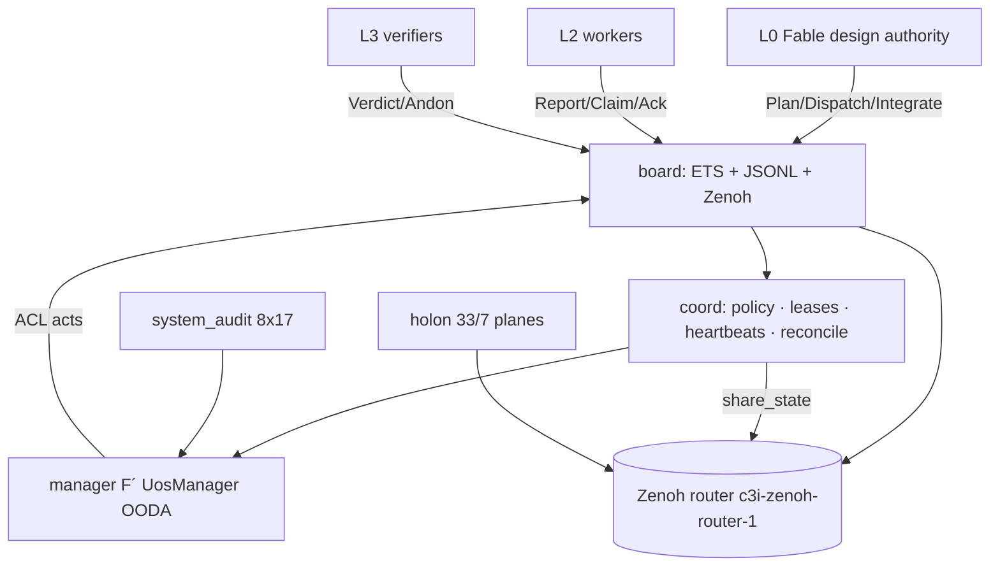
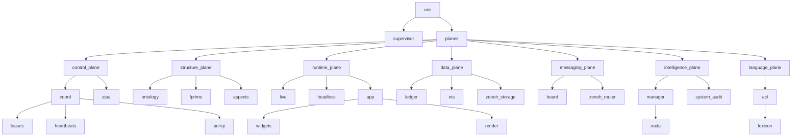

# 20260907-0537- UOS Hive Mind: Message Board, Coordination, Language and Holarchy (samūha-buddhi · समूह-बुद्धि)
#fractal-l0 #fractal-l1 #fractal-l2 #fractal-l3 #fractal-l4 #fractal-l5 #fractal-l6 #fractal-l7 #fractal-l8 #fractal-l9 #rocha-semiotics #cybernetics #km-triad #zero-muda #tailscale-web #hive-mind #uos-tui #zenoh

- **Wiki Identifier**: `WKI-20260907-0537-HIVE-MIND`
- **Timestamp**: `20260907-0537-`
- **Tailscale FQDN Link**: [http://nas-1.tail55d152.ts.net:4100/docs/docs/wiki/20260907-0537-uos-hive-mind-architecture-wiki.md](http://nas-1.tail55d152.ts.net:4100/docs/docs/wiki/20260907-0537-uos-hive-mind-architecture-wiki.md)
- **Live**: [a2a plane](http://nas-1.tail55d152.ts.net:8080/c3i/a2a/**) · [state](http://nas-1.tail55d152.ts.net:8080/uos/tui/state/**) · [hive](http://nas-1.tail55d152.ts.net:8080/uos/tui/state/hive) · [holarchy](http://nas-1.tail55d152.ts.net:8080/uos/tui/state/holarchy) · [lexicon](http://nas-1.tail55d152.ts.net:8080/uos/tui/state/acl_lexicon)
- **Transclusions**: `[[zk:20260907-0537-adr-062-uos-tui-swarm-hive-mind-message-board-coordination-acl-and-zenoh-infra]]` `[[zk:20260906-2150-adr-061-uos-tui-gleam-library-textual-reference]]` `[[wiki:20260906-2150-uos-fractal-textual-ontology-wiki]]` `[[zk:20260905-1801-moc-uos-unified-master]]` `[[wiki:20260905-1801-uos-zk-km-corpus-index]]`

## Comprehensive Verification Checklist (SC-CHECKLIST-001)
<details><summary>18 checkpoints (honest)</summary>

CHK-01 PASS · CHK-02 PASS · CHK-03 PASS · CHK-04 PASS · CHK-05 PASS (0 NIF; eclipse/zenoh container) · CHK-06 PASS · CHK-07 PASS (serial in F´ params, status bar, aspect 1) · CHK-08 PASS · CHK-09 NOT MEASURED · CHK-10 PASS (354 tests, 9 modalities) · CHK-11 N/A · CHK-12 PASS (child specs for coord, manager, live) · CHK-13/14/15 DECLARED (ports) · CHK-16 PASS (trace/span ids, µs Z) · CHK-17 PENDING · CHK-18 PASS
</details>

## 1. Architecture (ASCII, SC-DIAGRAM-001)
```text
 L0 Fable (design authority) ──Plan/Dispatch/Integrate──▶ board ◀──Report/Verdict/Ack── L2 workers · L3 verifiers
                                        │  ETS (live)  ·  JSONL ledger (durable, per-sender SHA-256 chains)
                                        │  Zenoh REST c3i/a2a/{src}/{tgt}/{id}  ·  storages keep every message
   coord: policy · leases(epochs) · claims(WIP) · heartbeats · Lamport · reconcile · usage · share_state
   manager (F´ UosManager, 0 tokens): observe(board,leases,zenoh,audit) → orient(Lyapunov) → decide(mode) → act(ACL messages)
   system_audit: 8 subjects × 17 aspects (fail-closed)      holon: 33 holons / 7 planes      acl: 12 performatives, Sanskrit ⇄ English
   hive: uos/tui/state/hive = holarchy + board + KPIs + audit + language + zenoh
```


## 2. Holarchy (generated from `holon.holarchy()`)
| L | id | name | Sanskrit | plane | whole | parts | module | audit subject |
|---|---|---|---|---|---|---|---|---|
| 0 | uos | Unified Operational System | ekīkṛta-kārya-tantra (एकीकृत-कार्य-तन्त्र) | control · niyantraṇa (नियन्त्रण) | — | supervisor, planes | `apps/uos_tui` | — |
| 0 | supervisor | L0 design authority (Fable) | adhiṣṭhātṛ (अधिष्ठातृ) | control · niyantraṇa (नियन्त्रण) | uos |  | `uos_tui/coord (policy)` | coordination policy |
| 1 | planes | Seven planes | sapta-tala (सप्त-तल) | structure · saṃracanā (संरचना) | uos | control-plane, structure-plane, runtime-plane, data-plane, messaging-plane, intelligence-plane, language-plane | `uos_tui/holon` | — |
| 1 | control-plane | Control plane | niyantraṇa-tala (नियन्त्रण-तल) | control · niyantraṇa (नियन्त्रण) | planes | coord, stpa | `uos_tui/coord` | coordination policy |
| 1 | structure-plane | Structure plane | saṃracanā-tala (संरचना-तल) | structure · saṃracanā (संरचना) | planes | ontology, fprime, aspects | `uos_tui/ontology` | fractal ontology |
| 1 | runtime-plane | Runtime plane | pravartana-tala (प्रवर्तन-तल) | runtime · pravartana (प्रवर्तन) | planes | live, headless, app | `uos_tui/live` | cockpit screen |
| 1 | data-plane | Data plane | dattāṃśa-tala (दत्तांश-तल) | data plane · dattāṃśa (दत्तांश) | planes | ledger, ets, zenoh-storage | `uos_tui/board (ledger)` | message board |
| 1 | messaging-plane | Messaging plane | sandeśa-tala (सन्देश-तल) | messaging · sandeśa (सन्देश) | planes | board, zenoh-router | `uos_tui/board` | zenoh infra |
| 1 | intelligence-plane | Intelligence plane | buddhi-tala (बुद्धि-तल) | intelligence · buddhi (बुद्धि) | planes | manager, system-audit | `uos_tui/manager` | telemetry |
| 1 | language-plane | Language plane | bhāṣā-tala (भाषा-तल) | language · bhāṣā (भाषा) | planes | acl | `uos_tui/acl` | — |
| 2 | coord | Coordination & sync | samanvaya (समन्वय) | control · niyantraṇa (नियन्त्रण) | control-plane | leases, heartbeats, policy | `uos_tui/coord` | coordination policy |
| 2 | stpa | STPA & FMEA safety | surakṣā (सुरक्षा) | control · niyantraṇa (नियन्त्रण) | control-plane |  | `uos_tui/stpa` | — |
| 2 | ontology | Fractal Textual ontology | sattā-śāstra (सत्ता-शास्त्र) | structure · saṃracanā (संरचना) | structure-plane |  | `uos_tui/ontology` | fractal ontology |
| 2 | fprime | F´ dictionaries | śabda-kośa (शब्द-कोश) | structure · saṃracanā (संरचना) | structure-plane |  | `uos_tui/fprime` | F´ dictionary |
| 2 | aspects | 17-aspect audit | saptadaśa-pakṣa (सप्तदश-पक्ष) | structure · saṃracanā (संरचना) | structure-plane |  | `uos_tui/aspects` | — |
| 2 | live | OTP live driver | jīva-cālaka (जीव-चालक) | runtime · pravartana (प्रवर्तन) | runtime-plane |  | `uos_tui/live` | cockpit screen |
| 2 | headless | Headless pilot | parīkṣaka (परीक्षक) | runtime · pravartana (प्रवर्तन) | runtime-plane |  | `uos_tui/headless` | — |
| 2 | app | TEA application core | mūla-yantra (मूल-यन्त्र) | runtime · pravartana (प्रवर्तन) | runtime-plane | widgets, render | `uos_tui/app` | cockpit screen |
| 2 | ledger | Append-only JSONL ledger | lekhā (लेखा) | data plane · dattāṃśa (दत्तांश) | data-plane |  | `uos_tui/board (jsonl)` | — |
| 2 | ets | ETS live table | smṛti (स्मृति) | data plane · dattāṃśa (दत्तांश) | data-plane |  | `uos_tui_ffi.erl (ets)` | — |
| 2 | zenoh-storage | Zenoh memory storages | megha-smṛti (मेघ-स्मृति) | data plane · dattāṃśa (दत्तांश) | data-plane |  | `ops/zenoh (storage_manager)` | — |
| 2 | board | Message board | sandeśa-phalaka (सन्देश-फलक) | messaging · sandeśa (सन्देश) | messaging-plane |  | `uos_tui/board` | message board |
| 2 | zenoh-router | Zenoh router c3i-zenoh-router-1 | mārga-darśaka (मार्ग-दर्शक) | messaging · sandeśa (सन्देश) | messaging-plane |  | `ops/zenoh` | zenoh infra |
| 2 | manager | F´ managing agent | prabandhaka (प्रबन्धक) | intelligence · buddhi (बुद्धि) | intelligence-plane | ooda | `uos_tui/manager` | telemetry |
| 2 | system-audit | System-wide audit | sarva-parīkṣā (सर्व-परीक्षा) | intelligence · buddhi (बुद्धि) | intelligence-plane |  | `uos_tui/system_audit` | — |
| 2 | acl | Agent communication language | sambhāṣā (सम्भाषा) | language · bhāṣā (भाषा) | language-plane | lexicon | `uos_tui/acl` | — |
| 3 | widgets | Widget catalog (17 families) | aṅga (अङ्ग) | runtime · pravartana (प्रवर्तन) | app |  | `uos_tui/widget` | — |
| 3 | render | Compositor | citra-kāra (चित्र-कार) | runtime · pravartana (प्रवर्तन) | app |  | `uos_tui/render` | — |
| 3 | ooda | Fast OODA controller | cakra (चक्र) | intelligence · buddhi (बुद्धि) | manager |  | `uos_tui/ooda` | — |
| 3 | leases | Fenced leases | paṭṭā (पट्टा) | control · niyantraṇa (नियन्त्रण) | coord |  | `uos_tui/coord (acquire/renew/release)` | — |
| 3 | heartbeats | Freshness monitor | spandana (स्पन्दन) | control · niyantraṇa (नियन्त्रण) | coord |  | `uos_tui/coord (beat/stale)` | — |
| 3 | policy | Hierarchical authority | adhikāra (अधिकार) | control · niyantraṇa (नियन्त्रण) | coord |  | `uos_tui/coord (authorize)` | — |
| 3 | lexicon | Sanskrit/English lexicon | kośa (कोश) | language · bhāṣā (भाषा) | acl |  | `uos_tui/acl (lexicon)` | — |

```text
L0 uos · Unified Operational System · ekīkṛta-kārya-tantra (एकीकृत-कार्य-तन्त्र)
  L0 supervisor · L0 design authority (Fable) · adhiṣṭhātṛ (अधिष्ठातृ)
  L1 planes · Seven planes · sapta-tala (सप्त-तल)
    L1 control-plane · Control plane · niyantraṇa-tala (नियन्त्रण-तल)
      L2 coord · Coordination & sync · samanvaya (समन्वय)
        L3 leases · Fenced leases · paṭṭā (पट्टा)
        L3 heartbeats · Freshness monitor · spandana (स्पन्दन)
        L3 policy · Hierarchical authority · adhikāra (अधिकार)
      L2 stpa · STPA & FMEA safety · surakṣā (सुरक्षा)
    L1 structure-plane · Structure plane · saṃracanā-tala (संरचना-तल)
      L2 ontology · Fractal Textual ontology · sattā-śāstra (सत्ता-शास्त्र)
      L2 fprime · F´ dictionaries · śabda-kośa (शब्द-कोश)
      L2 aspects · 17-aspect audit · saptadaśa-pakṣa (सप्तदश-पक्ष)
    L1 runtime-plane · Runtime plane · pravartana-tala (प्रवर्तन-तल)
      L2 live · OTP live driver · jīva-cālaka (जीव-चालक)
      L2 headless · Headless pilot · parīkṣaka (परीक्षक)
      L2 app · TEA application core · mūla-yantra (मूल-यन्त्र)
        L3 widgets · Widget catalog (17 families) · aṅga (अङ्ग)
        L3 render · Compositor · citra-kāra (चित्र-कार)
    L1 data-plane · Data plane · dattāṃśa-tala (दत्तांश-तल)
      L2 ledger · Append-only JSONL ledger · lekhā (लेखा)
      L2 ets · ETS live table · smṛti (स्मृति)
      L2 zenoh-storage · Zenoh memory storages · megha-smṛti (मेघ-स्मृति)
    L1 messaging-plane · Messaging plane · sandeśa-tala (सन्देश-तल)
      L2 board · Message board · sandeśa-phalaka (सन्देश-फलक)
      L2 zenoh-router · Zenoh router c3i-zenoh-router-1 · mārga-darśaka (मार्ग-दर्शक)
    L1 intelligence-plane · Intelligence plane · buddhi-tala (बुद्धि-तल)
      L2 manager · F´ managing agent · prabandhaka (प्रबन्धक)
        L3 ooda · Fast OODA controller · cakra (चक्र)
      L2 system-audit · System-wide audit · sarva-parīkṣā (सर्व-परीक्षा)
    L1 language-plane · Language plane · bhāṣā-tala (भाषा-तल)
      L2 acl · Agent communication language · sambhāṣā (सम्भाषा)
        L3 lexicon · Sanskrit/English lexicon · kośa (कोश)
```



## 3. Language lexicon (generated from `acl.lexicon`)
| role | English | IAST | Devanagari | gloss |
|---|---|---|---|---|
| perf | INFORM | sūcanā | सूचना | notice, information |
| perf | REQUEST | prārthanā | प्रार्थना | request, petition |
| perf | PROPOSE | prastāva | प्रस्ताव | proposal |
| perf | ACCEPT | svīkāra | स्वीकार | acceptance |
| perf | REJECT | nirākaraṇa | निराकरण | rejection |
| perf | QUERY | praśna | प्रश्न | question |
| perf | CONFIRM | puṣṭi | पुष्टि | confirmation |
| perf | COMMIT | saṅkalpa | सङ्कल्प | resolve, vow |
| perf | ASSERT | pratijñā | प्रतिज्ञा | assertion |
| perf | RETRACT | pratyāhāra | प्रत्याहार | withdrawal |
| perf | HYPOTHESIZE | kalpanā | कल्पना | hypothesis |
| perf | ANDON | sāvadhāna | सावधान | alert, attention |
| modal | K | jñā | ज्ञा | knows |
| modal | B | man | मन् | believes, thinks |
| modal | I | iṣ | इष् | intends, wills |
| modal | O | kṛtya | कृत्य | is obliged, duty |
| modal | G | lakṣya | लक्ष्य | goal |
| modal | ∴ | tasmāt | तस्मात् | therefore |
| dir | perf | kārya | कार्य | act, performative |
| dir | from | preṣaka | प्रेषक | sender |
| dir | to | prāpaka | प्रापक | receiver |
| dir | re | uttara | उत्तर | reply to |
| dir | ooda | cakra | चक्र | cycle phase |
| dir | conf | niścaya | निश्चय | certainty |
| dir | cost | mūlya | मूल्य | cost |
| dir | by | samaya | समय | deadline |
| tag | aspects | pakṣa | पक्ष | aspects |
| tag | ca | niyantraṇa | नियन्त्रण | control actions |
| tag | onto | sattā | सत्ता | ontology concepts |
| tag | muda | vyartha | व्यर्थ | waste |
| conn | ∧ | ca | च | and |
| conn | ⇐ | cet | चेत् | provided that |
| ooda | observe | avalokana | अवलोकन | observe |
| ooda | orient | vicāra | विचार | consider, orient |
| ooda | decide | nirṇaya | निर्णय | decide |
| ooda | act | kriyā | क्रिया | act |

## 4. Example utterance (canonical bilingual form) and its introspection
```text
@kārya prastāva  ; en: @perf PROPOSE
@preṣaka L0-fable/L0 @prāpaka broadcast  ; en: @from L0-fable/L0 @to broadcast
@cakra nirṇaya  ; en: @ooda decide
@mūlya 2591767
iṣ(L0-fable): dispatch(agents=15) ∧ pipeline(groups=4) ∧ retries=0 ∧ jidoka(on=red)  ; en: L0-fable intends dispatch(agents=15) and pipeline(groups=4) and retries=0 and jidoka(on=red)
iṣ(L0-fable): supervise(runtime, uos-manager) ⇐ tokens(uos-manager)=0 ∧ authority(design)=fable  ; en: L0-fable intends supervise(runtime, uos-manager), provided tokens(uos-manager)=0 and authority(design)=fable
tasmāt propose(swarm, workers=10, doc_workers=1, verifiers=4, models="sonnet x10 haiku x5")  ; en: therefore propose(swarm, workers=10, doc_workers=1, verifiers=4, models="sonnet x10 haiku x5")
#pakṣa 15,17  ; en: #aspects
#niyantraṇa CA-integrate_slice  ; en: #ca control actions
#sattā Pilot / run_test|17 Aspect audit  ; en: #onto concepts
```
```text
L0-fable (L0) proposes broadcast
precondition: B(s, feasible(a))
postcondition: O(r, reply ∈ {ACCEPT, REJECT}) ∧ B(r, I(s, a))
L0-fable intends to dispatch(agents=15) and pipeline(groups=4) and retries=0 and jidoka(on=red)
L0-fable intends to supervise(runtime, uos-manager), provided tokens(uos-manager)=0 and authority(design)=fable
therefore: propose(swarm, workers=10, doc_workers=1, verifiers=4, models="sonnet x10 haiku x5")
references: aspects 15,17; control actions CA-integrate_slice; concepts Pilot / run_test|17 Aspect audit
density 0.3 refs/token; entropy 5.23 bits/token
```

## 5. System-wide 17-aspect audit (generated)
| # | Aspect | cockpit screen | swarm dashboard screen | message board | coordination policy | F´ dictionary | fractal ontology | zenoh infra | telemetry |
|---|---|---|---|---|---|---|---|---|---|
| 1 | Substrate & Hardware Storage Safety | PASS | PASS | DECLARED | PASS | PASS | DECLARED | DECLARED | DECLARED |
| 2 | Standalone Jujutsu Monorepo Discipline | PASS | PASS | DECLARED | DECLARED | DECLARED | DECLARED | DECLARED | DECLARED |
| 3 | Zero-Muda Purity & Waste Elimination | PASS | PASS | PASS | PASS | DECLARED | PASS | PASS | DECLARED |
| 4 | Gleam/OTP Root Supervisor | PASS | PASS | DECLARED | PASS | DECLARED | DECLARED | PASS | DECLARED |
| 5 | ZigVM Deterministic Engine & VFS Laws | DECLARED | DECLARED | DECLARED | DECLARED | PASS | DECLARED | DECLARED | DECLARED |
| 6 | Hermes Formal Evidence & Gospel | DECLARED | DECLARED | DECLARED | DECLARED | PASS | DECLARED | DECLARED | DECLARED |
| 7 | Mathematical Authority & Conservation | DECLARED | DECLARED | PASS | DECLARED | PASS | DECLARED | DECLARED | PASS |
| 8 | Biosemiotic Cybernetics & Rocha Cut | DECLARED | DECLARED | PASS | PASS | PASS | DECLARED | DECLARED | DECLARED |
| 9 | Quarantined Modular MAX Inference | DECLARED | DECLARED | DECLARED | DECLARED | PASS | DECLARED | DECLARED | DECLARED |
| 10 | Zenoh OoZ & MoZ Mesh Telemetry | PASS | PASS | PASS | DECLARED | PASS | DECLARED | PASS | PASS |
| 11 | AG-UI 32-Event SSE Stream | PASS | PASS | DECLARED | DECLARED | PASS | DECLARED | PASS | DECLARED |
| 12 | A2UI Declarative Catalog | PASS | PASS | PASS | DECLARED | DECLARED | PASS | DECLARED | DECLARED |
| 13 | Penta-Stack Multi-Interface Accessibility | PASS | PASS | PASS | DECLARED | DECLARED | PASS | DECLARED | DECLARED |
| 14 | Universal Tailscale FQDN Web Navigation | PASS | PASS | PASS | DECLARED | PASS | DECLARED | PASS | DECLARED |
| 15 | Comprehensive Verification Checklist | PASS | PASS | PASS | PASS | DECLARED | DECLARED | DECLARED | DECLARED |
| 16 | Knowledge Management Triad | PASS | PASS | PASS | DECLARED | DECLARED | PASS | DECLARED | DECLARED |
| 17 | Sa-Plan & Bionic Durable Workflows | PASS | PASS | PASS | PASS | PASS | DECLARED | PASS | DECLARED |

Totals: PASS 56 · DECLARED 78 · FAIL 2 · admissible=false · no_failures=false (strict admission after Codex round H2; the two FAILs are evaluated checklists on the two screens)


## 6. Operational, security, observability and formal controls (generated controls report)
| domain | id | control | enforcement | status |
|---|---|---|---|---|
| operational | OP-1 | Zenoh router systemd user unit | `ops/zenoh/20260907-0450-c3i-zenoh-router-1.service` | PRESENT |
| operational | OP-2 | Router reachable (REST) | `system_audit.probe` | UP |
| operational | OP-3 | Retry + dead-letter | `board.retry_undelivered (max 5)` | ENFORCED |
| operational | OP-4 | Heartbeat freshness + retirement | `coord.stale / coord.retire` | ENFORCED |
| operational | OP-5 | Jidoka / andon | `manager.step + tps.jidoka` | ENFORCED |
| security | SEC-1 | Hierarchical authority | `coord.authorize (kinds per layer)` | ENFORCED |
| security | SEC-2 | Design authority fable-only | `coord.authorize design_kinds` | ENFORCED |
| security | SEC-3 | Intent never executed (Rocha cut) | `coord.authorize + manager (no side effects)` | ENFORCED |
| security | SEC-4 | Capability default-deny | `agent_runtime.allowed` | ENFORCED |
| security | SEC-5 | Memory isolation per agent | `agent_runtime.remember/recall` | ENFORCED |
| security | SEC-6 | Per-sender SHA-256 chains | `board.validate` | ENFORCED |
| security | SEC-7 | Fenced single-writer leases | `coord.acquire/renew (epochs)` | ENFORCED |
| security | SEC-8 | Zero-trust dispatch interceptor (Hermes) | `engines/hermes run_agent_dispatch_hook.exe` | MISSING |
| observability | OBS-1 | W3C trace/span on every message | `telemetry + board.seal` | ENFORCED |
| observability | OBS-2 | Delivery record per transport | `board.deliver` | ENFORCED |
| observability | OBS-3 | Shared state on Zenoh | `coord.share_state uos/tui/state/*` | LIVE |
| observability | OBS-4 | System-wide 17-aspect audit | `system_audit.all_subjects` | ENFORCED |
| observability | OBS-5 | Usage accounting per agent and global | `coord.record_usage` | ENFORCED |
| formal | FRM-1 | Lean 4 proofs bound | `formal/lean/Traceability.lean,formal/lean/TwoLattice_STM.lean` | PRESENT |
| formal | FRM-2 | Quint model bound | `formal/quint/parity_frontier.qnt` | PRESENT |
| formal | FRM-3 | MAX daemon quarantined | `services/inference/max/max_worker.py` | PRESENT |
controls_ok=false

