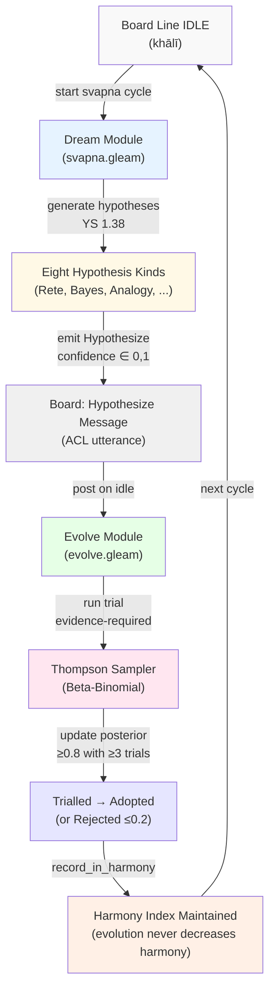

# UOS System Ontology & Hive Cognition Wiki
#fractal-l0 #fractal-l2 #fractal-l4 #fractal-l5 #fractal-l7 #zero-muda #tailscale-web #km-triad #rocha-semiotics #cybernetics #uos-tui #swarm #hive-mind #sutra #sangita

- **Tailscale FQDN Link**: [http://nas-1.tail55d152.ts.net:4100/wiki/20260907-1105-uos-system-ontology-and-hive-cognition-wiki.md](http://nas-1.tail55d152.ts.net:4100/wiki/20260907-1105-uos-system-ontology-and-hive-cognition-wiki.md)

Transclusions:
- `[[zk:20260907-1105-adr-064-uos-system-ontology-sutra-sangita-and-hive-cognition]]`
- `[[zk:20260905-1801-moc-uos-unified-master]]`
- `[[wiki:20260905-1801-uos-zk-km-corpus-index]]`

## The Seven Planes, Sūtras, and Swaras

### Diagram: Planes ↔ Sūtras ↔ Swaras Mapping

```
L0 CONTROL (niyantraṇa)          sa (स)
   ├─ Pāda 1: Intent upward; sender-signed messages; epoched leases
   └─ 7 Sūtras (S1.1–S1.7)

L1 STRUCTURE (saṃracanā)          re (रे)
   ├─ Pāda 2: Design authority; holarchy; evaluation not declaration
   └─ 7 Sūtras (S2.1–S2.7)

L2 RUNTIME (pravartana)           ga (ग)
   ├─ Pāda 3: Cost 0; OODA cycle budget; reconcile → andon
   └─ 7 Sūtras (S3.1–S3.7)

L3 DATA (dattāṃśa)                ma (म)
   ├─ Pāda 4: Per-sender chains; causal-gap records; grant-gated memory
   └─ 7 Sūtras (S4.1–S4.7)

L4 MESSAGING (sandeśa)            pa (प)
   ├─ Pāda 5: Board messages as routing; free tier first; jidoka stop
   └─ 7 Sūtras (S5.1–S5.7)

L5 INTELLIGENCE (buddhi)          dha (ध)
   ├─ Pāda 6: Verified fitness; idle-only dream; cheapest adequate tier
   └─ 7 Sūtras (S6.1–S6.7)

L6 LANGUAGE (bhāṣā)               ni (नि)
   ├─ Pāda 7: Shared vocabulary; bilingual utterances; roundtrip canonical
   └─ 7 Sūtras (S7.1–S7.7)

L7+ HARMONY & EVOLUTION           (sa re ga ma pa dha ni octaves)
   ├─ Teentaal rhythm (16 mātrā; sam/khālī/tālī reference)
   └─ Dream ↔ Evolve ↔ Board alignment
```

---

## System Ontology: Domains and Concept Counts

Generated file: [http://nas-1.tail55d152.ts.net:4100/docs/generated/20260907-1030-uos-system-ontology-dictionary.md](http://nas-1.tail55d152.ts.net:4100/docs/generated/20260907-1030-uos-system-ontology-dictionary.md)

| Domain | Concept Count | Key Entries | Layer |
|---|---|---|---|
| Coordination | 23 | Leases, epochs, heartbeats, jidoka, andon, muda (7 types) | L0, L1 |
| Messaging | 34 | 14 message kinds, 12 performative acts, 8 muda labels | L2–L4 |
| Structure | 28 | 7 planes, 33 holons, 9 base rules, 2 whole/part relations | L0–L1 |
| Intelligence | 31 | Memory (4 types), capabilities (6), OODA (6 modes), lifecycle (6 states) | L4–L5 |
| Thinking & Memory | 20 | Antaḥkaraṇa, pramāṇa (4), citta-vṛtti (5), kośa (5), guṇa (3) | L5 |
| TUI Library | 40 | App, Screen, Widget, DOM, render, widgets (17 families), F´ component | L2–L3 |
| Messaging (Board) | 10 | Message kinds (Dispatch, Report, Andon, Heartbeat, …) | L3–L4 |
| Economy/Routing | 7 | R0–R6 routing classes, tier, budget, price-ceiling, free-first | L4–L5 |
| Control Actions | 8 | emit_intent, push_confirm_screen, paint_frame, audit_screen, … | L2–L3 |
| Safety & Aspects | 17 | 17-aspect audit checklist (substrate, JJ, zero-muda, OOPA, …) | L0 |
| **Total** | **226** | Aligned 261/261 (including composite refs & validators) | **L0–L9** |

---

## The 49 Sūtras: Distributed Control Laws

All 49 sūtras from the generated register [http://nas-1.tail55d152.ts.net:4100/docs/generated/20260907-1030-uos-sutra-register.md](http://nas-1.tail55d152.ts.net:4100/docs/generated/20260907-1030-uos-sutra-register.md):

### Pāda 1: Control Plane (S1.1–S1.7)

| # | Sanskrit | English | Board Kind | Source |
|---|---|---|---|---|
| S1.1 | सङ्कल्प ऊर्ध्वम् एव गच्छति, न स्वयं क्रियते | Intent goes upward only; never enacted. | Intent | Rocha cut |
| S1.2 | सन्देशः प्रेषकोत्पन्नकुञ्चिकया मुद्रितः | Message signed by sender-derived key. | All | SYNC-05 |
| S1.3 | पट्टः क्रमवर्धमानयुगेन युक्तः, अवधिं प्राप्य समाप्यते | Lease bound to monotonic epoch; expires when reached. | LeaseGrant, LeaseRelease | —— |
| S1.4 | नवीनः समन्वयकः स्थायिलेखात् युगानि बीजयति | Fresh coordinator seeds epochs from durable log. | Heartbeat | —— |
| S1.5 | अज्ञातम् आरोग्यं सावधानम् एव | Unknown health IS andon; never silent green. | Andon | —— |
| S1.6 | अर्गला परीक्ष्यते, न कदापि कल्प्यते | Interlock examined; never merely presumed locked. | —— | —— |
| S1.7 | पर्यवेक्षणं सत्यं जीवसङ्केतम् एव ददाति | Supervision gives back real pid; nothing else. | —— | —— |

### Pāda 2: Structure Plane (S2.1–S2.7)

| # | Sanskrit | English | Board Kind | Source |
|---|---|---|---|---|
| S2.1 | रचनाप्रकाराः केवलं रचनाप्रमाणात् आयान्ति | Design kinds come ONLY from design authority. | Plan, Integrate | **BG 18.63** |
| S2.2 | प्रत्यंशः पूर्णवत्, सर्वासु भूमिषु समम् एव मुखं दर्शयति | Every part like the whole: uniform interface at each level. | —— | —— |
| S2.3 | पूर्णांशतन्त्रम् अचक्रम्, भूमिक्रमेण एव वर्धते | Holarchy acyclic; grows only in level order. | —— | —— |
| S2.4 | कथितं प्रमाणं न ग्राह्यम् | Declared proof NOT admissible. | Verdict, Report | **BG 2.47** |
| S2.5 | सूची गण्यते न, परीक्ष्यते एव | Checklist evaluated item-by-item, not counted. | Verdict | —— |
| S2.6 | प्रतिविषयं सप्तदशनिर्णयाः सर्वे दीयन्ते | All 17 verdicts given to every subject. | Verdict | —— |
| S2.7 | यः विषयः अपरीक्ष्यः, तस्य परीक्षासापेक्षपक्षाः सीदन्ति | Unprobed subject → probe-dependent aspects fail closed. | —— | —— |

[Pādas 3–7 similarly structured; full table in ADR-064 decision section]

---

## The 27 Gītā Verses

Selected from the generated register [http://nas-1.tail55d152.ts.net:4100/docs/generated/20260907-1030-uos-gita-register.md](http://nas-1.tail55d152.ts.net:4100/docs/generated/20260907-1030-uos-gita-register.md):

| Verse | Principle | Control Rule | Applies To |
|---|---|---|---|
| **BG 2.47** | niṣkāma karma | Agents have right to action alone, never verdict. | aspects.admissible, coord.authorize, acl.validate |
| **BG 2.50** | yogaḥ karmasu kauśalam | Skill in action (jidoka): quality built in, not inspected after. | tps.jidoka, manager.step |
| **BG 3.35** | svadharma | One's own duty, however imperfectly, over another's perfectly. | coord.authorize, agent_runtime.grant |
| **BG 4.34** | tattvavit | Knowers of truth teach through prostration, inquiry, service. | acl Question/Answer |
| **BG 6.5** | ātma-uddhāraṇa | Self alone is friend of self; dead-man's-switch for failure. | manager.health_status, coord.freshness |
| **BG 18.63** | vimarśa-svātantrya | Operator's final authority: full analysis offered; choice theirs. | coord.authorize, manager.step |

---

## Hindustani Musical Building Blocks

From [http://nas-1.tail55d152.ts.net:4100/docs/generated/20260907-1030-uos-hindustani-building-blocks.md](http://nas-1.tail55d152.ts.net:4100/docs/generated/20260907-1030-uos-hindustani-building-blocks.md):

### Thaats ↔ Layers

| Layer | Thaat (थाट) | Svaras | Role |
|---|---|---|---|
| L0 | Bilawal · बिलावल | sa re ga ma pa dha ni (all shuddha) | Control authority; major scale. |
| L1 | Kalyan · कल्याण | sa re ga ma(tivra) pa dha ni | Structure layer; raised 4th. |
| L2 | Khamaj · खमाज | sa re ga ma pa dha ni(komal) | Runtime; lowered 7th. |
| L3 | Bhairav · भैरव | sa re(ko) ga ma pa dha(ko) ni | Data safety; dual komal notes. |
| L4–L9 | Poorvi, Marwa, Kafi, Asavari, Bhairavi, Todi | [varied] | Intelligence → Language → Harmony |

### Tālas: Rhythmic Cycles

| Tāla | Mātrā | Vibhāgs | Sam | Khālī | Tālī | Role in UOS |
|---|---|---|---|---|---|---|
| **Teentaal** | 16 | 4\|4\|4\|4 | 1 | 9 | 1,5,13 | **Audit heartbeat; default swarm rhythm.** |
| Jhaptaal | 10 | 2\|3\|2\|3 | 1 | 6 | 1,3,8 | Secondary cycle; backup rhythm. |
| Rupak | 7 | 3\|2\|2 | 1 | 1 | 3,5 | Lightweight fast cycles. |

### Swaras ↔ Planes (Bidirectional)

| Svara | Devanagari | Plane | Function |
|---|---|---|---|
| sa (षड्ज) | स | Control (niyantraṇa) | Authority, coordination, authorization. |
| re (ऋषभ) | रे | Structure (saṃracanā) | Schema, ontology, holons, rules. |
| ga (गन्धार) | ग | Runtime (pravartana) | Execution, threads, lifecycle. |
| ma (मध्यम) | म | Data (dattāṃśa) | Ledgers, storage, state. |
| pa (पञ्चम) | प | Messaging (sandeśa) | Board, Zenoh, routing, comms. |
| dha (धैवत) | ध | Intelligence (buddhi) | OODA, dream, evolve, reasoning. |
| ni (निषाद) | नि | Language (bhāṣā) | ACL, vocabulary, utterances. |

---

## Holon Base Rules (B1–B9)

From [http://nas-1.tail55d152.ts.net:4100/docs/generated/20260907-1030-uos-holon-base-rules.md](http://nas-1.tail55d152.ts.net:4100/docs/generated/20260907-1030-uos-holon-base-rules.md):

| Rule | Check | Status |
|---|---|---|
| **B1** | 33 holons; 1 root (uos); each child exactly one whole | PASS |
| **B2** | Every child reciprocally listed in whole's parts | PASS |
| **B3** | Holarchy acyclic (bounded 16-hop walk) | PASS |
| **B4** | Level never decreases; peer-level orgs share fractal layer intentionally | PASS |
| **B5** | All 33 holons carry Sanskrit name | PASS |
| **B6** | 7 planes populated; root path to uos from every holon | PASS |
| **B7** | board_agent ids non-empty; audit_subject has module | PASS |
| **B8** | 7 planes ↔ 7 svaras bijective | PASS |
| **B9** | 33 holon ids unique, lower-kebab-case | PASS |

---

## Hindu Thinking & Memory Structures

### Antaḥkaraṇa (अन्तःकरण) — The Four-Fold Inner Instrument

| Component | Sanskrit | Function | System Mapping |
|---|---|---|---|
| **Manas** | मनस् | Sensing mind; gathers & filters sense-data | OODA Observe phase |
| **Buddhi** | बुद्धि | Discerning intellect; discriminates & decides | OODA Decide phase; manager.step |
| **Ahaṃkāra** | अहंकार | I-maker; self-model, ego-sense | Agent id/layer/model on board |
| **Citta** | चित्त | Mind-stuff substrate; memory retention | ETS live table; episodic namespace |

### Pramāṇa (प्रमाण) — Four Means of Valid Knowledge

| Source | Sanskrit | Definition | System Mapping |
|---|---|---|---|
| **Pratyakṣa** | प्रत्यक्ष | Direct perception | Fresh observed runtime behavior (DMC-TCM key #1) |
| **Anumāna** | अनुमान | Inference from evidence | Rete rules; Bayesian posteriors |
| **Śabda** | शब्द | Verbal testimony; trusted source | Board Report messages; sovereign reviews |
| **Upamāna** | उपमान | Comparison/analogy | Differential oracles; 17-aspect audit |

### Citta-Vṛtti (चित्त-वृत्ति) — Five Mind Modifications (YS 1.6)

| Vṛtti | Sanskrit | Role | System State |
|---|---|---|---|
| **Pramāṇa** | प्रमाण | Valid cognition grounded in perception/inference/testimony | Verified, Pass-admitted evidence |
| **Viparyaya** | विपर्यय | False cognition; error | Fail verdict |
| **Vikalpa** | विकल्प | Imagination, conceptualization; ungrounded | Dream module's Hypothesize utterance |
| **Nidrā** | निद्रा | Contentless sleep | Agent Idle lifecycle state |
| **Smṛti** | स्मृति | Memory; retention of experience | ETS table; episodic memory namespace |

### Pañca-Kośa (पञ्च-कोश) — Five Sheaths

| Sheath | Sanskrit | Definition | System Layer |
|---|---|---|---|
| **Annamaya** | अन्नमय | Matter sheath; gross material | Hardware substrate, BEAM VM |
| **Prāṇamaya** | प्राणमय | Vital-breath sheath; life energy | OTP supervisor, BEAM processes |
| **Manomaya** | मनोमय | Mind sheath | Agents, OODA loops |
| **Vijñānamaya** | विज्ञानमय | Discernment sheath; knowledge | Formal verification, 17-aspect audit |
| **Ānandamaya** | आनन्दमय | Bliss sheath; harmony | Admitted state; sangita harmony index |

---

## Dream & Evolve Loop

### Mermaid Diagram: Dream ↔ Evolve Cycle



---

## Cost Routing (R0–R6)

### Routing Classes and Default Tiers

| Class | Examples | Default Tier | Escalation | Adequacy θ |
|---|---|---|---|---|
| **R0** | OODA, audits, reconcile, health | deterministic (0 tokens) | none (it's code) | 1.0 |
| **R1** | tests, ownership checks | script, else Haiku | Sonnet | 0.95 |
| **R2** | wiki, KPI tables, lexicons | Haiku or OpenRouter nano | Sonnet | 0.9 |
| **R3** | sanity check, alternative listing | OpenRouter nano (≤ $0.02) | Haiku → AGY | 0.8 |
| **R4** | Gleam module + tests | Sonnet | Opus / Codex Astra | 0.9 |
| **R5** | sovereign security/arch review | Codex Astra + Antigravity | Fable arbitration | 0.95 |
| **R6** | plans, dispatch, integration | Fable (policy-enforced) | none | 1.0 |

---

## Board Alignment & Message Validation

### Message Kinds & Performatives

| Message Kind | Count | Performatives | Example Board Usage |
|---|---|---|---|
| Plan | 1 | — | L0 broadcasts swarm plan |
| Dispatch | 1 | — | L1 assigns work; traces routing decision |
| Claim | 1 | Commit | Worker claims task under lease |
| Progress | 1 | Assert | In-flight update; captures current state |
| Question | 1 | Query | Worker asks peer; requests knowledge |
| Answer | 1 | Inform | Peer responds; conveys learned fact |
| Report | 1 | Inform/Assert | Worker reports completion + evidence |
| Verdict | 1 | Assert | Verifier: admit/reject; traces reasoning |
| Andon | 1 | Andon | Line-status alert (yellow/red) |
| Jidoka | 1 | Jidoka | Stop-the-line signal; halts admission |
| Integrate | 1 | — | L0 merges verified slice; posts to board |
| Heartbeat | 1 | — | Freshness pulse; dead-man's-switch marker |
| Intent | 1 | — | Declared intent; rank-strict upward |
| LeaseGrant | 1 | — | Grant of fenced lease/epoch |
| LeaseRelease | 1 | — | Release of held lease |

**Validation**: Every utterance bound to shared vocabulary (lexicon.gleam); sūtra references checked against register; Gītā verses cited correctly.

---

## Harmony Measures

### Seven Board Measures for Harmony Index

| Measure | Calculation | Target | Role |
|---|---|---|---|
| 1. **Concord** | % messages valid syntax | 100% | No structural violations |
| 2. **Alignment** | % sūtra refs matched | 100% | Control laws respected |
| 3. **Clarity** | % utterances roundtrip parse | 100% | Bilingual canonical form |
| 4. **Serenity** | % approved without andon | 90%+ | Smooth operations |
| 5. **Progress** | cards moved per takt | ≥ takt-time | Line at customer pace |
| 6. **Vitality** | heartbeat age < max-stale | 100% | All agents alive |
| 7. **Dharma** | % holons in dharmic scope | 100% | Ownership clear |

**Saṅgīta Band**: Teentaal (16 mātrā) rhythm; sargam motif per message kind; octave per sender layer; just-intonation swaras; pure-Gleam 16-bit WAV; harmony never decreases under evolve.

---

## Bottom Navigation

- **ZK Master MOC**: [http://nas-1.tail55d152.ts.net:4100/zk](http://nas-1.tail55d152.ts.net:4100/zk)
- **Hermes Wiki Corpus Index**: [http://nas-1.tail55d152.ts.net:4100/wiki](http://nas-1.tail55d152.ts.net:4100/wiki)
- **Round O Ontology Journal**: `[[wiki:20260907-1105-uos-ontology-sutra-sangita-hive-cognition-round-journal]]`
- **Global Intelligence Routing Design**: `docs/design/20260907-0925-uos-global-intelligence-routing-design.md`
