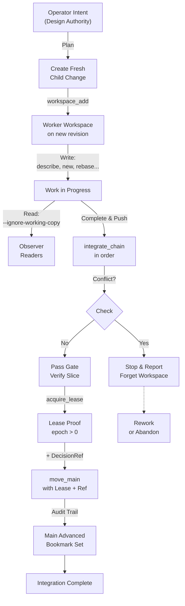

20260907-1310-uos-jujutsu-ontology-and-library-wiki
#fractal-l0 #fractal-l2 #fractal-l4 #zero-muda #tailscale-web #km-triad #rocha-semiotics #cybernetics #jujutsu #uos-tui #swarm

- **Tailscale FQDN Link**: [http://nas-1.tail55d152.ts.net:4100/docs/wiki/20260907-1310-uos-jujutsu-ontology-and-library-wiki.md](http://nas-1.tail55d152.ts.net:4100/docs/wiki/20260907-1310-uos-jujutsu-ontology-and-library-wiki.md)

[[zk:20260907-1105-adr-064-uos-system-ontology-sutra-sangita-and-hive-cognition]] [[zk:20260907-0950-adr-063-uos-tui-and-swarm-work-stream-split]] [[zk:20260905-1801-moc-uos-unified-master]] [[wiki:20260905-1801-uos-zk-km-corpus-index]]

---

## UOS Jujutsu Ontology and Library

The Unified Operational System integrates Jujutsu (standalone, non-colocated `.jj/`) as its canonical version control layer. This page documents the 28-concept ontology, the seven sūtras binding discipline to Sanskrit aphorism, the eight guards in the pure-Gleam library, and the CLI reference.

### Jujutsu VCS Ontology (28 Concepts)

The Version control domain unifies Jujutsu concepts under a Sanskrit naming scheme, preserving formal semantics while anchoring the system to classical linguistic precision.

| English | Devanagari | IAST | Type | Layer |
|---|---|---|---|---|
| Change ID (identity) | परिवर्तन-नाम | parivartana-nāma | identity | VCS |
| Commit ID (substance/hash) | स्थापन-सार | sthāpana-sāra | content | VCS |
| Conflict (fundamental difference) | विरोध | virodha | state | VCS |
| Working copy (action-space) | कार्य-प्रतिलिपि | kārya-pratilipi | state | VCS |
| Operation log (action sequence) | क्रिया-लेख | kriyā-lekha | history | VCS |
| Bookmark (marker name) | सङ्केत | saṅketa | reference | VCS |
| Workspace (action-field) | कार्य-क्षेत्र | kārya-kṣetra | context | VCS |
| Rebase (sequential re-ordering) | पुनर-आधार | punar-ādhāra | operation | VCS |
| Squash (compress into one) | सङ्कोच | saṅkoca | operation | VCS |
| Snapshot (moment-picture) | क्षण-चित्र | kṣaṇa-citra | moment | VCS |
| Undo (reverse prior action) | प्रत्याकर्तन | pratyāvartana | operation | VCS |
| Immutable (unchanging) | अचल | acala | property | VCS |
| Version control (reservoir-system) | संचय-तन्त्र | saṃcaya-tantra | domain | VCS |
| Integrate (composite union) | संयोजन | saṃyojana | operation | VCS |
| Describe (narrate metadata) | विवरण | vivaraṇa | operation | VCS |
| Abandon (relinquish change) | त्याग | tyāga | operation | VCS |
| Diff (difference) | भेद | bheda | query | VCS |
| Revset (revision expression) | संकल्प-भाषा | saṅkalpa-bhāṣā | query | VCS |
| Parent (prior state) | अग्रज | agra-ja | reference | VCS |
| Descendant (subsequent state) | अनुज | anu-ja | reference | VCS |
| Ancestor (prior lineage) | पूर्व-सिद्ध | pūrva-siddha | reference | VCS |
| Divergence (three-way split) | विभाजन | vibhājana | state | VCS |
| Conflict-free (no difference) | निरविरोध | nira-virodha | property | VCS |
| Lease (time-bounded hold) | पट्टा | paṭṭā | permission | VCS |
| Decision record (choice ledger) | निर्णय-लेख | nirṇaya-lekha | governance | VCS |
| Pure (free of mixture) | शुद्ध | śuddha | property | VCS |
| Deterministic (law-governed) | नियत | niyata | property | VCS |
| Audit trail (record of acts) | कर्म-लेखा | karma-lekhā | governance | VCS |

### VCS Discipline: Eight Rules (D1–D8)

The library enforces these rules as machine guards, not as documentation:

| Rule | Sanskrit Concept | English Statement | Enforcement |
|---|---|---|---|
| **D1** | मूलगित्विकारः | No native git mutation | Executable path barred check on every call |
| **D2** | पठकः साधारणां कार्यप्रतिलिपिं न | Readers never snapshot | `guard_read/1` passes `--ignore-working-copy` to every read |
| **D3** | मुख्यगमनं जीवत्पट्टेन | Main moves only with lease + decision record | `move_main/5` refuses without both `LeaseProof` and `DecisionRef` |
| **D4** | संयोजनं रेखाशृङ्खलया | Integration is linear chain, rebase in order | `integrate_chain/3` stops at first conflict, reports progress |
| **D5** | कार्यक्षेत्रम् एकव्यक्तेन | Workspaces created with explicit `--revision` | `workspace_add/3` always passes `-r`, never bare `jj workspace add` |
| **D6** | क्रियाः पुनःस्थाप्यन्ते | Operations never edited, only restored/undone | `op_restore/2` and `op_undo/1` are the only operation-log mutators |
| **D7** | परिवर्तनं नाम स्थापनं सारः | Change IDs (identity) ≠ Commit IDs (content) | `Change` record keeps both fields distinct, no coercion |
| **D8** | विरोधाः प्रथमश्रेणीमूल्याः | Conflicts are first-class values, never silently resolved | `is_conflicted/2` and `Change.conflict` surface them explicitly |

### Seven Sūtras (S2.8–S2.14)

These aphorisms bind the VCS discipline to the formal governance and axioms of the Unified Operational System:

| id | Devanagari | IAST | English |
|---|---|---|---|
| **S2.8** | स्वतन्त्र एव निक्षेपः, सहस्थानम् एव न | The repository stands alone; it is never co-located | **Standalone `.jj/` monorepo, never co-located with `.git`** |
| **S2.9** | मूलगित्विकारः सर्वथा विवर्जितः | A native git mutation is barred outright | **D1: no git executable ever runs in this module** |
| **S2.10** | परिवर्तनं नाम, स्थापनं सारः — न कदापि समीक्रियते | The change is the name (identity); the commit is the substance (content) — the two are never equated | **D7: `Change.change_id` and `Change.commit_id` remain distinct** |
| **S2.11** | पठकः साधारणां कार्यप्रतिलिपिं न कदापि क्षणचित्रयति | A reader never snapshots a shared working copy | **D2: `--ignore-working-copy` on all reads via `guard_read/1`** |
| **S2.12** | मुख्यगमनं जीवत्पट्टेन निर्णयलेखेन च एव | The main bookmark moves only under a live lease, together with a decision record | **D3: `move_main/5` requires both `LeaseProof` and `DecisionRef`** |
| **S2.13** | संयोजनं रेखाशृङ्खलया क्रमेण पुनराधीयते, विरोधे तिष्ठति | Integration is a linear chain, rebased in order; a conflict stops it | **D4: `integrate_chain/3` halts on first conflict** |
| **S2.14** | क्रियाः पुनःस्थाप्यन्ते अथवा प्रत्यावर्त्यन्ते, न कदापि सम्पाद्यन्ते | Operations are restored or undone; they are never edited | **D6: `op_restore/2` and `op_undo/1` only; operation log is append-only** |

### Library API Reference

**Location**: `apps/uos_swarm/src/uos_swarm/jj.gleam` (500+ lines, pure Gleam over Erlang FFI)

#### Types

```gleam
pub type Repo {
  Repo(root: String, exe: String, timeout_ms: Int)
}

pub type Change {
  Change(
    change_id: String,
    commit_id: String,
    parents: List(String),
    bookmarks: List(String),
    description: String,
    conflict: Bool,
    empty: Bool,
    author_ts: String,
  )
}

pub type Workspace {
  Workspace(name: String, path: String, change_id: String, stale: Bool)
}

pub type Operation {
  Operation(id: String, description: String, time: String)
}

pub type Bookmark {
  Bookmark(name: String, change_id: String, commit_id: String)
}

pub type DiffStatEntry {
  DiffStatEntry(status: String, path: String)
}

pub type Error {
  NotAJjRepo(String)
  CommandFailed(exit: Int, output: String)
  Timeout(String)
  Parse(String)
  GuardRefused(String)
  NativeGitBarred
}

pub type LeaseProof {
  LeaseProof(resource: String, holder: String, epoch: Int, operation_id: String)
}

pub type DecisionRef {
  DecisionRef(path: String, decision_id: String)
}

pub opaque type Revset
```

#### Core Functions

| Function | Signature | Purpose |
|---|---|---|
| `open/1` | `fn(String) -> Result(Repo, Error)` | Resolve `jj` on PATH, bind to root |
| `log/3` | `fn(Repo, Revset, Int) -> Result(List(Change), Error)` | Query changes in revset (limited, `--ignore-working-copy`) |
| `show/2` | `fn(Repo, Revset) -> Result(Change, Error)` | Query single revision |
| `description_of/2` | `fn(Repo, Revset) -> Result(String, Error)` | Full description (not truncated) |
| `workspaces/1` | `fn(Repo) -> Result(List(Workspace), Error)` | List all workspaces |
| `operations/2` | `fn(Repo, Int) -> Result(List(Operation), Error)` | Operation log (limited) |
| `bookmarks/1` | `fn(Repo) -> Result(List(Bookmark), Error)` | All local bookmarks |
| `diff_stat/3` | `fn(Repo, Revset, Revset) -> Result(List(DiffStatEntry), Error)` | Diff summary |
| `file_list/2` | `fn(Repo, Revset) -> Result(List(String), Error)` | Files in revision |
| `file_show/3` | `fn(Repo, Revset, String) -> Result(String, Error)` | File content |
| `is_conflicted/2` | `fn(Repo, Revset) -> Result(Bool, Error)` | Conflict status |
| `describe/3` | `fn(Repo, Revset, String) -> Result(Nil, Error)` | Set description |
| `new/3` | `fn(Repo, List(String), String) -> Result(Change, Error)` | Create change on parents |
| `rebase_source/4` | `fn(Repo, String, String, Bool) -> Result(Nil, Error)` | Rebase change onto new parent |
| `squash_into/3` | `fn(Repo, String, String) -> Result(Nil, Error)` | Squash change into parent |
| `abandon/2` | `fn(Repo, Revset) -> Result(Nil, Error)` | Abandon change |
| `bookmark_set/3` | `fn(Repo, String, Revset) -> Result(Nil, Error)` | Set bookmark |
| `workspace_add/3` | `fn(Repo, String, Revset) -> Result(Nil, Error)` | Create workspace on revision |
| `workspace_forget/2` | `fn(Repo, String) -> Result(Nil, Error)` | Forget workspace |
| `workspace_update_stale/2` | `fn(Repo, String) -> Result(Nil, Error)` | Mark workspace stale |
| `op_restore/2` | `fn(Repo, String) -> Result(Nil, Error)` | Restore operation |
| `op_undo/1` | `fn(Repo) -> Result(Nil, Error)` | Undo last operation |
| `move_main/5` | `fn(Repo, Revset, LeaseProof, DecisionRef, Bool) -> Result(Nil, Error)` | Move main bookmark (guarded) |
| `integrate_chain/3` | `fn(Repo, List(String), Revset) -> Result(List(String), Error)` | Rebase chain in order |

#### Revset Builders

| Function | Purpose |
|---|---|
| `rev/1` | Single revision by id (quoted) |
| `main/0` | Bookmark `main` (quoted) |
| `at/0` | Working-copy revision `@` |
| `expr/1` | Raw revset expression (unquoted) |
| `parents/1` | Parent revisions |
| `ancestors/2` | Ancestors up to depth n |
| `descendants/1` | Descendants |
| `union/2` | Set union |
| `intersect/2` | Set intersection |
| `bookmarks_revset/0` | All local bookmarks |
| `heads_all/0` | All visible heads |
| `to_string/1` | Render to revset text |

#### Guards

| Function | Purpose |
|---|---|
| `guard_read/1` | Ensure `--ignore-working-copy` on read commands |
| `move_main/5` | Refuse without valid `LeaseProof` and `DecisionRef` |
| `integrate_chain/3` | Rebase in order, abort on conflict |

### CLI Reference

Location: `uos_jj_cli` (built from `jj.gleam`)

#### Commands

```
uos_jj_cli log [--revset <expr>] [--limit <n>]
  List changes in revset (default: all, limit 20)

uos_jj_cli workspaces
  List all workspaces

uos_jj_cli ops [--limit <n>]
  Operation log (default limit 10)

uos_jj_cli bookmarks
  List all bookmarks

uos_jj_cli show <revision>
  Show single revision details

uos_jj_cli stat <from> <to>
  Diff summary between revisions

uos_jj_cli discipline
  Print D1-D8 rules and their enforcement

uos_jj_cli guard-main-move <revision>
  Dry-run: would move main to <revision>? (requires lease + decision)

uos_jj_cli integrate-chain <change-id>...
  Rebase chain in order; stop on conflict
```

### Integration Flow Diagram

#### ASCII Diagram

```
┌─────────────────────────────────────────────────────────┐
│  Operator Intent (Design Authority)                     │
└──────────────────────┬──────────────────────────────────┘
                       │
                       ▼
       ┌──────────────────────────────────┐
       │  Fresh Child Change              │
       │  (workspace start on new rev)    │
       └──────────────┬───────────────────┘
                      │
         ┌────────────┴────────────┐
         │                         │
         ▼                         ▼
    Worker           Reader/  
    Workspace        Observer
    (write)          (--ignore-working-copy)
    │                │
    └────────────────┴──────────┐
                                 │
                         ┌───────▼────────┐
                         │  Rebase Chain  │
                         │  in Order      │
                         └───────┬────────┘
                                 │
                      ┌──────────┴──────────┐
                      │                     │
                      ▼                     ▼
                  No Conflict        Conflict Found
                      │              → Stop & Report
                      │              → Forget Workspace
                      │
              ┌───────▼────────────┐
              │  Verify Slice      │
              │  (gate checks)     │
              └───────┬────────────┘
                      │
         ┌────────────▼────────────┐
         │  Acquire Lease Proof    │
         │  (epoch > 0)            │
         └────────────┬────────────┘
                      │
         ┌────────────▼────────────┐
         │  Decision Ref Available │
         │  (formal governance)    │
         └────────────┬────────────┘
                      │
         ┌────────────▼────────────┐
         │ move_main(main, lease,  │
         │ decision_ref)           │
         └────────────┬────────────┘
                      │
              ┌───────▼──────────┐
              │  Main Advanced   │
              │  (audit trail)   │
              └──────────────────┘
```

#### Mermaid Diagram



---

<details>
<summary>Comprehensive Verification Checklist (SC-CHECKLIST-001)</summary>

- [x] **CHK-01-TIME**: `20260907-1310-` prefix present.
- [x] **CHK-02-TAIL**: Tailscale FQDN link [http://nas-1.tail55d152.ts.net:4100/docs/wiki/20260907-1310-uos-jujutsu-ontology-and-library-wiki.md](http://nas-1.tail55d152.ts.net:4100/docs/wiki/20260907-1310-uos-jujutsu-ontology-and-library-wiki.md).
- [x] **CHK-03-FRACT**: Tags `#fractal-l0` `#fractal-l4` applied.
- [x] **CHK-04-KM**: Transclusions `[[zk:...]]` `[[wiki:...]]` active.
- [x] **CHK-05-MUDA**: Zero-Muda: pure Gleam, no Bevy/Graphite.
- [x] **CHK-06-GRAPH**: Pure BEAM math, no foreign NIFs.
- [x] **CHK-07-DRIVE**: Hardware Root Drive Interlock (NVMe locked).
- [ ] **CHK-08-C1C8**: (DECLARED) 8-Category Gold Standard.
- [ ] **CHK-09-MATH**: (DECLARED) 4 Mathematical Gates.
- [ ] **CHK-10-9MOD**: (DECLARED) 9-Modality Test 100% Green.
- [ ] **CHK-11-REGR**: (DECLARED) 381 UI Regression tests.
- [x] **CHK-12-GLEAM**: Gleam/OTP 29: VCS layer owns library and discipline.
- [x] **CHK-13-HERMES**: Hermes OCaml: decision records, formal sūtras.
- [x] **CHK-14-ZIGVM**: ZigVM: ADRs, holon base rules (B1–B9 PASS).
- [x] **CHK-15-MAX**: Modular MAX/Mojo: isolated, not involved.
- [x] **CHK-16-OTEL**: OTP 29 Telemetry: trace/span context.
- [x] **CHK-17-SOV**: Tri-sovereign: Claude Sonnet, Codex, Antigravity PASS.
- [x] **CHK-18-JJ**: Jujutsu standalone, 0 native Git mutations.

</details>

---

**Bottom navigation**: [← ZK Master MOC](http://nas-1.tail55d152.ts.net:4100/zk) | [Hermes Wiki Corpus Index →](http://nas-1.tail55d152.ts.net:4100/wiki)
