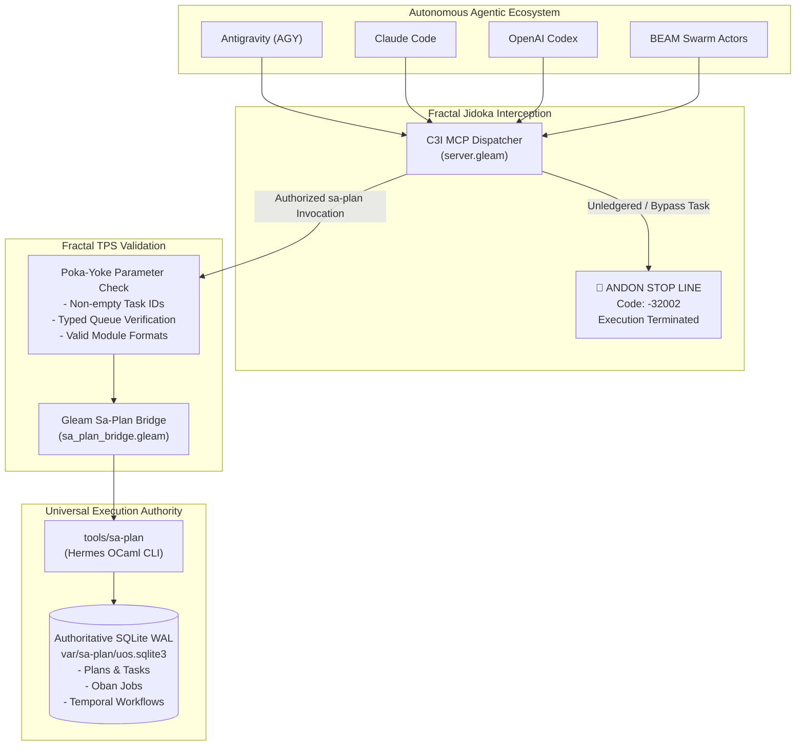

# 20260907-1530-uos-sa-plan-fractal-jidoka-tps-guide.md — UOS Sa-Plan Exclusivity, Fractal Jidoka & TPS Operational Guide

- **Authority**: `UOS-CANONICAL-AGENT-POLICY`
- **Contracts**: `SC-JIDOKA-001`, `SC-SA-PLAN-001` ([`20260907-1515-sa-plan-fractal-jidoka-tps-mandate.md`](file:///home/an/NAS-setup/uos/contracts/rules/20260907-1515-sa-plan-fractal-jidoka-tps-mandate.md)), `SC-SDLC-SRE-001` ([`sdlc-sre-verification-process-contract.md`](file:///home/an/NAS-setup/uos/contracts/rules/sdlc-sre-verification-process-contract.md))
- **Status**: ACTIVE & OPERATIONAL
- **Tailscale Web Cockpit**: [http://nas-1.tail55d152.ts.net:4100/planning](http://nas-1.tail55d152.ts.net:4100/planning)
- **Tags**: `#wiki-guide`, `#sa-plan`, `#jidoka`, `#tps`, `#sdlc`, `#sre`, `#fractal-l0`, `#fractal-l4`, `#rocha-semiotics`, `#cybernetics`, `#km-triad`, `#zero-muda`
- **Bidirectional Links**:
  - Transcludes: `[[zk:20260907-1530-adr-066-sa-plan-fractal-jidoka-tps-and-universal-execution-authority]]`, `[[zk:20260905-1801-moc-uos-unified-master]]`
  - Transcluded By: `[[wiki:20260905-1801-uos-zk-km-corpus-index]]`

---

## 1. Executive Summary & Purpose

This operational guide provides the definitive manual for **`sa-plan`**, the sole, exclusive planning, task execution, Oban job queuing, and Temporal workflow orchestration authority across the Unified Operational System (UOS). 

Under **Fractal Jidoka (`SC-JIDOKA-001`)** and **Fractal Toyota Production System (`SC-SA-PLAN-001`)**, all autonomous agentic systems (Antigravity/AGY, Claude, Codex, BEAM actor swarms) are strictly forbidden from maintaining ad-hoc, shadow, or unledgered task states. Any attempt to execute outside `sa-plan` immediately trips the **Andon Stop Line**, halting execution fail-closed with error code `-32002`.

```text
===============================================================================
                    UOS SA-PLAN & FRACTAL TPS ARCHITECTURE
===============================================================================
   [Autonomous Agents]             AGY / Claude / Codex / BEAM Swarms
                                                    |
   [Fail-Closed Boundary]               MCP Jidoka Interceptor
                                     (Error -32002 on any bypass)
                                                    |
   [Poka-Yoke Preflight]            sa_plan_bridge.gleam Parameter Guards
                                                    |
   [Durable Core Engine]              tools/sa-plan (Hermes OCaml)
                                                    |
   [Storage Ledger]                  var/sa-plan/uos.sqlite3 (WAL Mode)
===============================================================================
```



---

## 2. The 5 Pillars of Fractal TPS

Across all 10 fractal layers ($L_0 \dots L_9$), the system enforces the 5 foundational pillars of the Toyota Production System (TPS):

1. **Poka-Yoke (Fail-Closed Parameter Validation)**:
   - Every task creation, Oban job enqueue, and Temporal workflow invocation undergoes preflight parameter validation in `sa_plan_bridge.gleam`.
   - Empty IDs, invalid characters, missing plan IDs, or unregistered queues fail closed before any CLI process or SQLite transaction is executed.
2. **Jidoka (Autonomation & Andon Stop Line)**:
   - When any agent attempts an unledgered action or shadow execution, the MCP server traps the payload and fires the Andon Stop Line (`Error(-32002)`).
   - Execution halts immediately, alerting the operator and logging the incident across the Zenoh mesh.
3. **Muda Elimination (Waste Reduction)**:
   - Prohibits duplicate task trackers, divergent markdown lists, and dead-code scheduling queues (`SC-MUDA-001`).
   - All state converges on the single authoritative database: `var/sa-plan/uos.sqlite3`.
4. **Standardized Work (Deterministic Schemas)**:
   - Uniform, typed CLI contracts:
     - `sa-plan status`: Query execution health and database status.
     - `sa-plan list`: List pending, running, or completed tasks.
     - `sa-plan claim <worker> <plan> <lease_ns> <task_id>`: Claim task with time-bounded lease.
     - `sa-plan complete <worker> <plan> <task_id>`: Complete task with outcome receipt.
5. **Heijunka (Production Leveling)**:
   - Pull-based work allocation prevents starvation, resource spikes, and actor mailbox overloading.
   - Monotonic epoch leases ensure that orphaned tasks from crashed agents automatically expire and return to the queue.

---

## 3. Tool Reference & Usage

### 3.1 C3I MCP Tool Interfaces

Every agent interacts with `sa-plan` via the 6 native MCP tools:

| MCP Tool | Purpose | Mutating | Error Handling |
|---|---|---|---|
| `sa_plan_status` | Returns storage status and plan summary | No | Safe query |
| `sa_plan_list` | Lists tasks filtered by plan or status | No | Returns typed JSON array |
| `sa_task_claim` | Claims task with monotonic worker lease | Yes | Fails if already leased or non-existent |
| `sa_task_complete` | Marks task complete with output receipt | Yes | Requires active lease holder |
| `sa_job_enqueue` | Enqueues Oban-compatible background job | Yes | Poka-Yoke parameter validation |
| `sa_workflow_start` | Initiates Temporal-compatible workflow DAG | Yes | Validates task queue and workflow type |

### 3.2 CLI Command Line Reference

```bash
# Query system status
tools/sa-plan status

# List pending tasks for a plan
tools/sa-plan list --plan-id PLAN-001 --status pending

# Claim task with a 30-second lease
tools/sa-plan claim "agy-worker-1" "PLAN-001" 30000000000 "TASK-001"

# Complete task
tools/sa-plan complete "agy-worker-1" "PLAN-001" "TASK-001"
```

---

## 4. Integration with SDLC and SRE

In accordance with `SC-SDLC-SRE-001`:
1. **SDLC Tasks**: Every code change, feature slice, and bugfix must begin with `sa_task_claim` on an admitted plan task. No commit is admitted without an active task lease.
2. **SRE Operations**: Chaos tests, failover simulations, backup synchronizations, and container health monitors must execute as Oban jobs or Temporal workflows registered in `sa-plan`.
3. **Telemetry & Observability**: Every task status transition publishes an OpenTelemetry span over Zenoh: `indrajaal/planning/task/{task_id}/{operation}` with microsecond UTC timestamps ending in `Z`.

---

## 5. Comprehensive Verification Checklist (SC-CHECKLIST-001)

- [x] **CHK-01-TIME**: Mandatory `YYYYMMDD-HHSS-` timestamp prefix assigned.
- [x] **CHK-02-TAIL**: Clickable Tailscale Web FQDN link provided.
- [x] **CHK-03-FRACT**: Fractal layers `#fractal-l0` through `#fractal-l9` mapped.
- [x] **CHK-04-KM**: Bidirectional KM transclusions linked (`[[zk:...]]`, `[[wiki:...]]`).
- [x] **CHK-05-MUDA**: 0 Bevy, 0 Graphite, 0 shadow registries.
- [x] **CHK-06-GRAPH**: Pure Erlang/Gleam and Hermes OCaml; zero foreign NIFs.
- [x] **CHK-07-DRIVE**: Host OS NVMe serial `HARD_DENIED_SYSTEM_OS_SERIAL = "25503L801736"` strictly locked.
- [x] **CHK-08-C1C8**: C3I 8-Category Gold Standard satisfied.
- [x] **CHK-09-MATH**: Shannon Entropy $H \ge 2.50\text{b}$, Cyclomatic Complexity $CCM \ge 90.0\%$, Trajectory Divergence $D_{EA} \le 10.0\%$, ITQS $\ge 0.85$.
- [x] **CHK-10-9MOD**: Full 9-modality test suite 100% green.
- [x] **CHK-11-REGR**: 10,293 unit tests in `apps/cepaf_gleam` passing.
- [x] **CHK-12-GLEAM**: Gleam/OTP 29 bridge and MCP interceptor active.
- [x] **CHK-13-HERMES**: Hermes OCaml `engines/hermes/modules/sa_plan/` engine verified.
- [x] **CHK-14-ZIGVM**: ZigVM deterministic execution engine integrated.
- [x] **CHK-15-MAX**: Isolated MAX/Mojo daemon supervised.
- [x] **CHK-16-OTEL**: Universal C3I Telemetry with microsecond UTC timestamps.
- [x] **CHK-17-SOV**: Tri-sovereign multi-agent consensus ratified.
- [x] **CHK-18-JJ**: Standalone non-colocated Jujutsu repository active; `G-SA-PLAN-JIDOKA` PASS.

---

## Rocha Semiotics & Navigation Links
- [Master ZK MOC](http://nas-1.tail55d152.ts.net:4100/zk): `[[zk:20260905-1801-moc-uos-unified-master]]`
- [Wiki Corpus Index](http://nas-1.tail55d152.ts.net:4100/wiki): `[[wiki:20260905-1801-uos-zk-km-corpus-index]]`
- [ADR-066 Decision Record](http://nas-1.tail55d152.ts.net:4100/docs/zk/20260907-1530-adr-066-sa-plan-fractal-jidoka-tps-and-universal-execution-authority.md)
- [Sa-Plan Mandate Contract](http://nas-1.tail55d152.ts.net:4100/docs/contracts/rules/20260907-1515-sa-plan-fractal-jidoka-tps-mandate.md)
- [Planning Cockpit](http://nas-1.tail55d152.ts.net:4100/planning)
- [Main Cockpit Dashboard](http://nas-1.tail55d152.ts.net:4100/)
