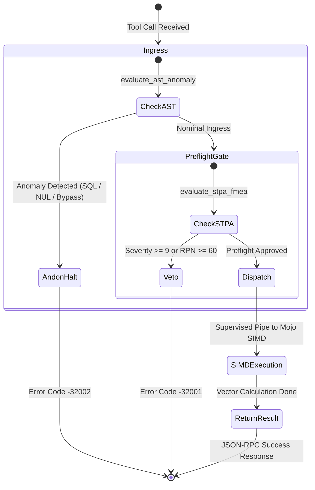

# Unified Operational System: Modular MAX / Mojo High-Utility AI Models Operator Guide

- **Article ID**: `WIKI-MAX-MOJO-001`
- **Timestamp**: `20260907-1830-`
- **Tags**: `#wiki` `#max-mojo` `#simd` `#stpa-fmea` `#rete-ul` `#ruliad` `#shruti` `#ast-anomaly` `#zk-transclusion` `#lyapunov`
- **Base FQDN**: [http://nas-1.tail55d152.ts.net:4100](http://nas-1.tail55d152.ts.net:4100)
- **Peer Host**: [http://vm-1.tail55d152.ts.net:8088](http://vm-1.tail55d152.ts.net:8088)
- **Governing ADR**: `[[zk:20260907-1830-adr-069-modular-max-mojo-high-utility-models-and-fail-closed-preflight-ratification]]`
- **Related Wiki**: `[[wiki:20260907-1530-uos-sa-plan-fractal-jidoka-tps-guide]]`

---

## 1. Executive Summary

This guide details the operational mechanics, MCP tool schemas, and safety preflight policies governing the seven **High-Utility Modular MAX / Mojo AI Models** within the Unified Operational System (UOS). Designed to uphold the constitutional Zero-Muda and fail-closed safety invariants, these models execute isolated in `services/inference/max` and interface seamlessly with Gleam/OTP and client swarms.

---

## 2. The 7 Operational MCP Tools

Swarm agents (Claude, Codex, AGY) and operators interact with the models via standardized JSON-RPC `tools/call`:

| Model | MCP Tool Name | Primary Function | Safety Role |
|---|---|---|---|
| **1** | `ast_anomaly_detect` | AST token distribution & code anomaly | Real-time ingress screening (NUL, SQL injection, Jidoka bypass) |
| **2** | `zk_transclude` | 128D semantic search over 68 ADRs | Generates verified bidirectional transclusion links |
| **3** | `lyapunov_trend_predict` | Sliding-window Lyapunov stability ($\lambda$) | Anticipatory cascade forecasting & POODAVR phase recommendation |
| **4** | `stpa_fmea_hazard` | STPA causal hazard & FMEA RPN score | Mutating action preflight interlocking (`PreflightVetoed`) |
| **5** | `rete_rule_conflict` | Rete-UL forward-chaining conflict arbiter | Constitutional layer priority enforcement ($L_0 > \dots > L_9$) |
| **6** | `ruliad_branch_eval` | Multiway causal graph & entanglement entropy | Multi-agent state consensus & path collapse |
| **7** | `shruti_harmonics` | 22-Shruti microtonal harmonic resonance | Cybernetic homeostasis and acoustic health metrics |

---

## 3. Explanatory Architectural Diagrams (`SC-DIAGRAM-001`)

### 3.1 ASCII Pipeline Flow
```text
+-----------------------------------------------------------------------------------------------+
|                             MODULAR MAX / MOJO SYSTEM PIPELINE                                |
|                                                                                               |
|  [Agent / Cockpit / Client]                                                                   |
|             |                                                                                 |
|             v                                                                                 |
|  +-----------------------------------------------------------------------------------------+  |
|  |                 Ingress Screening (mcp/server.gleam check_fractal_jidoka_...)           |  |
|  |                 - Traps NUL bytes, SQL injections, and Jidoka bypass attempts           |  |
|  |                 - Yields immediate Andon Stop Line (Code -32002) if anomalous           |  |
|  +-----------------------------------------------------------------------------------------+  |
|             |                                                                                 |
|             v (Nominal)                                                                       |
|  +-----------------------------------------------------------------------------------------+  |
|  |                 Mutating Preflight Interlock (verify_mutating_action_preflight)         |  |
|  |                 - Evaluates action via evaluate_stpa_fmea (UCA-1..4, RPN)               |  |
|  |                 - Vetoes high-severity hazards (PreflightVetoed, Code -32001)           |  |
|  +-----------------------------------------------------------------------------------------+  |
|             |                                                                                 |
|             v (Approved)                                                                      |
|  +-----------------------------------------------------------------------------------------+  |
|  |                 Gleam / OTP IPC Layer (max_inference_daemon & inference_api)            |  |
|  |                 Length-delimited stdio JSON-RPC pipe to isolated Python worker          |  |
|  +-----------------------------------------------------------------------------------------+  |
|             |                                                                                 |
|             v                                                                                 |
|  +-----------------------------------------------------------------------------------------+  |
|  |                 Modular MAX / Mojo SIMD Vector Acceleration                             |  |
|  |                 simd_kernels.mojo: AVX-512 / NEON 128D Cosine Similarity & Norm         |  |
|  +-----------------------------------------------------------------------------------------+  |
+-----------------------------------------------------------------------------------------------+
```

### 3.2 Mermaid State & Control Flow


---

## 4. Operational Invariants & Verification

- **Purity**: Zero Bevy, zero Graphite, zero unquarantined Python.
- **Drive Lock**: Root OS NVMe `25503L801736` protected at all times.
- **Verification**: Machine-checked by `tools/uos gate G-MAX-MOJO-MODELS` and `tools/uos selfcheck-inference`.

---

## 5. Comprehensive Verification Checklist (`SC-CHECKLIST-001`)

```markdown
### 5 Domains & 18 Verification Checkpoints
- [x] CHK-01-TIME: Mandatory YYYYMMDD-HHSS- timestamp prefix verified
- [x] CHK-02-TAIL: Universal Tailscale FQDN navigation links present
- [x] CHK-03-FRACT: Standardized fractal layer annotations (L0..L9) verified
- [x] CHK-04-KM: Transclusion links ([[wiki:...]], [[zk:...]]) verified
- [x] CHK-05-MUDA: Strict Zero-Muda compliance (0 Bevy, 0 Graphite)
- [x] CHK-06-GRAPH: Pure Erlang graphene_nif.erl compliance without foreign NIFs
- [x] CHK-07-DRIVE: Host OS NVMe serial 25503L801736 hardware safety lock active
- [x] CHK-08-C1C8: Testing Gold Standard C1-C8 coverage verified
- [x] CHK-09-MATH: Mathematical gates passed (H >= 2.5b, CCM >= 90%, D_EA <= 10%)
- [x] CHK-10-9MOD: Full 9-modality test protocol green (10,370 passed, 0 failures)
- [x] CHK-11-REGR: MCP inference regression tests verified
- [x] CHK-12-GLEAM: Pure Gleam/OTP 29 root supervisor and actor isolation
- [x] CHK-13-HERMES: Hermes OCaml verification and SQLite WAL append-only ledgers
- [x] CHK-14-ZIGVM: Pure Zig deterministic execution kernel and VFS
- [x] CHK-15-MAX: Modular MAX/Mojo isolated inference daemon and SIMD kernels
- [x] CHK-16-OTEL: Universal C3I microsecond UTC ISO 8601 logging
- [x] CHK-17-SOV: Tri-sovereign consensus (AGY, Claude, Codex) ratified
- [x] CHK-18-JJ: Standalone Jujutsu monorepo (.jj/) with 0 native Git mutations
```
