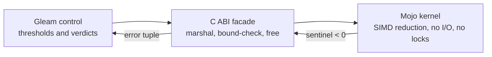

# UOS Provenance Integrity & KM Gate — Operational Guide

#fractal-l3 #fractal-l5 #km-triad #zero-muda #tailscale-web #checklist-nav

- **Tailscale FQDN**: [http://nas-1.tail55d152.ts.net:4100/docs/wiki/20260908-0927-uos-provenance-integrity-and-km-gate-guide.md](http://nas-1.tail55d152.ts.net:4100/docs/wiki/20260908-0927-uos-provenance-integrity-and-km-gate-guide.md)
- **Contract**: `SC-PROVENANCE-001`
- **Transclusions**: `[[zk:20260908-0927-adr-087-provenance-integrity-km-gate-and-mojo-metrics-kernel]]` · `[[wiki:20260905-1801-uos-zk-km-corpus-index]]` · `[[zk:20260905-1801-moc-uos-unified-master]]`

---

## 1. The one number

`admitted_ev_ceiling = 93`.

Everything in this guide derives from that scalar. An artifact asserting
ratification of an EV cycle above it is `NOT_ADMITTED` — not rejected, not
admitted: **pending sovereign review by Codex and AGY**.

## 2. When you are about to cite an ADR

Ask one question: *does its H1 title claim an EV cycle above 93?*

- **No** → cite it. Note that "outside the quarantined range" is not itself a
  positive admission claim; it only means this particular defect does not apply.
- **Yes** → it is one of `ADR-071`..`ADR-086`. Cite it as a readable decision
  document if you must, but **never as admission evidence**, and say so
  explicitly wherever you cite it.

Only the title is load-bearing. A body mention may be a *forward authorization*
("Codex is authorized to pursue `EV-85`..`EV-99`", ADR-059), which is not a
ratification claim (`INV-PROV-04`).

## 3. Running the gate

```bash
bash tools/km-gate --gate           # PASS/HOLD verdict plus full metrics
bash tools/km-gate --metrics        # observation only, no verdict
bash tools/km-gate --verify-chain   # recompute every cycle digest
bash tools/km-gate --cycles         # list the recorded cycle chain
```

| Rule | Fires when |
|---|---|
| `KMP-GAP` | ADR numbering is not contiguous from 1 |
| `KMP-DUP` | two records claim the same number |
| `KMP-INCOMPLETE` | an index does not enumerate every record |
| `KMP-UNMARKED` | a quarantine-derived record is listed without its marker |
| `KMP-ENTROPY` | fractal layer entropy drops below 2.50 bits |
| `CHAIN_BROKEN` | a cycle row no longer matches its digest |

The gate is `REPORT_ONLY`. A `PASS` means the indexes match the observed corpus
and every quarantine-derived record is marked. **It does not mean any EV cycle is
admitted.** Nothing in this tooling grants admission or effect authority.

## 4. Adding a decision record

1. Write it under `docs/zk/` with the `YYYYMMDD-HHSS-` prefix.
2. Run `bash tools/km-gate --gate`. It will report `KMP-INCOMPLETE` — the indexes
   do not yet know about your record. That is the gate working.
3. Add the record to the ZK master MOC §2.2 table and the wiki corpus index §4.0
   ADR directory.
4. Re-run the gate. `completeness_ratio` must return to 1.0.
5. **Do not put an EV number in the title** while the range above the ceiling is
   under review (`INV-PROV-05`). Number work within its sa-plan instead.

## 5. The cycle journal

Cycle records live in `var/km/provenance-cycles.sqlite3`, not in a flat file,
because the flat coordinator journal was overwritten in place three times on
2026-09-07. Four falsifiers are refused by the store itself:

| Attempt | Store response |
|---|---|
| raw `UPDATE` | `cycle rows are append-only` |
| raw `DELETE` | `cycle rows are append-only` |
| sequence gap | `cycle chain broken` |
| wrong `previous_digest` | `cycle chain broken` |

Append only through `tools/km-gate --append`, which computes the canonical
digest. A row inserted by hand with a fabricated digest **will** be caught by
`--verify-chain` — this was demonstrated during the falsifier test, and the
resulting store was retired to `var/km/quarantine/` rather than corrected in
place, because the table is append-only by design.

## 6. The metrics kernel

```text
  Gleam control ──────> C ABI facade ──────> Mojo kernel
  thresholds and        marshal, bound        SIMD reduction
  verdicts              check, free           no I/O, no locks
       ^                     |                     |
       └──── error tuple ────┴──── sentinel < 0 ───┘
```



Six entry points: `conformance_score`, `matrix_column_means`,
`shannon_entropy_bits`, `fmea_band`, `drift_distance`, `kernel_abi_version`.

Fail-closed at every layer. A missing `.so` yields `{error, nif_not_loaded}`;
a rejected argument yields a negative sentinel converted to an error tuple. An
uncomputed metric is never reported as a passing number (`INV-PROV-06`).

Build both OTP targets — a NIF must match the OTP that loads it:

```bash
cd native/nifs/mojo
make all      # system OTP
make otp29    # the OTP 29 runtime that serves the cockpit
make test     # 29 independent C oracle checks
```

## 7. Known open items

1. **`KMP-ENTROPY`** — 68 of 87 ADRs are tagged `#fractal-l0`, so layer entropy
   is 1.359 bits against a 2.50 floor. The layer tag currently carries almost no
   information. Repair means re-classifying records with their authors, not
   bulk-retagging.
2. **`graphene_nif.erl`** loads no NIF, so zero-muda holds — but it is a stub
   facade, not an implementation. `graph_bfs` ignores its edge list,
   `graph_shortest_path` returns cost 1.0 for any pair, `graph_analyze` hardcodes
   `density: 0.5`.
3. Sovereign review of `EV-94`..`EV-109` remains open.
