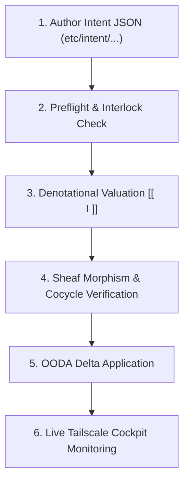

# UOS Operator Guide: Intent-Based Configuration & Algebraic Atlas

#fractal-l0 #fractal-l1 #fractal-l2 #fractal-l3 #fractal-l4 #fractal-l5 #fractal-l6 #fractal-l7 #fractal-l8 #fractal-l9 #zero-muda #tailscale-web #checklist-nav #km-triad #algebraic-atlas #denotational-intent

**UOS / Wiki / Operator Guide** · [Cockpit](http://nas-1.tail55d152.ts.net:4100/) · [Planning](http://nas-1.tail55d152.ts.net:4100/planning) · [Wiki](http://nas-1.tail55d152.ts.net:4100/wiki) · [ZK](http://nas-1.tail55d152.ts.net:4100/zk) · [Checklist](http://nas-1.tail55d152.ts.net:4100/checklist)
**Contract Reference:** `SC-INTENT-ATLAS-001`, `SC-DENOTATIONAL-INTENT-001`, `SC-PROVENANCE-001`, `SC-GLM-UI-001`, `SC-JIDOKA-001`
**Sole Execution Authority:** `sa-plan` (`uos/design-implementation-approach/20260908-1540`)

---

## 1. Introduction & Core Concepts

In the Unified Operational System (UOS), configuration and system state are managed declaratively through **Intents** rather than imperative mutation scripts. Every intent is a typed specification of desired state evaluated against the mathematical **Algebraic Atlas** of the system.

This guide provides practical instructions for operators to define intents, reconcile system deltas, verify atlas morphisms, and utilize the deployment harness.

```text
+-----------------------------------------------------------------------------+
|                      OPERATOR INTENT RECONCILIATION WORKFLOW                |
+-----------------------------------------------------------------------------+
|                                                                             |
|  1. Author Intent JSON Specification (etc/intent/my_intent.json)            |
|            |                                                                |
|            v                                                                |
|  2. Validate Preflight & Interlocks (tools/uos-deploy --test)               |
|            |                                                                |
|            v                                                                |
|  3. Denotational Valuation & Morphism Check (verify_all_cocycles)           |
|            |                                                                |
|            v                                                                |
|  4. OODA Delta Reconciliation (Compute Delta -> Apply Non-Destructive)      |
|            |                                                                |
|            v                                                                |
|  5. Monitor Live Cockpit & TUI (http://nas-1.tail55d152.ts.net:4100)        |
+-----------------------------------------------------------------------------+
```



---

## 2. Authoring an Intent Specification

Intent documents reside in `etc/intent/` and adhere to the canonical schema:

```json
{
  "version": "1.0.0",
  "name": "uos-production-intent",
  "authority": "sa-plan",
  "target_drive_serial": "SAMSUNG_990_PRO_SECONDARY",
  "prajna_health_threshold": 0.85,
  "topology_nodes": [
    "nas-1.tail55d152.ts.net",
    "vm-1.tail55d152.ts.net"
  ],
  "containers": [
    {
      "name": "c3i-zenoh-router",
      "image": "eclipse/zenoh:1.2.1",
      "port": 8080,
      "enabled": true
    },
    {
      "name": "c3i-redis-telemetry",
      "image": "redis:7.2-alpine",
      "port": 6379,
      "enabled": true
    }
  ],
  "zenoh_topics": [
    "indrajaal/l0/const/**",
    "indrajaal/l1/atomic/**",
    "indrajaal/l2/health/**",
    "indrajaal/otel/spans/**"
  ]
}
```

### Critical Validation Rules:
1. **`authority` MUST be `"sa-plan"`**: Per `SC-JIDOKA-001`, any intent claiming external or ad-hoc authority is rejected immediately and fails closed to bottom ($\bot$).
2. **`target_drive_serial` MUST NOT be `"25503L801736"`**: The root OS NVMe drive is hardware-locked; any attempt to target it triggers an immediate fail-closed abort.
3. **`prajna_health_threshold` MUST be $\ge 0.80$**: Required for constitutional Lyapunov trend stability.

---

## 3. Algebraic Atlas Navigation & Cocycle Verification

The state space is partitioned into 10 charts $U_0 \dots U_9$. To verify that all charts transition consistently without information loss:

```bash
# Run the Gleam EUnit test suite for algebraic atlas
cd apps/cepaf_gleam
gleam test -- --filter algebraic_atlas_intent_test
```

To view live atlas topology and object morphisms via REST:
```bash
curl -s http://127.0.0.1:4100/api/fpp/atlas | jq .
```

Expected output:
```json
{
  "status": "ok",
  "objects_count": 17,
  "morphisms_count": 16,
  "gluing_verified": true
}
```

---

## 4. Deploying & Testing the Cockpit

### 4.1 Deployment Harness Commands (`tools/uos-deploy`)

| Flag | Purpose | Description |
|------|---------|-------------|
| `--web` | Gleam Web Cockpit | Starts background Wisp server on port 4100 |
| `--tui` | Split-Screen TUI | Launches interactive terminal dashboard |
| `--test` | Headless CI | Runs all 32 TUI pages, Gleam EUnit, and 20-point verifier |
| `--interactive` | Full Cockpit | Combined terminal TUI and browser launcher |

### 4.2 Running Full Split-Screen Verification Cycle
```bash
bash scripts/run-split-screen-tests.sh
```
This runs the full 5-stage test cycle:
1. TUI Preflight Flight Check
2. Split-Screen TUI Single Frame Render
3. All 32 Canonical TUI Pages & 12 Subsystem Views
4. Comprehensive UI & Intent Gleam Regression Suite
5. 20-Point Multi-Surface Runtime Verifier

---

## 5. Tailscale Remote Access

All interfaces are served live on the Tailnet:
- **Cockpit Dashboard**: [http://nas-1.tail55d152.ts.net:4100/](http://nas-1.tail55d152.ts.net:4100/)
- **Planning Cockpit**: [http://nas-1.tail55d152.ts.net:4100/planning](http://nas-1.tail55d152.ts.net:4100/planning)
- **Verification Checklist**: [http://nas-1.tail55d152.ts.net:4100/checklist](http://nas-1.tail55d152.ts.net:4100/checklist)
- **Peer Runtime Host**: [http://vm-1.tail55d152.ts.net:8088](http://vm-1.tail55d152.ts.net:8088)

---
*Maintained under the UOS Knowledge Management Triad (`#km-triad`).*
