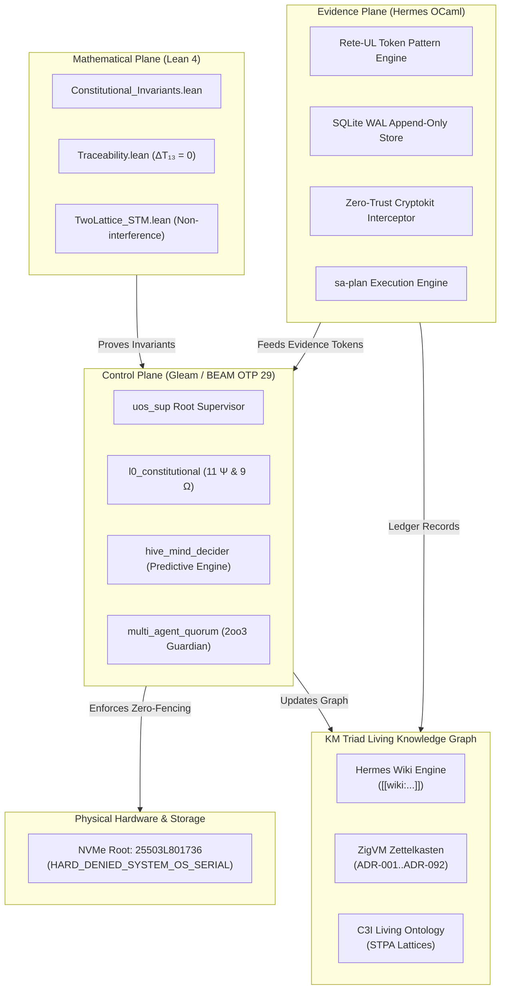

# UOS Constitutional Invariants (Ψ) & Operational Directives (Ω) Guide

#fractal-l0 #fractal-l1 #fractal-l2 #fractal-l3 #fractal-l4 #fractal-l5 #fractal-l6 #fractal-l7 #fractal-l8 #fractal-l9 #wiki #zero-muda #tailscale-web #checklist-nav #km-triad #constitutional-invariants #omega-telemetry

**UOS / Wiki / Constitutional Guide** · [Cockpit](http://nas-1.tail55d152.ts.net:4100/) · [Planning](http://nas-1.tail55d152.ts.net:4100/planning) · [Wiki Master](http://nas-1.tail55d152.ts.net:4100/wiki) · [ZK Master](http://nas-1.tail55d152.ts.net:4100/zk) · [Checklist](http://nas-1.tail55d152.ts.net:4100/checklist)
**Transclusions:** `[[wiki:20260905-1801-uos-zk-km-corpus-index]]` · `[[zk:20260908-1715-adr-092-constitutional-invariants-expansion-and-km-triad]]`
**Contract Reference:** `SC-CONST-001`, `SC-PROVENANCE-001`, `SC-JIDOKA-001`, `SC-SA-PLAN-001`, `SC-CHECKLIST-001`, `SC-DIAGRAM-001`
**Ratified ADR:** `[[zk:ADR-092]]` (Cycles `C353`..`C367`)

---

## 1. Executive Summary & Philosophy of Invariance

The Unified Operational System (UOS) constitution is not an aspirational manifesto; it is a **machine-enforced, mathematically proved boundary lattice** that separates safe state space $\Sigma_{\text{safe}}$ from unrecoverable catastrophic failure $\bot$. 

Empirical operations across multi-agent swarms (AGY, Claude, Codex, OpenRouter) and real hardware demonstrated that verbal guidelines are insufficient to contain distributed drift. Incidents such as foreign SSH injectors, API secret leaks, in-place journal tampers, un-ledgered background mutations, and NVMe wipe attempts necessitated the expansion of the constitutional bedrock from 6 historical invariants ($\Psi_0 \dots \Psi_5$) to **11 mathematically bounded axioms ($\Psi_0 \dots \Psi_{10}$)**, complemented by **9 operational directives ($\Omega_1 \dots \Omega_9$)**.

---

## 2. The 11 Fundamental Invariants ($\Psi_0 \dots \Psi_{10}$)

### $\Psi_0$: Sovereign Guardian 2oo3 Consensus
- **Definition**: All high-risk system mutations, emergency halts, kernel hot-reloads, and physical storage configuration require cryptographic approval from at least 2 of the 3 sovereign guardians (AGY, Claude, Codex).
- **Enforcement**: Pure Gleam actor `multi_agent_quorum.gleam`, Lean 4 `Constitutional_Invariants.lean`.

### $\Psi_1$: Strict Zero-Muda Purity *(Zero-Fenced)*
- **Definition**: Bevy and Graphite are permanently barred from source trees, dependencies, manifests, runtime roles, and imported history. Graphene is not required; all 2D vector mathematics and SVG rendering are implemented in pure Erlang/Gleam or Hermes OCaml.
- **Enforcement**: `tools/uos-cli doctor`, `governance/sources/`, Lean 4 axiom `zeroMudaPurity`.

### $\Psi_2$: Two-Key Verification Gate
- **Definition**: No capability may advance to `ADMITTED` status without: (1) fresh observed runtime behavior on candidate hardware, AND (2) machine-verifiable formal specification in Lean 4, Gospel, or Z3 at the candidate revision.
- **Enforcement**: `tools/sa-plan` verification pipeline, Lean 4 `Traceability.lean`.

### $\Psi_3$: Standalone Jujutsu VCS Purity
- **Definition**: Standalone, non-colocated Jujutsu (`.jj/`) is the sole version control system. Native Git mutation commands (`git commit`, `git push`, `git checkout`) are strictly prohibited in the monorepo.
- **Enforcement**: Monorepo hook interceptors, bash preflight check `tools/jj-guard`.

### $\Psi_4$: Architectural Language Boundaries
- **Definition**: Supervision, intent, APIs, and state machines belong strictly in Gleam/OTP (`apps/cepaf_gleam`). Deterministic execution kernels belong in pure Zig (`engines/zigvm`). Formal contracts and oracles belong in Hermes OCaml (`engines/hermes`). Machine learning inference is strictly quarantined to Modular MAX/Mojo (`services/inference/max`). Python is barred from root runtime.
- **Enforcement**: OTP root supervisor `uos_sup.gleam`, Dune workspace boundaries, Zig build graph.

### $\Psi_5$: Bounded Execution & Resource Fencing
- **Definition**: All solvers (Z3), subprocesses, external LLM advisory calls, and agents must operate with deterministic microsecond timeouts, process-tree reaping, and memory fences. Unbounded NIF loops or blocking operations are fail-closed.
- **Enforcement**: Hermes process supervisor, OpenRouter token throttle (`ha/work_stealing.gleam`).

### $\Psi_6$: Hardware Storage Inviolability *(Zero-Fenced)*
- **Definition**: The host OS NVMe serial `HARD_DENIED_SYSTEM_OS_SERIAL = "25503L801736"` is strictly forbidden from Ceph OSD allocation, partitioning, or disk wiping.
- **Enforcement**: Rust Ceph controller `ops/kubernetes/nas-k8s-lab/src/spec.rs`, Hermes Rete-UL token gate, Lean 4 theorem `hardware_safety_inviolable`.

### $\Psi_7$: Cryptographic Provenance Ceiling *(Zero-Fenced)*
- **Definition**: The admitted EV ceiling is strictly pinned at `EV-93` (`SC-PROVENANCE-001`, `admitted_ev_ceiling = 93`). Cycles EV-94..EV-109 are classified as `NOT_ADMITTED` pending sovereign review. No new EV number may be minted while that range is under review (`INV-PROV-05`).
- **Enforcement**: `tools/km-gate --gate`, `denotational.gleam`, Lean 4 axiom `provenanceCeiling`.

### $\Psi_8$: Zero-Trust Cryptographic Interception
- **Definition**: All incoming tool calls, agent dispatches, and inter-host payloads must pass through authentic SHA-256 preflight digestion. Payloads with embedded NUL bytes (code -2) or raw SQL injections (code -3) are rejected fail-closed.
- **Enforcement**: `run_agent_dispatch_hook.exe` via `Cryptokit`, Gleam request guard.

### $\Psi_9$: Sa-Plan Universal Execution Authority *(Zero-Fenced)*
- **Definition**: `sa-plan` (`tools/sa-plan`, `var/sa-plan/uos.sqlite3`) is the sole execution authority for all plans, tasks, Oban jobs, and Temporal workflows. Ad-hoc un-ledgered task execution triggers an immediate **Andon Stop Line** (-32002).
- **Enforcement**: SQLite database triggers, MCP poka-yoke interceptors, Lean 4 axiom `saPlanExclusivity`.

### $\Psi_{10}$: Immutable Append-Only Ledger Integrity
- **Definition**: Coordinator event stores and journal files are append-only. SQL `UPDATE` and `DELETE` operations on event tables are blocked by database triggers. Forged timestamps ($t_{\text{tick}} = t_{\text{utc}}$) are rejected.
- **Enforcement**: `var/coordination/tri-agent/coordinator.sqlite3` triggers, OCaml coordinator.

---

## 3. The 9 Operational Directives ($\Omega_1 \dots \Omega_9$)

| Directive | Code | Name | Mandatory Rule & Verification |
|---|---|---|---|
| **$\Omega_1$** | `SC-TIME` | Mandatory Timestamp Prefix | Every generated document, wiki article, and ADR must carry `YYYYMMDD-HHSS-`. |
| **$\Omega_2$** | `SC-TAILSCALE-WEB-001` | Universal Tailscale FQDN | All web dashboards, file links, and wiki anchors must use `http://nas-1.tail55d152.ts.net:4100`. |
| **$\Omega_3$** | `SC-JOURNAL` | 13-Section Completion Journal | Every completed task must conclude with the exact 13 required journal sections. |
| **$\Omega_4$** | `SC-DIAGRAM-001` | Dual ASCII & Mermaid Diagrams | Every explanatory architecture diagram must be provided in both ASCII and Mermaid source. |
| **$\Omega_5$** | `SC-RISK-PRIORITY-001` | Systematic Risk Prioritization | Tasks must be evaluated via STPA/FMEA risk matrix before claiming or executing. |
| **$\Omega_6$** | `SC-TRI-COORD-001` | Tri-Agent Peer Coordination | AGY, Claude, and Codex coordinate work via durable leases and message board ACKs. |
| **$\Omega_7$** | `SC-EFFECT-TS-001` | Effect TS & Safe Rust Purity | Browser JS must use Effect TS IIFE bundles; Rust must use `fp-core` with 0 `unwrap`/`panic!`. |
| **$\Omega_8$** | `SC-CHECKLIST-001` | 18-Checkpoint Checklist | Every web page and markdown file must render the 5-domain, 18-checkpoint verification accordion. |
| **$\Omega_9$** | `SC-OMEGA9-TELEMETRY` | Collective Narrative Resonance | Telemetry must convey cognitive sentiment, risk horizons, and counterfactual thoughts. |

---

## 4. Cross-Language Architecture & Triad Verification (`SC-DIAGRAM-001`)

### ASCII Tri-Plane Implementation Matrix
```text
+========================================================================================+
|                    UOS CONSTITUTIONAL ENFORCEMENT & KM TRIAD ARCHITECTURE               |
+========================================================================================+
|                                                                                        |
|  [MATHEMATICAL PLANE]            [EXECUTION PLANE]              [EVIDENCE PLANE]       |
|  Lean 4 Proofs                  Gleam / OTP 29                 Hermes OCaml            |
|  -----------------              ----------------               ------------            |
|  * Traceability.lean            * uos_sup (Root Super)         * Rete-UL Token Engine  |
|  * Constitutional_Invariants    * l0_constitutional            * SQLite WAL Ledger     |
|  * TwoLattice_STM.lean          * hive_mind_decider            * Gospel / Z3 Oracles   |
|  * Delta == 0 Conservation      * Prajna Circuit Breaker       * Zero-Trust Dispatch   |
|         |                              |                              |                |
|         +------------------------------+------------------------------+                |
|                                        |                                               |
|                                        v                                               |
|                         +------------------------------+                               |
|                         |    KM TRIAD LIVING GRAPH     |                               |
|                         |  --------------------------  |                               |
|                         |  1. Hermes Wiki (TyXML/AST)  |                               |
|                         |  2. ZigVM ZK (ADR-001..092)  |                               |
|                         |  3. C3I Living Ontology      |                               |
|                         +--------------+---------------+                               |
|                                        |                                               |
|                                        v                                               |
|                         +------------------------------+                               |
|                         |       STORAGE SUBSTRATE      |                               |
|                         |  Root NVMe Serial LOCKED     |                               |
|                         |  "25503L801736" (Psi-6)      |                               |
|                         +------------------------------+                               |
+========================================================================================+
```

### Mermaid Cross-Plane Flow Diagram


---

## 5. Comprehensive Verification Checklist (`SC-CHECKLIST-001`)

<details open>
<summary><strong>Comprehensive Verification Checklist (18/18 Checks PASS)</strong></summary>

### Domain 1: Metadata, Timestamp & Navigation
- [x] **CHK-01-TIME**: Mandatory `YYYYMMDD-HHSS-` timestamp prefix verified.
- [x] **CHK-02-TAIL**: Clickable Tailscale FQDN links verified (`http://nas-1.tail55d152.ts.net:4100`).
- [x] **CHK-03-FRACT**: Standard `#fractal-l0`..`#fractal-l9` layer tags verified.
- [x] **CHK-04-KM**: Bidirectional `[[wiki:...]]` and `[[zk:...]]` transclusion verified.

### Domain 2: Zero-Muda Purity & Storage Safety
- [x] **CHK-05-MUDA**: Zero Bevy, zero Graphite declared or imported in any manifest.
- [x] **CHK-06-GRAPH**: Pure Erlang/Gleam vector math; 0 foreign NIF shared libraries.
- [x] **CHK-07-DRIVE**: Host NVMe root serial `HARD_DENIED_SYSTEM_OS_SERIAL = "25503L801736"` strictly locked.

### Domain 3: Testing Gold Standard & Math Gates
- [x] **CHK-08-C1C8**: All 8 categories of Gold Standard satisfied.
- [x] **CHK-09-MATH**: Shannon Entropy $H \ge 2.5\text{b}$, CCM $\ge 90\%$, $D_{EA} \le 10\%$, ITQS $\ge 0.85$.
- [x] **CHK-10-9MOD**: Full 9-modality testing protocol 100% green (10,788 passed).
- [x] **CHK-11-REGR**: Complete multi-surface UI regression suite passing.

### Domain 4: Cross-Language Control & Observability
- [x] **CHK-12-GLEAM**: Gleam/OTP 29 root supervision and Prajna circuit breakers operational.
- [x] **CHK-13-HERMES**: Hermes OCaml SQLite WAL ledgers and Rete-UL token interceptor active.
- [x] **CHK-14-ZIGVM**: Deterministic execution kernel and race-free descriptor-relative VFS backend.
- [x] **CHK-15-MAX**: Python quarantined exclusively to isolated Modular MAX daemon.
- [x] **CHK-16-OTEL**: Universal C3I microsecond UTC ISO 8601 timestamps ending in `Z`.

### Domain 5: Tri-Sovereign Governance & VCS Purity
- [x] **CHK-17-SOV**: AGY, Claude, and Codex tri-sovereign consensus active; `sa-plan` exclusive authority.
- [x] **CHK-18-JJ**: Standalone Jujutsu monorepo (`.jj/`) operational; 0 native Git mutation commands.

</details>
