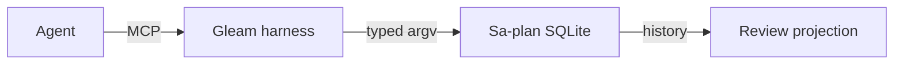

# Harness evolution: live completion status

Observed 2026-09-09T06:37:50.399917Z. #fractal-l0 #fractal-l1 #fractal-l2 #fractal-l3 #fractal-l4 #fractal-l5 #fractal-l6 #fractal-l7 #fractal-l8 #fractal-l9 #zk-adr #zero-muda

**The requested system is incomplete.** All 49 features have real Sa-plan tasks, jobs, workflows and current progress records. All are open; zero have verified acceptance. The Gleam MCP tracking service passed 70 targeted tests. The service uses Sa-plan's local durable workflow history; an external Temporal server/worker is not verified.

Canonical plan: `uos/harness-features/20260909`. [Progress snapshot](http://nas-1.tail55d152.ts.net:4100/files/governance/capability-inventory/20260909-0626-harness-feature-progress.json) · [Grouped journal and full feature table](http://nas-1.tail55d152.ts.net:4100/files/docs/journal/20260909-0626-harness-review-and-tracking-journal.md) · [Decision reconciliation](http://nas-1.tail55d152.ts.net:4100/files/docs/journal/20260909-0626-harness-evolution-review-reconciliation.json) · [ZK principle](http://nas-1.tail55d152.ts.net:4100/files/docs/zk/20260909-0626-harness-tracking-is-not-completion.md).

The [canonical cockpit](http://nas-1.tail55d152.ts.net:4100/) needs repair: its Live event panel renders sample events and fixed counters. The [ecology view](http://nas-1.tail55d152.ts.net:4110/ecology) discloses its local participant-model scope. A live harness completion dashboard has not been deployed.

Prioritize truthful telemetry, secure peer access and task authority, then backend bindings/evaluation and production recovery. Completing a tracking activity never completes the capability it describes.

```text
Agent --MCP--> Gleam harness --typed argv--> Sa-plan SQLite
Sa-plan SQLite --history--> Review projection
```




## Comprehensive verification checklist

Checks below are obligations, not blanket passing claims.

<details>
<summary>Domain 1 — Metadata, timestamp and Tailscale navigation</summary>

- [ ] **CHK-01-TIME** — Observe synchronized clock evidence and document prefix.
- [ ] **CHK-02-TAIL** — Verify full Tailnet links and actual serving status.
- [ ] **CHK-03-FRACT** — Verify L0–L9 tags and applicable layer mapping.
- [ ] **CHK-04-KM** — Reconcile specification, wiki, ZK and journal links.

</details>

<details>
<summary>Domain 2 — Zero-Muda purity and storage safety</summary>

- [ ] **CHK-05-MUDA** — Verify exclusions against the candidate dependencies.
- [ ] **CHK-06-GRAPH** — Verify the pure BEAM/Hermes graph boundary.
- [ ] **CHK-07-DRIVE** — Preserve the denied OS serial and test real interlocks only in scope.

</details>

<details>
<summary>Domain 3 — Testing Gold Standard and mathematical gates</summary>

- [ ] **CHK-08-C1C8** — Verify all applicable C1–C8 surfaces.
- [ ] **CHK-09-MATH** — Measure the four declared mathematical gates.
- [ ] **CHK-10-9MOD** — Apply relevant unit, system, TDD, BDD, performance, scalability, property, fuzz and chaos checks.
- [ ] **CHK-11-REGR** — Run applicable regressions and bounded observation.

</details>

<details>
<summary>Domain 4 — Cross-language control and observability</summary>

- [ ] **CHK-12-GLEAM** — Observe actual OTP control/supervision behavior.
- [ ] **CHK-13-HERMES** — Observe bounded analysis and authoritative evidence.
- [ ] **CHK-14-ZIGVM** — Verify deterministic execution and descriptor-relative VFS.
- [ ] **CHK-15-MAX** — Observe actual isolated inference when applicable.
- [ ] **CHK-16-OTEL** — Verify clock and nonzero trace/span identity.

</details>

<details>
<summary>Domain 5 — Sovereign governance and standalone Jujutsu</summary>

- [ ] **CHK-17-SOV** — Obtain candidate-bound independent review and authorized admission.
- [ ] **CHK-18-JJ** — Preserve standalone JJ, source ownership and exact candidate identity.

</details>

<details>
<summary>Domain 6 — Provenance extension</summary>

EV ceiling remains 93. EV-94..109 remain NOT_ADMITTED. No new EV number is minted.

</details>

[Previous: formal specification](http://nas-1.tail55d152.ts.net:4100/files/docs/design/20260909-0412-gleam-harness-symbiosis-formal-spec.md) · [Wiki](http://nas-1.tail55d152.ts.net:4100/wiki) · [ZK](http://nas-1.tail55d152.ts.net:4100/zk) · [Cockpit](http://nas-1.tail55d152.ts.net:4100/)

UOS footer: document and component evidence do not grant system admission.
