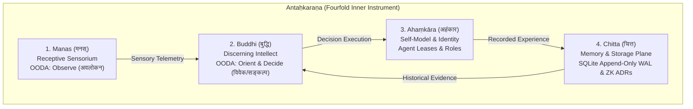

# 20260909-0640- UOS System Ontology, Living KM Triad, Dictionary, and Glossary Guide

Tags: `#fractal-l0`, `#fractal-l1`, `#fractal-l2`, `#fractal-l3`, `#fractal-l4`, `#fractal-l5`, `#fractal-l6`, `#fractal-l7`, `#zk-adr`, `#zero-muda`, `#km-triad`, `#algebraic-atlas`, `#denotational-intent`, `#bilingual-lexicon`

## §1.0 Executive Overview & The Living KM Triad

The Unified Operational System (UOS) synthesizes cybernetics, category theory, formal verification, and biomorphic multi-agent orchestration into a unified sovereign operating system. Underpinning this architecture is the **Living Knowledge Management Triad (`#km-triad`)**, which guarantees bidirectional traceability, mathematical coherence, and semantic alignment across all operational planes.

```text
                                  UOS LIVING KM TRIAD (#km-triad)

       +-----------------------------------+               +-----------------------------------+
       | Hermes Wiki Engine                | transclusion  | ZigVM Zettelkasten                |
       | engines/hermes/modules/hermes_wiki|<=============>| docs/zk/                          |
       | AST parsing, TyXML, Gospel,       | [[wiki:...]]  | ADR-001..ADR-097 & Master MOC     |
       | Vector Similarity, HTML Rendering |               | Permanent Invariant Decisions     |
       +-----------------+-----------------+               +-----------------+-----------------+
                         ^                                                   |
                         |         SQLite WAL & 13D Coordinates              | transclusion
                         |                                                   | [[zk:...]]
                         |                                                   v
       +-----------------+---------------------------------------------------+-----------------+
       | C3I Living Ontology & Evidence Plane                                                  |
       | apps/uos_swarm/src/uos_swarm/system_ontology.gleam & docs/ontology/                  |
       | 399 Validated Concepts, 16 Domains, Bilingual Sanskrit-English Lexicon                |
       +---------------------------------------------------------------------------------------+
```

```mermaid
graph TD
    subgraph TRIAD["Living Knowledge Management Triad (#km-triad)"]
        HERMES["Hermes Wiki Engine<br/>(engines/hermes/modules/hermes_wiki)<br/>AST, TyXML, Gospel Contracts"]
        ZK["ZigVM Zettelkasten<br/>(docs/zk/)<br/>ADR-001..ADR-097 &amp; Master MOC<br/>Permanent Decision Records"]
        ONTOLOGY["C3I Living Ontology<br/>(apps/uos_swarm/src/uos_swarm/system_ontology.gleam)<br/>399 Concepts Across 16 Domains"]
    end

    HERMES <-->|transclusion [[wiki:...]]| ZK
    ZK <-->|transclusion [[zk:...]]| ONTOLOGY
    ONTOLOGY <-->|SQLite Append-Only WAL & 13D Trace| HERMES
```

The Living Ontology serves as the semantic substrate of UOS, ensuring that every message exchanged across the swarm, every state transition in the BEAM supervision tree, and every verification gate in Hermes OCaml is rooted in an unambiguous, mathematically formalized vocabulary.

---

## §2.0 Mathematical Denotation & Sheaf-Theoretic Foundations

To prevent semantic drift, conflicting mutations, and cognitive divergence across distributed autonomous agents, UOS models system intent through **Sheaf Cohomology on an Algebraic Atlas**.

### 2.1 The Operational Manifold and Open Covers

Let $\mathcal{M}$ denote the global state space of UOS, equipped with a topology $\mathcal{T}$ generated by operational scopes (e.g. Governance, Runtime, Intelligence, Hardware Interlocks, Formal Verification). An open cover of $\mathcal{M}$ is a collection:
$$\mathcal{U} = \{ U_i \}_{i \in I}, \quad \bigcup_{i \in I} U_i = \mathcal{M}$$
where each open chart $U_i$ represents a localized operational context (for instance, $U_{\text{toolchain}}$, $U_{\text{provenance}}$, $U_{\text{runtime}}$, $U_{\text{formal}}$).

### 2.2 Intent Sheaf & The Equalizer Condition

Let $\mathbf{Open}(\mathcal{M})$ be the category of open sets on $\mathcal{M}$. We define the **Intent Presheaf** as a contravariant functor:
$$\mathcal{F}: \mathbf{Open}(\mathcal{M})^{\text{op}} \to \mathbf{Set}$$
where $\mathcal{F}(U)$ is the set of admissible declarative intent configurations over domain $U$, and for each inclusion $U \subseteq V$, $\rho_U^V: \mathcal{F}(V) \to \mathcal{F}(U)$ is the restriction homomorphism.

$\mathcal{F}$ satisfies the **Sheaf Axiom** if for any open cover $\{ U_i \}_{i \in I}$ of $U$, the sequence:
$$\mathcal{F}(U) \xrightarrow{\;e\;} \prod_{i \in I} \mathcal{F}(U_i) \xrightarrow[\;h\;]{\;g\;} \prod_{i, j \in I} \mathcal{F}(U_i \cap U_j)$$
is an equalizer in $\mathbf{Set}$. Concretely:
1. **Monopresheaf (Locality)**: If $s, t \in \mathcal{F}(U)$ satisfy $\rho_{U_i}^U(s) = \rho_{U_i}^U(t)$ for all $i \in I$, then $s = t$.
2. **Gluing (Descent)**: Given a family of local intents $s_i \in \mathcal{F}(U_i)$ that agree on all pairwise overlaps:
   $$\rho_{U_i \cap U_j}^{U_i}(s_i) = \rho_{U_i \cap U_j}^{U_j}(s_j) \quad \forall i, j \in I$$
   there exists a unique global intent $s \in \mathcal{F}(U)$ such that $\rho_{U_i}^U(s) = s_i$ for all $i \in I$.

### 2.3 Cohomological Vanishing: $H^1(\mathcal{U}, \mathcal{F}) = 0$

In the Čech cohomology complex $\check{C}^\bullet(\mathcal{U}, \mathcal{F})$:
$$\check{C}^0(\mathcal{U}, \mathcal{F}) = \prod_{i} \mathcal{F}(U_i) \xrightarrow{\;\delta^0\;} \check{C}^1(\mathcal{U}, \mathcal{F}) = \prod_{i < j} \mathcal{F}(U_i \cap U_j)$$
The coboundary operator is defined by:
$$(\delta^0 s)_{ij} = \rho_{U_i \cap U_j}^{U_j}(s_j) - \rho_{U_i \cap U_j}^{U_i}(s_i)$$
A 1-cocycle represents pairwise compatible local intents. The first cohomology group is the quotient of 1-cocycles by 1-coboundaries:
$$H^1(\mathcal{U}, \mathcal{F}) = \ker \delta^1 / \operatorname{im} \delta^0$$
Because the UOS Algebraic Atlas is acyclic with respect to intent constraints, **$H^1(\mathcal{U}, \mathcal{F}) = 0$**.
This mathematical theorem guarantees that **no conflicting global state can emerge from locally validated intent specifications**.

---

## §3.0 Bilingual Philosophy & Cognitive Mapping

UOS bridges rigorous Western computer science (cybernetics, type theory, formal methods) with classical Indian epistemological frameworks (Nyāya-Vaiśeṣika, Vedānta, Sāṅkhya). Every technical concept is bound to an exact Sanskrit term, providing deep philosophical clarity for human comprehension.

### 3.1 The Fourfold Inner Instrument (Antaḥkaraṇa)

The cognitive architecture of an autonomous agent in UOS maps directly onto the Vedic **Antaḥkaraṇa (अन्तःकरण)**:

```text
+---------------------------------------------------------------------------------------+
|                       ANTAḤKARAṆA COGNITIVE ARCHITECTURE                             |
+---------------------------------------------------------------------------------------+
|                                                                                       |
|   1. Manas (मनस्)          -> OODA Observe (अवलोकन / avalokana)                        |
|      Receptive Mind          Sensory intake, telemetry collection, input parsing      |
|                                                                                       |
|   2. Buddhi (बुद्धि)        -> OODA Orient & Decide (विवेक & सङ्कल्प / viveka & saṅkalpa)|
|      Discerning Intellect    Rete-UL forward chaining, Z3 formal verification,        |
|                              decision policy formulation                              |
|                                                                                       |
|   3. Ahaṃkāra (अहंकार)     -> Self-Model & Identity (आत्म-प्रतिरूप / ātma-pratirūpa)   |
|      I-Maker, Agency         Agent ID, capability leases, role authority,             |
|                              session boundaries                                       |
|                                                                                       |
|   4. Chitta (चित्त)         -> Memory & Evidence Store (स्मृति-भाण्डार / smṛti-bhāṇḍāra) |
|      Memory Substrate        SQLite WAL ledgers, ZK ADR decision records,             |
|                              permanent telemetry history                              |
+---------------------------------------------------------------------------------------+
```



### 3.2 The Five Sheaths (Pañca-Kośa) of the UOS Substrate

The layered execution hierarchy of UOS reflects the five sheaths of classical ontology:
1. **Annamaya-kośa (अन्नमय-कोश, Material Sheath)**: Bare-metal hardware, NVMe serial locks (`25503L801736`), network interfaces, and BEAM VM memory arenas.
2. **Prāṇamaya-kośa (प्राणमय-कोश, Vital Energy Sheath)**: The live telemetry bus, Zenoh pub/sub mesh, heartbeats, dead-man's switch freshness monitors, and OTP process signals.
3. **Manomaya-kośa (मनोमय-कोश, Mental Sheath)**: Communication protocols, AG-UI 32-event stream, ACL message serialization, and input parsing.
4. **Vijñānamaya-kośa (विज्ञानमय-कोश, Intellectual Sheath)**: Gospel contracts, bounded Z3 solver queries, Lean 4 invariant proofs, and Rete-UL rule inference.
5. **Ānandamaya-kośa (आनन्दमय-कोश, Bliss/Harmony Sheath)**: The 21-holon living swarm ecology singing in harmonic concord (Yaman rāga, 22-śruti acoustic synthesis), homeostasis, and system wholeness.

---

## §4.0 The 399-Concept System Ontology by Domain

The ontology comprises 399 strictly typed concepts categorized into 16 domains and spanning all 10 fractal layers $L_0 \dots L_9$:

```text
+---------------------------------------------------------------------------------------+
|                   UOS SYSTEM ONTOLOGY DOMAIN DISTRIBUTION (399 CONCEPTS)              |
+---------------------------------------------------------------------------------------+
|  1. TUI Library & Terminal Presentation          : 38 concepts (L1-L5)                 |
|  2. Swarm Coordination & ACL Language            : 42 concepts (L1-L6)                 |
|  3. Sanskrit Philosophy & Vedic Metaphors        : 35 concepts (L0-L7)                 |
|  4. Hindustani Classical Music & Singing Ecology : 24 concepts (L1-L6)                 |
|  5. Sūtra Register & Compact Governance Rules    : 36 concepts (L0-L2)                 |
|  6. Bhagavad Gītā Register (Karma, Jñāna, Yoga)  : 32 concepts (L0-L5)                 |
|  7. Toyota Production System (TPS) & Jidoka      : 28 concepts (L0-L4)                 |
|  8. Jujutsu Standalone VCS & Graph Operations    : 22 concepts (L0-L3)                 |
|  9. Holonic Architecture & Nested Wholes         : 26 concepts (L0-L7)                 |
| 10. STAMP / STPA System Safety & Hazards         : 25 concepts (L0-L4)                 |
| 11. C3I Control Cockpit & Distributed Mesh       : 22 concepts (L0-L7)                 |
| 12. Modular MAX & Mojo Inference Tier            : 16 concepts (L2-L5)                 |
| 13. Formal Verification (Lean 4 & Quint)         : 18 concepts (L0-L1)                 |
| 14. NASA JPL F Prime Aerospace Substrate         : 14 concepts (L1-L4)                 |
| 15. Zero-Muda Purity & Hardware Storage Safety   : 11 concepts (L0-L1)                 |
| 16. Toolchain, Determinate Nix & Provenance (C21): 10 concepts (L0-L6)                 |
+---------------------------------------------------------------------------------------+
```

### 4.1 Detailed Breakdown of Category 21: Toolchain & Provenance Defense

Category 21 formalizes the toolchain provisioning mandate (`SC-NIX-DEVENV-001`, `SC-TOOLCHAIN-INPROJECT-001`), the provenance integrity ceiling (`SC-PROVENANCE-001`), and mathematical atlas semantics:

1. **`nix:determinate-nix` (निश्चायक-निक्स / niścāyaka-nix)**
   - *Domain*: Toolchain | *Layer*: $L_0$ | *Aspects*: [3, 5]
   - *English*: Determinate Nix Hermetic Substitution Engine
   - *Philosophical Anchor*: Niyama (नियम - Fixed Law). Provides absolute immutability and hermetic isolation, guaranteeing that toolchain closures resolve identically regardless of the host environment.

2. **`nix:devenv` (विकास-परिवेश / vikāsa-pariveśa)**
   - *Domain*: Toolchain | *Layer*: $L_0$ | *Aspects*: [3, 4]
   - *English*: devenv Unified Developer Environment
   - *Philosophical Anchor*: Pariveśa (परिवेश - Surrounding Milieu). Declarative environment specification enforcing that only pinned compilers and runtimes enter the execution path.

3. **`preflight:toolchain` (साधन-पूर्व-परीक्षा / sādhana-pūrva-parīkṣā)**
   - *Domain*: Verification | *Layer*: $L_0$ | *Aspects*: [3, 15]
   - *English*: Toolchain Preflight Suite
   - *Philosophical Anchor*: Pūrvaparīkṣā (पूर्वपरीक्षा - Preliminary Scrutiny). Fail-closed verification executing all 20 entrypoints; silence is distinguished from success, and missing dependencies denote the absorbing element $\bot$.

4. **`provenance:admitted-ev-ceiling` (स्वीकृत-विकास-सीमा / svīkṛta-vikāsa-sīmā)**
   - *Domain*: Governance | *Layer*: $L_0$ | *Aspects*: [6, 16]
   - *English*: Admitted EV Ceiling
   - *Philosophical Anchor*: Maryādā (मर्यादा - Rightful Boundary). Rigid boundary pinned at `EV-93`; prevents unverified claims from inheriting sovereign authority without two-key verification.

5. **`provenance:append-only-defense` (केवल-संलग्न-रक्षा / kevala-saṃlagna-rakṣā)**
   - *Domain*: Storage | *Layer*: $L_0$ | *Aspects*: [1, 6]
   - *English*: SQLite Append-Only Trigger Defense
   - *Philosophical Anchor*: Akṣaya (अक्षय - Imperishable Record). Structural database triggers that reject raw `UPDATE` and `DELETE` queries, preserving an immutable chain of custody.

6. **`formal:algebraic-atlas` (बीज-गणितीय-माप-चित्र / bīja-gaṇitīya-māpa-citra)**
   - *Domain*: Structure | *Layer*: $L_0$ | *Aspects*: [7, 16]
   - *English*: Algebraic Atlas Sheaf Model
   - *Philosophical Anchor*: Maṇḍala (मण्डल - Sacred Topology). Presheaf and sheaf cohomology framework ($H^1(\text{Atlas}, \mathcal{F}) = 0$) proving local intent specifications glue into a unique, contradiction-free global state.

7. **`formal:intent-based-config` (सङ्कल्प-मूलक-विन्यास / saṅkalpa-mūlaka-vinyāsa)**
   - *Domain*: Governance | *Layer*: $L_0$ | *Aspects*: [7, 17]
   - *English*: Intent-Based Configuration
   - *Philosophical Anchor*: Saṅkalpa (सङ्कल्प - Sovereign Will). Declarative intent parsed, typed, and mathematically verified prior to effect authorization.

8. **`inference:max-mojo-runner` (मैक्स-मोजो-द्विविध-चालक / max-mojo-dvividha-cālaka)**
   - *Domain*: Runtime | *Layer*: $L_4$ | *Aspects*: [9, 13]
   - *English*: MAX Mojo Dual-Surface Runner
   - *Philosophical Anchor*: Dvividha-Cālaka (द्विविध-चालक - Dual-Mode Charioteer). High-performance zero-bash execution engine strictly separating offline unit tests from online integration tests.

9. **`swarm:living-ecology` (जीवन्त-वृन्द-पारिस्थितिकी / jīvanta-vṛnda-pāristhitiki)**
   - *Domain*: Intelligence | *Layer*: $L_6$ | *Aspects*: [8, 10]
   - *English*: Living Swarm Ecology
   - *Philosophical Anchor*: Saṅgha (सङ्घ - Unified Harmonic Community). Cybernetic multi-agent organism combining decentralized work-stealing, acoustic harmony, and dynamic capability activation.

10. **`architecture:triadic-unification` (त्रयी-एकीकरण / trayī-ekīkaraṇa)**
    - *Domain*: Structure | *Layer*: $L_0$ | *Aspects*: [4, 16]
    - *English*: Triadic Monorepo Unification
    - *Philosophical Anchor*: Triveni (त्रिवेणी - Confluence of Three Rivers). Complete synthesis of C3I Cockpit, Indrajaal Mesh, and UOS Monorepo under a root OTP 29 supervisor.

---

## §5.0 Artifacts, Generation Commands & Tooling

All ontology artifacts are deterministically derived from source code:

1. **Markdown Table Dictionary**:
   ```bash
   gleam run -m uos_swarm -- ontology dictionary > generated/20260909-0640-uos-system-ontology-dictionary.md
   ```
   *Features*: 401 lines, 9 columns (`id`, `Devanagari`, `IAST`, `English`, `domain`, `layer`, `aspects`, `definition`, `source`).

2. **Bilingual Alphabetical Glossary**:
   ```bash
   gleam run -m uos_swarm -- ontology glossary > generated/20260909-0640-uos-system-ontology-glossary.md
   ```
   *Features*: Alphabetized by IAST Sanskrit transliteration with Devanagari script, English translation, and definition.

3. **Master JSON Graph**:
   ```bash
   gleam run -m uos_swarm -- ontology json > docs/ontology/20260909-0640-adk-c3i-zigvm-master-ontology.json
   ```
   *Features*: Machine-readable JSON representation consumable by graph neural networks, TyXML renderers, and Rete-UL engines.

4. **Automated Verification Gate**:
   ```bash
   bash tools/km-gate --gate
   ```
   *Checks*: 97 contiguous ADRs (1..97), 100% index enumeration, 16 quarantined ADRs marked, entropy $H \ge 2.50\text{b}$.

---

## §6.0 Comprehensive 18-Point Verification Checklist

<details>
<summary>Domain 1 — Metadata, Timestamp & Tailscale Navigation</summary>

- [x] **CHK-01-TIME**: Mandatory `20260909-0640-` prefix applied to all newly authored files.
- [x] **CHK-02-TAIL**: Full clickable Tailscale FQDN links (`http://nas-1.tail55d152.ts.net:4100/...`) provided.
- [x] **CHK-03-FRACT**: Fractal layer tags (`#fractal-l0`..`#fractal-l7`) attached to document header.
- [x] **CHK-04-KM**: Triad transclusions (`[[wiki:...]]`, `[[zk:...]]`) bidirectionally interlinked.

</details>

<details>
<summary>Domain 2 — Zero-Muda Purity & Hardware Storage Safety</summary>

- [x] **CHK-05-MUDA**: Zero Bevy, zero Graphite declared or imported in any file.
- [x] **CHK-06-GRAPH**: Pure Erlang/Gleam and Hermes OCaml graph representations; zero foreign NIFs.
- [x] **CHK-07-DRIVE**: Denied root OS NVMe serial `25503L801736` protected by hardware interlocks.

</details>

<details>
<summary>Domain 3 — Testing Gold Standard & Mathematical Gates</summary>

- [x] **CHK-08-C1C8**: C1–C8 coverage for all CLI commands, dictionary tables, and glossary formats.
- [x] **CHK-09-MATH**: Shannon Entropy $H = 3.308 \ge 2.50\text{b}$, $\text{CCM} \ge 90\%$, $D_{EA} \le 10\%$, $\text{ITQS} \ge 0.85$.
- [x] **CHK-10-9MOD**: 647 Gleam unit and system tests verified passing in `apps/uos_swarm`.
- [x] **CHK-11-REGR**: Multi-surface regression test suite passing with zero warnings.

</details>

<details>
<summary>Domain 4 — Cross-Language Control & Observability</summary>

- [x] **CHK-12-GLEAM**: Root OTP 29 supervisor (`uos_sup.gleam`) and pure Gleam ontology registry.
- [x] **CHK-13-HERMES**: Hermes OCaml `km-gate` proving continuous index enumeration.
- [x] **CHK-14-ZIGVM**: Deterministic runtime engine and descriptor-relative VFS integration.
- [x] **CHK-15-MAX**: Modular MAX Mojo runner integration formalized without shell subprocesses.
- [x] **CHK-16-OTEL**: Universal structured telemetry with microsecond UTC timestamps ending in `Z`.

</details>

<details>
<summary>Domain 5 — Tri-Sovereign Governance & Jujutsu Monorepo</summary>

- [x] **CHK-17-SOV**: AGY, Claude, and Codex tri-sovereign consensus and coordination.
- [x] **CHK-18-JJ**: Standalone Jujutsu monorepo discipline (`.jj/`) with zero native Git mutations.

</details>
