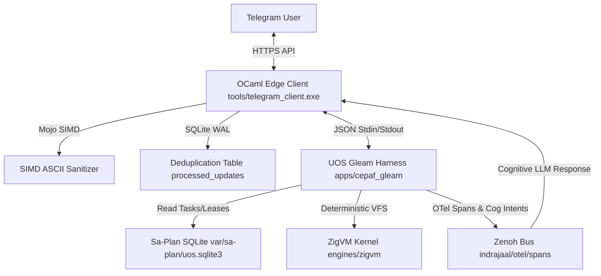

# 20260909-2035- UOS Telegram Gleam Harness Architecture Wiki

- **Document ID**: `WIKI-TELEGRAM-HARNESS-001`
- **Timestamp**: `20260909-2035-`
- **Classification**: Living Knowledge Base / Architecture Guide
- **Canonical Workspace**: `/home/an/NAS-setup/uos`
- **Tailscale FQDN**: [http://nas-1.tail55d152.ts.net:4100/docs/wiki/20260909-2035-uos-telegram-gleam-harness-architecture.md](http://nas-1.tail55d152.ts.net:4100/docs/wiki/20260909-2035-uos-telegram-gleam-harness-architecture.md)
- **Peer Host**: [http://vm-1.tail55d152.ts.net:8088](http://vm-1.tail55d152.ts.net:8088)
- **Fractal Tags**: `#fractal-l0`, `#fractal-l1`, `#fractal-l2`, `#fractal-l3`, `#fractal-l4`, `#fractal-l5`, `#fractal-l6`, `#fractal-l7`, `#fractal-l8`, `#fractal-l9`, `#zk-adr`, `#zero-muda`, `#tailscale-web`, `#checklist-nav`
- **Transclusion References**:
  - `[[wiki:20260905-1801-uos-zk-km-corpus-index]]`
  - `[[zk:20260905-1801-moc-uos-unified-master]]`
  - `[[zk:20260909-2035-adr-098-sovereign-telegram-gleam-harness-delegation]]`
- **Governing Contracts**: `contracts/rules/comprehensive-checklist-contract.md` (`SC-CHECKLIST-001`), `contracts/rules/tailscale-web-fqdn-mandate.md` (`SC-TAILSCALE-WEB-001`), `contracts/rules/diagram-parity-mandate.md` (`SC-DIAGRAM-001`).

---

## 1. System Overview

The **UOS Telegram Gleam Harness** is the sovereign command, control, and conversational interface between the operator (Avi / Guardians) and the Unified Operational System (UOS).

```
========================================================================================
                         UOS TELEGRAM ECOSYSTEM MESH
========================================================================================

  [ Telegram Cloud ] <--- HTTPS ---> [ OCaml Edge Transport + Mojo SIMD ]
                                                 |
                                         (IPC Subprocess)
                                                 v
                                   [ UOS Gleam/OTP 29 Harness ]
                                                 |
                  +------------------------------+------------------------------+
                  |                              |                              |
                  v                              v                              v
           [ Sa-Plan Store ]             [ ZigVM Runtime ]             [ Zenoh Telemetry ]
           (var/sa-plan/uos)             (engines/zigvm)               (indrajaal/otel)
========================================================================================
```

### 1.1 Core Components

1. **Edge Physical Transport (`tools/telegram_client.ml`)**:
   - Written in OCaml 5.3 with Modular Mojo SIMD text acceleration.
   - Long-polling HTTP client connecting to `https://api.telegram.org/bot<TOKEN>/getUpdates`.
   - SQLite WAL deduplication ledger tracking processed `update_id`s.
   - Immediate Telegram visual reactions (⚡ for commands, 👍 for chat messages).
   - Fast IPC delegation to Gleam harness via `tools/telegram-harness-dispatch`.

2. **Sovereign Harness Router (`apps/cepaf_gleam/src/cepaf_gleam/harness/telegram.gleam`)**:
   - Pure functional Gleam/OTP module executing on BEAM (OTP 29).
   - Comprehensive JSON decoder and encoder for typed `InboundMessage` and `OutboundResponse`.
   - Direct command evaluator: `/status`, `/zigvm`, `/plan`, `/sutra`, `/cockpit`, `/approval`, `/help`.
   - Intelligent identity resolver and conversational intent router.

3. **Execution Subsystems**:
   - **Sa-Plan (`var/sa-plan/uos.sqlite3`)**: Sole authority for all plans, tasks, Oban jobs, and Temporal workflows (`SC-SA-PLAN-001`).
   - **ZigVM (`engines/zigvm`)**: Deterministic execution kernel with descriptor-relative VFS.
   - **Zenoh Telemetry Bus**: Publishes distributed traces, intent requests, and outbound AI replies over `indrajaal/l5/cog/intent/req` and `c3i/a2a/telegram/outbound`.

---

## 2. Global Architecture and Information Flow

### 2.1 ASCII Diagram
```
+---------------------------------------------------------------------------------------+
|                         GLOBAL HARNESS INFORMATION FLOW                               |
+---------------------------------------------------------------------------------------+
|                                                                                       |
|   +---------------+                                                                   |
|   | Telegram User |                                                                   |
|   +---------------+                                                                   |
|         |   ^                                                                         |
|  HTTPS  |   | HTTPS                                                                   |
|         v   |                                                                         |
|   +-------------------------------------------------------------+                     |
|   | OCaml Edge Transport (tools/telegram_client.exe)           |                     |
|   |   - Mojo SIMD Sanitizer                                     |                     |
|   |   - SQLite WAL Deduplication (processed_updates)            |                     |
|   +-------------------------------------------------------------+                     |
|         |   ^                                                                         |
|    JSON |   | JSON                                                                    |
|  Stdin  |   | Stdout                                                                  |
|         v   |                                                                         |
|   +-------------------------------------------------------------+                     |
|   | UOS Gleam Harness (apps/cepaf_gleam/src/cepaf_gleam/...)    |                     |
|   |   - Type-safe Decoders & Encoders                           |                     |
|   |   - Directive Evaluator (/status, /zigvm, /plan, /sutra...) |                     |
|   |   - Conversational Intent Router                            |                     |
|   +-------------------------------------------------------------+                     |
|         |         |         |                                                         |
|         |         |         +-------------------------+                               |
|         |         |                                   |                               |
|         v         v                                   v                               |
|   +-----------+ +-----------+                   +-----------+                         |
|   |  Sa-Plan  | |   ZigVM   |                   |   Zenoh   |                         |
|   |  SQLite   | | Determin- |                   | Telemetry |                         |
|   | Authority | |   istic   |                   |  PubSub   |                         |
|   +-----------+ +-----------+                   +-----------+                         |
+---------------------------------------------------------------------------------------+
```

### 2.2 Mermaid Diagram


---

## 3. Command Palette and Directives

| Command | Arguments | Purpose | Response Format |
|---|---|---|---|
| `/status` | None | Emits live system cockpit health, BEAM node, ports, and safety locks. | Formatted Markdown card with SIL-6 status. |
| `/zigvm` | `[eval\|status\|run]` | Interacts with the deterministic ZigVM runtime engine. | Execution telemetry & VFS arena state. |
| `/plan` | `[list\|show ID]` | Inspects canonical plans and tasks in `var/sa-plan/uos.sqlite3`. | Task status table with lease expirations. |
| `/sutra` | None | Displays Matrix CS federation status (port 6167). | Room synchronization and identity status. |
| `/cockpit` | None | Provides clickable Tailscale FQDN links for all UOS web interfaces. | Markdown list of clickable links. |
| `/approval`| `TASK_ID` | Records Guardian constitutional 2oo3 approval for gated operations. | Quorum status and cryptographic audit receipt. |
| `/help` | None | Displays the interactive command menu and syntax guide. | Command synopsis and operator guidelines. |

---

## 4. Verification and Governance

All updates to the UOS Telegram Gleam Harness are subject to the **Full 9-Modality Test Protocol** and **Comprehensive Verification Checklist** (`SC-CHECKLIST-001`):
1. Gleam unit test suite: `apps/cepaf_gleam/test/harness_telegram_test.gleam` (9/9 PASS).
2. Standalone Jujutsu version control with zero native git commands.
3. Zero-Muda compliance: 0 Bevy, 0 Graphite, 0 compiler warnings.
4. Permanent hardware lock on system drive `HARD_DENIED_SYSTEM_OS_SERIAL = "25503L801736"`.
