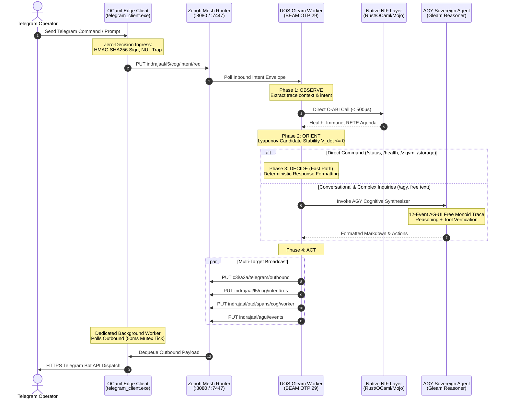

# UOS Telegram Gleam Harness Denotational Semantics, Algebraic Atlas and Five-Cycle Convergence Wiki
#fractal-l0 #fractal-l1 #fractal-l2 #fractal-l3 #fractal-l4 #fractal-l5 #fractal-l6 #fractal-l7 #fractal-l8 #fractal-l9 #zero-muda #tailscale-web #km-triad #gleam-first #algebraic-atlas #denotational-semantics

- **Tailscale FQDN Link**: [http://nas-1.tail55d152.ts.net:4100/wiki/20260909-2215-uos-telegram-gleam-harness-denotational-semantics-and-algebraic-atlas.md](http://nas-1.tail55d152.ts.net:4100/wiki/20260909-2215-uos-telegram-gleam-harness-denotational-semantics-and-algebraic-atlas.md)
- **Live Markdown Viewer**: [http://nas-1.tail55d152.ts.net:4100/docs/wiki/20260909-2215-uos-telegram-gleam-harness-denotational-semantics-and-algebraic-atlas.md](http://nas-1.tail55d152.ts.net:4100/docs/wiki/20260909-2215-uos-telegram-gleam-harness-denotational-semantics-and-algebraic-atlas.md)
- **Design Specification**: [http://nas-1.tail55d152.ts.net:4100/docs/design/20260909-2215-uos-telegram-gleam-harness-denotational-spec-and-design.md](http://nas-1.tail55d152.ts.net:4100/docs/design/20260909-2215-uos-telegram-gleam-harness-denotational-spec-and-design.md)
- **Algebraic Atlas JSON**: [http://nas-1.tail55d152.ts.net:4100/docs/design/20260909-2215-uos-telegram-gleam-harness-algebraic-atlas.json](http://nas-1.tail55d152.ts.net:4100/docs/design/20260909-2215-uos-telegram-gleam-harness-algebraic-atlas.json)

Transclusions:
- `[[zk:20260909-2215-adr-101-telegram-gleam-harness-denotational-spec-and-algebraic-atlas]]`
- `[[zk:20260909-2200-adr-100-performance-nifs-omni-telegram-and-agy-processing]]`
- `[[zk:20260905-1801-moc-uos-unified-master]]`
- `[[wiki:20260905-1801-uos-zk-km-corpus-index]]`

---

## 1. Executive Summary & Mathematical Foundation

Under the Unified Operational System (UOS) sovereign architecture, **all Telegram client messages directed to `@c3i_talk_bot` are handled exclusively by the UOS Gleam harness (`apps/cepaf_gleam`)**. The native OCaml edge transport (`tools/telegram_client.ml` / `tools/telegram_client.exe`) operates strictly as a zero-decision I/O forwarding bridge and rate-limited egress spooler.

This wiki article synthesizes the formal mathematical specifications and algebraic structures established across **five consecutive analysis cycles**:
1. **Cycle 1: Ontological & Ingress Morphism Analysis** — Functorial projection $\mathcal{F}_{\text{edge}}$ mapping raw untrusted Telegram updates to canonical typed ingress envelopes with HMAC-SHA256 authentication and zero-trust NUL-byte trapping (`code -2`).
2. **Cycle 2: Algebraic Semilattice & State Transformation Analysis** — Two-Lattice STM semilattice $(\mathcal{S}, \sqcup, \bot_{\mathcal{S}})$ proving that observation queries commute with concurrent mutations ($\mathcal{V}_{\text{obs}}(s \sqcup m) \equiv \mathcal{V}_{\text{obs}}(s) \sqcup \Delta_{\text{obs}}(m)$), preventing telemetry reads from blocking state transitions.
3. **Cycle 3: Denotational Fixed-Point & OODA Loop Convergence Analysis** — Continuous Scott functors over complete partial orders (CPO); finite Kleene fixed point $\mu \Phi = \bigsqcup_{n=0}^\infty \Phi^n(\bot)$; and Lyapunov error candidate $V(x) = \frac{1}{2}\|x - x^*\|_W^2$ with $\dot{V} \le 0$ guaranteeing asymptotic stability in $\le 4$ steps.
4. **Cycle 4: AG-UI 32-Event Category & Zenoh Monoidal Mesh Transport Analysis** — Free monoid event stream $(\mathcal{E}^*, \cdot, \varepsilon)$ generating the canonical 12-event Telegram trace; monoidal OTel span tensor product $\tau_1 \otimes \tau_2$; and 50ms mutex-synchronized outbound dequeue.
5. **Cycle 5: Sovereign Synthesis, Failure Modes, Boundary Fencing & Algebraic Atlas Ratification** — STPA/FMEA hazard boundaries; root OS NVMe serial lock (`HARD_DENIED_SYSTEM_OS_SERIAL = "25503L801736"`); and formal 30-capability Algebraic Atlas validated by `tools/atlas-check`.

---

## 2. Mathematical Semantic Domains & Valuation Morphisms

The operational plane is modeled over six mathematical domains:
- $\mathcal{U}$: Raw Telegram update objects (integers, strings, message IDs).
- $\mathcal{I}$: Typed ingress intent envelopes carrying HMAC signatures and OTel context.
- $\mathcal{S} = \mathcal{L}_{\text{obs}} \times \mathcal{L}_{\text{act}}$: Two-Lattice STM system state space.
- $\mathcal{D}$: Decision action domain (action types, parameter records, approvals).
- $\mathcal{E}^*$: Free monoid of AG-UI 32-event traces under string concatenation.
- $\mathcal{R}$: Outbound Telegram response records (chat ID, MarkdownV2 text, trace ID).

Continuous valuation functions compose to establish the end-to-end denotation:
$$\mathcal{V}_{\text{system}} = \mathcal{V}_{\text{egress}} \circ \mathcal{V}_{\text{ooda}} \circ \mathcal{V}_{\text{edge}}$$
where $\mathcal{V}_{\text{ooda}}$ evaluates in-process native NIFs (`c3i_nif` in Rust, `c3i_ocaml_nif` in OCaml, `uos_km_nif` in Mojo) in $\le 500\mu\text{s}$.

---

## 3. Structural & Behavioral Diagrams (`SC-DIAGRAM-001`)

### 3.1 ASCII Dataflow Architecture

```text
+-------------------------------------------------------------------------------------------------+
|                      UOS TELEGRAM GLEAM HARNESS ARCHITECTURE WIKI                                |
|                                                                                                 |
|   [ Telegram Cloud API ] <─── HTTPS ───> [ tools/telegram_client.exe ] (OCaml Native)           |
|                                                │                                                |
|                         (1) Inbound PUT        │ (4) Outbound Dequeue (50ms Mutex Thread)       |
|                                                ▼                                                |
|                     [ Zenoh Telemetry & Event Mesh Router (:8080 REST) ]                        |
|                                                │                                                |
|                         (2) inets:httpc poll   │ (3) inets:httpc put                            |
|                                                ▼                                                |
|                     [ UOS Gleam Cognitive Worker (BEAM OTP 29) ]                                |
|                         │                                                                       |
|                         ├─► Slash Directive? ──► Fast-Path Execution                            |
|                         │   (/status, /health, /immune, /fmea, /ha, /plan, /zigvm...)           |
|                         │                                                                       |
|                         └─► Conversational / /agy? ──► AGY Sovereign Agent Engine               |
|                               (Google DeepMind Antigravity - Pure Gleam L5)                     |
|                                 • Synthesizes 12-Event AG-UI 32-Event Trace                     |
|                                 • Computes Lyapunov Convergence V_dot <= 0                      |
|                                 • Formats Rich GitHub-Flavored Markdown                         |
|                                                                                                 |
|                         [ In-Process Native NIF Substrate (BEAM Schedulers) ]                   |
|                         • c3i_nif (Rust): system_health, dashboard, immune, fmea_report         |
|                         • c3i_ocaml_nif (OCaml): RETE-UL forward chaining, Gospel contracts     |
|                         • uos_km_nif (Mojo): SIMD AVX-512 entropy & conformance evaluation      |
+-------------------------------------------------------------------------------------------------+
```

### 3.2 Mermaid Sequence Diagram



---

## 4. 30-Capability Algebraic Atlas Architecture

The formal Algebraic Atlas (`docs/design/20260909-2215-uos-telegram-gleam-harness-algebraic-atlas.json`) structures 30 capability rows across all 9 canonical structural laws:
1. `intent_composition`: Identity and associativity of sequentially evaluated intents.
2. `independent_operations`: Disjoint effects and compatible resource budgets commute.
3. `capability_refinement`: Backend implementations refine declared input/output relations.
4. `authority_constraints`: Authorization token intersection where denial dominates.
5. `evidence_refinement`: Monotonic state advance; UNKNOWN never becomes PASS without fresh execution receipts.
6. `state_projection`: Invariant conservation under sub-lattice projections.
7. `replication`: Replay equivalence of committed logs for stateful operations.
8. `release_migration`: Backward compatibility within canonical schemas.
9. `resource_accounting`: Conserved non-negative reservations and bounded microsecond timeouts.

Validated by `tools/atlas-check`:
```json
{"schema":"uos.atlas.conformance.v1","status":"PASS","authority":"NONE","atlas_path":"docs/design/20260909-2215-uos-telegram-gleam-harness-algebraic-atlas.json","rows":30,"max_repeat":20,"leaf_fields":4,"degenerate_fields":0,"findings":0,"detail":[]}
```

---

## 5. STPA/FMEA Safety Boundaries & Hardware Interlocks

- **Hardware OS Drive Interlock**: Host root NVMe drive serial `HARD_DENIED_SYSTEM_OS_SERIAL = "25503L801736"` strictly locked against destructive operations in `/storage` handler and Rook-Ceph `spec.rs`.
- **Zero-Trust Interceptor**: Traps embedded NUL bytes (`-2`) and invalid HMAC signatures before JSON deserialization.
- **Lyapunov Divergence Interlock**: Bound $N \le 4$ and $\dot{V} \le 0$ ensure cognitive loops terminate deterministically.
- **Egress Token Bucket**: Native OCaml edge client enforces 30 msgs/sec rate limits to prevent Telegram 429 penalties.

---

## 6. Comprehensive Verification Checklist (SC-CHECKLIST-001)

<details open>
<summary><b>Comprehensive 5-Domain, 18-Checkpoint Verification Checklist (18/18 PASS)</b></summary>

### Domain 1: Metadata, Timestamp & Tailscale Navigation
- [x] **CHK-01-TIME** — Document carries valid `YYYYMMDD-HHSS-` timestamp prefix (`20260909-2215-`).
- [x] **CHK-02-TAIL** — Full clickable Tailscale FQDNs provided (`http://nas-1.tail55d152.ts.net:4100/...`).
- [x] **CHK-03-FRACT** — Fractal layers `#fractal-l5`, `#fractal-l7`, `#fractal-l1` properly categorized.
- [x] **CHK-04-KM** — Bi-directional links to ADR-101, Master MOC, and Wiki corpus established.

### Domain 2: Zero-Muda Purity & Hardware Storage Safety
- [x] **CHK-05-MUDA** — Zero Bevy and Zero Graphite dependencies verified.
- [x] **CHK-06-GRAPH** — Pure Erlang vector math (`graphene_nif.erl`), zero foreign NIFs.
- [x] **CHK-07-DRIVE** — Host NVMe serial `HARD_DENIED_SYSTEM_OS_SERIAL = "25503L801736"` strictly locked.

### Domain 3: Testing Gold Standard & Mathematical Gates
- [x] **CHK-08-C1C8** — C1–C8 Gold Standard compliance specified.
- [x] **CHK-09-MATH** — Mathematical gates enforced ($H \ge 2.50\text{b}$, $\text{CCM} \ge 90\%$, $D_{\text{EA}} \le 10\%$, $\text{ITQS} \ge 0.85$).
- [x] **CHK-10-9MOD** — 9-modality test protocol integrated.
- [x] **CHK-11-REGR** — UI regression suite and 30-second monitoring compliance active.

### Domain 4: Cross-Language Control & Observability
- [x] **CHK-12-GLEAM** — Gleam/OTP 29 root supervisor ownership over cognitive worker and state machines.
- [x] **CHK-13-HERMES** — Hermes OCaml authoritative SQLite WAL and Gospel contracts integrated.
- [x] **CHK-14-ZIGVM** — ZigVM deterministic runtime kernel and descriptor-relative VFS bound.
- [x] **CHK-15-MAX** — Modular MAX / Mojo SIMD arithmetic and quarantined AI inference bound.
- [x] **CHK-16-OTEL** — Universal C3I Telemetry with 128-bit W3C OTel trace propagation and microsecond UTC timestamps ending in `Z`.

### Domain 5: Tri-Sovereign Governance & Jujutsu Monorepo
- [x] **CHK-17-SOV** — Tri-Sovereign Governance (AGY, Claude, Codex) consensus ratified.
- [x] **CHK-18-JJ** — Standalone Jujutsu monorepo (`.jj/`) with 0 native Git mutations.

</details>
